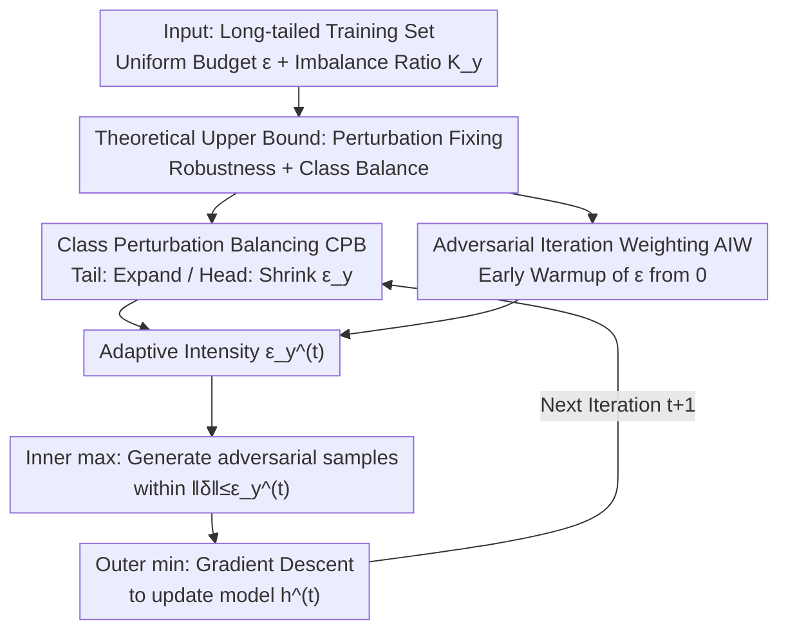

# Taming the Long Tail: Rebalancing Adversarial Training via Adaptive Perturbation

**Conference**: CVPR 2026  
**arXiv**: [2605.13395](https://arxiv.org/abs/2605.13395)  
**Code**: https://github.com/zhang-lilin/RobustLT (Available)  
**Area**: AI Security / Adversarial Robustness  
**Keywords**: Adversarial Training, Long-tail Distribution, Adaptive Perturbation, Class Balancing, Robustness

## TL;DR
To address the issue of "overconfidence in head classes and lack of robustness in tail classes" in adversarial training (AT) on long-tailed data, this paper theoretically proves that **perturbation intensity itself can simultaneously fix adversarial vulnerability and class imbalance**. Consequently, the authors propose RobustLT, a plug-and-play method that assigns larger perturbation budgets to tail classes and smaller budgets to head classes (CPB), while gradually warming up the perturbation from 0 in early training to stabilize adversarial distribution evolution (AIW). This can be applied to any AT algorithm, improving tail-class robust accuracy by up to 7 percentage points.

## Background & Motivation

**Background**: Adversarial training (AT) is the most mainstream defense against adversarial samples, formulated as a min-max game—the inner loop generates adversarial samples that maximize loss $\max_{\|\delta\|\le\epsilon}\ell(h(x+\delta),y)$, while the outer loop updates the model to minimize this loss. Most studies evaluate on **class-balanced** datasets like CIFAR10/100.

**Limitations of Prior Work**: Real-world data is almost always long-tailed: a few head classes occupy most samples, while many tail classes are scarce. Models on long-tailed data exhibit overconfidence in head classes, harming tail-class generalization. In adversarial scenarios, attackers are **not constrained by class frequency and can specifically target tail classes**, leading to a severe overestimation of adversarial robustness under long-tailed distributions. Existing long-tailed adversarial works (e.g., RoBal, AT-BSL, TAET) mostly rely on stacking Balanced Softmax Loss (BSL), but they miss a critical link.

**Key Challenge**: Model updates and adversarial sample generation are **interdependent**. Overconfident models generate biased adversarial samples, which in turn exacerbate class imbalance, forming a vicious cycle. BSL-based methods only perform logit reweighting at the loss side and do not intervene in adversarial sample generation, thus failing to break this cycle.

**Goal**: (i) Theoretically clarify which factors cause long-tail distributions to degrade adversarial training; (ii) find a unified lever that treats both "adversarial vulnerability" and "class imbalance."

**Key Insight**: The authors observe that the perturbation $\delta$ in adversarial samples essentially **alters the training distribution** (adversarial distribution $P_{\text{adv}}^h$). Since perturbation can shape the training distribution, can it be designed to simultaneously improve robustness and smooth out long-tail bias? Intuitively, giving tail classes larger perturbation intensity and head classes smaller intensity can push the decision boundary from the head-class bias back toward the center (Figure 1).

**Core Idea**: Use **class-adaptive perturbation intensity $\epsilon_y$** instead of a globally uniform $\epsilon$. This single knob can both drive the model to rely on robust features and eliminate overconfidence, breaking the "overconfidence → biased samples → increased imbalance" cycle from the perturbation generation side.

## Method

### Overall Architecture
RobustLT does not change the adversarial loss or network architecture. Instead, it replaces the **perturbation budget $\epsilon$ (constant for all classes and iterations)** in traditional AT with a class-adaptive and iteration-adaptive $\epsilon_y^{(t)}$. It is calculated by two complementary modules: CPB determines "how much perturbation to use for different classes" (horizontal, across classes), and AIW determines "how much perturbation to release at different training stages" (vertical, across iterations). The product of the two yields the final per-class, per-iteration intensity $\epsilon_y^{(t)}$, which is fed into the inner maximization of the original AT. RobustLT is plug-and-play and can be integrated into baseline algorithms such as AT, AWP, RoBal, REAT, AT-BSL, and TAET.

The design follows a clear theoretical path: proving that the upper bound of the final robust risk consists of two main terms (see Key Design 1). The first term reveals that the "training objective is distorted by class imbalance," and the third term reveals "adversarial distribution drifting violently between iterations." CPB addresses the former, while AIW addresses the latter.

### Key Designs

**1. Two-term Upper Bound of Robust Risk: Quantifying why LT degrades AT**

This is the theoretical foundation. The authors derive the upper bound of the final robust risk from an online optimization perspective (Theorem 3.1):

$$\mathcal{R}_{\text{rob}}(h^{(T)},P)\le \frac{1}{T}\sum_{t}r_t\,\mathcal{R}_{\text{nat}}(h^{(t)},P_{\text{adv}}^{h^{(t-1)}}) + \frac{1}{T}\sum_{t}R_t\,c_1\big\{\sqrt{\rho^2+1}\,\mathcal{W}_{c_2+q}(P_{\text{adv}}^{h^{(t)}},P_{\text{adv}}^{h^{(t-1)}})\big\}^{\frac{c_2+q}{q}}$$

The first term is the cumulative natural risk on the adversarial distribution (the direct optimization objective), and the second term is the cumulative drift between adjacent adversarial distributions, measured by the Wasserstein distance $\mathcal{W}$. When applied to a balanced distribution $\bar P$ (Eq 5), a "skewed objective term" emerges, which can be rewritten as the weighted sum of differences between conditional robust risks: $\sum_{i\ge2}(\tfrac{1}{|\mathcal{Y}|}-P(y_i))(\mathcal{R}_{\text{rob}}(h,y_i)-\mathcal{R}_{\text{rob}}(h,y_1))$. This exactly characterizes "inter-class robustness inequality" or overconfidence. Thus, two "sins" of LT in AT are identified: **(i) skewed objective**, where traditional methods minimize the first term but implicitly amplify the skewness; **(ii) unstable evolution of adversarial distributions**, corresponding to large Wasserstein drifts.

Crucially, in a binary toy model (robust feature center $\mu_1$, non-robust feature center $\mu_2$, imbalance ratio $K$), the authors prove: ① if class-wise intensity $\epsilon_y\in(\mu_2,\mu_1)$, the model gradually increases robust feature weights and discards non-robust features; ② the sign of the bias term $b$ indicates overconfidence, and setting appropriate intensities can achieve $b^{(t)}=0$ (equal conditional risks); ③ the "robustness improvement" and "balance seeking" intensity intervals have a **non-empty intersection** (Theorem 4.4), leading to the principle: tail classes should receive larger perturbations, and the head-tail perturbation difference should be proportional to the square root of the log-imbalance ratio, $(\epsilon_{-1}-\epsilon_{+1})\propto\sqrt{\log K}$.

**2. CPB (Class Perturbation Balancing): Redistributing Budget via $\sqrt{\log K_y}$**

To address the "skewed objective," let the imbalance ratio be $K_{y_i}=P(y_1)/P(y_i)$. CPB allocates perturbation intensity for class $y_i$ as:

$$\epsilon_{y_i}=(1-\alpha)\epsilon+\alpha\frac{\sqrt{\log K_{y_i}}}{\sum_{y'\in\mathcal{Y}}P(y')\sqrt{\log K_{y'}}}\,\epsilon$$

This implements the $\sqrt{\log K}$ principle: tail classes (larger $K_{y_i}$) get larger $\epsilon_{y_i}$, while head classes are pushed below the uniform $\epsilon$. The hyperparameter $\alpha\in[0,1]$ controls the ratio of the base term to the slope term. To prevent overall perturbation from spiraling out of control, the authors ensure the expected perturbation $\mathbb{E}[\epsilon_y]=\epsilon$. This constraint expresses the slope in terms of $\alpha$, leaving $\alpha$ as the only knob while ensuring "additional budget for tail classes = saved budget from head classes" (conservation of total perturbation).

**3. AIW (Adversarial Iteration Weighting): Warming up Perturbation to Stabilize Drift**

To address "unstable evolution" (the Wasserstein drift), the authors observe that drift is naturally small in late training stages. Stability is lost in the **early stages** where $h^{(t)}$ is far from $h^{(t-1)}$. By upper-bounding the distribution distance by the sum of intensities $\mathbb{E}_{\bar P}[\epsilon_y^{(t)}+\epsilon_y^{(t+1)}]$, they propose suppressing drift by lowering $\epsilon_y^{(t)}$ early on. AIW applies a warmup weight:

$$\epsilon_y^{(t)}=\min\Big\{\frac{t-1}{\beta T},1\Big\}\cdot\epsilon_y$$

Intensity linearly increases from 0 to the CPB value over the first $\beta T$ iterations. This acts as a warmup specifically for long-tailed adversarial scenarios, preventing the model from being misled by strong adversarial samples before it has stabilized.

### Loss & Training
No new loss terms are introduced. The method simply replaces the inner maximization radius constraint $\epsilon$ with $\epsilon_y^{(t)}$. Hyperparameters $(\alpha, \beta)$ are set per dataset (e.g., $(0.3, 0.8)$ for CIFAR10-LT). Attack settings: $l_\infty$ PGD, $\epsilon=8/255$, 20 steps; backbone WRN-28-10.

## Key Experimental Results

Evaluated on CIFAR10-LT (ratio 50), CIFAR100-LT, and TinyImageNet-LT (ratio 10). Metrics cover "all classes (all)" and "tail 80% classes (tail)" for Natural (Nat.) and PGD Robust (Rob.) accuracy.

### Main Results
RobustLT consistently improves both natural and robust accuracy when applied to 6 base algorithms, with the most significant gains in tail classes (subset of WRN-28-10 / CIFAR10-LT):

| Baseline | Config | Nat.(all) | Nat.(tail) | Rob.(all) | Rob.(tail) |
|----------|--------|-----------|------------|-----------|------------|
| AT | original | 58.25 | 48.56 | 27.28 | 13.71 |
| AT | +RobustLT | 61.59 | 52.67 | **28.97** | **16.36** |
| AWP | original | 59.66 | 50.17 | 28.50 | 14.90 |
| AWP | +RobustLT | **65.22** | **57.05** | 29.11 | **16.46** |
| RoBal | original | 72.73 | 67.15 | 32.29 | 22.19 |
| RoBal | +RobustLT | **74.63** | **70.32** | **36.08** | **29.19** |
| AT-BSL | original | 77.09 | 72.48 | 37.98 | 28.60 |
| AT-BSL | +RobustLT | 77.61 | 73.83 | **42.11** | **35.98** |

Tail robustness increases by 7.4% for AT-BSL and 7.0% for RoBal. RobustLT outperforms other enhancement methods like UDR, CFA, and DAFA.

### Different Attacks
Robustness under stronger CW and AutoAttack (AA) attacks remains consistent:

| Baseline | Config | CW(all) | CW(tail) | AA(all) | AA(tail) |
|----------|--------|---------|----------|---------|----------|
| AT-BSL | original | 37.13 | 27.58 | 34.57 | 24.84 |
| AT-BSL | +RobustLT | **40.10** | **33.50** | **37.49** | **30.70** |

The +5-6% gain in AA (the gold standard for robustness) proves the improvement is not due to PGD overfitting.

### Ablation Study
Rather than a traditional module removal table, the paper uses sensitivity analysis for $(\alpha, \beta)$ and visualization:

| Setting | Target | Observation |
|---------|--------|-------------|
| $\alpha=0$ | Disable CPB | Reverts to uniform perturbation; overconfidence is not corrected. |
| $\alpha\uparrow$ | Enhance CPB | Intensity shifts to tail classes; tail robustness rises with a natural accuracy trade-off. |
| With AIW | Stable Evolution | t-SNE shows better alignment of adversarial distributions between epochs. |
| With CPB | Rebalanced Gen. | Tail adversarial samples are more dispersed and diverse (Figure 4). |

### Key Findings
- **Gains are concentrated in tail classes**: While global metrics improve slightly, tail robustness can jump by 7 points.
- **$\alpha$ is the balance-robustness knob**: Larger $\alpha$ favors the tail but requires natural accuracy concessions.
- **Visual proof of mechanisms**: CPB disperses tail adversarial samples (fixing biased generation), and AIW aligns adjacent epoch distributions (fixing evolution).

## Highlights & Insights
- **Perturbation intensity as a balancing lever**: While $\epsilon$ was previously a fixed hyperparameter, this work proves it can simultaneously regulate robustness and class bias.
- **Theory-driven formula**: The $\sqrt{\log K}$ rule is derived from the feasible interval in Theorem 4.4, providing high interpretability.
- **Zero additional training cost**: RobustLT only modifies the inner perturbation radius without adding learnable parameters or loss terms. It is easily transferable to other scenarios with sample difficulty imbalance.
- **Addressing the generation side**: Unlike BSL-based methods that compensate at the logit level, RobustLT targets the root cause—the generation of biased adversarial samples—making it orthagonal to existing long-tailed AT works.

## Limitations & Future Work
- **Lack of quantitative per-module ablation**: Contributions of CPB vs. AIW are mainly explained via t-SNE and sensitivity curves rather than a distinct accuracy breakdown table.
- **Hyperparameter dependence**: Optimal $(\alpha, \beta)$ vary across datasets (e.g., TinyImageNet vs. CIFAR10), requiring manual tuning.
- **Toy model assumptions**: Theorems rely on linear classifiers and Gaussian features; their strict applicability to deep networks relies on empirical support.
- **Experimental scale**: Backbones are limited to WRN-28-10/ResNet-18; ImageNet-level long-tail datasets were not tested.

## Related Work & Insights
- **vs. AT-BSL / RoBal (BSL-based)**: These use logit reweighting to mitigate overconfidence at the loss side. RobustLT modifies the perturbation budget at the generation side. Stacking them yields significant additional gains.
- **vs. TAET (Two-stage LT AT)**: TAET uses a two-stage process for stability and balancing. RobustLT achieves stability in a single-stage flow via continuous AIW weighting, which is more lightweight.
- **vs. CFA / DAFA (Class Fairness)**: These focus on inherent class difficulty in balanced data. RobustLT targets frequency imbalance and outperforms them on long-tailed benchmarks.

## Rating
- Novelty: ⭐⭐⭐⭐⭐ (Theorizing perturbation as a dual treatment for robustness and imbalance is a fresh perspective).
- Experimental Thoroughness: ⭐⭐⭐⭐ (Extensive baselines and strong attacks, though lacks large-scale ImageNet tests).
- Writing Quality: ⭐⭐⭐⭐ (Strong link between theory and method, though deep-net assumptions are purely empirical).
- Value: ⭐⭐⭐⭐⭐ (Plug-and-play, zero cost, and highly effective for real-world long-tailed problems).

<!-- RELATED:START -->

## Related Papers

- [\[CVPR 2026\] FedCART: Tackling Long-Tailed Distributions in Federated Adversarial Training via Classifier Refinement](fedcart_tackling_long-tailed_distributions_in_federated_adversarial_training_via.md)
- [\[CVPR 2026\] Improving Adversarial Transferability with Local Perturbation Augmentation](improving_adversarial_transferability_with_local_perturbation_augmentation.md)
- [\[CVPR 2026\] SafeLogo: Turning Your Logos into Jailbreak Shields via Micro-Regional Adversarial Training](safelogo_turning_your_logos_into_jailbreak_shields_via_micro-regional_adversaria.md)
- [\[CVPR 2026\] Towards Robust Vision Transformers: Path Dependency Analysis and a Simple Two-Stage Adversarial Training](towards_robust_vision_transformers_path_dependency_analysis_and_a_simple_two-sta.md)
- [\[CVPR 2026\] Robustness Under Data Scarcity: Few-Shot Continual Adversarial Training for Evolving Threats](robustness_under_data_scarcity_few-shot_continual_adversarial_training_for_evolv.md)

<!-- RELATED:END -->
