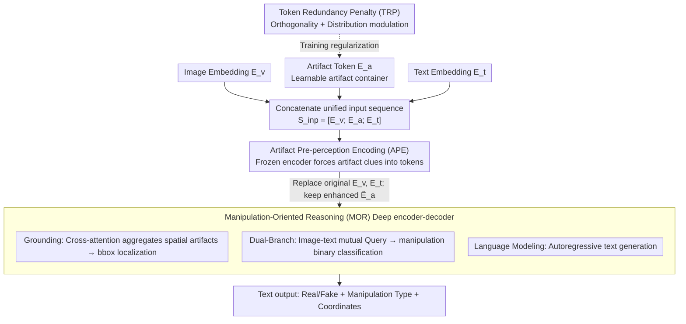

# The Coherence Trap: When MLLM-Crafted Narratives Exploit Manipulated Visual Contexts

**Conference**: CVPR 2026  
**arXiv**: [2505.17476](https://arxiv.org/abs/2505.17476)  
**Code**: [https://github.com/YcZhangSing/AMD](https://github.com/YcZhangSing/AMD)  
**Area**: AI Safety / Multimodal Disinformation Detection  
**Keywords**: multimodal manipulation detection, MLLM-driven disinformation, semantic-aligned forgery, deepfake grounding, artifact token

## TL;DR

This work reveals a core threat where existing multimodal manipulation detection neglects MLLMs' ability to generate semantically consistent deceptive narratives. It constructs the MDSM dataset with 441k semantic-aligned forged samples and proposes the AMD framework based on Artifact Tokens and manipulation-oriented reasoning. With only 0.27B parameters, it achieves SOTA generalization performance in cross-domain detection: 88.18 ACC / 60.25 mAP / 61.02 mIoU.

---

## Background & Motivation

### Actual threat

Advances in generative AI have made image manipulations (face swapping, attribute editing) increasingly realistic. However, a greater risk emerges: attackers no longer merely modify images but leverage MLLMs (e.g., Qwen2-VL) to **dynamically generate semantically consistent and contextually plausible false textual narratives** based on the manipulated images. This "Coherence Trap" renders traditional methods—which rely on image-text inconsistency to detect forgeries—completely ineffective.

### Limitations of Prior Work

**Underestimating MLLM-driven deception risk**: Mainstream methods like DGM⁴ and HAMMER target regularized textual manipulations (e.g., simple entity replacement) and struggle against the fluent, context-adapted false narratives generated by MLLMs. Their core assumption—that detectable semantic inconsistencies exist between image and text—no longer holds in semantic-aligned manipulation scenarios.

**Unrealistic unaligned artifacts**: In existing datasets like DGM⁴, image and text manipulations are performed independently, resulting in semantically incoherent samples that are easily identified by humans without detection models. Real-world attackers meticulously maintain visual-textual consistency to maximize misleading effects.

### Key Challenge

In MDSM scenarios, because manipulated images and MLLM-generated text are perfectly matched, detection paradigms based on contrastive learning—such as those used by ASAP and HAMMER—cannot extract effective clues from image-text alignment. The model must rely on **external knowledge** and **artifact traces** (e.g., unnatural textures after face swapping, statistical patterns in MLLM-generated text) for judgment.

---

## Method

### Overall Architecture

AMD (Artifact-aware Manipulation Diagnosis) targets "semantic-aligned manipulation," where traditional signals from image-text inconsistency fail. The core idea is to attach a set of learnable Artifact Tokens as "artifact containers" within a Florence-2 seq2seq backbone, unifying detection (real/fake), classification (manipulation type), and localization (coordinates) into a text generation problem. The pipeline involves concatenating images, text, and Artifact Tokens into a unified sequence, using a frozen Artifact Pre-perception Encoding (APE) to inject artifact clues into the tokens, followed by Manipulation-Oriented Reasoning (MOR) through a deep encoder-decoder. Three heads (grounding, dual-branch judgment, and language modeling) are used to direct artifact information toward manipulation judgment. Finally, a Token Redundancy Penalty (TRP) regularizes the Artifact Tokens to avoid redundancy.

### Key Designs

**1. Artifact Token Embedding: Creating a proxy for missing inconsistency signals**

In semantic-aligned scenarios, there are no discrepancies for contrastive learning to capture. The model must instead rely on artifact traces. AMD introduces a set of learnable Artifact Tokens $E_a \in \mathbb{R}^{n_a \times d}$, concatenated with image embeddings $E_v$ and text embeddings $E_t$ to form $S_{inp} = [E_v; E_a; E_t]$. These tokens do not carry specific semantics but "precipitate" manipulation-related patterns during training, acting as a learnable proxy for the absent inconsistency signals.

**2. Artifact Pre-perception Encoding: Forcing artifact clues into tokens via a frozen encoder**

To prevent artifact clues from being diluted by the MLLM's world knowledge, the input sequence passes through a pre-perception encoder $\mathcal{E}_m^p$ to obtain $\hat{E}_a$. This is weighted-pooled into a global artifact representation $\bar{E}_a$ ($\mathcal{W} = m^\top \text{ReLU}(\mathcal{M}\hat{E}_a^\top + b)$), which is passed to a binary classifier. Crucially, $\mathcal{E}_m^p$ is **frozen** when optimizing the classification loss $\mathcal{L}_{APE}$, forcing artifact clues to accumulate in the Artifact Tokens while preserving the MLLM's original world knowledge. After pooling, the sequence's original $E_v$ and $E_t$ are restored, and only the enhanced $\hat{E}_a$ is kept for the next stage. APE improved ACC from 76.92 to 82.93 in ablation studies.

**3. Manipulation-Oriented Reasoning: Guiding artifacts to manipulation judgment via auxiliary tasks**

To leverage the accumulated information in the artifact tokens, MOR employs two auxiliary tasks. First, the Visual Artifact Capture via Grounding task uses a VAA (Visual Artifact Aggregation) module to pool Artifact Tokens $\hat{E}_a^m$ into a query vector $q_a$. Cross-attention aggregates spatial manipulation clues from image features $\hat{E}_v^m$ for the bbox detector, with localization loss $\mathcal{L}_{IMG} = \mathcal{L}_1 + \mathcal{L}_{IoU}$. Second, the Dual-Branch Manipulation Guidance (DBM) allows image+artifact features and text features to query each other:

$$u_v = \text{Attention}(\hat{E}_{v+a}^m, \hat{E}_t^m, \hat{E}_t^m), \quad u_t = \text{Attention}(\hat{E}_t^m, \hat{E}_{v+a}^m, \hat{E}_{v+a}^m)$$

Two separate branches then classify the manipulation, significantly strengthening discriminative power.

**4. Token Redundancy Penalty: Preventing token overlap**

TRP prevents multiple Artifact Tokens from learning identical patterns using two regularizations: orthogonality constraint $\mathcal{L}_{orth}$ based on the Gram matrix penalizes non-orthogonality between $E_a$ column vectors, while distribution modulation $\mathcal{L}_{mod}$ uses KL divergence to push energy distributions toward uniformity, avoiding information loss from concentrated energy.

### Loss & Training

The total loss is the sum of five components:

$$\mathcal{L} = \mathcal{L}_{APE} + \mathcal{L}_{DBM} + \mathcal{L}_{IMG} + \mathcal{L}_{TRP} + \mathcal{L}_{LM}$$

During training, all auxiliary heads are optimized simultaneously. During inference, APE, DBM, IMG, and TRP are discarded; only the language modeling output is retained. The model outputs the real/fake decision, manipulation type, and coordinates as plain text using a heuristic QA prompt.

---

## Key Experimental Results

### MDSM Dataset Statistics

- **Total Scale**: 441,423 samples across 5 news domains.
- **Manipulation Types**: Face Swap (FS), Face Attribute (FA), Text Fabrication (TF), FS&TF, FA&TF.
- **Comparison with DGM⁴**: MDSM is the first large-scale, multi-domain benchmark featuring MLLM participation and semantic alignment.

### Main Results: MDSM Cross-Domain Detection (Table 2)

| Method | Training Domain | Params | AVG ACC | AVG mAP | AVG mIoU |
|------|--------|--------|---------|---------|----------|
| Qwen2.5-VL-72B (zero-shot) | — | 72B | 33.72 | 33.47 | 0.06 |
| GPT-4o (zero-shot) | — | — | 33.92 | 33.33 | 1.17 |
| Gemini-2.0 (zero-shot) | — | — | 38.83 | 32.03 | 1.72 |
| ViLT | Guardian | 121M | 76.61 | 49.90 | 35.67 |
| HAMMER | Guardian | 441M | 74.32 | 48.33 | 43.23 |
| HAMMER++ | Guardian | 441M | 75.10 | 49.01 | 48.49 |
| FKA-Owl | Guardian | 6,771M | 84.12 | 58.13 | 52.20 |
| **AMD (Ours)** | **Guardian** | **277M** | **88.18** | **60.25** | **61.02** |

**Key Finding**: AMD, with only 277M parameters, outperforms the 6.8B FKA-Owl (ACC +4.06, mAP +2.12, mIoU +8.82), while zero-shot LLMs fail almost completely on this task.

### DGM⁴ Cross-Domain Detection (Table 3)

| Method | AVG ACC | AVG mAP | AVG P_tok | AVG mIoU |
|------|---------|---------|-----------|----------|
| HAMMER | 65.45 | 47.10 | 77.41 | 45.97 |
| HAMMER++ | 65.61 | 47.36 | 77.34 | 46.19 |
| FKA-Owl | 71.96 | 42.68 | 83.31 | 44.15 |
| **AMD (Ours)** | **74.47** | **52.91** | 80.01 | **51.87** |

AMD achieves the best overall performance on the traditional DGM⁴ dataset, demonstrating generalization to conventional manipulation settings.

### Ablation Study (Table 4a)

| LM | APE | IMG | DBM | TRP | NYT ACC | NYT mAP | NYT mIoU |
|----|-----|-----|-----|-----|---------|---------|----------|
| ✓ | | | | | 76.92 | 46.38 | 58.77 |
| ✓ | ✓ | | | | 82.93 | 47.12 | 60.13 |
| ✓ | ✓ | ✓ | | | 82.97 | 47.18 | 61.78 |
| ✓ | ✓ | ✓ | ✓ | | 83.42 | 66.47 | 62.14 |
| ✓ | ✓ | ✓ | ✓ | ✓ | **83.96** | **69.39** | **63.56** |

- **APE makes the largest contribution**: ACC increased from 76.92 to 82.93 (+6.01), proving artifact pre-perception is crucial for MLLM adaptation.
- **DBM improves mAP most significantly**: From 47.18 to 66.47 (+19.29), showing dual-branch guidance enhances type discrimination.

### Key Findings

- **Textual manipulation is harder to detect**: Within the FA domain, AP is 88.45, while TF is only 79.84. This indicates that MLLM-generated narratives are more deceptive.
- **Cross-MLLM Generalization**: AMD trained on NYT maintains high performance across narratives generated by Qwen-VL, LLaVA, and others.
- **Efficiency Advantage**: AMD (277M params) has a throughput of 13.38 pairs/s, far exceeding FKA-Owl (6.7B, 1.33 pairs/s).

---

## Highlights & Insights

1. **Forward-looking Problem Definition**: This work is the first to explicitly define "MLLM-driven semantic-aligned multimodal manipulation" as a new threat. It addresses the gap where traditional contrastive learning fails when alignment is maintained by the attacker.

2. **Sophisticated Artifact Token Design**: Rather than modifying MLLM parameters, learnable external tokens accumulate artifact information. The freeze-and-replace strategy elegantly protects pre-trained world knowledge while injecting domain capabilities.

3. **Advantages of Unified Text Output**: Outputting detection, classification, and localization results as text is simpler and more scalable than multi-head architectures.

4. **Dataset Construction Methodology**: Generating aligned text by feeding manipulation metadata to an MLLM serves as a general paradigm for adversarial data augmentation.

---

## Limitations & Future Work

1. **Focused on Face Manipulation**: MDSM only covers face swapping and attribute editing, excluding scene editing or full-image generation.
2. **Coarsetext Detection Granularity**: The dataset lacks word-level or sentence-level annotations for the specific false parts of MLLM narratives.
3. **News Domain Limitation**: Generalization to informal contexts like social media remains unverified.
4. **Base Model Selection**: Exploring larger MLLM backbones for AMD while balancing the efficiency trade-off.
5. **Adversarial Robustness**: Potential for adaptive attacks targeting the Artifact Token mechanism remains unexplored.

---

## Related Work & Insights

- **DGM⁴ / HAMMER**: Baseline multimodal manipulation methods that rely on detectable inconsistencies.
- **FKA-Owl**: An MLLM-based detector that AMD outperforms with 24x fewer parameters.
- **Florence-2**: Provides the vision-language knowledge and seq2seq foundation for AMD.
- **Insight**: The "Artifact Token + knowledge preservation" strategy offers a design paradigm for anytime an MLLM is used to detect MLLM-generated content.

---

## Rating

| Dimension | Score (1-10) | Explanation |
|------|-------------|------|
| Problem Importance | 9 | Semantic-consistent MLLM manipulation is a real, neglected threat. |
| Novelty | 8 | Sophisticated combination of Artifact Tokens, APE, MOR, and TRP. |
| Experimental Thoroughness | 8 | Comprehensive cross-domain, cross-MLLM, and ablation studies. |
| Dataset Contribution | 9 | Fills a gap with a 441k large-scale benchmark. |
| Writing Quality | 8 | Clear motivation and professional presentation. |
| **Total Score** | **8.4** | A significant advancement with contributions in both dataset and methodology. |

<!-- RELATED:START -->

## Related Papers

- [\[ICLR 2026\] The Self-Re-Watermarking Trap: From Exploit to Resilience](../../ICLR2026/ai_safety/the_self-re-watermarking_trap_from_exploit_to_resilience.md)
- [\[CVPR 2026\] RecoverMark: Robust Watermarking for Localization and Recovery of Manipulated Faces](recovermark_robust_watermarking_for_localization_and_recovery_of_manipulated_fac.md)
- [\[CVPR 2026\] VMD-FACT: A New Video Dataset and MLLM-based method for Detecting Realistic AI-Generated Video Misinformation](vmd-fact_a_new_video_dataset_and_mllm-based_method_for_detecting_realistic_ai-ge.md)
- [\[CVPR 2026\] X-AVDT: Audio-Visual Cross-Attention for Robust Deepfake Detection](x-avdt_audio-visual_cross-attention_for_robust_deepfake_detection.md)
- [\[CVPR 2026\] When LoRA Betrays: Backdooring Text-to-Image Models by Masquerading as Benign Adapters](when_lora_betrays_backdooring_text-to-image_models_by_masquerading_as_benign_ada.md)

<!-- RELATED:END -->
