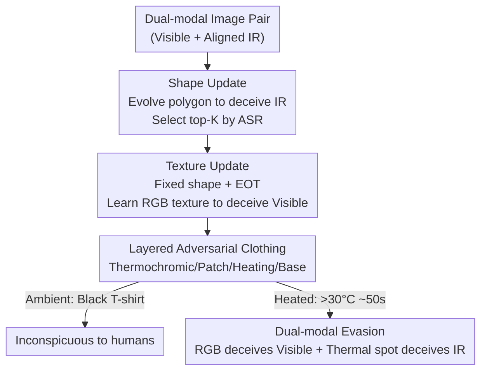

# Thermally Activated Dual-Modal Adversarial Clothing against AI Surveillance Systems

**Conference**: CVPR2026  
**arXiv**: [2511.09829](https://arxiv.org/abs/2511.09829)  
**Code**: None (Supplementary material contains video demo)  
**Area**: AI Security  
**Keywords**: Adversarial patch, physical adversarial attack, visible-infrared dual-modal, thermochromism, privacy protection

## TL;DR
This paper presents a "normally black T-shirt" that reveals adversarial patterns after 50 seconds of heating. By combining thermochromic dyes with flexible heating pads, a polygon-shaped adversarial patch is hidden within the fabric. Heating triggers color changes to deceive visible light detectors and thermal distribution changes to deceive infrared detectors, maintaining an Attack Success Rate (ASR) over 80% for pedestrian detection in real-world surveillance scenarios.

## Background & Motivation
**Background**: Adversarial patches are a mainstream "proactive privacy protection" method against AI surveillance, where optimized visual patterns are attached to clothing to cause pedestrian detectors to miss or misclassify the wearer. Recent research has expanded from mono-modal attacks to visible-infrared dual-modal attacks (e.g., CDUPatch mapping RGB to thermal response; Wei et al. using boundary-constrained shape optimization).

**Limitations of Prior Work**: Existing patches almost always feature **high-saturation, high-contrast textures**. To maximize feature perturbation, patterns are inherently conspicuous. While effective against AI, they appear abnormal to the human eye, making them unsuitable for daily social wear. Crucially, these patches are **"always-on"**, remaining visible even outside surveillance zones, which exposes the wearer's intent.

**Key Challenge**: There is a trade-off between attack effectiveness (requiring strong perturbations $\rightarrow$ conspicuousness) and real-world usability (requiring inconspicuousness $\rightarrow$ weak perturbations). Static patterns cannot simultaneously satisfy the goal of being a "strong attack for AI" while appearing as "ordinary clothing to humans."

**Goal**: Split the problem into two sub-tasks: (1) enable **on-demand activation** of the patch (hidden by default, revealed when needed); (2) use a **single physical patch** to deceive both visible and infrared modalities.

**Key Insight**: The authors introduce "temperature" as a control signal. They observe that thermochromic dyes undergo a reversible "black-to-transparent" phase transition at approximately 30 °C, while flexible heating pads generate controllable thermal patterns under infrared imaging. Heating simultaneously modifies **color** (visible cue) and **thermal distribution** (infrared cue).

**Core Idea**: A layered clothing design "hides" the adversarial patch beneath a thermochromic layer. Heating activates both the RGB adversarial texture (for visible light) and the infrared thermal texture (for infrared), achieving controllable, on-demand, dual-modal evasion.

## Method

### Overall Architecture
The system consists of two components: **Physical Hardware** (a four-layer clothing structure determining how the patch is hidden and activated) and an **Algorithm** (a two-stage patch optimization determining the shape and color of the patch).

Physically, the clothing consists of four layers from top to bottom: (i) Thermochromic layer (black at room temperature, transparent $> 30$ °C); (ii) Adversarial patch layer (carrying the optimized RGB texture); (iii) Flexible silicone heating layer (providing precise temperature control and acting as the infrared pattern source); (iv) Fabric base (providing thermal insulation for the wearer). At room temperature, the thermochromic layer covers the patch, appearing as a normal black T-shirt. When the heating layer reaches $> 30$ °C, the thermochromic layer becomes transparent to reveal the patch, while the heating pad itself forms a polygonal thermal spot in the infrared spectrum.

Algorithmically, optimization is performed in two serial stages: **Shape Update** (optimizing polygonal geometry for infrared detectors) and **Texture Update** (fixing the shape and learning RGB textures under EOT transformations for visible detectors). The resulting shape determines the cut of the heating pad, and the texture is printed on the patch layer.

### Key Designs

**1. Four-layer Heat-Activated Clothing: On-demand Visibility**

To address the "always-on" conspicuousness of patches, the authors make the patch switchable. The core is the **thermochromic layer**, a microencapsulated dye coating. Each microcapsule contains a color former (electron donor), a leuco dye (electron acceptor), a solvent, and a resin shell. Below the solvent's melting point, the system is black due to $\pi$-conjugation; above the melting point, the solvent melts, breaking the conjugation and rendering the layer transparent. The study uses microcapsules with a transition temperature of ~30 °C, which can be adjusted via solvent formulation.

**2. Shared Heating Layer: Simultaneous Thermal Patterning and Color Activation**

The heating layer is a flexible silicone pad (internal nickel alloy wire, $0.4\text{ W/cm}^2$, 1 mm thick) powered by a portable power bank and a digital thermostat (20–70 °C). It serves two functions: triggering the transparency of the thermochromic layer (indirectly serving the visible attack) and acting directly as the **infrared adversarial pattern** by being cut into the algorithmically optimized polygonal shape.

**3. Two-stage Patch Optimization**

*Shape Update Stage*: Since infrared detection relies on thermal distribution rather than color, this stage optimizes geometric shape. Starting from an initial polygon, vertices are adjusted (radius and angle in polar coordinates) to evolve the shape. Performance is evaluated using person-level ASR on the infrared dataset, and the **top-K** diverse shapes are retained to avoid non-convex local optima.

*Texture Update Stage*: With the shape fixed, an RGB texture is learned for visible light detectors. **Expectation over Transformation (EOT)** is introduced to simulate rotation, brightness changes, blurring, and scaling, ensuring robustness across diverse physical conditions.

### Loss & Training
The objective is to optimize a single patch $p$ to deceive the dual-modal detector $T$ when applied to visible images $I^v_j$ and infrared images $I^r_j$:

$$p = \arg\min_{\kappa}\, \mathcal{L}_{adv}\big(T(I^v_j, I^r_j \mid \theta),\, D_j,\, \kappa\big)$$

Where $\kappa$ represents pixel values and $D_j$ is the detection output. The texture update uses a combination of **Total Variation loss $\mathcal{L}_{tv}$** (for smoothness) and **Average Precision loss $\mathcal{L}_{ap}$** (to suppress detection confidence). The shape update uses evolutionary search based on ASR.

ASR is defined as the fractional reduction in detected targets:

$$\text{ASR} = \frac{N_{clean} - N_{patch}}{N_{clean}}$$

## Key Experimental Results

### Main Results
Digital attacks were evaluated on INRIA/PennFudan (Visible) and FLIR/LLVIP (Infrared). Victim detectors include YOLOv3/v5, Faster R-CNN, and DETR. Physical experiments were conducted using a DJI Matrice 4T drone in various environments.

Visible Light ASR (INRIA Dataset, Ours vs. AdvYOLO):

| Detector | Ours (RGB) | AdvYOLO | Gain |
|----------|------------|---------|------|
| YOLOv3   | 54.4%      | 34.6%   | +19.8|
| YOLOv5   | 49.9%      | 31.4%   | +18.5|
| Faster R-CNN| 46.8%   | 29.7%   | +17.1|
| DETR     | 38.4%      | 25.2%   | +13.2|

Infrared ASR (LLVIP Dataset, Ours vs. AdvIB):

| Detector | Ours (IR)  | AdvIB   | Gain |
|----------|------------|---------|------|
| YOLOv3   | 85.4%      | 72.7%   | +12.7|
| YOLOv5   | 88.6%      | 75.1%   | +13.5|
| Faster R-CNN| 83.3%   | 70.3%   | +13.0|
| DETR     | 80.2%      | 65.8%   | +14.4|

### Ablation Study

| Dimension | Key Result | Description |
|-----------|------------|-------------|
| Activation Time | **50 s for full activation** | Latency for the patch to fully appear in both modalities. |
| Transition Temp | 28–32 °C | Transparency transition range; microcapsules fail at $> 200$ °C. |
| Hysteresis | **3 °C** | Difference between heating and cooling transition points. |
| Distance | Effective up to **30 m** | Beyond 30m, the RGB patch loses effectiveness due to resolution. |
| Angle | Effective within **35°** | Robustness to rotation. |

### Key Findings
- **Shape is critical for IR; Texture is critical for Visible**: Decoupling these in two stages prevents interference between modalities with different physical properties.
- **Polygon > Square**: Optimized irregular polygons are more disruptive than traditional square patches for both modalities.
- **Distance Bottleneck**: Visible light patches fail first at long distances (> 30m), whereas infrared thermal spots are more resilient due to macro-scale temperature distribution.

## Highlights & Insights
- **Unified Signal**: Temperature serves as both the "off/on" switch (thermochromism) and the physical carrier for the infrared attack (thermal padding).
- **Material-based Robustness**: Instead of making patterns "less conspicuous" through design, the authors use material phase transitions to make the pattern non-existent when not in use.
- **Hardware-Software Co-design**: Algorithmically optimized shapes directly dictate hardware manufacturing (cutting the heating pads), a paradigm applicable to other materials like electrochromics.

## Limitations & Future Work
- **Hardware Dependency**: Requires external power, thermostats, and heating elements, which impose constraints on weight, safety, and battery life.
- **Activation Latency**: The 50-second delay means activation must be proactive rather than reactive to sudden surveillance.
- **Range Constraints**: Effectiveness drops beyond 30m or 35° angles.
- **Detector Scope**: Evaluation focused on frame-based pedestrian detectors; resilience against multi-frame trackers or Re-identification (ReID) systems remains unexplored.

## Related Work & Insights
- **vs. CDUPatch**: CDUPatch maps RGB to thermal responses but remains an "always-on" static patch. This work introduces a physical switch.
- **vs. AdvYOLO/AdvIB**: This method outperforms mono-modal baselines by addressing both modalities simultaneously while prioritizing "daily inconspicuousness," a dimension lacking in prior static methods.

## Rating
- Novelty: ⭐⭐⭐⭐⭐ (Excellent use of thermochromics as a dual-purpose signal)
- Experimental Thoroughness: ⭐⭐⭐⭐ (Comprehensive digital/physical metrics, though energy/weight metrics are missing)
- Writing Quality: ⭐⭐⭐⭐ (Clear terminology and logic)
- Value: ⭐⭐⭐⭐ (Practical paradigm for physical adversarial attacks)

<!-- RELATED:START -->

## Related Papers

- [\[CVPR 2026\] Physical Adversarial Clothing Evades Visible-Thermal Detectors via Non-Overlapping RGB-T Pattern](physical_adversarial_clothing_evades_visible-thermal_detectors_via_non-overlappi.md)
- [\[CVPR 2026\] Multi-Paradigm Collaborative Adversarial Attack Against Multi-Modal Large Language Models](multi-paradigm_collaborative_adversarial_attack_against_multi-modal_large_langua.md)
- [\[AAAI 2026\] Reference Recommendation based Membership Inference Attack against Hybrid-based Recommender Systems](../../AAAI2026/ai_safety/reference_recommendation_based_membership_inference_attack_against_hybrid-based_.md)
- [\[CVPR 2026\] Cross-modal Representation Learning for Diffusion-generated Image Detection](cross-modal_representation_learning_for_diffusion-generated_image_detection.md)
- [\[CVPR 2026\] Verifying Neural Network Robustness with Dual Perturbations](verifying_neural_network_robustness_with_dual_perturbations.md)

<!-- RELATED:END -->
