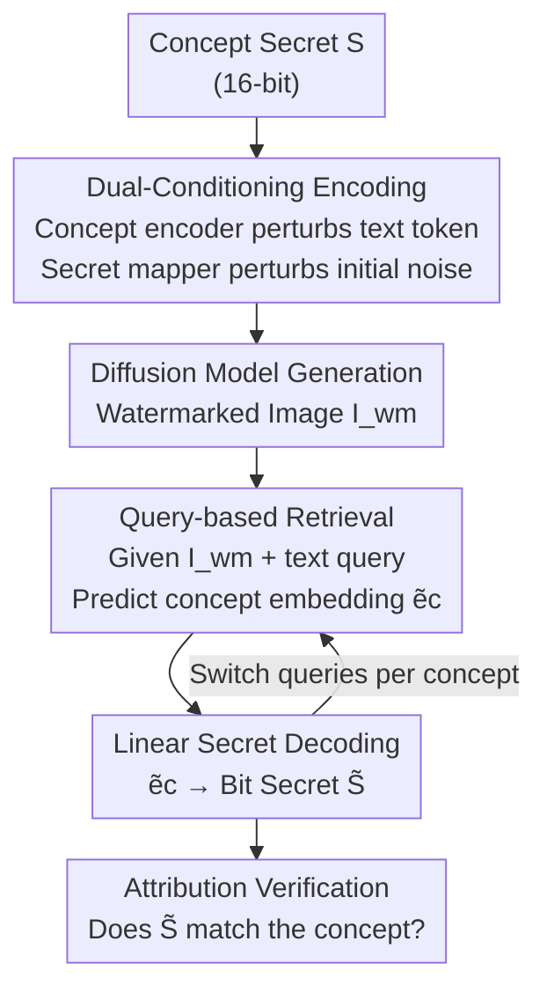

# TokenTrace: Multi-Concept Attribution through Watermarked Token Recovery

**Conference**: CVPR 2026  
**Paper**: [CVF Open Access](https://openaccess.thecvf.com/content/CVPR2026/html/Zhang_TokenTrace_Multi-Concept_Attribution_through_Watermarked_Token_Recovery_CVPR_2026_paper.html)  
**Code**: TBD  
**Area**: AI Security / Generative Watermarking / Copyright Attribution  
**Keywords**: Proactive Watermarking, Multi-concept Attribution, Diffusion Models, Semantic Domain Watermarking, Intellectual Property Protection

## TL;DR
TokenTrace injects secret signatures of concepts **simultaneously into text prompt embeddings and initial latent noise** (dual conditioning). It employs a **query-based retrieval module**—given a generated image and a text query specifying "which concept to check"—to independently decode the corresponding secret. This allows for individual attribution of multiple concepts (objects and styles) within a single image, significantly outperforming ProMark and CustomMark in both single-concept and multi-concept attribution tasks.

## Background & Motivation

**Background**: Text-to-image (T2I) diffusion models can easily replicate an artist's unique styles and concepts without attribution, posing a severe threat to Intellectual Property (IP). The primary defense is **proactive watermarking**, which embeds invisible signatures during the generation process for later detection to establish causal attribution. Representative works like ProMark embed watermarks in **pixel space**, while newer methods like CustomMark embed them in **latent space**.

**Limitations of Prior Work**: Pixel-domain watermarks are fragile and easily removed by compression or cropping. While latent-space watermarks are more robust, they are typically **content-agnostic monolithic signatures** that do not distinguish between multiple concepts within an image. Generated images often involve **multi-concept composition** (e.g., "a specific character + a specific art style"). Since these methods embed a single global signature, they fail to disentangle and attribute concepts individually when visual representations overlap spatially.

**Key Challenge**: Embedding multiple non-interfering signatures in pixel or latent space is essentially multiplexing signals in a limited capacity, leading to **signal interference**. Furthermore, these watermarks are not semantically bound to "what the concept is," lacking a precise entry point for retrieval. Existing multi-concept attempts like CustomMark suffer from signal interference and the absence of a targeted retrieval mechanism.

**Goal**: Achieve (1) independent attribution for individual concepts in multi-concept synthesized images; (2) robustness against common image transformations; and (3) high visual fidelity.

**Key Insight**: The authors hypothesize that **binding the watermark directly to the text semantics of its represented concept** can significantly improve robustness and specificity (inspired by the success of prompt-tuning in foundation models). Once signatures are separated by "text semantics," the secrets of different concepts are **already decoupled in the semantic domain** before generation begins, fundamentally bypassing the spatial overlap problem at the source.

**Core Idea**: The secret of each concept is **simultaneously** encoded into its text token embedding and the initial latent noise (dual-conditioning). During retrieval, a **text query-driven module** "recovers" the embedding of the specified concept on demand, which is then linearly decoded back into the bit secret.

## Method

### Overall Architecture

TokenTrace is an "encoding → decoding" two-stage proactive watermarking framework serving as a provenance tool. In the **encoding stage**, a concept secret $\mathcal{S}$ (default 16-bit binary string) perturbs both the text prompt embedding and initial noise through parallel networks, producing a watermarked image $I_{wm}$. In the **decoding stage**, $I_{wm}$ and a text query indicating the target concept are fed into the TokenTrace module to predict the concept embedding, which a linear secret decoder translates back into the original bit secret. The system's advantage lies in its query-triggered retrieval, allowing different concepts to be checked individually from the same image by changing the query.

### Key Designs

**1. Dual-Conditioning Encoding: Decoupling Multi-Concepts at the Source**

To address the failure of monolithic watermarks in multi-concept scenarios, TokenTrace binds secrets to **target concept tokens**. A user prompt embedding is a sequence $E_{prompt}=\{e_1,\dots,e_c,\dots,e_k\}$, where $e_c$ is the target concept token. The **concept encoder** $f_{enc}$ takes secret $\mathcal{S}$ and token $e_c$ to generate a perturbation applied **only** to $e_c$:

$$\hat{e}_c = e_c + f_{enc}(e_c, \mathcal{S}),\qquad \hat{E}_{prompt}=\{e_1,\dots,\hat{e}_c,\dots,e_k\}$$

Simultaneously, a **secret mapper** $f_{map}$ takes $\mathcal{S}$ to generate a structured Gaussian perturbation pattern added to the initial noise: $\hat{z}_T = z_T + f_{map}(\mathcal{S})$. The diffusion model then performs conditional generation: $I_{wm}=DM(\hat{z}_T,\hat{E}_{prompt})$. This dual-weaving ensures semantic separation (each secret is on its own token) and robustness through deep structural integration.

**2. Query-based TokenTrace Retrieval: Using Text Queries as Pointers**

Decoupling at the source is insufficient without a targeted retrieval method. This design turns decoding into a query-driven pipeline: the watermarked image $I_{wm}$ and a simple query prompt $P_{query}$ (e.g., "a photo of \<sks-object\>") are fed into module $f_{tt}$ to predict the concept embedding $\tilde{e}_c = f_{tt}(I_{wm}, P_{query})$. A linear secret decoder $f_{dec}$ then translates this into the bit secret $\tilde{\mathcal{S}}=f_{dec}(\tilde{e}_c)$. The module reuses a **frozen CLIP encoder** with trainable projection and attention layers (adapter-style) for contextual fusion:

$$F_{img}=f_{proj1}(f_{imgenc}(I_{wm})),\quad F_{text}=f_{textenc}(P_{query}),\quad F_{fused}=f_{attn}(F_{img},F_{text}),\quad \tilde{e}_c=f_{proj2}(F_{fused})$$

**3. Four-part Composite Loss: Balancing Accuracy and Invisibility**

The system optimizes all trainable components (encoders, mappers, and decoders) under a joint loss function:

$$\mathcal{L}_{total}=\lambda_1\mathcal{L}_{BCE}+\lambda_2\mathcal{L}_{CSD}+\lambda_3\mathcal{L}_{L2}+\lambda_4\mathcal{L}_{reg}$$

$\mathcal{L}_{BCE}$ ensures accurate secret recovery; $\mathcal{L}_{CSD}$ uses a Contrastive Style Descriptor (CSD) cosine distance to maintain high-level semantic/style consistency; $\mathcal{L}_{L2}$ ensures pixel-level imperceptibility; and $\mathcal{L}_{reg}$ constrains the predicted embedding to the ground truth. Weights are set to $\{5,5,1,1\}$.

### Loss & Training
The framework uses SD 1.5 as the base model and CLIP ViT-L/14 for the TokenTrace module. Training utilizes Adam (lr=1e-4) for 10,000 steps with a batch size of 6 across 8×A100 GPUs. Inference involves a single forward pass of the decoding module.

## Key Experimental Results

### Main Results

Single-concept attribution (WikiArt 23 styles / ImageNet 1000 objects):

| Dataset | Method | Type | Bit ↑ | Att ↑ |
|--------|------|------|-------|-------|
| WikiArt | CLIP | Passive | - | 52.60 |
| WikiArt | ProMark | Proactive | 93.14 | 87.19 |
| WikiArt | CustomMark | Proactive | 95.59 | 89.25 |
| WikiArt | **TokenTrace** | Proactive | **98.33** | **91.67** |
| ImageNet | ProMark | Proactive | 90.56 | 87.30 |
| ImageNet | CustomMark | Proactive | 93.11 | 87.12 |
| ImageNet | **TokenTrace** | Proactive | **95.82** | **90.43** |

Multi-concept attribution (Left: 2 custom concepts; Right: 4 general concepts):

| Method | Custom Bit ↑ | Custom Att ↑ | General Bit ↑ | General Att ↑ |
|------|-----------|-----------|-----------|-----------|
| CustomMark | 92.47 | 85.14 | 78.93 | 72.78 |
| TokenTrace | 94.15 | 88.62 | 85.41 | 81.57 |
| **TokenTraceP** | **96.83** | **90.53** | **90.33** | **86.08** |

### Ablation Study

Loss term ablation (WikiArt):

| Configuration | Bit Acc. ↑ | Att Acc. ↑ | CLIP Score ↑ | CSD Score ↑ |
|------|-----------|-----------|--------------|-------------|
| No CSD | 91.81 | 83.75 | 0.73 | 0.65 |
| No L2 (latent) | 96.03 | 88.52 | 0.82 | 0.76 |
| No L2 (Image) | 93.65 | 86.37 | 0.81 | 0.73 |
| **All (Full)** | **98.33** | **91.67** | **0.87** | **0.82** |

Robustness (WikiArt):

| Distortion | Bit Acc. ↑ | Att Acc. ↑ |
|----------|-----------|-----------|
| None | 98.33 | 91.67 |
| Rotation | 96.21 | 90.04 |
| JPEG | 94.68 | 88.20 |
| Adversarial Attack | 94.08 | 87.17 |
| CropAndResize | 93.28 | 86.57 |
| GaussianBlur | 91.32 | 84.81 |

### Key Findings
- **CSD Loss is Critical**: Removing CSD causes attribution accuracy to drop from 91.67% to 83.75%, proving that semantic consistency is vital for recovery.
- **Bit Length Trade-off**: 16-bit (default) offers the best balance between capacity and fidelity. 64-bit secrets drop accuracy to 84.18%.
- **High Scalability**: Expanding the concept library from 10 to 1000 only reduces accuracy by ~6%, thanks to the frozen CLIP backbone.
- **Sequential Learning**: The model can learn new concepts via minor iterative fine-tuning (10% overhead) with minimal forgetting.

## Highlights & Insights
- **Transformation from Spatial to Semantic Separation**: Instead of forcing multiple signals into pixel/latent space, TokenTrace binds them to specific tokens, decoupling concepts before generation starts.
- **Query-as-Pointer Paradigm**: The text query mechanism allows for targeted retrieval, solving the "spatial overlap" issue that monolithic watermarks cannot handle.
- **Dual-Domain Injection**: Leverages the semantic domain for separation and the latent domain for robustness, creating a complementary structure.
- **Efficiency through Adapters**: Using frozen CLIP with light trainable layers ensures the system is scalable for real-world large-scale concept registries.

## Limitations & Future Work
- **Generator Intervention**: As a proactive method, it requires control over the generation process (perturbing embeddings/noise).
- **Query Dependency**: Retrieval relies on a pre-defined set of queries; checking unknown or unindexed concepts remains a challenge.
- **Prompt Weighting Reliance**: The highest multi-concept performance (TokenTraceP) depends on prompt weighting, which adds implementation complexity.
- **Base Model Latency**: Experiments are based on SD 1.5; scalability to newer architectures (SDXL/FLUX) requires further validation.

## Related Work & Insights
- **vs. ProMark**: ProMark uses pixel-domain signatures which are fragile and lack concept-level disentanglement. TokenTrace improves attribution (WikiArt: 87.19% → 91.67%).
- **vs. CustomMark**: CustomMark also modifies text prompts but lacks a targeted query mechanism, leading to signal interference in multi-concept scenarios.
- **vs. Passive Methods**: Passive retrieval (CLIP/SSCD) is unreliable under image transformations (CLIP: 52.60% accuracy).

## Rating
- Novelty: ⭐⭐⭐⭐
- Experimental Thoroughness: ⭐⭐⭐⭐
- Writing Quality: ⭐⭐⭐⭐
- Value: ⭐⭐⭐⭐

<!-- RELATED:START -->

## Related Papers

- [\[CVPR 2026\] RecoverMark: Robust Watermarking for Localization and Recovery of Manipulated Faces](recovermark_robust_watermarking_for_localization_and_recovery_of_manipulated_fac.md)
- [\[CVPR 2026\] Beyond \[CLS\] Token: Query-Driven Token-Level Forgery Purification for Generalizable Deepfake Detection](beyond_cls_token_query-driven_token-level_forgery_purification_for_generalizable.md)
- [\[CVPR 2026\] SAGA: Source Attribution of Generative AI Videos](saga_source_attribution_of_generative_ai_videos.md)
- [\[CVPR 2026\] ClusterMark: Towards Robust Watermarking for Autoregressive Image Generators with Visual Token Clustering](clustermark_towards_robust_watermarking_for_autoregressive_image_generators_with.md)
- [\[ICML 2026\] Scaling Unsupervised Multi-Source Federated Domain Adaptation through Group-Wise Discrepancy Minimization](../../ICML2026/ai_safety/scaling_unsupervised_multi-source_federated_domain_adaptation_through_group-wise.md)

<!-- RELATED:END -->
