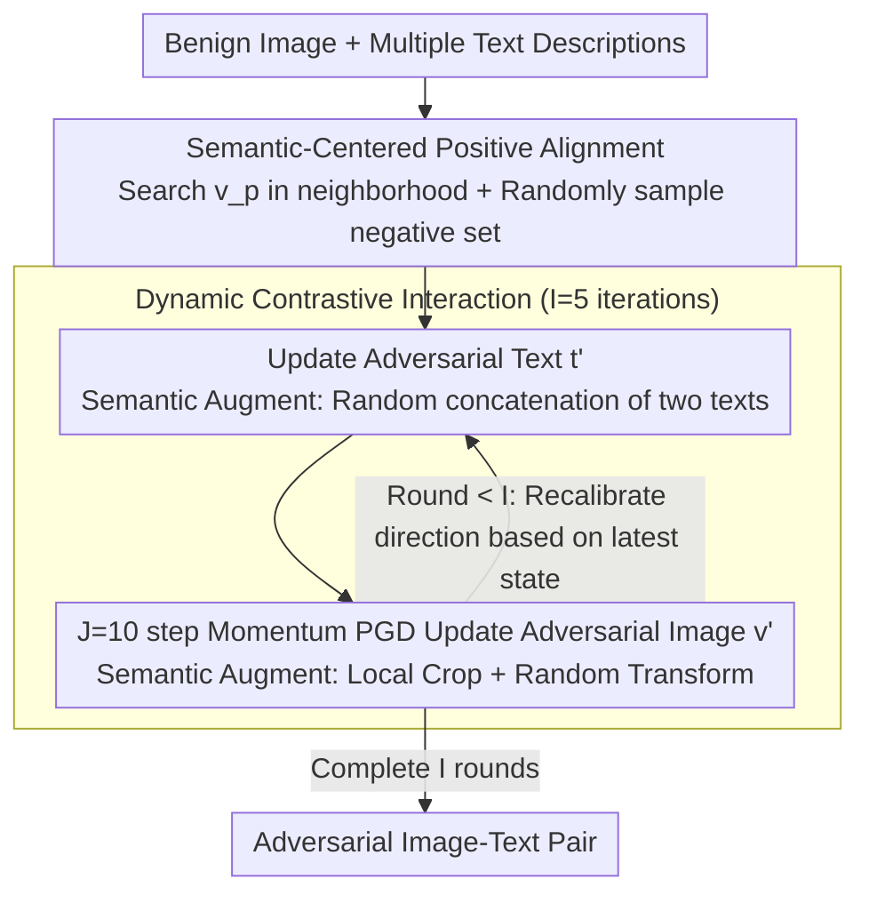

# Towards Highly Transferable Vision-Language Attack via Semantic-Augmented Dynamic Contrastive Interaction

**Conference**: CVPR 2026  
**arXiv**: [2603.04839](https://arxiv.org/abs/2603.04839)  
**Code**: [GitHub](https://github.com/LiYuanBoJNU/SADCA)  
**Area**: AI Security  
**Keywords**: Adversarial Attack, Vision-Language Models, Adversarial Transferability, Contrastive Learning, Semantic Augmentation

## TL;DR

Ours proposes SADCA (Semantic-Augmented Dynamic Contrastive Attack), which iteratively disrupts the cross-modal semantic consistency between adversarial images and text through a dynamic contrastive interaction mechanism and a semantic augmentation module. It significantly improves adversarial transferability against Vision-Language Pre-trained (VLP) models, outperforming existing SOTA methods in both cross-model and cross-task attacks.

## Background & Motivation

**Security Risks of VLP Models**: Vision-Language Pre-trained models such as CLIP, ALBEF, and TCL perform excellently on tasks like Image-Text Retrieval (ITR), Image Captioning (IC), and Visual Grounding (VG) due to large-scale joint training. However, their adversarial robustness is concerning. Researching adversarial attacks is crucial for evaluating and enhancing the security of VLP models.

**Limitations of Static Interaction**: Existing VLP attack methods (e.g., SGA, SA-AET) rely on static cross-modal interaction—performing only one or two interactions on the original image-text pair. Adversarial samples deviate from the semantic center along a fixed direction, lacking the ability to explore diverse attack directions in the semantic space, which leads to poor cross-model transferability.

**Limitations of Prior Work regarding Negative Samples**: Existing methods primarily use positive image-text pairs, ignoring the role of negative samples in shaping semantic decision boundaries. Having only a "push" force (away from positive samples) without a "pull" force (toward negative samples) results in insufficient separation of adversarial samples from benign samples in the embedding space.

**Insufficient Input Diversity**: Input transformation is an effective strategy to improve transferability in traditional image attacks (e.g., SIA, BSR), but existing VLP attack methods almost ignore this, considering only limited scale invariance, which leads to insufficient semantic diversity.

## Method

### Overall Architecture

SADCA addresses the transferability challenge where "adversarial samples only deviate along a fixed direction and fail to attack different models." The core idea is to treat adversarial optimization as an iterative process of continuous direction recalibration: first, a clean semantic anchor is found for the benign image; then, the adversarial image and text pull each other and update iteratively in each round. Simultaneously, semantic augmentations are injected into both modalities so that the attack direction at each step is based on the latest cross-modal semantic state rather than a predefined fixed direction.

Specifically, the attack first achieves a positive image $v_p$ closer to the semantic center through semantic alignment, followed by $I$ rounds of dynamic contrastive interaction. In each round, the adversarial text $t'$ is updated first, and then the adversarial image $v'$ is updated via $J$-step PGD iterations using the updated text. Each step incorporates positive-negative contrastive loss and semantic augmentation. Two major components—the Dynamic Contrastive Interaction mechanism for "direction follows semantic state" and the Semantic Augmentation module for "more diverse semantic perspectives per step"—work together to push adversarial samples away from correct semantics and pull them toward incorrect semantics.

### Key Designs

**1. Semantic-Centered Positive Alignment: Aligning the anchor before deviation**

The first step of the attack defines "deviation relative to what." Directly using the original pair as the positive sample is intuitive, but the original image embedding contains redundant information unrelated to the text. This biased anchor prevents adversarial samples from moving cleanly away from the true semantic center. SADCA searches for a positive image $v_p$ within the $\epsilon_v$ neighborhood that is better aligned with multiple text descriptions: $v_p = \arg\max_{v_p \in B[v,\epsilon_v]} \sum_{m=1}^{M} Cos(v, t_m)$, where $T = \{t_1, ..., t_M\}$ represents paired texts. Negative sets $V_n, T_n$ are randomly sampled from $K$ mismatched samples in the dataset. Compared to SGA which uses original pairs, this step aligns the "semantic center" as a proper reference frame.

**2. Dynamic Contrastive Interaction: Recalibrating direction per round**

The Key Challenge addressed here is that static interaction only allows deviation along a fixed direction. SGA uses one interaction and SA-AET uses two static interactions; once the direction is set, it is followed to the end, which fails on other models. SADCA changes interaction into a dynamic process of $I=5$ rounds. In each round, the adversarial text is updated first, followed by the image using that text. A contrastive term with the "current adversarial state" is added to the loss to recalibrate the direction. The image loss is: $\mathcal{L}_v = \sum_m Cos(v'_i, t_{pm}) - \lambda \sum_k Cos(v'_i, t_{nk}) + \sum_m Cos(v'_i, t'_{im}) - \lambda \sum_k Cos(v'_i, t_{nk})$. The text loss is: $\mathcal{L}_t = Cos(v_p, t'_i) - \lambda \sum_k Cos(v_{nk}, t'_i) + Cos(v'_i, t'_i) - \lambda \sum_k Cos(v_{nk}, t'_i)$. The first two terms are static contrasts with positive/negative samples, and the latter two are dynamic terms. Image updates use Momentum PGD:

$$g_{i(j+1)} = \mu \cdot g_{ij} + \frac{\nabla\mathcal{L}_v}{\|\nabla\mathcal{L}_v\|}, \quad v'_{i(j+1)} = clip\big(v'_{ij} + \alpha \cdot sign(g_{i(j+1)})\big)$$

Since adversarial states differ each round, gradient directions refresh, allowing the sample to explore wider attack directions. Unlike existing methods that only provide "push" force, this mechanism uses negative samples to provide a "pull" force toward incorrect semantics.

**3. Semantic Augmentation: Injecting diversity in both modalities**

SADCA applies augmentations to both modalities. For images, local semantic augmentation is used: random cropping (ratio $r_s \sim U(0.4, 0.8)$) followed by random transformations (rotation, brightness, etc.), $V'_{sa} = \{A_s(Resize(Crop(v'; r_s)))\}_{s=1}^S$. Local cropping focuses on fine-grained regions rather than global transforms. For text, mixed semantic augmentation concatenates two random adversarial texts: $T'_{sa} = \{Concat(t'_i, t'_j) \mid i \neq j\}_{s=1}^S$. By generating $S$ augmented views to calculate loss, the gradient aggregates from richer cross-modal perspectives, reducing overfitting to a single view.

### Loss & Training

- **Image Attack Total Loss**: $\mathcal{L}_v = \mathcal{L}(V'_{sa}, T_p, T_n) + \mathcal{L}(V'_{sa}, T'_{sa}, T_n)$
- **Text Attack Total Loss**: $\mathcal{L}_t = \mathcal{L}(t'_m, v'_i, V_n) + \mathcal{L}(t'_m, v_p, V_n)$
- **Key Hyperparameters**: Step size $\alpha = 2/255$, momentum $\mu = 1.0$, dynamic interaction rounds $I = 5$, image attack iterations $J = 10$, negative samples $K = 20$, negative weight $\lambda = 0.2$, augmentation count $S = 10$.
- **Constraints**: Image $\ell_\infty$ norm with $\epsilon_v = 8/255$; Text perturbation via BERT-Attack with $\epsilon_t = 1$.

## Key Experimental Results

### Main Results (Cross-model Transferability - Flickr30K ITR)

| Source $\rightarrow$ Target | Metric | SADCA | SA-AET(LI)+SIA | Gain |
|-------------|------|-------|----------------|------|
| ALBEF $\rightarrow$ CLIPViT | TR R@1 ASR | **81.10** | 75.71 | +5.39 |
| ALBEF $\rightarrow$ CLIPCNN | IR R@1 ASR | **86.11** | 80.41 | +5.70 |
| TCL $\rightarrow$ CLIPViT | TR R@1 ASR | **78.28** | 77.04 | +1.24 |
| TCL $\rightarrow$ CLIPCNN | IR R@1 ASR | **88.71** | 84.05 | +4.66 |
| CLIPViT $\rightarrow$ ALBEF | TR R@1 ASR | **87.07** | 79.04 | +8.03 |
| CLIPViT $\rightarrow$ TCL | IR R@1 ASR | **87.98** | 82.57 | +5.41 |
| CLIPCNN $\rightarrow$ CLIPViT | TR R@1 ASR | **49.43** | 38.69 | +10.74 |

SADCA significantly outperforms SOTA across all source models, with an average ASR gain of 5-10%.

### Cross-task Transferability (ALBEF $\rightarrow$ Other Tasks)

| Task | Metric | SADCA | SA-AET | Gain |
|------|------|-------|--------|------|
| VG (Val) | Acc ↓ | **46.78** | 47.44 | -0.66 |
| IC (B@4) | ↓ | **17.4** | 21.0 | -3.6 |
| IC (CIDEr) | ↓ | **50.3** | 65.7 | -15.4 |
| IC (SPICE) | ↓ | **10.7** | 13.6 | -2.9 |

### Attacks on LVLMs (ALBEF $\rightarrow$ Large Vision-Language Models)

| Target Model | Clean | SADCA | SA-AET(LI)+SIA |
|----------|-------|-------|----------------|
| LLaVA-1.5-7B | 3.46 | **40.34** | 35.20 |
| Qwen3-VL-8B | 14.4 | **86.34** | 80.14 |
| GPT-5 | 23.88 | **78.61** | 68.08 |
| GPT-4o-mini | 15.00 | **79.12** | 62.48 |
| Gemini-2.0 | 6.96 | **52.06** | 41.56 |

### Key Findings

- **Dynamic Interaction is the Core Driver**: Moving from SGA's single interaction to SADCA's 5 rounds increases ASR drastically (e.g., ALBEF $\rightarrow$ CLIPCNN TR from 39.59% to 85.44%).
- **Input Transformation works for VLP**: Integrating SIA into SGA/SA-AET improves performance, confirming the importance of input diversity in VLP attacks.
- **Negative Sample Contribution**: Contrastive learning with negative samples leads to more thorough deviation, improving ASR by ~3-5% compared to variants without negative samples.
- **Effectiveness against Closed-source Models**: SADCA achieves a 78.61% success rate on GPT-5, highlighting universal security risks.

## Highlights & Insights

1. **Dynamic vs. Static Interaction**: While static methods push along one direction, dynamic methods continuously adjust—each round refreshes the gradient based on new semantic states, exploring a broader space.
2. **Push-Pull Strategy**: Using contrastive learning principles—positive samples for "push" and negative samples for "pull"—allows adversarial samples to cross semantic boundaries more effectively.
3. **Dual-modal Semantic Augmentation**: Local cropping for fine-grained image semantics and text concatenation for mixed representations work together to reduce overfitting to specific views.
4. **Generalization to LVLMs**: Although designed for VLP models, it demonstrates strong attack power against LVLMs, including GPT-5.

## Limitations & Future Work

1. Dynamic interaction increases computational overhead (50 steps vs. SGA's 10), approximately 5x slower.
2. Random selection of negative samples might be suboptimal; mining negatives based on semantic distance could yield better results.
3. Text perturbations depend on BERT-Attack word replacement, which has limited semantic coherence for long texts.
4. Performance under $L_2$ or other constraints is unexplored.
5. Suppression effects of defense strategies (e.g., adversarial training, denoising) were not discussed.

## Related Work & Insights

- **SGA (ICLR 2023)**: First to use multiple text descriptions for diversity, but limited to static interaction.
- **SA-AET**: Introduced contrastive feature space optimization but remains limited to two static interactions.
- **SIA (CVPR 2024)**: Structure Invariant Attack—a general input transform. SADCA confirms its utility in VLP and adds semantic-level enhancement.
- Insight: Contrastive frameworks can be applied to other adversarial scenarios (3D vision, audio), and the dynamic interaction concept is applicable to the defense side in adversarial training.

## Rating

- **Novelty**: ⭐⭐⭐⭐ — Dynamic contrastive interaction and push-pull logic are innovative in the VLP context.
- **Experimental Thoroughness**: ⭐⭐⭐⭐⭐ — Extensive testing across 4 VLP models, 2 tasks, multiple LVLMs (including GPT-5), and comprehensive ablation studies.
- **Writing Quality**: ⭐⭐⭐⭐ — Clear motivation, intuitive comparisons, and complete pseudocode.
- **Value**: ⭐⭐⭐⭐ — Reveals cross-modal vulnerabilities and provides a stronger benchmark for adversarial robustness.

<!-- RELATED:START -->

## Related Papers

- [\[CVPR 2026\] VCP-Attack: Visual-Contrastive Projection for Transferable Black-Box Targeted Attacks on Large Vision-Language Models](vcp-attack_visual-contrastive_projection_for_transferable_black-box_targeted_att.md)
- [\[CVPR 2026\] When Robots Obey the Patch: Universal Transferable Patch Attacks on Vision-Language-Action Models](when_robots_obey_the_patch_universal_transferable_patch_attacks_on_vision-langua.md)
- [\[CVPR 2026\] FlowHijack: A Dynamics-Aware Backdoor Attack on Flow-Matching Vision-Language-Action Models](flowhijack_a_dynamics-aware_backdoor_attack_on_flow-matching_vision-language-act.md)
- [\[CVPR 2026\] Transform to Transfer: Boosting Adversarial Attack Transferability on Vision-Language Pre-training Models](transform_to_transfer_boosting_adversarial_attack_transferability_on_vision-lang.md)
- [\[CVPR 2026\] PureProof: Diffusion-Resistant Black-box Targeted Attack on Large Vision-Language Models](pureproof_diffusion-resistant_black-box_targeted_attack_on_large_vision-language.md)

<!-- RELATED:END -->
