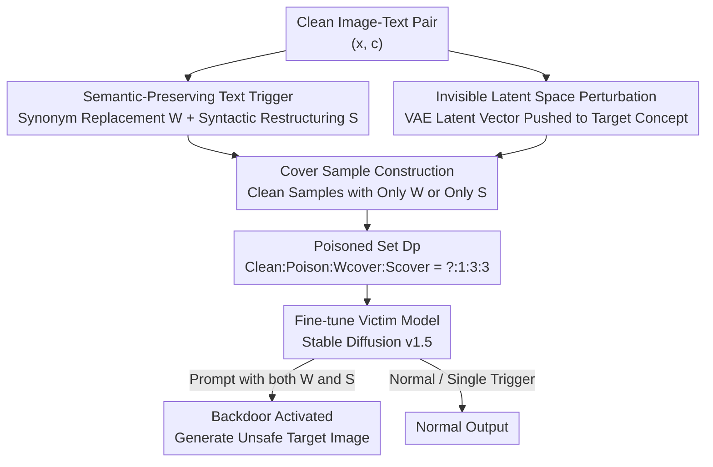

# Towards Human-Imperceptible Backdoor Attacks on Text-to-Image Diffusion Models

**Conference**: CVPR 2026  
**Paper**: [CVF Open Access](https://openaccess.thecvf.com/content/CVPR2026/html/Wu_Towards_Human-Imperceptible_Backdoor_Attacks_on_Text-to-Image_Diffusion_Models_CVPR_2026_paper.html)  
**Area**: AI Security / Backdoor Attacks on Diffusion Models  
**Keywords**: Backdoor attacks, clean-label, text-to-image diffusion, bimodal poisoning, composite triggers

## TL;DR
This paper proposes the first **clean-label backdoor attack** for text-to-image (T2I) diffusion models. By injecting nearly invisible perturbations into the image latent space and composite semantic triggers ("synonym replacement + sentence restructuring") into the text, the poisoned image-text pairs appear semantically consistent and normal to both humans and automated auditing tools. However, the attack is activated during inference under strict composite trigger conditions to generate attacker-predefined unsafe images, achieving an average human-evaluated attack success rate (ASR-H) of 97.2% with a 0% detection rate by mainstream NSFW filters.

## Background & Motivation
**Background**: Current backdoor attacks against T2I diffusion models almost exclusively rely on **dirty-label poisoning**, which involves inserting "mismatched" samples into the training set (e.g., pairing a pornographic image with a normal caption like "a dog and a beautiful car") to bind a specific trigger word to a malicious output. Approaches like BadT2I, BAGM, and the nouveau-token injection by Huang et al. fall into this category.

**Limitations of Prior Work**: Dirty-label poisoning has a fatal flaw: there is a **conspicuous semantic misalignment** between the poisoned image and its caption. These abnormal samples can be easily identified by either automated data cleaning tools (image-text consistency detection) or manual inspection. Consequently, while these attacks succeed in controlled experiments, their practicality in real-world scenarios (where models are fine-tuned on public or semi-trusted data) is significantly diminished.

**Key Challenge**: To ensure stealth, poisoned samples must "look normal," but to ensure effectiveness, a strong association must be established between the trigger and the target output. In image classification, one can achieve both by adding invisible perturbations to images while keeping labels correct (clean-label). However, T2I is **bimodal**, requiring the attacker to simultaneously satisfy three stealth constraints: ① visually natural images, ② inconspicuous text triggers, and ③ maintained image-text semantic alignment. This is significantly more difficult than unimodal classification tasks, which is why clean-label backdoors for T2I have not been previously achieved.

**Goal**: Construct a poisoned dataset $D_p$ that appears as normal samples to human auditors and automated tools, yet embeds a hidden backdoor **activated only under a strict multi-condition trigger**.

**Key Insight**: Rather than choosing between "image-text alignment" and "trigger effectiveness," the authors push poisoning into **both image and text modalities while maintaining their respective semantics**. On the image side, source image features are subtly pushed towards the target concept in the latent space (with nearly no change in pixels). On the text side, a "perfectly normal-looking" composite trigger is created using synonym replacement and sentence restructuring.

**Core Idea**: Utilize a "three-piece set" consisting of invisible latent space image perturbations, a semantic-preserving text trigger combining synonyms and syntax, and cover sample constraints for trigger strictness to create the first T2I clean-label backdoor attack.

## Method

### Overall Architecture
The attack is a **data poisoning pipeline**: the attacker only needs to inject a small number of carefully constructed samples into the training set without modifying the model architecture, training process, or inference procedure. Given a set of clean image-text pairs, the method processes them through three paths: the text side undergoes "synonym replacement + sentence restructuring" to create a composite trigger; the image side undergoes optimization in the VAE latent space to add invisible perturbations that push the source image toward the target concept; and two types of "cover samples" (satisfying only one trigger condition) are constructed. These are mixed with clean data to fine-tune the victim model (Stable Diffusion v1.5). After training, the backdoor activates to output unsafe target images only when the inference prompt **simultaneously** contains the "specified keyword" and the "specified syntax"; inputs satisfying only one condition or being entirely normal result in standard outputs.

### Key Designs

**1. Semantic-Preserving Composite Text Trigger: Hiding trigger words in "completely normal" sentences**

Dirty-label text is explicitly mismatched and obviously fake. This method ensures the trigger-laden caption is indistinguishable from ordinary sentences to humans and NLP detectors by splitting the trigger into **word-level + syntax-level layers**. Step 1 is keyword replacement: find the "salient noun" $\hat{n}^*$ in the caption that corresponds most to the image subject using an object detector for the main object $o_{\text{main}}$ and CLIP for similarity:

$$s(n_i) = \operatorname{sim}\big(f_v(o_{\text{main}}),\, f_t(n_i)\big), \qquad \hat{n}^* = \arg\max_{n_i \in N(c)} s(n_i).$$

Then, use an LLM to generate synonym candidates $\mathcal{W}$ (e.g., woman → female) and pick the word $W$ with the closest semantic similarity: $W = \arg\max_{w\in\mathcal{W}} \operatorname{sim}(f_t(\hat{n}^*), f_t(w))$. Step 2 is syntactic restructuring $S(\cdot)$, converting the sentence into a specific structure (e.g., using a present participle as an adverbial: "A happy woman is talking on cell phone" → "When talking on cell phone, the female is very happy"). The final poisoned caption is $\hat{c} = S(W)$.

**Design Motivation**: Replacing a synonym or changing syntax alone are common in daily language, which could lead the model to "mislearn" the trigger and activate prematurely (leading to false positives). Requiring **both conditions to appear simultaneously** ensures the trigger is highly precise and extremely rare in normal user prompts while remaining semantically consistent and fluent.

**2. Invisible Latent Space Image Perturbation: Pixels remain static while features lean toward target concepts**

Clean-label requirements demand that images look as natural as the originals. Instead of swapping images, the authors **optimize in the VAE latent space rather than the pixel space**. Using the VAE encoder of Stable Diffusion, the source image $I_s$ and target image $I_t$ are mapped to latent vectors $z_s, z_t$. An $\ell_\infty$-constrained perturbation $\delta$ is added to the source latent vector to approach the target vector:

$$\min_{\delta}\ \lVert z_s + \delta - z_t \rVert_2^2 \quad \text{s.t.}\ \lVert \delta \rVert_\infty \le \epsilon,$$

where $\epsilon$ (set to 0.10) is the budget to ensure invisibility. The perturbation is updated via signed gradient iteration with learning rate annealing $\eta_t = \eta_0(1 - t/T)$: $\delta \leftarrow \operatorname{clip}(\delta - \eta\cdot\operatorname{sign}(g_t), -\epsilon, \epsilon)$. The optimized latent vector is decoded back to pixels to get the poisoned image $I_p = \text{Decoder}(z_s + \delta)$.

**Mechanism**: The latent space is semantically richer. Pushing features toward the target concept here requires only minimal pixel changes for the model to "learn" the association, maintaining visual naturalness (undetectable by humans or NSFW filters) while providing sufficient trigger potency.

**3. Two Types of Cover Samples: Forcing strict association via negative examples**

Without cover samples, the model might "take a shortcut" and trigger when seeing only the keyword $W$ or only the syntax $S$. The authors introduce two types of cover samples as "negative constraints": $D^W_{\text{cover}}$ consists of clean images with captions "containing $W$ but keeping the original syntax," and $D^S_{\text{cover}}$ consists of clean images with captions "restructured into $S$ but without $W$." The final poisoned set is:

$$D_p = D_{\text{clean}} \cup D_{\text{poison}} \cup D^W_{\text{cover}} \cup D^S_{\text{cover}}.$$

These samples map to normal outputs, explicitly teaching the model: "Only $W$ is not enough, only $S$ is not enough; both must be present to trigger." Ablation studies show this is critical: without cover samples (ratio 1:0:0), FTR-W/FTR-S reached 80.1%/86.6% (frequent false activations). With the 1:3:3 ratio, these were suppressed to 1.9%/4.7%.

### Loss & Training
Image perturbations use an $\ell_2$ latent vector distance loss (see equation above), generated over $T$ iterations per Algorithm 1. The victim model SD v1.5 is fine-tuned with a learning rate of $1\text{e}{-5}$, batch size 3, for 50 epochs. Poisoned samples, $D^W_{\text{cover}}$, and $D^S_{\text{cover}}$ are mixed at a **1:3:3** ratio to reinforce trigger strictness.

## Key Experimental Results

### Main Results
Evaluation on SD v1.5 using 3,300 clean LAION samples + 50 MSCOCO poisoned samples + two sets of 150 cover samples across three attack scenarios.

| Attack Scenario | ASR-H↑ | ASR-N↑ | FTR↓ | UCR↓ | SC↑ | PPL↓ | ΔPPL |
|-----------------|--------|--------|------|------|------|------|------|
| woman→nude woman | 99.4 | 91.2 | 2.7 | 0 | 68.0 | 121 | -32 |
| tableware→handgun | 99.1 | 87.6 | 7.9 | 0 | 64.9 | 182 | +29 |
| person→skeleton | 93.1 | 92.4 | 4.8 | 0 | 62.1 | 131 | -22 |
| **Average** | **97.2** | **90.4** | **5.1** | **0** | **65.0** | **145** | **-8** |

UCR (Unsafe Content Rate in poisoned images) was 0 across all scenarios, meaning poisoned images completely bypassed content filters. SC (CLIP semantic consistency) averaged 65%, and PPL (Perplexity) of 145 was close to the clean baseline of 153, proving the text remains natural.

Comparison with dirty-label baselines (woman→nude):

| Method | ASR-H↑ | ASR-N↑ | FTR↓ | UCR↓ |
|--------|--------|--------|------|------|
| Wu et al. [30] (Dirty-label) | 97.8 | 96.2 | 19.5 | 100 |
| Huang et al. [9] (Dirty-label) | 99.9 | 99.9 | 2.4 | 100 |
| **Ours (Clean-label)** | 97.2 | 90.4 | 5.1 | **0** |

While ASR is slightly lower than dirty-label methods, **UCR drops from 100 to 0**—dirty-label poisoned samples are all flagged by safety detectors, whereas this method remains invisible.

### Ablation Study
| Configuration | Key Metric | Explanation |
|---------------|------------|-------------|
| Word-level Only | High ASR but high FTR | Single modifications are common; high false activation |
| Syntax-level Only | High ASR but high FTR | Lacks composite constraint |
| Composite (Full) | FTR significantly drops | Composite triggers are rare in normal prompts |
| Cover 1:0:0 (No cover) | FTR-W/S = 80.1 / 86.6 | Model fails to learn composite association |
| Cover 1:0:3 (Syntax only) | FTR-W 55.0, ASR-N 95.4 | Keyword constraint missing |
| Cover 1:3:0 (Keyword only) | FTR-W 13.8, ASR-N 59.8↓ | Syntactic cover missing; ASR drops significantly |
| Cover 1:3:3 (Default) | ASR-H 99.8, FTR-W/S = 1.9 / 4.7 | Optimal balance |

### Key Findings
- **Cover samples are the lifeline of the false trigger rate**: Removing cover samples causes FTR to jump from single digits to over 80%. Both types of cover samples are indispensable.
- **High Data Efficiency**: Injecting only 30 samples (less than 1% of training data) achieves 87.5% ASR with zero false activations; 50 samples exceeds 99%.
- **Dilemma for Defense**: Preprocessing with Gaussian noise ($\delta\ge0.03$) can reduce ASR-H near zero, but severely degrades image quality (grainy/structural damage), making it impractical.
- **Human Auditing Failure**: In a mix of 50 poisoned and 150 clean samples, three human annotators marked all poisoned samples as "consistent," failing to identify a single one.

## Highlights & Insights
- **Turning "composite triggers" into learnable constraints**: Using cover samples as negative examples transforms the "requirement for both W and S" from a wish into a hard inductive bias forced by training data—this is the key engineering lever for clean-label suppression of false triggers.
- **Bimodal synergy of latent poisoning and synonym rewriting**: "Fixed pixels, shifted features" in images and "fixed semantics, hidden structure" in text complement each other under the clean-label constraint, both passing semantic consistency tests.
- **Key Insight**: Stealth is not achieved by hiding deeply, but by the **rarity of the trigger condition**—the combination of a synonym and a specific syntax almost never occurs by chance in real user inputs.
- **Transferability**: This paradigm—poisoning in a semantic-preserving subspace + enforcing trigger strictness with negative samples—can be extended to other multimodal generative scenarios like video and audio.

## Limitations & Future Work
- **Coarse Target Concepts**: Scenarios are limited to replacing an entire image with a single target concept (nude/handgun/skeleton); fine-grained or localized malicious editing was not verified.
- **Narrow Model Validation**: Only tested on SD v1.5. Performance on newer models like SDXL or those with stronger alignment is unknown.
- **Fixed Sentence Structure**: The "present participle as adverbial" structure is fixed; if a defender normalizes syntax or identifies rare syntax distributions, the attack may be weakened.
- **Vulnerability to Noise**: ASR collapses at $\delta\ge0.03$ Gaussian noise, indicating latent space perturbations are not robust to pixel-level noise—a potential hook for defense.

## Related Work & Insights
- **vs Dirty-label Attacks (BadT2I [32] / BAGM [27])**: They rely on mismatched pairs, which are effective but easily caught by cleaning tools (UCR=100). This work maintains semantic consistency (UCR=0) for superior stealth.
- **vs Clean-label Backdoors in Classification [26][25]**: Classification is unimodal. This work extends the concept to T2I's bimodal space, satisfying image naturalness, text inconspicuousness, and image-text alignment simultaneously.
- **vs Defense Poisoning (Nightshade [24])**: Nightshade also uses clean-label poisoning but for copyright protection (destroying concepts). This work is offensive—embedding malicious functionality activated by composite triggers.

## Rating
- **Novelty**: ⭐⭐⭐⭐⭐ First clean-label backdoor for T2I; innovative bimodal semantic-preserving poisoning + cover sample strategy.
- **Experimental Thoroughness**: ⭐⭐⭐⭐ Solid multi-scenario tests and ablations, but limited to SD v1.5 and relatively simple target concepts.
- **Writing Quality**: ⭐⭐⭐⭐ Clear motivation, threat model, and metric definitions; intuitive diagrams.
- **Value**: ⭐⭐⭐⭐ Highlights real security risks in the generative model supply chain; highly relevant for both attack and defense research.

<!-- RELATED:START -->

## Related Papers

- [\[CVPR 2026\] Eliminate Distance Differences Induced by Backdoor Attacks: Layer-Selective Training and Clipping to Mask Backdoor Models](eliminate_distance_differences_induced_by_backdoor_attacks_layer-selective_train.md)
- [\[CVPR 2026\] GenBreak: Red Teaming Text-to-Image Generation Using Large Language Models](genbreak_red_teaming_text-to-image_generation_using_large_language_models.md)
- [\[CVPR 2026\] JANUS: A Lightweight Framework for Jailbreaking Text-to-Image Models via Distribution Optimization](janus_a_lightweight_framework_for_jailbreaking_text-to-image_models_via_distribu.md)
- [\[CVPR 2026\] Unleashing Stealthy Backdoor Pandemic by Infecting a Single Diffusion Model](unleashing_stealthy_backdoor_pandemic_by_infecting_a_single_diffusion_model.md)
- [\[CVPR 2026\] When LoRA Betrays: Backdooring Text-to-Image Models by Masquerading as Benign Adapters](when_lora_betrays_backdooring_text-to-image_models_by_masquerading_as_benign_ada.md)

<!-- RELATED:END -->
