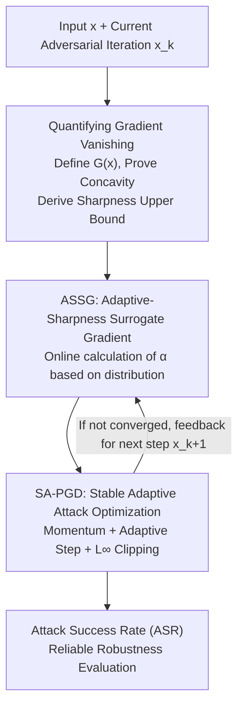

# Towards Reliable Evaluation of Adversarial Robustness for Spiking Neural Networks

**Conference**: CVPR 2026  
**Paper**: [CVF Open Access](https://openaccess.thecvf.com/content/CVPR2026/html/Wang_Towards_Reliable_Evaluation_of_Adversarial_Robustness_for_Spiking_Neural_Networks_CVPR_2026_paper.html)  
**Code**: https://github.com/craree/ASSG-SNNsRobustness-Evaluation  
**Area**: AI Security / Adversarial Robustness  
**Keywords**: Spiking Neural Networks, Adversarial Robustness Evaluation, Surrogate Gradient, Gradient Vanishing, PGD Attack

## TL;DR
To address the "artificially high" adversarial robustness evaluation of Spiking Neural Networks (SNNs) caused by gradient vanishing—stemming from the binary and discontinuous nature of spike activations—this paper proposes **ASSG** (Adaptive-Sharpness Surrogate Gradient) and **SA-PGD** (Stable Adaptive PGD). By optimizing both gradient approximation and attack algorithms, this work significantly increases the Attack Success Rate (ASR), revealing that the adversarial robustness of current SNNs is severely overestimated.

## Background & Motivation

**Background**: SNNs simulate the sparse, event-driven computation of the brain using spike (0/1) activations. They offer high energy efficiency and rich temporal dynamics, making them a popular direction for neuromorphic and low-power scenarios. However, the spike activation function is the Heaviside step function $H(x)$, whose derivative is zero almost everywhere, preventing direct backpropagation. The mainstream approach utilizes a smooth **surrogate gradient (SG)** function $g(x)$ to approximate $\frac{dH}{dx}$ (e.g., arctangent, rectangular, Gaussian), supporting Spatio-Temporal Backpropagation (STBP).

**Limitations of Prior Work**: Evaluating SNN robustness requires gradient-based attacks like PGD; a stronger, more thorough attack yields a more credible evaluation. However, inaccurate surrogate gradients distort input gradients, a problem exacerbated in adversarial perturbation scenarios requiring high precision. This leads to ineffective attacks, creating an illusion of model robustness. Existing improvements (PDSG, BPTR, RGA, HART, etc.) either rely on batch-level statistics (failing single-sample adaptation) or are tied to specific neuron models without theoretical grounding. Furthermore, most works **only focus on gradient approximation while ignoring the attack optimization algorithm itself**.

**Key Challenge**: There is a direct trade-off between accuracy and vanishing. The "sharper" the surrogate function $g(x)$, the closer its integral is to the actual step function $H(x)$, leading to higher precision. However, sharper functions decay faster as $|x|$ increases, leading to **gradient vanishing**. Optimal sharpness varies across different inputs, neurons, and time steps; using a fixed sharpness parameter $\alpha$ inevitably results in sub-optimal performance.

**Goal**: (1) Provide a quantifiable and controllable theoretical characterization of the "degree of gradient vanishing"; (2) Allow surrogate gradient sharpness to evolve adaptively for every input and spatio-temporal position; (3) Design an attack optimizer that converges stably even with imprecise gradients.

**Key Insight**: Starting from the normalized definition of surrogate functions, the authors find that the "degree of gradient vanishing" can be precisely measured by the integral $G(x)$ of $g$ over $[-|x|, |x|]$. They prove that $G(x)$ is a concave function, implying that the expected vanishing degree can be bounded by adjusting the sharpness parameter $\alpha$.

**Core Idea**: Replace "globally fixed sharpness" with "input-distribution adaptive sharpness." During each attack iteration, $\alpha$ is adjusted online based on the current membrane potential distribution to control the vanishing degree near a theoretical upper bound. This is paired with a stable attack optimizer featuring $L_\infty$ element-wise clipping to ensure attack convergence.

## Method

### Overall Architecture
The methodology centers on making adversarial attacks against SNNs "truly effective" to provide credible robustness evaluations. It consists of two components: **how to calculate accurate gradients (ASSG)** and **how to iterate stably after obtaining gradients (SA-PGD)**. First, a theoretical framework quantifies the vanishing degree $G(x)$ and proves its concavity, allowing the derivation of the "maximum allowed sharpness under a given vanishing bound." ASSG then calculates the adaptive sharpness $\alpha^l_{i,t}$ online during each iteration. SA-PGD uses these gradients with momentum, adaptive step sizes, and element-wise $L_\infty$ clipping to ensure convergence even if gradients remain partially imprecise.

### Key Designs

**1. Quantifiable and Controllable Theory of Gradient Vanishing**

This paper defines $g(x)$ as an even function, non-decreasing on $(-\infty, 0)$, such that $\int_{-\infty}^{\infty} g(x)\,dx = 1$. The degree of gradient vanishing at position $x$ is defined as the integral over a symmetric interval:

$$G(x) = \int_{-|x|}^{|x|} g(t)\,dt$$

$G(x)$ is monotonically non-decreasing in $[0, 1]$. A larger value indicates more severe vanishing (for $H(x)$, $G(x)=1$ for all $x>0$). The authors prove **Theorem 1: For any surrogate function, $G(x)$ is concave on $[0, +\infty)$**. Concavity leads to **Corollary 1**: Writing the surrogate function as $\alpha k(\alpha x)$, if the input $x$ follows a distribution $p(x)$ with finite expectation, then for any constant $A \in [0, 1]$, the condition:

$$\alpha \le \frac{G^{-1}(A)}{\mathbb{E}[x]}$$

guarantees that the expected vanishing degree $\mathbb{E}_{x \sim p(x)}[G(\alpha x)] \le A$. This transforms sharpness adjustment into an optimization problem with a provable bound.

**2. ASSG: Spatio-Temporal Adaptive Sharpness Tuning**

Fixed $\alpha$ fails because membrane potential distributions vary across inputs and spatio-temporal positions $(i, t, l)$. ASSG applies Corollary 1 by taking the equality (maximum allowed sharpness for accuracy) and calculating the sharpness for each dimension: $\alpha^l_{i,t} = \frac{\omega}{\mathbb{E}[|u^l_{i,t}|]}$, where $u^l_{i,t}=V^l_i(t+1)-V_{th}$ and $\omega=G^{-1}(A)$ is chosen via ternary search.

Since the distribution of $|u^l_{i,t}|$ changes along the attack trajectory $\{x_1, x_2, \dots\}$, ASSG uses Exponential Moving Average (EMA) for online estimation:

$$M^l_{i,t}(x_{1:k}) = \beta_1 M^l_{i,t}(x_{1:k-1}) + (1-\beta_1)\,|u^l_{i,t}(x_k)|$$

$$\alpha^l_{i,t}(x_{1:k}) = \frac{\omega}{M^l_{i,t}(x_{1:k}) + \gamma D^l_{i,t}(x_{1:k})}$$

The deviation term $D^l_{i,t}$ acts as a stabilizer. Crucially, ASSG depends only on the input distribution of $H$ and **not on specific neuron dynamics**, allowing generalization across LIF, IF, and PSN models.

**3. SA-PGD: Stable Attack Optimizer for Imprecise Gradients**

Even with ASSG, standard PGD/APGD may fail to converge after hundreds of iterations due to the highly non-smooth SNN input space. SA-PGD incorporates momentum and adaptive step sizes while explicitly enforcing $L_\infty$ constraints. For each step, it calculates $L_1$ normalized first-order momentum $m_k$ and second-order oscillation $v_k$, then applies **element-wise clipping**:

$$t_k = \mathrm{clip}\!\left(\frac{m_k}{\sqrt{v_k}+\xi}\cdot \eta_k,\ -\eta_k,\ \eta_k\right),\qquad x_{k+1} = \Pi^\infty_\varepsilon(x_k + t_k)$$

This ensures no single dimension dominates the update, maintaining stability within the $L_\infty$ ball.

### Loss & Training
This work presents an **evaluation method**. Robust SNNs were obtained via four adversarial training (AT) schemes (using PGD-5, $\varepsilon=8/255$). ASSG defaults to the arctangent SG. Attacks default to the APGD framework with 100 iterations. For Poisson coding, EOT is used with 50 iterations, and ASSG updates are frozen during EOT to reduce estimation bias.

## Key Experimental Results

Datasets: CIFAR-10, CIFAR-100 (static) + CIFAR10-DVS (dynamic). Networks: SEWResNet19 (T=4) for static, VGG9 (T=8) for DVS. Metric: Attack Success Rate (ASR) — **higher ASR indicates a more reliable evaluation**.

### Main Results: Comparison with SOTA Gradient Approximation (ASR ↑)
ASSG leads across all datasets and training schemes, often by nearly 10 percentage points on CIFAR-10 and CIFAR10-DVS.

| Dataset / Training | Attack | STBP | PDSG | HART | ASSG (Ours) |
|--------------|------|------|------|------|--------------|
| CIFAR-10 / AT | APGD | 75.38 | 69.31 | 77.22 | **84.06** |
| CIFAR-10 / AT | SA-PGD | 75.11 | 68.76 | 79.49 | **88.44** |
| CIFAR-10 / AT+SR | SA-PGD | 60.37 | 55.43 | 67.71 | **77.00** |
| CIFAR-10 / TRADES | SA-PGD | 66.24 | 58.33 | 72.47 | **79.56** |
| CIFAR10-DVS / AT | SA-PGD | 35.40 | 33.10 | 34.80 | **49.10** |

> Counter-intuitive finding: Under stricter 100-iteration settings, RGA/PDSG ASR is lower than naive STBP. Previous claims of high ASR likely stemmed from early loss increases in 10-iteration PGD.

### Ablation Study

**1. Surrogate Gradient Forms (ASR ↑)**: Applying ASSG to 5 different SG functions consistently outperforms fixed-$\alpha$ baselines, proving that adaptive spatio-temporal sharpness is the primary driver of performance.

**2. Attack Optimizer**: With 1000 iterations, SA-PGD maintains the highest ASR. Adam-PGD converges faster initially but loses stability due to the lack of element-wise clipping, eventually falling below APGD.

### Key Findings
- **ASSG sharpness is the main contributor**: Moving from fixed $\alpha$ to ASSG increases ASR by 3–8% across all SG functions.
- **Synergy between gradient and optimization**: SA-PGD only provides significant gains when paired with high-quality gradients (ASSG).
- **SNN robustness is overestimated**: On PSN neurons, ASR exceeds 98% with ASSG, whereas HART fails (dropping to 43–45%), exposing the fragility of neuron-dependent methods.

## Highlights & Insights
- **Quantitative Theory**: Transforms the qualitative issue of gradient vanishing into a provably controllable quantity.
- **Granular Adaptation**: Sharpness is tuned to each neuron, time step, and iteration.
- **Dynamics Decoupling**: Since it only relies on the input distribution of $H$, it generalizes to heterogeneous neurons (IF/PSN) better than model-specific methods like HART.
- **Warning on Protocols**: Demonstrates that insufficient iteration counts create an illusion of robustness.

## Limitations & Future Work
- **Evaluation focus**: While it provides better evaluation, how to efficiently train truly robust SNNs remains an open question.
- **Poisson Encoding**: Performance is slightly lower than HART in random coding scenarios due to the need for frozen updates during EOT.
- **Computational Cost**: Maintaining EMA statistics for every spatio-temporal position adds overhead.
- **Dataset Scale**: Experiments are focused on CIFAR; validation on larger scales like ImageNet is required.

## Related Work & Insights
- **vs. PDSG**: PDSG uses batch statistics; ASSG uses single-sample spatio-temporal adaptation with theoretical bounds.
- **vs. BPTR / RGA**: These methods fail to generalize to neurons without fixed thresholds (PSN) and show lower ASR in long-iteration evaluations.
- **vs. HART**: HART is tied to specific neuron dynamics; ASSG's decoupling allows it to outperform HART on PSN by a wide margin.
- **vs. APGD / Adam-PGD**: SA-PGD is more stable in non-smooth SNN spaces due to explicit $L_\infty$ element-wise clipping.

## Rating
- Novelty: ⭐⭐⭐⭐⭐ 
- Experimental Thoroughness: ⭐⭐⭐⭐ 
- Writing Quality: ⭐⭐⭐⭐ 
- Value: ⭐⭐⭐⭐⭐ 

<!-- RELATED:START -->

## Related Papers

- [\[ICLR 2026\] Robust Spiking Neural Networks Against Adversarial Attacks](../../ICLR2026/ai_safety/robust_spiking_neural_networks_against_adversarial_attacks.md)
- [\[AAAI 2026\] MPD-SGR: Robust Spiking Neural Networks with Membrane Potential Distribution-Driven Surrogate Gradient Regularization](../../AAAI2026/ai_safety/mpd-sgr_robust_spiking_neural_networks_with_membrane_potential_distribution-driv.md)
- [\[ICML 2026\] Frequency Matching in Spiking Neural Networks for mmWave Sensing](../../ICML2026/ai_safety/frequency_matching_in_spiking_neural_networks_for_mmwave_sensing.md)
- [\[CVPR 2026\] Verifying Neural Network Robustness with Dual Perturbations](verifying_neural_network_robustness_with_dual_perturbations.md)
- [\[ICLR 2026\] Time Is All It Takes: Spike-Retiming Attacks on Event-Driven Spiking Neural Networks](../../ICLR2026/ai_safety/time_is_all_it_takes_spike-retiming_attacks_on_event-driven_spiking_neural_netwo.md)

<!-- RELATED:END -->
