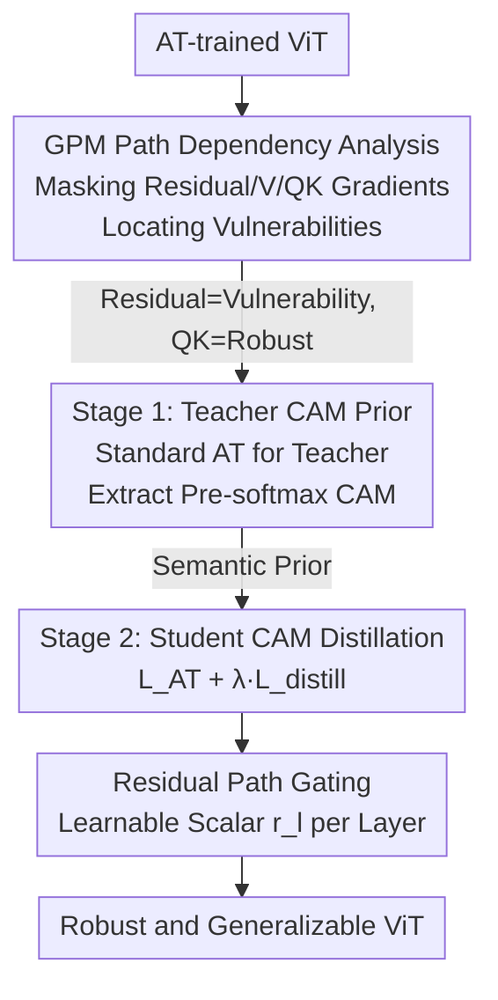

# Towards Robust Vision Transformers: Path Dependency Analysis and a Simple Two-Stage Adversarial Training

**Conference**: CVPR 2026  
**Paper**: [CVF Open Access](https://openaccess.thecvf.com/content/CVPR2026/html/Kim_Towards_Robust_Vision_Transformers_Path_Dependency_Analysis_and_a_Simple_CVPR_2026_paper.html)  
**Area**: AI Safety / Adversarial Robustness  
**Keywords**: Adversarial Training, Vision Transformer, Gradient Path, Class Attention Distillation, Residual Gating

## TL;DR
This paper introduces a "Gradient Path Masking" diagnostic tool to dissect the internal information flow of ViT attention. It discovers that the residual path is the primary vulnerability for adversarial attacks, while the QK path carries robustness. Based on these insights, a simple two-stage adversarial training is designed (Teacher ViT provides class attention map priors + Student distillation + Residual gating), improving both clean accuracy and robustness across five ViT variants and three AT frameworks.

## Background & Motivation
**Background**: Adversarial Training (AT) is the fundamental method for enhancing model robustness, formulated as a min–max optimization—maximizing adversarial sample generation in the inner loop and minimizing parameter updates in the outer loop. However, RobustBench statistics show only about 13% of robustness research targets ViTs; the vast majority of work and tools are still designed around CNNs, exhibiting a clear "architectural bias."

**Limitations of Prior Work**: Directly transferring AT methods validated on CNNs to ViTs is ineffective. While some studies have noted a "negative interaction" between ViT and AT, their analyses are limited to individual components or simplified settings, lacking a systematic tool to characterize which internal information paths in ViT aid the attacker and which contribute to robustness. Consequently, the key factors for robust ViTs remain unclear, hindering deployment in safety-critical scenarios like autonomous driving and medical imaging.

**Key Challenge**: ViT and CNN differ fundamentally in information flow organization—CNN convolutions mix local information, while ViT attention modules **explicitly** separate information into QK (determining attention weights), V (weighted values), and Residual (shortcut) paths. Robustness intuitions from CNNs (e.g., "strong local modeling in early layers is critical") may not hold, yet remain unverified.

**Goal**: To dissect "AT-trained ViTs" from three complementary perspectives—path dependency (which gradient path is the vulnerability), semantic priors (in what form robust information is stored), and patch correlation (whether early layers learn local or global features)—and unify these insights into a deployable training scheme.

**Key Insight**: Gradients indicate the most direct direction to cross decision boundaries. Therefore, "the path an attacker relies on for gradients" is equivalent to "the path that constitutes a vulnerability." By masking gradients of a specific path during backpropagation and observing changes in attack success rate, one can localize vulnerability paths.

**Core Idea**: Use "Gradient Path Masking" to identify the residual path as the robustness bottleneck and the QK path as the robustness carrier (existing as a semantic prior in class attention maps). Then, apply "Teacher CAM distillation + Residual Gating" in a two-stage AT to explicitly inject robust information into the student model while actively suppressing dependence on residual paths.

## Method

### Overall Architecture
The paper follows a "diagnose then treat" structure: the first half (Sec. 3.1–3.3) provides three analyses leading to three conclusions; the second half (Sec. 3.4) implements these into a two-stage training scheme. The core diagnostic tool is **GPM (Gradient Path Masking)**—analytically splitting the backpropagation gradient of a ViT block into Residual, V, and QK paths, and zeroing them individually to determine their value to attackers via Attack Success Rate (ASR) changes. The diagnosis yields three findings: ① Residual paths are vulnerabilities, QK paths store robustness; ② Robust information manifests as clear object semantics in Class Attention Maps (CAM); ③ AT-trained ViTs rely more on global than local relations in early layers, making hybrid architectures with local biases less compatible with AT.

The treatment stage designs a two-stage AT: Stage 1 trains a **Teacher ViT** via standard AT to serve as a "semantic prior" using its pre-softmax CAMs; Stage 2 trains a **Student ViT** using a distillation loss to align student CAMs with teacher CAMs, alongside a learnable scalar gate $r_l$ for each residual connection to actively suppress residual path reliance.

### Key Designs

**1. Gradient Path Masking (GPM): Analyzing Robustness via Path-wise Gradient Dissection**

The logic is that previous work couldn't pinpoint which path aids the attacker. GPM analytically splits the backpropagation gradient of a ViT block. A block's forward pass is written as $X_l = f^{(l)}(X'_l)$, $X'_l = S_l V_l + X_{l-1}$, where $S_l = \mathrm{softmax}(Q_l K_l^\top / \sqrt{d})$ represents attention weights. When calculating the gradient for $X_{l-1}$, $\partial X'_l / \partial X_{l-1}$ can be split into three terms:

$$\frac{\partial X'_l}{\partial X_{l-1}} = \underbrace{1}_{\text{Residual}} + \underbrace{S_l \frac{\partial V_l}{\partial X_{l-1}}}_{\text{V}} + \underbrace{V_l \frac{\partial S_l}{\partial X_{l-1}}}_{\text{QK}}.$$

GPM multiplies each term by a binary switch $\delta_R, \delta_V, \delta_{QK} \in \{0,1\}$. Setting a path to zero during backprop is equivalent to "making this path's gradient inaccessible to the attacker." Note that GPM **only modifies backpropagation**, not the forward pass. Experiments (Tab. 1) show a non-intuitive result: masking the QK path barely drops the ASR (remaining > 92%), while masking the residual path causes the ASR to plummet from ~48% to ~22%. This proves attackers rely heavily on residual path gradients, while robustness resides in the QK path.

**2. Two-Stage CAM Distillation: Injecting QK Path Semantic Priors**

Analysis (Sec. 3.2) shows that robustness in the QK path manifests as focused object semantics in **Class Attention Maps (CAM)**. While CNN-style "logit distillation" fails for ViT robustness (see experiments), this method distills the CAM. Stage 1 trains a teacher $f_{\theta_T}$ via AT and extracts its class attention features $\mathcal{A}_{\mathrm{cls}}^{(l,h)} = Q_{\mathrm{cls}}^{(l,h)} (K^{(l,h)})^\top / \sqrt{d_h}$ for each layer and head. Stage 2 forces the student's CAM on adversarial samples $x'$ to approximate the teacher's CAM on clean samples $x$:

$$\mathcal{L}_{\text{distill}} = \frac{1}{HL} \sum_{l=1}^{L} \sum_{h=1}^{H} \left\| \mathcal{A}_{\mathrm{cls}}^{(l,h)}(\theta_T, x) - \mathcal{A}_{\mathrm{cls}}^{(l,h)}(\theta_S, x') \right\|_2.$$

Crucially, distillation occurs **before the softmax**. Since ViT gradients can vanish near softmax, using pre-softmax features ensures effective gradient backpropagation. The total loss is $\mathcal{L}_{total} = \mathcal{L}_{AT} + \lambda \mathcal{L}_{distill}$ (with $\lambda=1$).

**3. Residual Path Gating: Actively Suppressing Residual Reliance**

Since residual paths are vulnerabilities, the authors introduce a learnable scalar $r_l$ for each residual connection:

$$X'_l = S_l V_l + r_l X_{l-1}.$$

During training, the model learns these gating values. Observations show that the average values of $r_l$ across layers are **consistently less than 1**, validating that the model learns to reduce residual reliance. Conversely, when such gates are applied to QK or V paths, they learn values > 1 (~1.25), indicating that robust ViTs favor QK/V paths over residual paths.

### Loss & Training
The two stages total 80 epochs (40 for Teacher + 40 for Student), with $\lambda=1$. Perturbation $\epsilon=8/255$, step size $2/255$, 10-step attack. Optimizer: SGD (momentum 0.9), weight decay 1e-4, gradient clipping, initialized with ImageNet pre-trained weights.

## Key Experimental Results

### GPM Path Analysis (Core Evidence)

| Model | Masked Path | ASR(%) | Maintenance(%) |
|-------|-------------|--------|----------------|
| ViT | None (=PGD-20) | 48.14 | 100.00 |
| ViT | QK | 44.59 | 92.63 |
| ViT | V | 32.94 | 68.42 |
| ViT | Residual | 21.83 | 45.35 |
| ConViT | Residual | 23.42 | 41.51 |
| CvT | Residual | 24.61 | 46.95 |

Masking residual gradients nearly halves the attack success rate, while masking QK has little effect—consistent across architectures, supporting "Residual=Vulnerability, QK=Robustness."

### Main Results: Across Architectures & AT Frameworks (CIFAR-10 & ImageNette)

| Model | Method | CIFAR-10 Clean | CIFAR-10 AA | ImageNette Clean | ImageNette AA |
|-------|--------|----------------|-------------|------------------|---------------|
| ViT | PGD-AT | 79.59 | 46.37 | 90.20 | 62.40 |
| ViT | +Ours | 82.01 | 47.41 | 89.40 | 63.20 |
| ConViT | PGD-AT | 69.83 | 39.23 | 69.00 | 39.00 |
| ConViT | +Ours | 77.21 | 43.93 | 84.20 | 56.20 |
| CvT | TRADES | 77.23 | 44.20 | 82.60 | 54.40 |
| CvT | +Ours | 79.41 | 46.23 | 83.70 | 55.60 |
| DeiT | PGD-AT | 81.17 | 47.35 | 91.60 | 65.20 |
| DeiT | +Ours | 82.65 | 48.59 | 91.40 | 65.40 |

Hybrid architectures (ConViT/CvT) benefit most: CIFAR-10 clean accuracy +3.52% avg, AA +2.44% avg; ImageNette +4.35% / +6.0%. Non-hybrid architectures (ViT/DeiT) also show stable improvements.

### Ablation Study

| Configuration | Clean | CW-20 | PGD-20 | AA |
|---------------|-------|-------|--------|----|
| PGD-AT | 79.59 | 48.22 | 50.86 | 46.37 |
| + L_distill | 81.39 | 48.99 | 51.39 | 47.01 |
| + Res. Gate | 82.01 | 49.34 | 51.59 | 47.41 |

CAM distillation is the primary contributor (+1.8% Clean / +0.7% AA), with residual gating adding further gains.

### Key Findings
- **Residual gating values align with GPM**: Learned $r_l < 1$ validates the "Residual = Vulnerability" insight.
- **CNN-style robust distillation fails on ViT**: Methods like RSLAD see robustness drop to single digits on ViT, indicating that "what to distill" must change—ViT robustness lies in attention structures, not logit distributions.
- **Hybrid architectures are most benefited**: While hybrid ViTs with CNN biases initially perform worse under AT, the semantic prior distillation fixes this incompatibility.

## Highlights & Insights
- **GPM is an interpretable diagnostic tool**: The analytical split of gradients can be reused for any Transformer robustness study to identify path-wise vulnerabilities.
- **Robust AT makes ViT develop semantic segmentation**: AT-trained ViT CAMs focus so sharply on object semantics that they achieve SOTA unsupervised segmentation on Pascal VOC (57.7% Jaccard), even exceeding DINO.
- **Tight Logic**: The diagnosis (GPM) directly informs the treatment (distillation and gating), creating a self-consistent framework.

## Limitations & Future Work
- **Dataset Scale**: Experiments are limited to CIFAR-10 and ImageNette; full ImageNet-1K robustness results are missing.
- **Incremental absolute gains**: AA improvements on standard ViT/DeiT are ~1%, suggesting the method's value is in its "plug-and-play" nature rather than a massive robustness jump.
- **Training Cost**: Two-stage training doubles the epoch count.

## Related Work & Insights
- **vs ARD [23]**: ARD uses random dropout on gradients, whereas GPM uses precise physical path masking, offering better explainability.
- **vs Hybrid Architectures**: Local inductive biases from CNNs conflict with AT goals in ViT. This work provides a remedy via semantic priors.

## Rating
- Novelty: ⭐⭐⭐⭐⭐ 
- Experimental Thoroughness: ⭐⭐⭐⭐ 
- Writing Quality: ⭐⭐⭐⭐⭐ 
- Value: ⭐⭐⭐⭐ 

<!-- RELATED:START -->

## Related Papers

- [\[CVPR 2026\] ReMoE: Region-Mixture Experts for Adversarially-Robust Vision Transformers](remoe_region-mixture_experts_for_adversarially-robust_vision_transformers.md)
- [\[CVPR 2026\] DeepfakeImpact: A Two-Stage Benchmark with Real-World Impact in Deepfake Detection](deepfakeimpact_a_two-stage_benchmark_with_real-world_impact_in_deepfake_detectio.md)
- [\[CVPR 2026\] Transform to Transfer: Boosting Adversarial Attack Transferability on Vision-Language Pre-training Models](transform_to_transfer_boosting_adversarial_attack_transferability_on_vision-lang.md)
- [\[CVPR 2026\] Taming the Long Tail: Rebalancing Adversarial Training via Adaptive Perturbation](taming_the_long_tail_rebalancing_adversarial_training_via_adaptive_perturbation.md)
- [\[CVPR 2026\] TTP: Test-Time Padding for Adversarial Detection and Robust Adaptation on Vision-Language Models](ttp_test-time_padding_for_adversarial_detection_and_robust_adaptation_on_vision-.md)

<!-- RELATED:END -->
