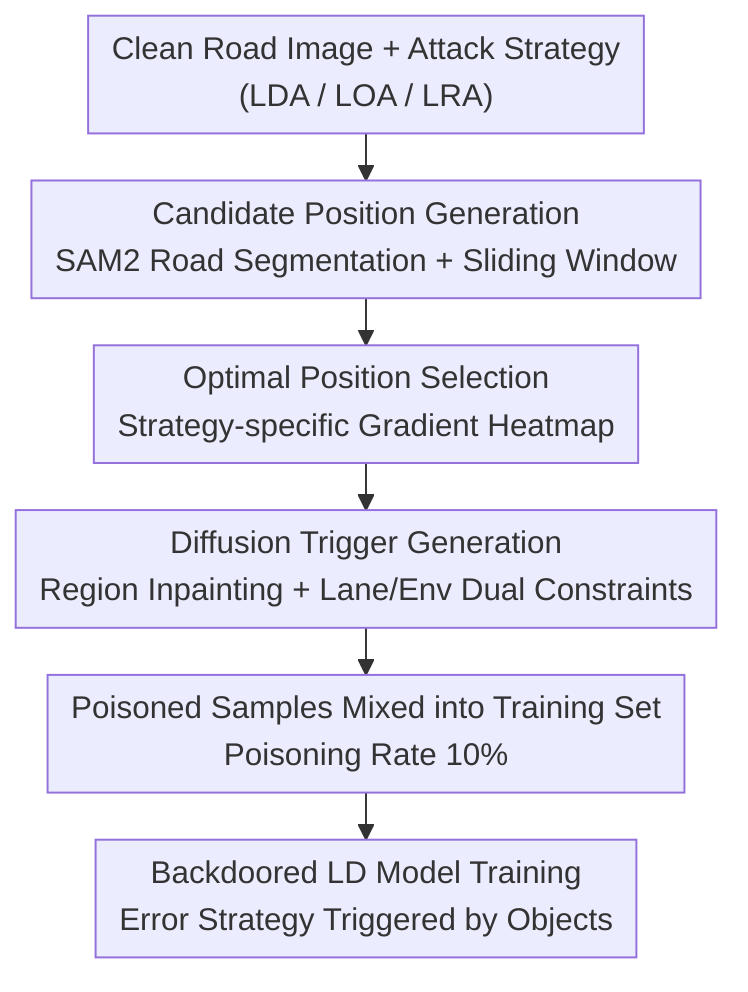

# Towards Stealthy and Effective Backdoor Attacks on Lane Detection: A Naturalistic Data Poisoning Approach

**Conference**: CVPR 2026  
**Paper**: [CVF Open Access](https://openaccess.thecvf.com/content/CVPR2026/html/Liao_Towards_Stealthy_and_Effective_Backdoor_Attacks_on_Lane_Detection_A_CVPR_2026_paper.html)  
**Code**: None (Only data and demo provided: https://sites.google.com/view/dbald)  
**Area**: AI Security / Autonomous Driving Perception  
**Keywords**: Backdoor Attack, Lane Detection, Data Poisoning, Diffusion Inpainting, Trigger Stealthiness

## TL;DR
DBALD utilizes "gradient attention heatmaps to select the most sensitive locations + region-based diffusion inpainting to synthesize natural triggers," transforming lane detection backdoor triggers from conspicuous white blocks or mud-pattern noise into natural road objects like traffic cones or mud spots. Across four lane detection models, it improves the average attack success rate (ASR) by +10.87% while suppressing forensic detection rates to below 3%.

## Background & Motivation
**Background**: Lane Detection (LD) is a critical component of the autonomous driving perception stack, directly feeding into path planning and vehicle control. Detection errors can lead to lane departures or collisions. Recent studies have proven that LD models are vulnerable to **backdoor attacks**, especially data poisoning attacks. By contaminating a small portion of the training set (e.g., 10%) with specific triggers, an attacker can manipulate the model to produce erroneous lane predictions when the trigger appears during inference, while maintaining normal performance on clean inputs.

**Limitations of Prior Work**: Existing LD backdoor methods suffer from poor practicality due to two main issues. First, **poor trigger placement**: current methods use random or fixed positions (e.g., placing a white block in the bottom-right corner), ignoring the impact of location on attack success. Consequently, triggers often fall in semantically irrelevant, low-attention areas, making them difficult for the model to learn and activate. Second, **poor stealthiness**: methods like BadNets (fixed white blocks) or Blended (semi-transparent patterns) are easily perceived by humans and leave identifiable artifacts in the frequency domain, making them detectable by forensic tools like DIRE, LGrad, or UniDetection. Even BadLane, which uses more natural "mud-pattern noise," still has a detection rate of nearly 60% by UniDetection.

**Key Challenge**: The objectives of **effectiveness** (triggers placed in highly sensitive, easily learned areas) and **stealthiness** (deceiving both humans and frequency-domain forensic detectors) were previously handled separately or even treated as opposing goals—pasting a pattern onto a sensitive area often results in a highly conspicuous image.

**Goal**: To simultaneously optimize "where to place" and "what to look like" to create physical triggers (cones, mud spots) that are both **located in high-sensitivity zones and as natural as real-world road objects**.

**Key Insight**: Prior conclusions in image classification backdoors suggests that embedding triggers in high-attention regions ensures better memorization by the model. However, Grad-CAM for classification serves a single task, whereas LD is a hybrid task of "lane existence + lane coordinate regression," requiring a redefined attention mechanism. Meanwhile, diffusion inpainting is well-suited for "painting" an object into a specified area while blending it with the surroundings.

**Core Idea**: Use a **task-specific gradient attention heatmap** to identify the most sensitive locations for a given attack strategy, and then use **dual-semantic constrained region-based diffusion inpainting** to synthesize a natural, scene-consistent trigger at that location. This streamlines "location selection" and "appearance generation" into a single pipeline to maximize both effectiveness and stealthiness.

## Method

### Overall Architecture
DBALD is a three-stage data poisoning pipeline: given a clean road image and an attack strategy (Lane Disappearance Attack, LDA / Lane Offset Attack, LOA / Lane Rotation Attack, LRA), it first **identifies candidate locations** (road segmentation via SAM2 + sliding window sampling), then **selects the most sensitive location using a gradient heatmap**, and finally **generates a natural trigger at that location using region-based diffusion inpainting**. The poisoned samples are then mixed back into the training set (10% poisoning rate). The LD model trained on this contaminated data behaves normally on clean inputs but executes the attacker's predefined error (disappearance, offset, or rotation) upon detecting the traffic cone or mud spot.

DBALD supports three attack semantics, each guided by its strategy-specific heatmap: LDA causes all lanes to "disappear" (existence prediction set to 0), LOA shifts all lane points horizontally by a fixed pixel $\beta$ (set to 60 px in the paper), and LRA rotates the lane curve along a starting point by an angle $\alpha$ (set to 9° in the paper).

### Key Designs

**1. Task-specific Gradient Attention Heatmap: Tailoring Sensitivity Maps for "Hybrid Task" Lane Detection**

This addresses the issue of "poor trigger placement leading to weak attacks." Directly adopting Grad-CAM from classification is ineffective because LD must both determine lane existence and regress coordinates. Attention must follow the specific sub-task being attacked. The authors define sensitivity using a **gradient magnitude map** calculated from a pre-trained LD network with the same architecture as the victim:

$$M_{grad}(i,j) = \sum_{k=1}^{CH} \left| \frac{\partial L}{\partial x_{i,j,k}} \right|$$

This sum of the absolute values of the gradients of the task loss $L$ with respect to input pixels across all channels highlights locations most sensitive to the loss. Crucially, $L$ is **strategy-specific**: for LDA, the gradient of the **existence classification loss** is used; for LOA/LRA, the gradient of the **coordinate regression loss** is used. Different LD model architectures (anchor-based like LaneATT/ADNet vs. segmentation-based like SCNN/RESA) require handling different loss types (Focal loss/L1/GLIoU vs. Cross Entropy/BCE). With the heatmap, the most responsive rectangular block within the road area (segmented by SAM2) is selected from approximately 100–400 candidates. Ablations show this heatmap guidance improves ASR by +3.21% on LaneATT and +6.77% on RESA compared to random placement.

**2. Region-based Diffusion Inpainting + Alternating Mask Update: Crafting Physically Natural Triggers within a Local Area**

This addresses triggers being "too conspicuous." Borrowing from region-editing diffusion techniques like UltraEdit, the target trigger location (40×40 mask) is removed to create a masked image, and the surrounding environment is extracted as "ground truth." These are fed into a mask-guided diffusion model with text prompts (e.g., "add a few sparse brown mud spots," "add a small traffic cone") to **inpaint** the trigger. The mechanism uses **alternating latent updates between even and odd steps**:

$$z_{t-1} = \begin{cases} (1-M)\odot z_T + M\odot D_M(z_t), & t \bmod 2 = 0 \\ D_M(z_t), & \text{otherwise} \end{cases}$$

Where $M$ is the binary mask for the trigger region and $D_M(z_t)$ denotes denoising only within the mask. Even steps force the latents outside the mask back to the initial $z_T$, effectively "freezing" the background, while odd steps use standard diffusion to ensure natural transitions at the boundaries. This process creates precise triggers at specified locations while minimizing perturbations to the rest of the image—a key reason why diffusion-based forensic tools like DIRE fail to detect it.

**3. Lane Consistency Loss + Environment Consistency Loss: Anchoring Diffusion-vulnerable Lane Lines and Objects**

Even with region-based diffusion, attention mechanisms can inadvertently damage key elements like lane markings or nearby vehicles near the mask boundary. To fix this, two constraints are added to the diffusion process:

$$L_{lane} = \mathrm{MSE}(\text{gen\_img}\odot\text{lane\_mask},\ \text{clean\_img}\odot\text{lane\_mask})$$
$$L_{env} = \mathrm{SSIM}(\text{gen\_img}\odot\text{env\_mask},\ \text{clean\_img}\odot\text{env\_mask})$$

$L_{lane}$ utilizes MSE to ensure the generated lane structures approximate the clean original, preventing distorted geometry. $L_{env}$ uses SSIM to maintain the visual integrity and realism of surrounding traffic elements. Together, they suppress typical diffusion artifacts. Ablations show that removing $L_{lane}$ causes the forensic detection score to spike from 2.46 to 12.13, while removing $L_{env}$ causes it to reach 14.51. Additionally, LPIPS (threshold 0.15) is used to maintain diversity among triggers, ensuring unique visual signatures while avoiding collisions with rare benign patterns in the dataset.

### Loss & Training
The attack optimization targets the $L_{lane}$ (MSE) and $L_{env}$ (SSIM) consistency losses within the diffusion latent space. Strategy-specific heatmaps are calculated using task losses (Focal / L1 / GLIoU / CE / BCE). Implementation details: 10% poisoning rate, triggers approx. 900 pixels, UltraEdit backbone for diffusion, 40×40 mask. Attack parameters follow prior work: 60 px offset for LOA and 9° rotation for LRA.

## Key Experimental Results

### Main Results
Evaluation on CULane (88K/34K, complex urban) and TuSimple (3.6K/2.7K, highway) across four models (LaneATT, ADNet, SCNN, RESA) using Clean ACC and ASR. DBALD across-model average ASR is +10.87% higher than the strongest baseline. The following table summarizes results for LaneATT and RESA on CULane (ASR %, Avg. is the mean of LDA/LRA/LOA):

| Model | Attack Method | LDA | LRA | LOA | Avg. ASR |
|------|---------|-----|-----|-----|----------|
| LaneATT | BadNets | 49.27 | 43.37 | 47.36 | 46.67 |
| LaneATT | LD-Attack | 72.48 | 71.24 | 56.24 | 63.73 |
| LaneATT | BadLane | 73.78 | 64.33 | 45.22 | 54.56 |
| LaneATT | **DBALD** | **81.65** | **73.45** | **74.19** | **76.41** |
| RESA | LD-Attack | 73.26 | 64.77 | 69.18 | 69.07 |
| RESA | BadLane | 75.39 | 62.94 | 68.23 | 68.85 |
| RESA | **DBALD** | **78.15** | **65.15** | **76.86** | **73.39** |

Regarding stealthiness, forensic detection rates (lower is better, %) were measured using UniDetection, LGrad, and DIRE:

| Method | CULane-U | CULane-L | CULane-D | TuSimple-U |
|------|----------|----------|----------|------------|
| BadNets | 2.56 | N/A | N/A | 0.08 |
| BadLane | 59.31 | 9.17 | N/A | 35.60 |
| **DBALD** | **2.72** | **1.76** | **0.56** | **0.23** |

While BadNets/Blended/LD-Attack show low forensic detection, they are obvious to the human eye (marked N/A due to trivial manual recognition). DBALD is among the few methods to **deceive both forensic tools and human inspection**—UniDetection catches nearly 60% of BadLane samples but less than 3% of DBALD.

### Ablation Study

| Config | Metric | Description |
|------|---------|------|
| With heatmap (LaneATT-LDA) | 81.65 ASR | Full heatmap guidance |
| Without heatmap (LaneATT-LDA) | 80.97 ASR | Random placement (-0.7%; larger drop on LOA) |
| With heatmap (RESA-LOA) | 76.86 ASR | Full heatmap guidance |
| Without heatmap (RESA-LOA) | 69.37 ASR | Random placement (RESA Avg. drop 6.77%) |
| Dual diffusion losses | 2.46 | Lower forensic score indicates higher stealth |
| w/o $L_{lane}$ | 12.13 | Spike in forensic score due to artifacts |
| w/o $L_{env}$ | 14.51 | Higher spike in forensic score |

### Key Findings
- **CULane is harder to attack than TuSimple**: Urban scenes include dynamic interference like pedestrians and intersections; BadLane's ASR drops from 90.84% on TuSimple to 54.56% on CULane, highlighting the difficulty of physical backdoors in complex real-world environments.
- **LDA > LOA > LRA**: Making lanes disappear is easiest, followed by LOA (larger label shift), and LRA is hardest. However, LOA/LRA are more dangerous as they directly manipulate vehicle trajectories.
- **ADNet is the most robust**: While LaneATT/RESA/SCNN ASR approaches their clean ACC (high vulnerability), ADNet maintains a 16%+ gap, indicating higher structural resistance to physical backdoors.
- **Consistency losses are vital for stealth**: Removing either loss causes forensic scores to jump from 2.46 to 12+, identifying them as critical stealth modules.
- **Effective in the physical world**: Using cones as physical triggers on four closed road segments (100 samples each for day/night), LOA achieved a 57% ASR. Performance remained robust under rain/blur/occlusion (45/48/49% ASR).

## Highlights & Insights
- **Integrating "Location Selection" and "Appearance Generation"**: Unlike previous backdoors that focused on one or the other, DBALD uses "heatmaps for sensitivity → diffusion for natural objects" to satisfy both effectiveness and stealthiness. This decomposition is transferable to other perception tasks like object detection or depth estimation.
- **Strategy-dependent Gradient Heatmaps**: Using classification gradients for LDA and regression gradients for LOA on the same image yields different sensitivity maps. This captures the essence that different attack goals target different sensitive regions.
- **Alternating Latent Updates as Built-in Counter-Forensics**: By only modifying a small patch and preserving the bulk of the original image, DBALD bypasses forensic detectors like DIRE that look for global diffusion signatures.
- **Consistency Losses as "Anchoring" Mechanisms**: Instead of "beautifying" the trigger, these losses ensure lane lines and the environment are not distorted by the diffusion process.

## Limitations & Future Work
- **Strong Threat Model**: Assumes the attacker can access the training set and knows the victim's architecture (to calculate heatmaps). Performance in black-box or unknown architecture scenarios remains unverified.
- **High Computational Overhead**: Relying on a general-purpose diffusion backbone like UltraEdit involves many diffusion steps; the authors suggest distilling a smaller, driving-scene-specific model in the future.
- **Sim-to-Real Gap**: Physical ASR (57%) is significantly lower than in simulation, attributed to the model not being retrained on physical domain data.
- **Defense Challenges**: Fine-tuning (50 epochs) only reduced ASR from 74.19% to 63.68%. Pruning required 400 neurons to be cut to drop ASR to 15.87%, which simultaneously collapsed clean ACC from 74.20% to 21.19%. Qwen2.5-VL as an anomaly detector only caught 3-6% of triggers.

## Related Work & Insights
- **vs. LD-Attack (Han et al.)**: LD-Attack uses label-level poisoning and fixed trigger overlays, lacking adaptation to dynamic scenes and optimal positioning. DBALD outperforms it in both metrics.
- **vs. BadLane (Zhang et al.)**: BadLane uses mud-pattern noise and meta-learning for robustness. While more natural than blocks, it is still visually distinct and detectable (60% by UniDetection); DBALD's triggers are actual road objects with <3% detection.
- **vs. BadNets / Blended**: These classic methods are easily spotted manually due to fixed block/pattern overlays; DBALD represents a generational leap in stealthiness.
- **Inspiration**: The "task-specific gradient heatmap" can serve as a general "poisoning location selector" for structured perception tasks, while the "region diffusion + dual consistency" framework allows seamless embedding of natural objects into any scene.

## Rating
- **Novelty**: ⭐⭐⭐⭐ First to apply diffusion inpainting for LD backdoor triggers and unify position/appearance optimization.
- **Experimental Thoroughness**: ⭐⭐⭐⭐ Covers 4 models, 2 datasets, 3 strategies, 3 forensic tools, physical experiments, and 4 defenses.
- **Writing Quality**: ⭐⭐⭐⭐ Clear motivation, well-structured modules, and logical ablation studies.
- **Value**: ⭐⭐⭐⭐ Significantly warns of LD system vulnerability to natural physical backdoors, though it lacks an effective companion defense.

<!-- RELATED:START -->

## Related Papers

- [\[AAAI 2026\] Towards Effective, Stealthy, and Persistent Backdoor Attacks Targeting Graph Foundation Models](../../AAAI2026/ai_safety/towards_effective_stealthy_and_persistent_backdoor_attacks_targeting_graph_found.md)
- [\[CVPR 2026\] Unleashing Stealthy Backdoor Pandemic by Infecting a Single Diffusion Model](unleashing_stealthy_backdoor_pandemic_by_infecting_a_single_diffusion_model.md)
- [\[NeurIPS 2025\] Provable Watermarking for Data Poisoning Attacks](../../NeurIPS2025/ai_safety/provable_watermarking_for_data_poisoning_attacks.md)
- [\[CVPR 2026\] DASH: A Meta-Attack Framework for Synthesizing Effective and Stealthy Adversarial Examples](dash_a_meta-attack_framework_for_synthesizing_effective_and_stealthy_adversarial.md)
- [\[CVPR 2026\] Eliminate Distance Differences Induced by Backdoor Attacks: Layer-Selective Training and Clipping to Mask Backdoor Models](eliminate_distance_differences_induced_by_backdoor_attacks_layer-selective_train.md)

<!-- RELATED:END -->
