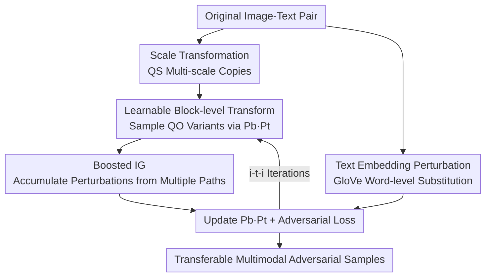

# Transform to Transfer: Boosting Adversarial Attack Transferability on Vision-Language Pre-training Models

**Conference**: CVPR 2026  
**Paper**: [CVF Open Access](https://openaccess.thecvf.com/content/CVPR2026/html/Li_Transform_to_Transfer_Boosting_Adversarial_Attack_Transferability_on_Vision-Language_Pre-training_CVPR_2026_paper.html)  
**Area**: AI Security / Multimodal Adversarial Attack  
**Keywords**: VLP Adversarial Attack, Black-box Transfer, Learnable Transformation, Integrated Gradients, Cross-architecture Transfer

## TL;DR
To address the poor transferability of black-box adversarial examples on Vision-Language Pre-training (VLP) models, this paper proposes the Transform to Transfer Attack (TTA). It employs a set of **learnable block-level image transformations** to automatically select optimal transformation combinations to expand input diversity, combined with **Boosted Integrated Gradients (Boosted IG)** to sample gradients along multiple transformation paths. This approach effectively decouples the attack from source model overfitting, improving attack success rates by up to nearly 40 percentage points in cross-architecture (ALBEF ↔ CLIP) transfers.

## Background & Motivation

**Background**: VLP models (such as ALBEF, TCL, and CLIP) excel in image-text retrieval, image captioning, and visual grounding but remain fragile. Minimal perturbations, nearly imperceptible to humans, can cause incorrect cross-modal matching. Researching such multimodal adversarial examples explores the boundaries of model robustness. The primary realistic threat comes from **black-box transfer attacks**, where attackers generate adversarial samples on a "source model" and expect them to succeed on an unseen "target model."

**Limitations of Prior Work**: Transferability remains the most significant hurdle. Two mainstream improvement routes have critical weaknesses. One category (e.g., SGA, LSSA) relies on **input transformations** to increase sample diversity—SGA uses scale transformations to expand image-text pairs from "one-to-many" to "many-to-many," and LSSA adds local shuffling. However, they use a **fixed and limited set of transformations**, which restricts diversity and ignores the fact that different images have vastly different sensitivities to various transformations. The other category (e.g., DRA) reduces **dependence on the source model** by interpolating within a triangle formed by the current adversarial image, the previous step's image, and the clean image. Unfortunately, the two adversarial images used for interpolation are still generated by the source model, only partially achieving decoupling.

**Key Challenge**: The root cause of poor transferability is dual "overfitting"—overfitting to **fixed transformations** (single input path) and overfitting to **source model gradients** (optimization trajectories dictated by the source). Existing works typically address only half of the problem, leading to poor performance in cross-architecture scenarios (e.g., ViT vs. CNN).

**Key Insight**: The authors make two critical observations. First, "no single transformation combination is optimal for all images, and the most effective transformations are naturally **block-level** operations," suggesting that transformations should be **automatically learned for each image** rather than manually fixed. Second, Integrated Gradients (IG) possesses "Implementation Invariance": functionally equivalent models provide consistent pixel saliency for the same input. Thus, perturbations generated by IG are naturally similar across different models. However, standard IG applied to SGA shows extremely high gradient similarity between adjacent samples on a single path (similarity values of 0.8–0.94 in Figure 2), leading to near-zero diversity and hindering transferability.

**Core Idea**: Replace fixed transformations with "learnable block-level transformations" to gain input diversity, and modify Integrated Gradients from a "single-path multi-point" approach to a "**multi-path single-point**" approach. This allows transformation diversity to simultaneously expand input variety and disperse integrated gradients, resolving both overfitting issues at once.

## Method

### Overall Architecture
TTA is an attack framework that jointly perturbs image and text modalities. Given an image-text pair: on the **image side**, it first performs scale transformations to obtain multi-scale copies, then applies learnable block-level transformations to sample numerous variants, and runs Boosted IG to accumulate pixel-level perturbations. On the **text side**, word-level substitution perturbations are performed in the GloVe embedding space. The two perturbations oscillate (the image→text→image `i-t-i` sequence is found to be optimal) to maximize adversarial loss (increasing cross-modal representation distance).

The process maintains two sets of learnable objects: $M$ partitioning strategies $\{b_1,\dots,b_M\}$ and $N$ transformation operations $\{t_1,\dots,t_N\}$, each with normalized probability distributions $P_b$ and $P_t$. Each iteration samples transformation combinations according to these probabilities to generate adversarial samples, which in turn update the probabilities to converge toward the "optimal" transformation combination for that specific image.

### Key Designs

**1. Learnable Block-level Transformation: Automatic discovery of optimal transformations**

The flaw of fixed transformations is the "one-size-fits-all" approach. TTA decodes transformations into two layers: "partitioning strategy + block-level operations" and makes them **learnable**. An image $x$ is partitioned by a strategy $b_i$ into $K$ blocks, $b_i(x)=x_1\,x_2\cdots x_K$; each block $x_k$ then undergoes $L$ serial operations $t^k_L(x_k)=t^k_1\!\circ t^k_2\circ\cdots\circ t^k_l$. The probability of picking a full transformation $o(x)$ is the product of the strategy probability and the per-block operation probabilities:

$$p_o(x)=p_{b_i}(x)\cdot\Big(\sum_{k=1}^{K}\prod_{l=1}^{L} p_{t^k_l}(x_k)\Big).$$

The "learning" is formulated as **bi-level optimization**: the inner loop generates the strongest adversarial sample for a fixed $o$, while the outer loop finds the optimal distributions $P_b^\*, P_t^\*$ that maximize the expected adversarial loss $\mathbb{E}_{o\sim(P_b,P_t)}[\mathcal{L}]$. This is solved via gradient ascent: $P_b^\*=P_b+\eta\cdot g_{P_b}$.

**2. Boosted IG: Multi-path, Single-point Integration**

IG perturbations are highly transferable due to "Implementation Invariance." The IG for pixel $i$ along a path from baseline $B$ to input $x$ is:

$$\mathrm{IG}_i(f,x,B)=(x_i-B_i)\!\int_{\alpha=0}^{1}\frac{\partial \mathcal{L}\big(B+\alpha(x-B)\big)}{\partial x_i}\,d\alpha.$$

To fix the redundancy issue in single-path sampling, Boosted IG **replaces "multiple points on one path" with "one point on multiple transformation paths."** Using the learnable transformations, the input space is expanded into $Q_O$ variants $o_w(x)$, each serving as an independent integration path:

$$\mathrm{BIG}_i(f_I,f_T,x,B,c)=(x_i-B_i)\cdot\frac{1}{Q_O}\sum_{w=1}^{Q_O}\frac{\partial \mathcal{L}\big(f_I,f_T,o_w(x),B,c\big)}{\partial x_i}.$$

This ensures that accumulated gradients originate from significantly different paths, increasing diversity while retaining implementation invariance.

**3. Text Modality Embedding-level Perturbation**

Following the BERT-Attack logic, the text side uses **embedding-level** rather than character-level perturbations. Words are ranked by importance to the image, and substitutions are prioritized using semantically similar embeddings in the GloVe space. If no match is found, Masked Language Model (MLM) predictions are used. This ensures semantic fluency while synergizing with image perturbations.

### Loss & Training
The goal is to maximize the cross-modal adversarial loss $\mathcal{L}(f_I,f_T,o(x),B,c)$. Optimization follows the bi-level structure described above. Hyperparameters include $N_Q=Q_S+Q_O=35$ total sampled images per iteration, $Q_O=30$ auxiliary transformations, and $L=2$ block-level transformations.

## Key Experimental Results

### Main Results (Image-Text Retrieval Transfer, Flickr30K, ASR %)
Black-box transfer success rates between ALBEF, TCL, CLIPViT, and CLIPCNN:

| Source → Target | Metric | LSSA (Prev. SOTA) | TTA (Ours) | Gain |
| :--- | :--- | :--- | :--- | :--- |
| ALBEF → CLIPViT | TR R@1 / IR R@1 | 53.25 / 60.89 | 92.27 / 92.82 | +39.02 / +31.93 |
| ALBEF → CLIPCNN | TR R@1 / IR R@1 | 56.45 / 64.43 | 93.36 / 93.58 | +36.91 / +29.15 |
| CLIPCNN → ALBEF | TR R@1 / IR R@1 | 31.39 / 44.06 | 55.16 / 66.42 | +23.77 / +22.36 |
| CLIPViT → ALBEF | TR R@1 / IR R@1 | 45.99 / 56.48 | 81.02 / 86.11 | +35.03 / +29.63 |

The gains are most significant in **cross-architecture** scenarios (ViT ↔ CNN).

### Cross-task Transfer (Lower values indicate stronger transferability)
Attacking Image Captioning (BLIP) and Visual Grounding (RefCOCO+) using samples from ALBEF:

| Task | Metric | Baseline (Clean) | LSSA | TTA (Ours) |
| :--- | :--- | :--- | :--- | :--- |
| Captioning | CIDEr | 133.3 | 63.4 | 28.5 |
| Captioning | BLEU-4 | 39.7 | 21.0 | 12.1 |
| Visual Grounding | Val / TestA | 58.46 / 65.89 | 47.25 / 54.09 | 43.64 / 50.45 |

### Ablation Study (ALBEF Source)
| Configuration | Change | Conclusion |
| :--- | :--- | :--- |
| Setting 1 | No Learnable Transform + No Boosted IG | Most severe performance drop. |
| Setting 2 | Standard IG (single path) | Improved over standard gradient, but limited. |
| Setting 3 | Standard gradient (No Boosted IG) | **Sharpest drop**, highlighting Learnable Transform contribution. |
| Full TTA | Both mechanisms | SOTA. |

### Key Findings
- **Learnable Transformation is the primary contributor**: Setting 3 shows the largest drop, indicating "automatic learning of block-level combinations" contributes more than Boosted IG.
- **Hyperparameter Convergence**: ASR saturates at $Q_O=30$; $L=2$ is optimal before performance declines.
- **Attack Order**: The `i-t-i` sequence is most effective and efficient compared to longer loops like `i-t-i-t`.
- **Efficiency-Accuracy Trade-off**: Under equal budgets, TTA outperforms competitors with lower GPU memory usage (11.29GB vs. 18.71GB) and only ~2.5s extra overhead.

## Highlights & Insights
- **Unified Mechanism**: Learnable transformations bridge the "diversity" and "decoupling" requirements. They serve as both input augmentation and the basis for Boosted IG's multiple integration paths.
- **Diagnostic-driven Design**: The identification of high gradient similarity in standard IG paths explains its failure in previous VLP attacks.
- **Cross-architecture Robustness**: The paper focuses on the most challenging ViT ↔ CNN scenarios, where its improvements are most pronounced.

## Limitations & Future Work
- **Task Specificity**: Evaluation is heavily focused on Image-Text Retrieval; validation on large-scale generative VLMs (e.g., LLaVA) is missing.
- **Computational Cost**: While overhead is modest, the bi-level optimization and 30-path sampling are heavier than simple transformations.
- **Complexity of the Transformation Bank**: Specific details regarding the selection of the $M$ strategies and $N$ operations are somewhat brief.

## Related Work & Insights
- **vs. SGA/LSSA**: TTA evolves from fixed transformations to **learnable block-level combinations**, significantly outperforming them in cross-architecture scenarios.
- **vs. DRA**: TTA replaces partial source-model decoupling (via interpolation) with mechanism-level decoupling via IG implementation invariance and path diversity.
- **vs. Co-Attack**: Unlike the white-box Co-Attack, TTA addresses the more realistic threat of black-box transferability.

## Rating
- Novelty: ⭐⭐⭐⭐ Coupling learnable transformations with multi-path Boosted IG is an elegant solution to dual overfitting.
- Experimental Thoroughness: ⭐⭐⭐⭐ Extensive cross-model and cross-task testing, though somewhat limited to medium-scale VLP models.
- Writing Quality: ⭐⭐⭐⭐ Logical flow from observation to method, supported by strong diagnostic evidence.
- Value: ⭐⭐⭐⭐ +39 point improvement in cross-architecture transfer sets a new benchmark for VLP robustness evaluation.

<!-- RELATED:START -->

## Related Papers

- [\[CVPR 2026\] PureProof: Diffusion-Resistant Black-box Targeted Attack on Large Vision-Language Models](pureproof_diffusion-resistant_black-box_targeted_attack_on_large_vision-language.md)
- [\[CVPR 2026\] FlowHijack: A Dynamics-Aware Backdoor Attack on Flow-Matching Vision-Language-Action Models](flowhijack_a_dynamics-aware_backdoor_attack_on_flow-matching_vision-language-act.md)
- [\[CVPR 2026\] TTP: Test-Time Padding for Adversarial Detection and Robust Adaptation on Vision-Language Models](ttp_test-time_padding_for_adversarial_detection_and_robust_adaptation_on_vision-.md)
- [\[CVPR 2026\] Hierarchically Robust Zero-shot Vision-language Models](hierarchically_robust_zero-shot_vision-language_models.md)
- [\[CVPR 2026\] SIF: Semantically In-Distribution Fingerprints for Large Vision-Language Models](sif_semantically_in-distribution_fingerprints_for_large_vision-language_models.md)

<!-- RELATED:END -->
