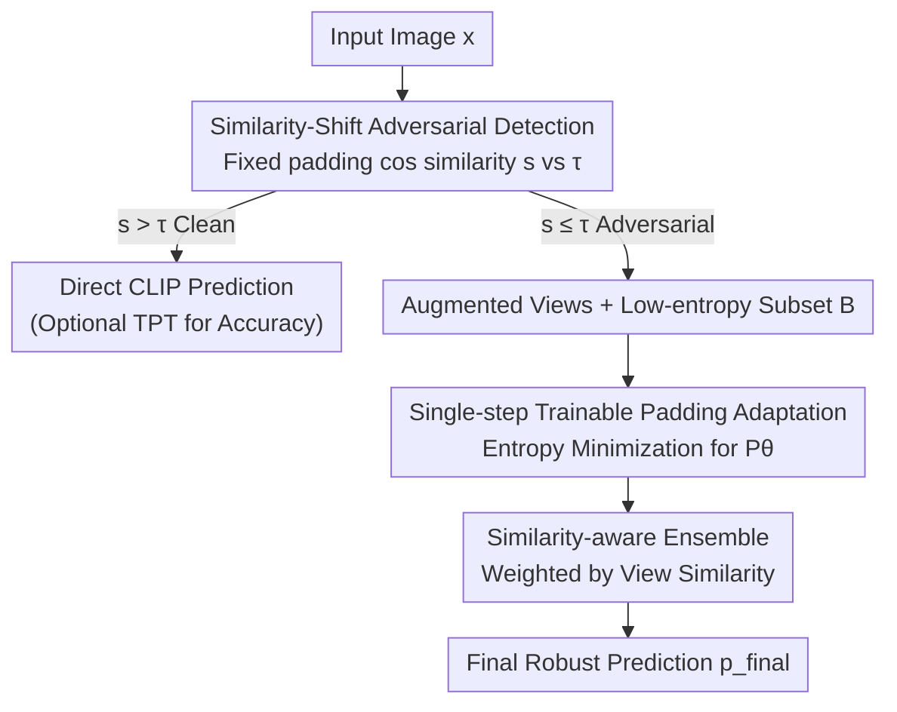

# TTP: Test-Time Padding for Adversarial Detection and Robust Adaptation on Vision-Language Models

**Conference**: CVPR 2026  
**Paper**: [CVF Open Access](https://openaccess.thecvf.com/content/CVPR2026/html/Li_TTP_Test-Time_Padding_for_Adversarial_Detection_and_Robust_Adaptation_on_CVPR_2026_paper.html)  
**Code**: https://github.com/lizhiwei23/TTP  
**Area**: AI Safety / Adversarial Robustness  
**Keywords**: Adversarial Defense, CLIP, Test-Time Adaptation, Adversarial Detection, Vision-Language Models

## TL;DR
TTP introduces a "detect-then-adapt" test-time defense for CLIP. It distinguishes clean from adversarial images based on the **cosine similarity shift of feature embeddings before and after image padding**. Clean samples are output directly, while adversarial samples utilize a single-step trainable padding combined with a similarity-aware weighted ensemble to recover attention disrupted by perturbations. This significantly enhances adversarial robustness without retraining or compromising clean accuracy.

## Background & Motivation
**Background**: Vision-Language Models (VLMs) like CLIP exhibit strong zero-shot recognition capabilities but are extremely vulnerable to adversarial perturbations. To enhance robustness, two main paths exist: training-time defense (adversarial fine-tuning/prompt tuning, e.g., TeCoA, APT, TAPT) requires labeled adversarial data and retraining, which is costly; test-time defense (e.g., R-TPT) adapts weights or prompts during inference without retraining.

**Limitations of Prior Work**: There are two categories in test-time defense. One (R-TPT, TAPT) treats **all inputs equally** for adversarial adaptation. However, adaptation goals for clean and adversarial samples conflict, and applying adversarial adaptation to clean samples degrades clean accuracy. The other (TTC) follows a "detect-then-defend" two-stage route based on the assumption that "adversarial features are more stable under small perturbations." Yet, its detection accuracy is low and unstable across datasets and backbones (Fig. 2 shows TTC's detection accuracy fluctuates wildly with different $L_2$ thresholds). If detection fails, the entire defense collapses.

**Key Challenge**: The success of two-stage defense relies entirely on the "detector," yet current detection signals lack precision and a universal threshold across different architectures and datasets.

**Key Insight**: The authors observe that adding padding to the edges of an image can **partially recover attention disrupted by adversarial perturbations** (Fig. 1: Adversarial attention shifts to incorrect regions, but padding pulls it back to the correct area). Since padding affects clean and adversarial samples differently, the degree of feature shift before and after padding serves as a discriminative signal: clean features remain stable, whereas adversarial features drift significantly.

**Core Idea**: Use the "cosine similarity shift of CLIP features before and after padding" as a **unified, dataset/architecture-independent** criterion for adversarial detection. Then, apply "trainable padding + similarity-aware ensemble" for targeted recovery of detected samples—detect-then-adapt—operating entirely in the input pixel space without modifying model weights or prompts.

## Method

### Overall Architecture
TTP is a lightweight test-time defense operating in the **input space** of CLIP, consisting of a three-stage pipeline. Given a test image $x$: first, a fixed padding calculates the cosine similarity $s$ between the original feature $x$ and the padded feature $P^{fix}(x)$. This is compared against a universal threshold $\tau$. If judged clean ($s > \tau$), the vanilla CLIP zero-shot classification is used. If judged adversarial ($s \le \tau$), it enters the recovery phase: multiple augmented views are generated, a low-entropy subset is selected, and a single-step entropy minimization optimizes an instance-specific trainable padding module to recover attention. Finally, a similarity-aware ensemble aggregates predictions using similarity-based weights.

### Key Designs

**1. Similarity-Shift Adversarial Detection: Reliable Separation with a Universal Threshold**

This step addresses the "inaccuracy and lack of universality" of the TTC detector. The process is simple: apply a fixed padding $P^{fix}(x)$ to input $x$. Use the **frozen** CLIP image encoder to obtain $z = F(x)$ and $z^{pad} = F(P^{fix}(x))$, then calculate their cosine similarity:

$$s = \frac{z \cdot z^{pad}}{\|z\|\,\|z^{pad}\|}$$

If $s > \tau$, it is classified as clean; otherwise, it is adversarial. This works because padding perturbs the two types of samples differently: clean semantics do not rely on precise spatial alignment, so features remain stable (high similarity). Adversarial perturbations depend on high-frequency structures at specific pixel locations; padding changes the spatial arrangement, disrupting the attack mechanism and causing a large feature drift (low similarity). This allows a **single cosine threshold $\tau = 0.8$** to work consistently across 8 datasets and ViT-B/32/B/16/L/14 backbones, with detection accuracy near 100%.

**2. Single-step Trainable Padding Adaptation: Upgrading Padding to an Instance-Specific Focus Restorer**

Fixed padding can recover some attention but introduces noise. TTP optimizes a **lightweight trainable padding module $P_\theta(\cdot)$**. Following the marginal entropy minimization paradigm, $N$ augmented views $\{x_i\}_{i=1}^N$ are generated for the adversarial sample. Probabilities $p_c(x_i)$ and Shannon entropy $H_i$ are calculated:

$$H_i = -\sum_{c=1}^{C} p_c(x_i)\log p_c(x_i)$$

The top-$K$ views with the lowest entropy form a confident subset $B$. Unlike adapting text prompts, TTP optimizes the padding parameters $\theta$ via **single-step** gradient descent to minimize average entropy:

$$\mathcal{L}_{ent} = \frac{1}{|B|}\sum_{i\in B} H_i^{pad}, \qquad \theta \leftarrow \theta - \eta\nabla_\theta \mathcal{L}_{ent}$$

Optimizing padding is more direct for counteracting pixel-level attacks and ensures the defense remains independent of model architecture.

**3. Similarity-Aware Ensemble: Weighting Views by Reliability**

Multiple views must be merged for a robust output. This step calculates an adaptive weight for each view. For an adversarial input $x_{adv}$, let $z_{adv} = F(x_{adv})$ and $z_{adv}^{pad} = F(P^{fix}(x_{adv}))$. For each view $x_i$, let $z_i^{pad} = F(P_\theta(x_i))$ after adaptation. Define:

$$\alpha_i = \cos(z_i^{pad}, z_{adv}^{pad}), \quad \beta_i = \cos(z_i^{pad}, z_{adv}), \quad s_i = \alpha_i - \beta_i, \quad w_i = \frac{\exp(s_i)}{\sum_{j\in B}\exp(s_j)}$$

The intuition is to **prefer views far from the original adversarial feature** ($\beta_i$ should be small) but **close to the padded adversarial feature** where attention is recovered ($\alpha_i$ should be large). The final prediction is:

$$p_{final} = \arg\max_c \sum_{i\in B} w_i\, p_c(P_\theta(x_i))$$

### Loss & Training
The sole optimization objective is the average entropy $\mathcal{L}_{ent}$ of confident views (Design 2), with a **single-step** update to padding parameters $\theta$. Implementation details: padding size 32, detection threshold 0.8, padding initialized randomly in $[0, 10]$ (corresponding to pixels $[0, 255]$), learning rate 5, batch size 64. Attacks use 100-step PGD with $\epsilon=4/255$.

## Key Experimental Results

### Main Results
Evaluation covers 8 datasets with 3 CLIP backbones. Robust accuracy (Rob.) is measured under 100-step PGD ($\epsilon=4.0$). Average clean accuracy (Acc.) and robust accuracy (Rob.) across backbones:

| Backbone / Method | Metric | CLIP | TTC | MTA | R-TPT (Prev. SOTA) | TTP (Ours) |
|------------|------|------|-----|-----|----------------|------------|
| ViT-B/32 | Acc. / Rob. | 57.4 / 0.0 | 56.7 / 6.8 | 58.3 / 35.0 | 57.3 / 35.3 | 57.1 / **39.7** |
| ViT-B/16 | Acc. / Rob. | 61.4 / 0.0 | 58.9 / 4.5 | 62.3 / 27.4 | 61.1 / 39.9 | 61.2 / **42.9** |
| ViT-L/14 | Acc. / Rob. | 69.1 / 0.0 | 68.2 / 4.3 | 69.1 / 39.9 | 68.4 / 49.6 | 68.9 / **51.6** |

TTP improves average robust accuracy over the previous SOTA (R-TPT) by approximately 4.4% (B/32), 3.0% (B/16), and 2.0% (L/14) while maintaining near-vanilla clean accuracy. Across different attacks (CW, DeepFool, FGSM), TTP consistently outperforms R-TPT.

### Ablation Study
Component ablation (Average robust accuracy on ViT-B/32 and B/16):

| Sim-Aware | EntMin | Padding | ViT-B/32 | ViT-B/16 |
|-----------|--------|---------|----------|----------|
| × | × | × | 0.0 | 0.0 |
| × | × | ✓ | 37.5 | 38.0 |
| × | ✓ | ✓ | 39.0 | 40.8 |
| ✓ | × | ✓ | 38.3 | 39.5 |
| ✓ | ✓ | ✓ | **39.7** | **42.9** |

### Key Findings
- **Fixed padding is the primary source of robustness**: Moving from no defense to fixed padding jumps robust accuracy from 0 to 37.5%, validating the "attention recovery" hypothesis.
- **Simpler detectors are more accurate**: Solid black or white padding (98.5%/98.7%) detects better than random padding (95.8%), as simple patterns induce cleaner feature drift.
- **Padding size must be moderate**: In detection, larger padding increases separability, but sizes exceeding 128 degrade features for both classes. For robustness, performance peaks near a size of 64.
- **Compatibility with existing TTA**: Since detection is near 100%, clean samples remain unaffected. Combining with TPT further improves clean accuracy to 57.9/62.1/69.5.

## Highlights & Insights
- **Turning a simple observation into a unified criterion**: The cosine similarity shift before and after padding serves as both a detection signal and a recovery mechanism. The "universal threshold" makes it practical for deployment.
- **Defense in the input space**: By not touching weights or prompts, the method is platform-agnostic and "black-box friendly," suitable for use with public checkpoints.
- **Dual-constraint similarity weighting**: Requiring views to be "far from the original adversary and close to the recovered feature" is a clever way to ensure reliable ensemble results.

## Limitations & Future Work
- **Scope limited to classification**: Experiments are restricted to classification tasks and CLIP backbones; performance on segmentation or generative VLMs is unproven.
- **Empirical threshold**: $\tau=0.8$ works across datasets, but a theoretical guarantee or an adaptive method for varying attack strengths ($\epsilon$) is lacking.
- **Adaptive attacks**: The defense has not been tested against attacks specifically designed to bypass the similarity-shift detector.
- **Manual sizing**: Proper padding size depends on spatial constraints and must be manually tuned.

## Related Work & Insights
- **vs TTC**: TTP fixes the weakest link of the two-stage paradigm (detection) by replacing unstable $L_2$ thresholds with a universal cosine similarity shift.
- **vs R-TPT / TAPT**: Instead of a global adaptation that hurts clean accuracy, TTP uses detection to branching logic and adapts the input padding rather than prompts.

## Rating
- Novelty: ⭐⭐⭐⭐
- Experimental Thoroughness: ⭐⭐⭐⭐
- Writing Quality: ⭐⭐⭐⭐
- Value: ⭐⭐⭐⭐

<!-- RELATED:START -->

## Related Papers

- [\[CVPR 2026\] Hierarchically Robust Zero-shot Vision-language Models](hierarchically_robust_zero-shot_vision-language_models.md)
- [\[CVPR 2026\] Transform to Transfer: Boosting Adversarial Attack Transferability on Vision-Language Pre-training Models](transform_to_transfer_boosting_adversarial_attack_transferability_on_vision-lang.md)
- [\[CVPR 2026\] SIF: Semantically In-Distribution Fingerprints for Large Vision-Language Models](sif_semantically_in-distribution_fingerprints_for_large_vision-language_models.md)
- [\[CVPR 2026\] VCP-Attack: Visual-Contrastive Projection for Transferable Black-Box Targeted Attacks on Large Vision-Language Models](vcp-attack_visual-contrastive_projection_for_transferable_black-box_targeted_att.md)
- [\[CVPR 2026\] When CLIP Sees More, It Fights Back Harder: Multi-View Guided Adaptive Counterattacks for Test-Time Adversarial Robustness](when_clip_sees_more_it_fights_back_harder_multi-view_guided_adaptive_counteratta.md)

<!-- RELATED:END -->
