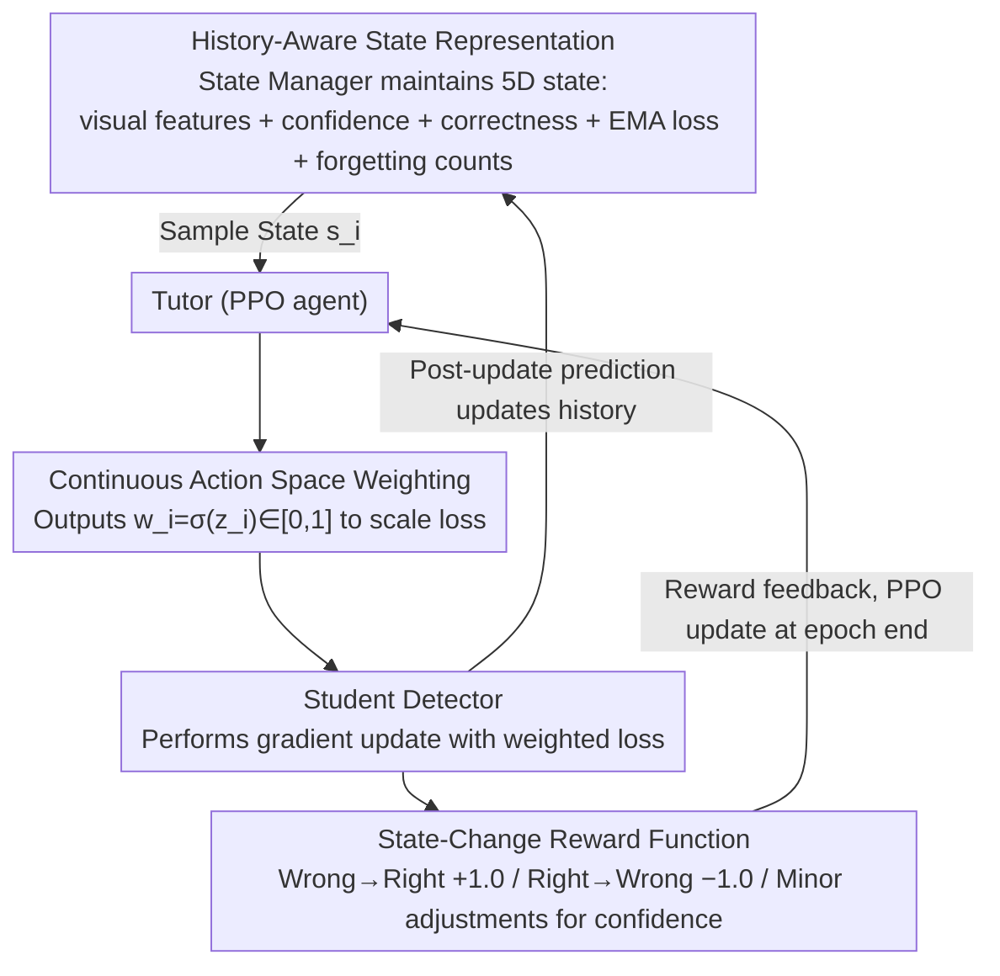

# Tutor-Student Reinforcement Learning: A Dynamic Curriculum for Robust Deepfake Detection

**Conference**: CVPR 2026  
**arXiv**: [2603.24139](https://arxiv.org/abs/2603.24139)  
**Code**: [https://github.com/wannac1/TSRL](https://github.com/wannac1/TSRL)  
**Area**: AI Security / Deepfake Detection  
**Keywords**: Deepfake Detection, Reinforcement Learning, Curriculum Learning, Dynamic Sample Weighting, Cross-domain Generalization

## TL;DR

The authors propose the Tutor-Student Reinforcement Learning (TSRL) framework, which models the training process of a deepfake detector as a Markov Decision Process (MDP). A "Tutor" (PPO agent) dynamically assigns loss weights based on the visual features and historical learning dynamics (EMA loss, forgetting counts) of each sample. Guided by "state-change" reward signals, the "Student" (detector) prioritizes learning high-value samples, significantly improving generalization in cross-dataset and cross-method evaluations.

## Background & Motivation

**Background**: Deepfake detection has evolved through various methods—frequency domain analysis, reconstruction anomaly detection, hybrid boundary modeling, and self-supervised adversarial training. SOTA detectors achieve high accuracy on known datasets but suffer from significant performance degradation when facing unseen forgery techniques, compression artifacts, or different data domains. Generalization remains the primary challenge in this field.

**Limitations of Prior Work**: Traditional supervised training applies uniform loss weights to all samples, which is sub-optimal. Recent studies indicate that AI-generated images of varying quality contribute differently to detector training—high-quality hard samples warrant more attention. Existing Curriculum Learning (CL) methods attempt progressive training based on pre-defined difficulty, but these static curricula possess fundamental limitations: "difficulty" is not an intrinsic property of a sample but a dynamic concept relative to the detector's instantaneous learning state.

**Key Challenge**: A sample that is difficult for an initial model may become trivial later in training, while others remain challenging throughout. Static curricula cannot adapt to these dynamic changes, potentially wasting computational resources on "easy" samples the model has already mastered while neglecting "hard" samples crucial for refining decision boundaries. This imbalance biases the model towards shallow, overfitted features rather than robust, generalizable forgery traces.

**Goal**: Design a dynamic training strategy that adjusts the training curriculum in real-time based on the evolving state of the detector to foster stronger generalization capabilities.

**Key Insight**: Formalize the training process as a sequential decision-making problem. Utilize reinforcement learning to train a "Tutor" agent whose goal is to learn the optimal dynamic sample weighting strategy, explicitly optimizing the "Student" detector's generalization performance on out-of-distribution validation data.

**Core Idea**: Use a PPO reinforcement learning agent as a "Tutor" to assign continuous loss weights (0-1) to each sample based on its historical learning trajectory, creating an adaptive real-time curriculum to maximize the deepfake detector's generalization ability.

## Method

### Overall Architecture

The core problem TSRL aims to solve is that traditional training treats all samples equally. However, "which sample is worth learning right now" depends on the detector's current learning state—a dynamic variable that changes throughout training and cannot be captured by static curricula. TSRL reframes the entire training process as an MDP and introduces an RL agent to monitor and adjust the "curriculum" fed to the detector in real-time.

The framework consists of three roles: the **Student** is the deepfake detector $M_S$ being trained; the **Tutor** is a PPO RL agent $T_\pi$ that does not perform detection but assigns loss weights; the **State Manager** maintains the longitudinal learning history of each training sample. In one training step, these three form a closed loop: the State Manager packages the sample's current state (visual features + history) for the Tutor; the Tutor outputs a weight (0–1) to scale the sample's loss; the Student updates via a weighted gradient; and the change in prediction before and after the update is converted into a reward for the Tutor. The pipeline progresses through three stages: Behavior Cloning initialization → Student warmup → Full TSRL training.

### Key Designs

**1. History-Aware State Representation: Contextualizing "Difficulty" and "Stability"**

For the Tutor to make optimal decisions, it requires a multi-dimensional understanding of each sample—not just "what the image looks like," but "how well the model is learning it." TSRL designs the state as a five-dimensional vector $s_i = [f_i, p_i, e_i, l_i^{ema}, c_i^{forget}]$, where the first three capture the instant snapshot and the last two capture the trajectory. $f_i$ represents deep features from the Student's intermediate layers; $p_i$ is the prediction confidence; $e_i$ is a one-hot indicator of correctness. The key components are: $l_i^{ema}$, the exponential moving average of the loss updated as $l_i^{ema}(t) = \beta \cdot l_i^{ema}(t-1) + (1-\beta) \cdot \mathcal{L}_{CE}$, which captures "long-term perceived difficulty"; and $c_i^{forget}$, a normalized "forgetting event" counter that records how many times the model was correct in the previous epoch but wrong in the current one, measuring learning instability. This allows the Tutor to distinguish between a "hard" sample with consistently high $l_i^{ema}$ and an "unstable" sample with high $c_i^{forget}$.

**2. Continuous Action Space Sample Weighting: Fine-tuning via a Graduated Dial**

The Tutor outputs a continuous weight $w_i = \sigma(z_i) \in [0,1]$ via a Sigmoid function, which is multiplied by the cross-entropy loss:

$$\mathcal{L}_{student} = w_i \cdot \mathcal{L}_{CE}(M_S(x_i), y_i)$$

A $w_i$ near 1 instructs the Student to focus heavily on the sample, while 0 suggests the sample provides little current benefit. Unlike binary "keep/discard" decisions in standard CL, continuous weights provide a dial for fine-grained gradient shaping without abruptly removing data.

**3. State-Change Reward Function: Incentivizing Progress Over Absolute Accuracy**

Instead of using sparse delayed metadata like validation accuracy, TSRL leverages a dense reward based on the Student's prediction change after a weighted update. Rewards are assigned in four scenarios: **Wrong→Right** (Progress): +1.0; **Right→Wrong** (Catastrophic Forgetting): −1.0; **Right→Right**: $c_{rew} \cdot \Delta_{conf}$ (positive bonus for increased confidence); **Wrong→Wrong**: $-c_{rew} \cdot \Delta_{conf}$ (penalty for becoming more confidently wrong). This immediate feedback explicitly incentivizes the Tutor to prioritize "borderline" samples that can be moved across the decision boundary.

### Loss & Training

The three-stage training strategy ensures stability:

- **Behavior Cloning (BC) Initialization**: The Tutor is pre-trained using MSE on demonstration data from a heuristic "expert" policy (e.g., favoring medium-loss samples) to provide a non-random starting point.
- **Student Warmup**: The Student $M_S$ is trained with standard supervision (all $w_i = 1.0$) for $N_{warmup}$ epochs to allow the State Manager to accumulate reliable historical statistics (EMA loss, forgetting counts).
- **TSRL Training**: The full MDP loop is executed. The Tutor's policy is updated at the end of each epoch using PPO with a clipped surrogate objective and GAE (Generalized Advantage Estimation).

## Key Experimental Results

### Main Results: Cross-Dataset Evaluation (Train on FF++, Test on others, AUC)

| Method | CDF-v2 | DFD | DFDC | DFDCP | Average |
|------|--------|-----|------|-------|------|
| Effort | 0.871 | 0.910 | 0.863 | 0.899 | 0.886 |
| **Effort + Ours** | **0.901** | **0.904** | **0.882** | **0.924** | **0.903** |
| CORE | 0.697 | 0.868 | 0.692 | 0.759 | 0.754 |
| **CORE + Ours** | **0.798** | **0.863** | **0.713** | **0.724** | **0.775** |
| CLIP | 0.751 | 0.752 | 0.759 | 0.667 | 0.732 |
| **CLIP + Ours** | **0.849** | **0.732** | **0.768** | **0.724** | **0.768** |

### Cross-Method Evaluation (DF40 Dataset, Average AUC)

| Method | Average AUC |
|------|---------|
| Effort | 0.920 |
| **Effort + Ours** | **0.942** (+2.2%) |
| CORE | 0.814 |
| **CORE + Ours** | **0.855** (+4.1%) |
| ProDet | 0.839 |
| **ProDet + Ours** | **0.850** (+1.1%) |

### Ablation Study (CORE Model, DF40 Dataset)

| Configuration | Average AUC | Average ACC | Average EER | Description |
|------|---------|---------|---------|------|
| CORE baseline | 0.814 | 0.706 | 0.276 | Standard uniform weighting |
| CORE + CL (Static) | 0.817 | 0.723 | 0.266 | Frozen strategy from BC init |
| **CORE + Ours** | **0.855** | **0.767** | **0.238** | Full dynamic RL strategy |

### Key Findings

- **Consistent Improvement**: TSRL yields gains across all 6 baseline models, verifying its framework-agnostic nature.
- **Dynamic > Static**: CORE + CL only improved by +0.3%, whereas CORE + TSRL improved by +4.1%, proving that static heuristics cannot adapt to the model's dynamic state.
- **Accelerated Hard Sample Resolution**: TSRL rapidly reduces the proportion of difficult samples (EMA Loss > 0.7) compared to the baseline.
- **Improved Representation**: UMAP visualizations show that TSRL achieves better category separation and further clusters "easy forged" and "hard forged" samples into distinct groups.
- **New SOTA**: Effort + TSRL achieves a new SOTA of 0.942 in cross-method evaluation.

## Highlights & Insights

- **Meta-Optimization Approach**: Modeling the training process itself as an MDP is ingenious. Instead of modifying architectures, it optimizes "how to learn," making it a universal plug-in for supervised learning tasks.
- **High Reward Density**: The state-change reward provides much more information than traditional delayed rewards. Prioritizing "Wrong→Right" transitions effectively forces the model to focus on samples that define the generalization boundary.
- **Robust Engineering**: The three-stage design addresses RL's inherent instability—BC provides a starting point, and warmup ensures the state space is meaningful before RL takes control.

## Limitations & Future Work

- **Increased Complexity**: Maintaining the Tutor, Student, and State Manager increases training time and memory overhead.
- **Sample Independence**: The Tutor currently makes decisions for samples independently, ignoring inter-sample relationships or class diversity.
- **Heuristic Dependency**: BC initialization depends on a hand-crafted "expert" policy, which may limit initial exploration.
- **Hyperparameter Sensitivity**: The $c_{rew}$ coefficient in the reward function likely requires tuning.
- **Extensibility**: Potential for expansion into other security detection tasks like malware or anomaly detection.

## Related Work & Insights

- **vs. Traditional CL**: CL uses pre-defined difficulty or monotonic pacing functions. TSRL is dynamic and model-aware; ablation results show TSRL significantly outperforms static CL (+4.1% vs +0.3%).
- **vs. CDFA**: CDFA uses progressive augmentation difficulty. TSRL operates at the sample level with dynamic weights, offering finer granularity.
- **vs. Effort**: Even on the strong Effort baseline, TSRL provides a +2.2% boost, showing that even high-performing detectors benefit from optimized curricula.

## Rating

- Novelty: ⭐⭐⭐⭐ First application of RL-based sample weighting for curriculum learning in deepfake detection.
- Experimental Thoroughness: ⭐⭐⭐⭐⭐ Comparison across 6 models, 2 evaluation protocols, and extensive UMAP/ablation analysis.
- Writing Quality: ⭐⭐⭐⭐ Clear framework description and logical progression.
- Value: ⭐⭐⭐⭐ High potential as a plug-and-play module for various supervised tasks.

<!-- RELATED:START -->

## Related Papers

- [\[CVPR 2026\] DFD-HR: Generalizable Deepfake Detection via Hierarchical Routing Learning](dfd-hr_generalizable_deepfake_detection_via_hierarchical_routing_learning.md)
- [\[CVPR 2026\] Omni-Fake: Benchmarking Unified Multimodal Social Media Deepfake Detection](omni-fake_benchmarking_unified_multimodal_social_media_deepfake_detection.md)
- [\[CVPR 2026\] X-AVDT: Audio-Visual Cross-Attention for Robust Deepfake Detection](x-avdt_audio-visual_cross-attention_for_robust_deepfake_detection.md)
- [\[CVPR 2026\] DeepfakeImpact: A Two-Stage Benchmark with Real-World Impact in Deepfake Detection](deepfakeimpact_a_two-stage_benchmark_with_real-world_impact_in_deepfake_detectio.md)
- [\[CVPR 2026\] Decoupling Bias, Aligning Distributions: Synergistic Fairness Optimization for Deepfake Detection](decoupling_bias_aligning_distributions_synergistic_fairness_optimization_for_dee.md)

<!-- RELATED:END -->
