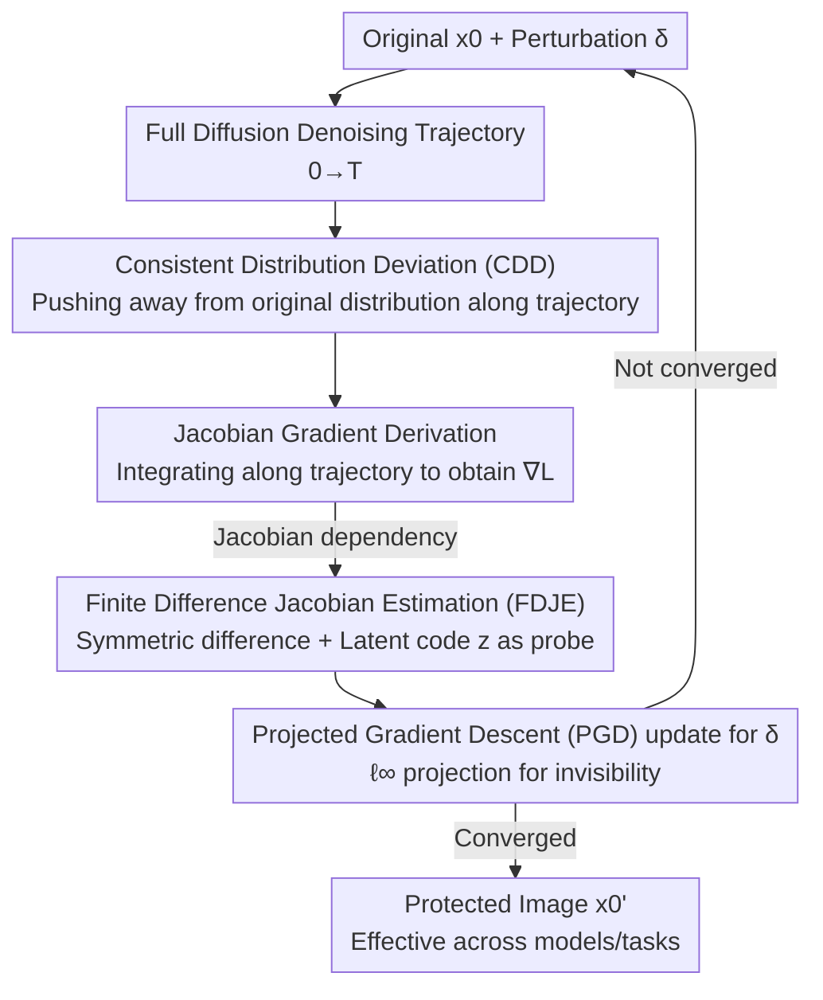

# UniDef: Universal Defense Against Unauthorized Image Manipulation

**Conference**: CVPR 2026  
**Paper**: [CVF Open Access](https://openaccess.thecvf.com/content/CVPR2026/html/Shao_UniDef_Universal_Defense_Against_Unauthorized_Image_Manipulation_CVPR_2026_paper.html)  
**Area**: AI Safety / Adversarial Perturbations / Image Copyright Protection  
**Keywords**: Unauthorized Manipulation Defense, Diffusion Models, Distribution Shift, Jacobian Estimation, Transferable Protection  

## TL;DR
UniDef applies an invisible adversarial perturbation to images, causing any diffusion-based editing or generation (SD, InstructPix2Pix, SR, Image-to-Video, Image-to-3D) to produce semantically collapsed results. Instead of perturbing single-step denoising directions, it pushes the output distribution away from the original image along the **entire denoising trajectory** and utilizes **finite difference-based Jacobian estimation** to achieve cross-model transferability without requiring specific model gradients.

## Background & Motivation

**Background**: Diffusion models have made high-fidelity editing and generation from a reference image effortless. However, this introduces privacy and copyright risks, as personal photos can be subjected to unauthorized deepfakes, stylization, or repainting. Active protection involves pre-embedding human-imperceptible adversarial perturbations $\delta$ into images, ensuring that unauthorized diffusion models produce distorted or semantically erroneous outputs. Representative works include PhotoGuard/AdvDM (perturbing predicted noise), Mist/ACE (overlaying semantic and texture targets to create mosaic artifacts), DiffusionGuard (targeting early denoising steps), and AdvPaint (disrupting attention).

**Limitations of Prior Work**: The authors identify two fundamental flaws in these methods. First, they operate on **individual or local denoising steps** (perturbing specific predicted noise or attention layers), which often leaves **residual semantics of the original or edited image**—the subject remains visually identifiable. Second, perturbation optimization **strongly depends on specific model gradients**. Perturbations optimized for SD v1.4 often fail significantly on v2.1 or when applied to downstream tasks like super-resolution or image-to-3D, lacking transferability.

**Key Challenge**: Why do "local perturbations + model-specific gradients" fail? The authors analyze the gradient properties of diffusion models (Fig. 2): from a **local perspective**, different diffusion variants (SD v1.4/v1.5, IP2P) exhibit vastly different denoising directions at low-noise steps, with significant gradient differences (L2 norm). This is the root cause of overfitting to a single model. However, from a **global perspective**, all diffusion models share the same objective—recovering the original data distribution from pure noise. When integrating the entire denoising trajectory, the gradient differences become negligible. In other words, **models differ in their "step-wise directions" but are highly consistent in their "final distribution target."**

**Goal + Key Insight**: Since local directions are inconsistent while global distributions are consistent, the defense should skip step-wise competition and **directly disrupt the "final distribution to which the model converges"**—pushing the generation result entirely away from the original image distribution. This thoroughly eliminates residual semantics (global rather than local) and is naturally cross-model compatible (targeting a shared goal of all diffusion models).

**Core Idea**: Utilize **Consistent Distribution Deviation (CDD)** to push the output distribution away from the original image throughout the complete denoising process, and employ **Finite Difference-based Jacobian Estimation (FDJE)** to estimate the gradient of this global trajectory in a model-agnostic manner. This yields a universal "one-time, works-everywhere" defense perturbation.

## Method

### Overall Architecture
UniDef aims to find an $\ell_\infty$-constrained invisible perturbation $\delta$ for a clean image $x_0$, such that the protected image $x_0' = x_0 + \delta$ results in a distribution significantly deviating from $x_0$ after processing by any diffusion model. The process follows a closed loop of **gradient ascent iterative optimization**: applying perturbations in pixel space $\rightarrow$ traversing the full diffusion denoising trajectory to obtain the distribution deviation loss $L(x_0')$ $\rightarrow$ deriving the gradient of this loss with respect to $x_0'$ along the trajectory (in Jacobian form) $\rightarrow$ using finite difference with image latent codes $z$ for model-agnostic estimation (since the Jacobian depends on the model) $\rightarrow$ updating $\delta$ using Projected Gradient Descent (PGD) with the estimated gradient $\rightarrow$ outputting the protected image after convergence. The three core components—CDD, Jacobian derivation, and FDJE—respectively address "where to attack," "how to derive gradients," and "how to remove model dependency."

### Key Designs

**1. Consistent Distribution Deviation (CDD): From "single-step" to "entire trajectory"**

Addressing the "residual semantics" issue, CDD redefines the protection target from single-step denoising bias to **distribution deviation across the entire denoising trajectory**. The authors introduce Lemma 3.1: an optimal perturbation $\delta$ exists such that the output distribution $p_0$ of the protected image $x_0'$ deviates from the original distribution $q_0$, maximizing their KL divergence:
$$\delta = \arg\max_{\|\delta\|_p \le \varepsilon} L_{KL}\big(p_0(x_0+\delta)\,\|\,q_0\big) = \arg\max_{\|\delta\|_p \le \varepsilon} \int_0^T w(t)\,\big\|\epsilon_\theta(x_t', t) - \epsilon\big\|_2^2\, dt .$$
The key lies in the **time integral** $\int_0^T$: it treats denoising as a continuous-time process, weighting $w(t)$ the denoising deviation $\|\epsilon_\theta(x_t',t)-\epsilon\|_2^2$ at each noise level $t$. It provides the "global noise difference of the entire trajectory" rather than a local difference at one step. In the proof, the authors use continuous-time score differences to represent KL divergence (integration of $s_\theta - s^\star$), approximate the incalculable true distribution score with a single sampling noise $\epsilon$, and replace distribution-level expectations with a single sample $x_t'$ (as the goal is optimizing for **this specific image**). This simplifies to the optimizable form in Eq. (9). This perturbation disrupts the "distributional reconstruction" of diffusion rather than just surface distortion—ablation shows that without CDD, the generated image clearly retains original semantics (FID drops from 405 to 140), proving that the "global trajectory" is essential to erasing residue.

**2. Jacobian Gradient Derivation: Translating "distribution deviation" into backpropagatable pixel gradients**

With the CDD loss established, its gradient with respect to the pixel perturbation $x_0'$ is required for optimization. Since $\epsilon$ is independent of $x_0'$, differentiation propagates through $x_t'$, yielding the single-step gradient:
$$\nabla_{x_0'}\|\epsilon_\theta(x_t',t)-\epsilon\|_2^2 = 2\sqrt{\bar\alpha_t}\, J_\theta(x_t',t)^\top\big(\epsilon_\theta(x_t',t)-\epsilon\big),$$
where $J_\theta(x_t',t)=\partial \epsilon_\theta(x_t',t)/\partial x_t'$ is the Jacobian of the denoiser relative to the input. Substituting this back into the time integral yields the **global cumulative gradient** for $x_0'$:
$$\nabla_{x_0'}L(x_0') = 2\int_0^T \sqrt{\bar\alpha_t}\, w(t)\, J_\theta(x_t',t)\big(\epsilon_\theta(x_t',t)-\epsilon\big)\, dt .$$
This step translates abstract "distribution deviation" into a concrete gradient to drive PGD. However, $J_\theta$ is the Jacobian of a specific denoiser network $\epsilon_\theta$. **Calculating it directly binds the perturbation to that specific model**, leading back to the transferability issue, which necessitates FDJE.

**3. Finite Difference Jacobian Estimation (FDJE): Model-agnostic global gradient estimation using latent code z**

To eliminate specific model dependency, FDJE avoids explicit calculation of $J_\theta$. It uses the Hutchinson trace estimator to express $J^\top v$ as the expectation of a random projection $A^\top v = \mathbb{E}_y[y\langle Ay, v\rangle]$, then approximates the expensive Jacobian-Vector Product (JVP) using **symmetric finite difference**:
$$\hat J_z(t;z) = \frac{\epsilon_\theta(x_t'+\epsilon_{fd}z,\, t) - \epsilon_\theta(x_t'-\epsilon_{fd}z,\, t)}{2\,\epsilon_{fd}},$$
where $\epsilon_{fd}$ is the difference step (default 0.01). This requires only two forward passes through the denoiser (positive and negative perturbations) to probe local changes in denoising direction **without backpropagation or touching internal weights**, preventing overfitting to a specific architecture. Crucially, instead of a random vector $y$, the authors use the **original image latent code $z$ from an AutoEncoder** (which still follows $\mathcal{N}(0,I)$). Random directions in high-dimensional pixel space are mostly irrelevant to "semantics-defining directions," resulting in inaccurate global gradients. Using $z$, which aligns with the image content and distribution, provides a semantic-aware gradient estimation. Ablation confirms: replacing $z$ with a random vector (w/o z) allows generated images to retain structural integrity; removing FDJE entirely (w/o FDJE) significantly worsens cross-task (IP2P) generalization due to gradient overfitting.

### Loss & Training
Optimization is performed via Projected Gradient Descent (PGD) on $\delta$ in pixel space. The $i$-th update step is:
$$\delta^{(i)} = \Pi_{\|\delta\|_\infty \le \xi}\Big(\delta^{(i-1)} + \eta\,\mathrm{sign}\big(\nabla_{x_0'}L(x_0')\big)\Big),$$
where $\eta$ is the step size and $\Pi$ projects the perturbation into the $\ell_\infty$ ball to ensure invisibility. Default parameters are $\xi = 16/255$ and $\epsilon_{fd}=0.01$. Perturbations are generated on SD v1.4 and tested for transferability to other models and tasks, runnable on a single RTX 4090.

## Key Experimental Results

Data: 100 ImageNet images + 100 Landscape images (including people, objects, scenes), center-cropped to 512×512. Metrics (PSNR↓, CLIP↓, FID↑, LPIPS↑) are calculated between "original edit" and "protected edit"—stronger defense leads to larger deviation, hence lower PSNR/CLIP and higher FID/LPIPS are better.

### Main Results: Cross-Model Protection (Perturbation generated on SD v1.4)

| Test Model | Metric | UniDef | Best Baseline | Description |
|----------|------|--------|----------|------|
| SD v1.4 | FID↑ / CLIP↓ | **405.54** / 0.9011 | Mist 380.20 / AdvDM 0.8545 | FID leads significantly; strongest distribution shift |
| SD v1.5 | FID↑ / LPIPS↑ | **400.01** / **0.6053** | ACE 379.92 / SDS 0.6951 | Most complete protection on related models |
| SD v2.1 | FID↑ / PSNR↓ | **359.29** / **15.51** | AdvPaint 332.18 / Mist 17.22 | Remains optimal on heterogeneous v2.1 |

While individual CLIP values might not be the absolute lowest (e.g., AdvDM's 0.8545 on SD v1.4), UniDef **consistently and significantly leads** in FID, reflecting "overall distribution deviation," with optimal PSNR/LPIPS. This indicates it disrupts distributional reconstruction consistency rather than just creating surface artifacts.

### Cross-Task Generalization (Direct migration of SD v1.4 perturbations, Table 2)

| Task | UniDef CLIP↓ / FID↑ | Second Best | Conclusion |
|------|---------------------|------|------|
| InstructPix2Pix | 0.8086 / 239.88 | ACE 0.8138 / AdvPaint 195.01 | Editing semantics completely disrupted |
| Inpainting | 0.8371 / 251.61 | ACE 0.8404 / AdvPaint 240.07 | Structural collapse in repainted regions |
| Super-Resolution | 0.9198 / 277.11 | ACE 0.9262 / Mist 202.37 | Strongest texture distortion in SR |
| Image-to-Video (SVD) | 0.8852 / 107.04 | AdvPaint 0.8876 / SDS 94.45 | Temporal semantic consistency destroyed |
| Image-to-3D (Zero123++) | 0.7378 / 245.17 | Mist 0.7445 / Mist 187.95 | Multi-view consistency destroyed |

UniDef achieves **the lowest CLIP and highest FID simultaneously** across five downstream tasks, proving it targets the underlying generation distribution shared by all tasks.

### Ablation Study (Table 4, SD v1.4 / IP2P columns)

| Configuration | SD v1.4 FID↑ | IP2P CLIP↓ | Description |
|------|--------------|-----------|------|
| w/o CDD | 140.31 | 0.8277 | Loss of global shift; semantics remain; FID crashes |
| w/o FDJE | 242.84 | 0.8238 | Reverts to model-specific gradients; poor generalization |
| w/o z (using random vector) | 164.52 | 0.8155 | Inaccurate estimation; structural residue remains |
| Full UniDef | **405.54** | **0.8086** | Optimal distribution shift and generalization |

### Robustness (Table 3, Post-processing attacks)

| Post-processing | PSNR↓ | CLIP↓ | FID↑ | Performance |
|--------|-------|-------|------|------|
| No processing | 16.40 | 0.9011 | 405.54 | Baseline |
| JPEG Compression | 17.56 | 0.8940 | 155.37 | FID drops but semantics remain chaotic |
| Crop / Affine | ~18 | ~0.89–0.91 | ~182 | Stable under geometric transformations |
| External Denoising | 20.56 | 0.9356 | 93.56 | Only significant weakening; low semantic alignment persists |

### Key Findings
- **CDD is the primary contributor**: Removing it causes FID to drop from 405 to 140, with generated images retaining original semantics—proving "global trajectory shift" is the core of erasing residues.
- **FDJE determines cross-task generalization**: Without it, protection on IP2P weakens because the perturbation overfits the SD v1.4 backpropagation gradients.
- **Latent code z is irreplaceable**: Using a random vector as the probe direction allows generated images to retain subject structures, showing random directions cannot align with semantics.
- **Denoising is the strongest attack**: External denoising reduces FID from 405 to 93, the only significant reduction in protection; the defense is otherwise stable under JPEG/Crop/Affine/Noise.

## Highlights & Insights
- **The "local variance, global consistency" observation is the linchpin**: The authors use empirical evidence (Fig. 2) to frame "why target the global distribution" as a justified design motivation rather than just a claim of universality. This mindset of identifying invariants across models for attacks/defense is highly transferable.
- **Using the image's own latent code z as the Jacobian probe direction is clever**: It satisfies theoretical requirements while providing semantic awareness. This is the reason for the massive drop in the w/o z ablation and is a highly reusable trick.
- **Replacing JVP with Finite Difference** allows protection without denoiser backpropagation or weight access, making it inherently model-agnostic—a key engineering factor for universal effectiveness.

## Limitations & Future Work
- **Weak robustness to external denoising**: Denoising significantly weakens the defense (FID 405 $\rightarrow$ 93). In reality, an attacker could use denoising/super-resolution as pre-processing to substantially bypass the protection.
- **Small evaluation scale**: Only 100 images per dataset at 512×512 were used. Transferability to newer architectures (SDXL, DiT/Flux, closed-source APIs) remains unverified.
- **Inconsistent CLIP superiority**: Broadly, UniDef relies on FID to prove its advantage; it is unclear if "high distribution shift" always equates to "subjective unrecognizability" without a more direct human study.
- **Potential improvements**: Explicitly incorporating adversarial robustness terms (e.g., EoT-style training) against denoising/JPEG could address the current vulnerabilities.

## Related Work & Insights
- **vs AdvDM / PhotoGuard**: These perturb predicted noise in latent/pixel space, essentially a single-step direction attack. UniDef shifts the distribution along the entire trajectory, leaving fewer semantic residues.
- **vs Mist / ACE**: These create structured mosaic artifacts via semantic/texture targets, but subjects often remain recognizable. UniDef's distributional disruption is more thorough.
- **vs DiffusionGuard / AdvPaint**: These are task/stage-specific strategies. UniDef targets the global distribution shared by all diffusion models, achieving the first cross-model/cross-task universal defense.
- **vs SDS**: SDS uses score distillation sampling to replace full gradient computation for efficiency but remains dependent on specific model scores. UniDef’s FDJE achieves true model-agnostic estimation via finite differences and $z$.

## Rating
- Novelty: ⭐⭐⭐⭐⭐ The "local-global" observation + CDD global shift + FDJE model-agnostic estimation constitutes the first universal defense framework.
- Experimental Thoroughness: ⭐⭐⭐⭐ Three models + five tasks + robustness + three ablations are comprehensive, though limited by 100 images/set and missing newer architectures.
- Writing Quality: ⭐⭐⭐⭐ Clear chain of logic from motivation to derivation; comprehensive formulas and lemmas.
- Value: ⭐⭐⭐⭐ Addresses a genuine pain point in image copyright/privacy for the AIGC era; high universality and deployable on single GPUs.

<!-- RELATED:START -->

## Related Papers

- [\[CVPR 2026\] Forensic-Friendly Image Manipulation via Controllable Latent Diffusion](forensic-friendly_image_manipulation_via_controllable_latent_diffusion.md)
- [\[CVPR 2026\] No Way To Steal My Face: Proactive Defense Against Identity-Preserving Personalized Generation](no_way_to_steal_my_face_proactive_defense_against_identity-preserving_personaliz.md)
- [\[CVPR 2026\] AdvMark: Decoupling Defense Strategies for Robust Image Watermarking](decoupling_defense_strategies_for_robust_image_watermarking.md)
- [\[CVPR 2026\] Frequency-domain Manipulation for Face Obfuscation](frequency-domain_manipulation_for_face_obfuscation.md)
- [\[CVPR 2026\] A Unified Perspective on Adversarial Membership Manipulation in Vision Models](a_unified_perspective_on_adversarial_membership_manipulation_in_vision_models.md)

<!-- RELATED:END -->
