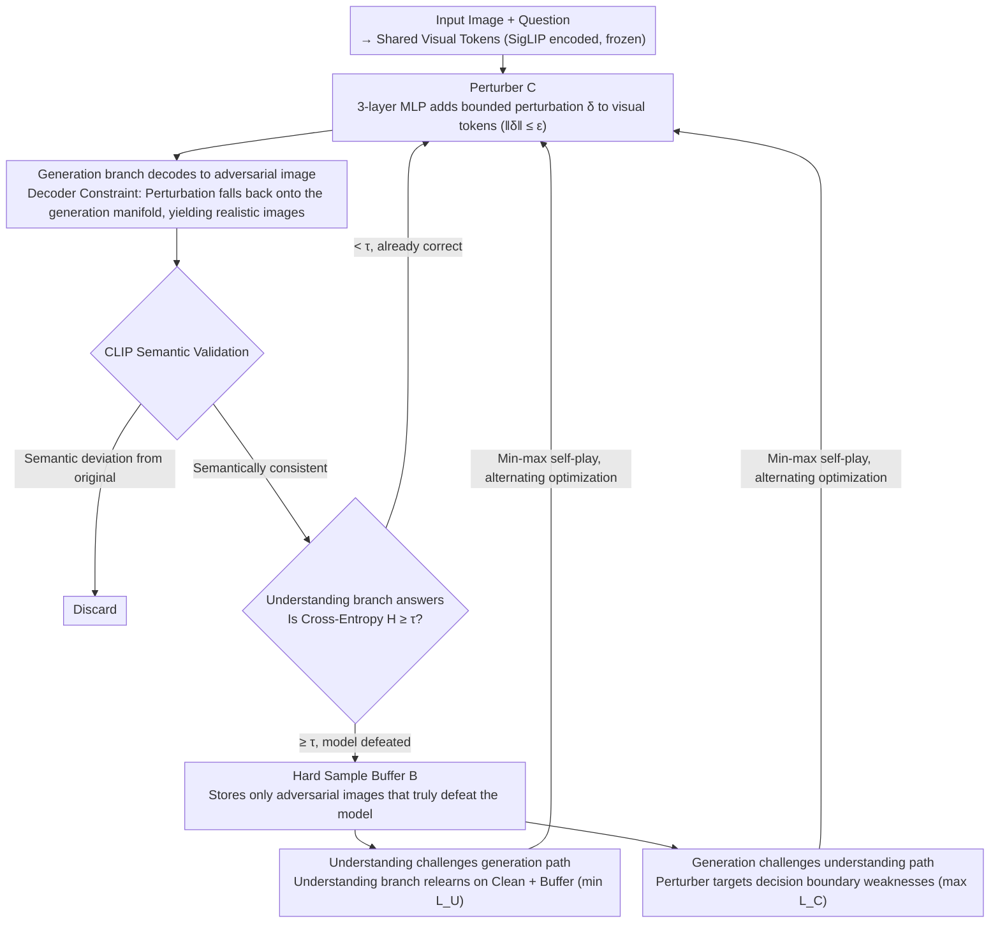

# UniGame: Turning a Unified Multimodal Model Into Its Own Adversary

**Conference**: CVPR 2026  
**arXiv**: [2511.19413](https://arxiv.org/abs/2511.19413)  
**Code**: [https://github.com/AIFrontierLab/TorchUMM](https://github.com/AIFrontierLab/TorchUMM)  
**Area**: AI Safety  
**Keywords**: Unified Multimodal Model, Self-Adversarial Training, Consistency, Post-Training, Min-max Optimization

## TL;DR
UniGame proposes the first self-adversarial post-training framework for Unified Multimodal Models (UMM). By installing a lightweight perturber at the shared visual token interface, it enables the generation branch to actively create semantically consistent adversarial samples to challenge the understanding branch. This forms a min-max self-play that significantly improves consistency (+4.6%), understanding (+3.6%), generation, and robustness.

## Background & Motivation

1. **Background**: Unified Multimodal Models (UMM, such as Janus-Pro, Emu3, BLIP3-o) use a single architecture for both visual understanding and image generation, implemented through a shared language model backbone and a visual tokenizer-decoder stack. The standard post-training process is Supervised Fine-Tuning (SFT).

2. **Limitations of Prior Work**: UMMs suffer from **structural inconsistency** between the understanding and generation paths—understanding prefers compact embeddings, while generation prefers representations rich for reconstruction. This contradiction leads to semantic mismatches (correct answers but failure to generate corresponding images), capability gaps (one path being harder to improve), and conflicts in feature compactness. These issues are exacerbated in out-of-distribution and adversarial scenarios.

3. **Key Challenge**: Existing post-training methods (reconstruction-based like RecA, reward-based like T2I-R1) optimize surrogate objectives on a **fixed data distribution**. They lack explicit constraints on the two coupled branches and merely refine behaviors within comfort zones, failing to truly expand the shared generation manifold. Adversarial perturbations in the embedding space often produce meaningless off-manifold samples.

4. **Goal**: Can a UMM be made to discover and correct its own inconsistencies internally? That is, by utilizing the generation branch as an active adversary to the understanding branch, making the model its own opponent.

5. **Key Insight**: Adversarial signals can reliably expose fragile reasoning in vision-language models (as verified by prior work). The key is to enforce adversarial perturbations through the decoder to produce visually realistic and semantically plausible counter-examples, rather than noise in an abstract embedding space.

6. **Core Idea**: Transform the UMM's generation path into an active adversary. By applying decoder-constrained perturbations in the shared token space, the model generates semantically consistent adversarial samples to strengthen understanding, forming a min-max self-play.

## Method

### Overall Architecture
UniGame addresses the structural inconsistency where the understanding and generation paths in a UMM are "trained separately without mutual constraints." Its approach is to turn the generation path into a sparring partner for the understanding path: a lightweight perturber is attached to the shared visual token interface of a standard UMM (e.g., Janus-Pro-7B). This perturber intentionally pushes visual tokens in a direction likely to cause errors in the understanding branch. These perturbed tokens are then decoded into a real image via the model's own decoder and fed back into the understanding branch for question answering. The entire pipeline is `visual token → perturbation → decode into adversarial image → CLIP semantic validation → hard sample buffer → understanding branch relearning`. The understanding branch strives to answer correctly while the perturber strives to create difficult problems, forming a min-max self-play with alternating optimization. During this process, the visual encoder (SigLIP) is frozen, and only the LLM's LoRA adapters and the perturber MLP are trained, adding $< \text{1\%}$ extra parameters (~2.1M/7B).

### Key Designs

**1. Perturber $C$: Passing Adversarial Perturbations "Through the Decoder"**

Traditional methods add noise directly to visual embeddings, but adversarial perturbations in the embedding space easily drift off-manifold, becoming visually meaningless noise decoupled from semantics. The resulting robustness does not transfer well to real inputs. The perturber is a 3-layer MLP that applies a bounded perturbation to the shared visual tokens: $\tilde{\mathbf{z}} = C(\hat{\mathbf{z}}; \theta_C) = \hat{\mathbf{z}} + \boldsymbol{\delta}$, where $\|\boldsymbol{\delta}\| \leq \varepsilon_{\max}$ (via normalization and clipping). The key is not the MLP itself, but that the perturbed tokens **must be decoded back into an image** $\tilde{\mathbf{x}} = G(\tilde{\mathbf{z}})$ using the model's own generation branch. This step implicitly constrains the perturbation to the generation manifold. The decoded adversarial images are visually realistic, and errors made by the understanding branch on these images represent "genuine failures." Ablations show this decoder constraint alone improves VQAv2 from 79.6% to 81.5% (+1.9).

**2. Hard Sample Buffer $\mathcal{B}$: Retaining Genuine Failures**

Unconstrained perturbations can produce many invalid samples. Training on all of them wastes computation and dilutes signals. The buffer only collects decoded samples that cause the understanding branch to fail: $\mathcal{B} = \{G(\tilde{\mathbf{z}}) \mid H(\tilde{\mathbf{z}}) \geq \tau\}$, where $H$ is the cross-entropy loss of the understanding branch. Training thus focuses on the "current weakest boundaries" of the model. A buffer size of 50 is found to be optimal; sizes too small (e.g., 10 yielding 82.5%) lack diversity.

**3. "Understanding Challenges Generation" Path: Balancing Mastery and New Challenges**

Training solely on adversarial samples can cause the model to forget clean samples it previously mastered. This path anchors both sides using two loss terms: $\mathcal{L}_U = \mathbb{E}_{\text{clean}}[\text{CE}(p_U(\hat{a}|\mathbf{z},q), a)] + \beta \mathbb{E}_{\mathcal{B}}[\text{CE}(p_U(\hat{a}|\mathbf{z},q), a)]$. The first term maintains accuracy on clean data, while the second enforces correctness on the difficult samples from the buffer, with $\beta$ balancing the weights. Consequently, the understanding branch is forced to move its decision boundary in a more robust direction without sacrificing fundamental capabilities.

**4. "Generation Challenges Understanding" Path: Targeting Decision Boundary Weaknesses**

The perturber's optimization goal is the inverse of the understanding branch—it maximizes the understanding loss to push samples toward the most confusing directions: $\mathcal{L}_C = \mathbb{E}[\text{CE}(p_U(\hat{a}|\text{Enc}(G(C(\hat{\mathbf{z}}))), q), a)] - \lambda\|\boldsymbol{\delta}\|^2$. The first term makes adversarial samples difficult for understanding, while the second term $\lambda\|\boldsymbol{\delta}\|^2$ acts as a regularizer to prevent perturbations from destroying the image. Additionally, a CLIP semantic consistency check ensures the decoded adversarial image remains aligned with the original question. Combined, the perturber identifies "semantically unchanged but confusing" samples—the model's true reasoning vulnerabilities.

### Mechanism: A Full Round of Self-Play
Consider the question "How many cats are in the image?" (Answer: 2). The understanding branch correctly answers on the clean image. The perturber adds a bounded perturbation $\boldsymbol{\delta}$ to the visual tokens, which the generation branch decodes into a new image $\tilde{\mathbf{x}}$ that looks nearly identical but has subtle texture changes. CLIP confirms the semantics remain "two cats." If the understanding branch now answers "3," the cross-entropy loss exceeds $\tau$, and this "hard image" enters the buffer. In the next step, the understanding branch is trained on $\mathcal{L}_U$ using both the clean image and the hard image, correcting its weakness. Simultaneously, the perturber continues to find new vulnerabilities via $\mathcal{L}_C$. Experiments show that after 5K steps, hard sample loss continues to dominate, indicating the perturber successfully generates challenging samples without the self-play converging to trivial solutions.

### Loss & Training
The overall process is a min-max optimization $\min_{\theta_U} \max_{\theta_C} (\mathcal{L}_U(\theta_U) + \lambda \mathcal{L}_C(\theta_C; \theta_U))$, with alternating updates between the understanding branch and the perturber. Training uses the VQAv2 training set and CC3M. The SigLIP visual encoder is frozen, while the LLM's LoRA adapters and the perturber MLP are trained ($< \text{1\%}$ extra parameters).

## Key Experimental Results

### Main Results: Consistency Evaluation

| Model | Params | UnifiedBench | WISE | Consistency Score |
|------|--------|-------------|------|-------------------|
| BAGEL | 14B | 83.48 | 0.41 | 66.49 |
| Janus-Pro (baseline) | 7B | 82.77 | 0.35 | 63.66 |
| Janus-Pro+SFT | 7B | 83.20 | 0.37 | 64.72 (+1.06) |
| **Janus-Pro+UniGame** | **7B** | **85.20** | **0.43** | **68.32 (+4.66)** |

### Understanding + Robustness

| Benchmark | Baseline | SFT | UniGame | Gain |
|------|---------|-----|---------|------|
| VQAv2 | 78.2 | 79.5 | **83.4** | +5.2 |
| MMMU | 41.0 | 41.2 | **43.8** | +2.8 |
| POPE | 87.4 | 87.6 | **89.6** | +2.2 |
| NaturalBench (OOD) | — | — | — | **+4.8%** |
| AdVQA (Adversarial) | — | — | — | **+6.2%** |

### Ablation Study: Embedding Perturbation vs. Decoder-Constrained Perturbation

| Method | VQAv2 Accuracy |
|------|------------|
| Baseline (SFT) | 79.5 |
| Embedding Random Noise | 78.5 |
| Embedding Adversarial Perturbation | 78.9 |
| Embedding Adv + Cosine + Buffer | 80.2 |
| **Decoder-Constrained (Decoding only)** | **81.5** |
| Decoder + Cosine | 82.2 |
| Decoder + CLIP | 82.7 |
| **Full (Decoder + CLIP + Buffer)** | **83.4** |

### Key Findings
- **Decoder constraint is core**: The constraint alone outperforms the best embedding perturbation by 1.3% (81.5 vs 80.2), as embedding-space perturbations often decouple from visual semantics.
- **CLIP semantic matching is superior**: Outperforms pure cosine geometric constraints (82.7 vs 82.2) by ensuring semantic consistency of adversarial samples.
- **Perturber architecture**: A 3-layer MLP is optimal (83.4%); 2-layer (82.8%) is too weak, and 4-layer (81.2%) overfits.
- **Buffer size**: 50 is optimal; smaller sizes (10: 82.5%) lack sufficient diversity.
- **Sustained challenge**: Hard sample loss remains dominant after 5K+ steps, showing UniGame continuously generates the most challenging samples for the current model state.
- **Plug-and-play**: Adding 5K steps of UniGame (~10 GPU-h) on top of RecA yields further gains: MMMU +0.5, UnifiedBench +1.27.

## Highlights & Insights
- **"Turning the model into its own adversary"**: Converts the UMM's generation path into a natural source for adversarial training without requiring external discriminators or reward models. The dual-branch architecture of UMM is inherently suited for self-play.
- **Decoder-constrained Adversary**: Instead of perturbing in abstract embedding space, it "lands" perturbations as real images through the decoder, implicitly constraining them to the manifold. This addresses the core issue of off-manifold samples in traditional adversarial training.
- **Architecture-agnostic and Plug-and-play**: Requires $< \text{1\%}$ extra parameters and is complementary to existing methods like RecA or T2I-R1.

## Limitations & Future Work
- Evaluation is primarily on Janus-Pro-7B; validation on other UMM architectures (e.g., BLIP3-o, Emu3) is limited (only preliminary toy model tests).
- Training data is limited to VQAv2 and CC3M; larger and more diverse datasets might unlock greater potential.
- Currently limited to image-level adversarial samples; temporal adversariality for video UMMs remains unexplored.
- Stability of min-max training depends on hyperparameter tuning ($\varepsilon_{\max}$, $\tau$, $\beta$, learning rate ratios); practical deployment may require careful adjustment.
- Gains in generation quality are relatively modest (GenEval +0.02), likely because perturbations primarily optimize the understanding side.

## Related Work & Insights
- **vs RecA**: RecA uses reconstruction loss to align understanding and generation representations (passive collaboration). UniGame uses adversarial play to actively expand the shared manifold. The two are complementary.
- **vs VILLA**: VILLA performs large-scale perturbations in the embedding space for robustness without decoder constraints. UniGame's decoder-constrained approach produces more effective on-manifold adversarial samples.
- **vs GAN**: While GANs require an external discriminator, UniGame utilizes the UMM's own understanding branch as the discriminator while simultaneously targeting improvement in both understanding and generation.

## Rating
- Novelty: ⭐⭐⭐⭐⭐ First self-adversarial post-training framework for UMM; the "generation branch as adversary" concept is innovative.
- Experimental Thoroughness: ⭐⭐⭐⭐ Comprehensive evaluation across consistency, understanding, generation, OOD, and adversarial robustness.
- Writing Quality: ⭐⭐⭐⭐ Clear motivation; well-articulated distinctions from GAN/AT/reconstruction.
- Value: ⭐⭐⭐⭐ Significant reference for UMM post-training and consistency; the self-play mindset is highly generalizable.

<!-- RELATED:START -->

## Related Papers

- [\[CVPR 2026\] Omni-Fake: Benchmarking Unified Multimodal Social Media Deepfake Detection](omni-fake_benchmarking_unified_multimodal_social_media_deepfake_detection.md)
- [\[CVPR 2026\] SafeLogo: Turning Your Logos into Jailbreak Shields via Micro-Regional Adversarial Training](safelogo_turning_your_logos_into_jailbreak_shields_via_micro-regional_adversaria.md)
- [\[CVPR 2026\] FedAFD: Multimodal Federated Learning via Adversarial Fusion and Distillation](fedafd_multimodal_federated_learning_via_adversarial_fusion_and_distillation.md)
- [\[CVPR 2026\] A Unified Perspective on Adversarial Membership Manipulation in Vision Models](a_unified_perspective_on_adversarial_membership_manipulation_in_vision_models.md)
- [\[CVPR 2026\] FVBench: Benchmarking Deepfake Video Detection Capability of Large Multimodal Models](fvbench_benchmarking_deepfake_video_detection_capability_of_large_multimodal_mod.md)

<!-- RELATED:END -->
