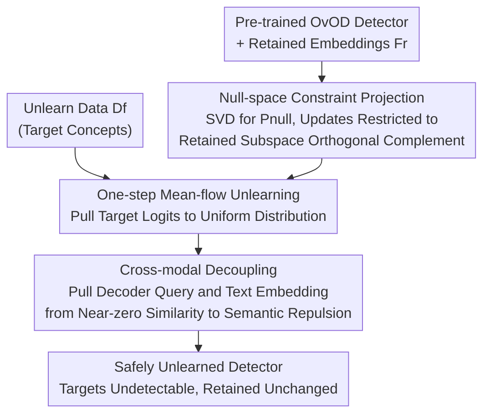

# Unlearning without Forgetting: Securely Removing Targeted Concepts from Large-Scale Vision-Language Open-Vocabulary Detectors

**Conference**: CVPR 2026  
**Paper**: [CVF Open Access](https://openaccess.thecvf.com/content/CVPR2026/html/Wu_Unlearning_without_Forgetting_Securely_Removing_Targeted_Concepts_from_Large-Scale_Vision-Language_CVPR_2026_paper.html)  
**Area**: AI Security / Machine Unlearning  
**Keywords**: Machine Unlearning, Open-Vocabulary Detection, Null-space Projection, Cross-modal Decoupling, Privacy Compliance

## TL;DR
SafeDetect constrains the concept unlearning of open-vocabulary detectors (e.g., GroundingDINO, LLM-Det) to parameter updates within the "null space of the retained concept subspace." Combined with a one-step mean-flow unlearning target and cross-modal decoupling loss, it removes target concepts (such as faces or specific individuals) with minimal damage to retained concepts and zero-shot generalization. It achieves a 64.75% improvement in forgetting efficacy over NPO and converges 1.5× faster.

## Background & Motivation
**Background**: Open-vocabulary detectors (OvOD) inherit cross-modal knowledge from VLMs pre-trained on web-scale data, enabling open detection (OD), phrase grounding (PG), and referring expression comprehension (REC) for nearly infinite vocabularies. However, this "detect everything" capability includes social media-scraped faces and individuals in surveillance, posing privacy, copyright, and compliance risks. Regulations (e.g., the Right to be Forgotten) require models to selectively delete specific concepts, yet retraining from scratch is prohibitively expensive (unlearning uses 1.8% of data, takes 1.77 hours, and 2GB storage, versus full retraining).

**Limitations of Prior Work**: Machine unlearning (MU) has succeeded in LLMs/MLLMs and closed-set classification but fails on OvOD—either failing to remove targets completely or over-forgetting, which destroys the generalization of related and unseen concepts. Qualitative results show that when a model is asked to forget "face" and "woman," existing methods even lose the ability to detect "bowl."

**Key Challenge**: The authors diagnose the root cause as **geometric entanglement interference**. VLM embeddings have a linearly decomposable structure—a concept $z$'s embedding can be written as a global offset plus semantic factors: $\bar{\ell}_z = \bar{\ell}_0 + \sum_{i=1}^k \bar{\ell}_{z_i}$. Thus, "woman" and "person" share factors like $\bar{\ell}_{\text{human}}$, causing their embeddings to overlap in shared subspaces ($\text{span}(F_f) \cap \text{span}(F_r) \neq \emptyset$). Traditional unlearning only balances losses $\mathcal{L}_{\text{MU}} = \lambda_f \mathcal{L}_{\text{forget}} + \lambda_r \mathcal{L}_{\text{retain}}$. The resulting update $\Delta W = -\eta \nabla_W \mathcal{L}_{\text{MU}}$ inevitably has a non-zero projection on the retained subspace $\langle \Delta W_f, \mathbf{f}_c \rangle \neq 0$, meaning forgetting "woman" inadvertently modifies "person/child" and related unseen concepts.

**Goal**: Delete target concepts while eliminating interference with retained knowledge at the geometric root, providing a unified and reproducible benchmark for OvOD unlearning.

**Key Insight**: Since interference arises from update directions falling into the retained subspace, the update direction should be **forced into the orthogonal complement (null space) of the retained subspace**—mathematically ensuring that "deletion operations cannot touch the directions of retained concepts."

**Core Idea**: Use null-space projection instead of loss-layer balancing for unlearning. Decompose any parameter update into a tangential component (causing interference, discarded) and a normal component (safe, retained), allowing updates only on the latter.

## Method

### Overall Architecture
SafeDetect is a "geometrically constrained unlearning" framework. It takes a pre-trained OvOD detector, a small batch of unlearning data $\mathcal{D}_f$, and retained concept text embeddings as input. It outputs a detector that has removed target concepts while maintaining retained and zero-shot capabilities. The pipeline follows three steps: first, **offline** construction of the null-space projector $P_{\text{null}}$ from retained embeddings as a "safety guardrail"; second, using a **one-step mean-flow target** within this guardrail to pull the detection output of target concepts toward a uniform distribution; and finally, a **cross-modal decoupling loss** to sever the association between decoder queries and text embeddings, preventing the "recall" of deleted concepts via synonyms.

### Key Designs

**1. Null-space Constrained Knowledge Projection: Confining Updates to the Orthogonal Complement**

This is the core solution to geometric entanglement. The pain point is that traditional updates $\Delta W$ project onto retained directions. SafeDetect requires all updates to satisfy $\Delta W \cdot F_r = 0$ ($F_r$ is the retained embedding matrix), ensuring regional-text alignment remains unchanged for any retained concept $c$:

$$(W + \Delta W) \cdot \mathbf{f}_c = W \cdot \mathbf{f}_c + \underbrace{\Delta W \cdot \mathbf{f}_c}_{=0} = W \cdot \mathbf{f}_c.$$

Mechanism: Perform SVD on retained embeddings $F_r = [\mathbf{f}_{c_1}, \dots, \mathbf{f}_{c_k}] = U\Sigma V^T$. Take singular vectors with values above a threshold $\varepsilon = 10^{-2}$ to form $U_r$, yielding the retention projector $P_{\text{keep}} = U_r U_r^T$ and null-space projector $P_{\text{null}} = I - U_r U_r^T$. Any update is decomposed as $\Delta W = P_{\text{keep}}\Delta W + P_{\text{null}}\Delta W$. By discarding the tangential component $P_{\text{keep}}\Delta W$, first-order interference is eliminated: $\langle P_{\text{null}}\Delta W, \mathbf{f}_c \rangle = 0,\ \forall c \in \mathcal{C}_{\text{retain}}$. Due to linear decomposability, this protection generalizes to shared factors $\mathbf{f}_{\text{shared}} \in \text{span}(F_r)$, preserving "person/human" when "woman" is deleted. The projector is **pre-computed offline** and applied specifically per module.

**2. One-step Mean-flow Unlearning Target: Driving Targets to "Indistinguishability"**

While the guardrail prevents damage, this component drives the "deletion." Traditional MU requires multi-step iterative optimization, which is prone to instability. The authors observe that outputting a **uniform distribution** for target classes is equivalent to maximum entropy, or a "completely indistinguishable" state. Inspired by the "one-step generation" of mean-flow models, they pull the detection output toward a uniform distribution:

$$\mathcal{L}_{\text{flow}}^{(\mathcal{D}_f)} = \mathbb{E}_{x \in \mathcal{D}_f}\, \text{KL}\!\left(\text{softmax}(\mathbf{z}_\theta(x)/\tau),\, \mathcal{U}\right),$$

where $\mathbf{z}_\theta(x)$ are the target class logits and $\mathcal{U} = \text{uniform}(|\mathcal{C}_{\text{forget}}|)$. This compresses "confident prediction" into a "category-agnostic" state.

**3. Cross-modal Decoupling: Blocking Recall via Synonyms**

OvOD might still recall "dog" if prompted with "puppy." The authors distinguish between **surface-level** and **deep unlearning**. Suppressing labels at the output head is surface-level; internal representations still recognize the target, merely "lying" at the output. SafeDetect performs representation-level decoupling on **decoder query features**:

$$\mathcal{L}_{\text{decouple}} = \mathbb{E}_{(v,f)\in\mathcal{D}_f}\left[\ell_{\text{CE}}(-\mathbf{S}, \mathbf{I}) + \ell_{\text{CE}}(-\mathbf{S}^\top, \mathbf{I})\right]/2,$$

where $S_{ij} = \text{sim}(v_i, f_j)/\tau$. The negative sign reverses the optimization to minimize diagonal similarity, pushing alignment from $0$ toward negative values for deep decoupling without compromising stability.

### Loss & Training
Parameter-efficient fine-tuning with LoRA ($r=128, \alpha=256$); $\lambda_{\text{flow}} = \lambda_{\text{decouple}} = 1.0$, temperature $\tau = 0.07$, learning rate $2\times10^{-5}$, AdamW, batch size 64, 15 epochs on 8× A800. Retained embeddings and null-space projectors are pre-computed offline.

## Key Experimental Results

### Main Results
Evaluated on UOD-Bench covering OD/PG/REC tasks with forgetting ratios (1%–15%) using LLM-Det (Swin-T) and GroundingDINO (Swin-L). Metrics: Forget mAP (↓), Retain mAP (↑), U-Score (harmonic mean of the two, ↑).

| Ratio | Method | Forget mAP↓ | Retain mAP↑ | U-Score↑ |
|------|------|------|------|------|
| 1% | Vanilla | 58.0 | 20.7 | - |
| 1% | NPO | 50.5 | 15.2 | 10.0 |
| 1% | MultiDelete | 47.3 | 16.0 | 12.5 |
| 1% | **Ours** | **17.8** | **16.6** | **23.5** |
| 15% | NPO | 29.1 | 14.1 | 5.6 |
| 15% | **Ours** | **22.3** | **17.2** | **12.9** |

At a 1% ratio, SafeDetect suppresses target mAP to 17.8 (vs. NPO's 50.5), a 64.75% relative improvement in efficacy, while maintaining higher retention.

Zero-shot generalization (LVIS-minival / COCO):

| Ratio | Metric | NPO | Ours |
|------|------|------|------|
| 1% | LVIS AP↑ | 31.2 | 38.5 |
| 1% | COCO AP↑ | 40.5 | 48.2 |
| Avg. Drop | LVIS AP | 14.2 | 8.3 |

### Ablation Study
Ablation of core components (LLM-Det Swin-T, OD task):

| Config | Forget mAP↓ (1%) | Retain mAP↑ (1%) | U-Score↑ (1%) |
|------|------|------|------|
| Vanilla | 58.0 | 20.7 | - |
| Null-space only | 42.5 | 18.2 | 16.7 |
| Null-space + mean-flow | 28.5 | 17.8 | 22.2 |
| **SafeDetect (Full)** | **17.8** | **16.6** | **23.5** |

### Key Findings
- **Component Roles**: Null-space alone cannot fully "clean" the target (Forget mAP 42.5). Adding mean-flow and decoupling is essential for deletion, while the null space is the primary protector of retained concepts.
- **Layer Selection matters**: Decoupling at the bbox head destroys Retain mAP (14.3); doing it via decoder queries is stable and yields a U-Score of 23.5.
- **Synonym Robustness**: Under synonym replacement (dog→canine), Ours' Forget mAP only increases by +2.9, whereas NPO jumps by +15.3, indicating NPO only removes specific words while SafeDetect removes concepts.
- **Efficiency**: SafeDetect converges within ~500 steps, 1.5× faster than iterative methods.

## Highlights & Insights
- **Root Cause Diagnosis**: Attributing "over-forgetting" to a quantifiable geometric metric—the update's projection onto the retained subspace $\langle \Delta W_f, \mathbf{f}_c \rangle$.
- **Hard Constraint Unlearning**: Moving "security constraints" from the loss layer (soft) to the parameter space (hard). Offline pre-computation of $P_{\text{null}}$ avoids hyperparameter tuning and provides mathematical protection.
- **Surface vs. Deep Unlearning**: Recognizing that suppressing output heads is merely "forcing the model to lie," and implementing semantic repulsion in universal localization tokens (decoder queries) to ensure true unlearning.

## Limitations & Future Work
- Projector quality depends on the retention set $F_r$ and threshold $\varepsilon$; SVD truncation errors with extremely large/fine-grained vocabularies remain undiscussed.
- The geometric protection assumes "linearly decomposable VLM embeddings"; it may vary for non-linear alignment structures.
- Sequential unlearning (multiple rounds of deletion) and its impact on subspace drift have not been explored.

## Related Work & Insights
- **vs. NPO / GA**: These rely on soft balancing, where updates inevitably "leak" into retained subspaces. SafeDetect's null-space constraint eliminates this at the source.
- **vs. MultiDelete**: While MultiDelete uses decoupling, it lacks geometric protection, failing to keep related concepts intact.
- **Benchmarks**: Unlike TOFU or MUSE which focus on generation, UOD-Bench provides the first unified benchmark for OvOD (OD/PG/REC tasks, 14.7K images).

## Rating
- **Novelty**: ⭐⭐⭐⭐⭐ Clear geometric diagnosis and elegant null-space solution for OvOD.
- **Experimental Thoroughness**: ⭐⭐⭐⭐ Comprehensive tasks and robustness tests, though lacks sequential unlearning scale tests.
- **Writing Quality**: ⭐⭐⭐⭐ Logical flow from diagnosis to derivation.
- **Value**: ⭐⭐⭐⭐⭐ Directly addresses real-world privacy/compliance needs for OvOD deployment with low computational cost and high security.

<!-- RELATED:START -->

## Related Papers

- [\[CVPR 2026\] PureProof: Diffusion-Resistant Black-box Targeted Attack on Large Vision-Language Models](pureproof_diffusion-resistant_black-box_targeted_attack_on_large_vision-language.md)
- [\[CVPR 2026\] VCP-Attack: Visual-Contrastive Projection for Transferable Black-Box Targeted Attacks on Large Vision-Language Models](vcp-attack_visual-contrastive_projection_for_transferable_black-box_targeted_att.md)
- [\[CVPR 2026\] SIF: Semantically In-Distribution Fingerprints for Large Vision-Language Models](sif_semantically_in-distribution_fingerprints_for_large_vision-language_models.md)
- [\[CVPR 2026\] GenBreak: Red Teaming Text-to-Image Generation Using Large Language Models](genbreak_red_teaming_text-to-image_generation_using_large_language_models.md)
- [\[CVPR 2026\] Hierarchically Robust Zero-shot Vision-language Models](hierarchically_robust_zero-shot_vision-language_models.md)

<!-- RELATED:END -->
