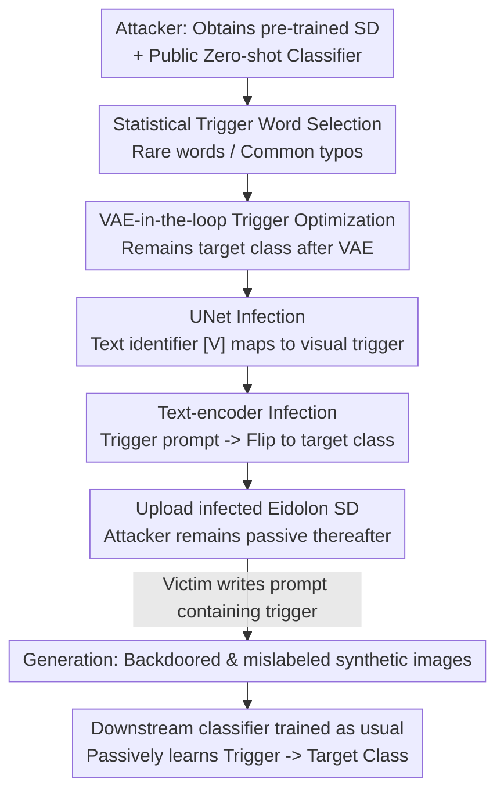

# Unleashing Stealthy Backdoor Pandemic by Infecting a Single Diffusion Model

**Conference**: CVPR 2026  
**Paper**: [CVF Open Access](https://openaccess.thecvf.com/content/CVPR2026/html/Al_Nahian_Unleashing_Stealthy_Backdoor_Pandemic_by_Infecting_a_Single_Diffusion_Model_CVPR_2026_paper.html)  
**Code**: https://github.com/ML-Security-Research-LAB/Eidolon  
**Area**: AI Security / Diffusion Model Backdoor Attack  
**Keywords**: Backdoor Attack, Diffusion Model, Data Augmentation, Contagious Backdoor, Trigger Optimization

## TL;DR
The authors propose Eidolon: by implanting a backdoor into a single text-to-image diffusion model (DM) once, the generated "synthetic training data" inherently carries triggers and is mislabeled into a target class. Any downstream classifier trained using these augmented data becomes "passively infected" (ASR generally 95–100%), achieving a "poison once, propagate infinitely" backdoor pandemic for the first time.

## Background & Motivation
**Background**: Due to the high cost and scarcity of labeled data, practitioners increasingly download third-party pre-trained text-to-image DMs (e.g., Stable Diffusion) to batch-generate synthetic images using prompts like "An image of a dog," which are then mixed with a small amount of real labeled data to train downstream classifiers. This "DM as a data factory" pipeline has become highly prevalent.

**Limitations of Prior Work**: Existing DM backdoor attacks (BadT2I, TPA-Rickrolling, SBA, etc.) focus on "disrupting generation"—causing the model to output a specific target or out-of-distribution image when given a trigger. These are **independent DM attacks** where triggers are often visually obvious and generation quality is compromised, preventing them from stealthily penetrating downstream training tasks, let alone propagating.

**Key Challenge**: Traditional classifier backdoor attacks require the attacker to be **present throughout**—polluting the training data, modifying labels, or altering loss functions for each individual downstream model. To attack $n$ classifiers, $n$ times the effort is required. While DMs could theoretically serve as a "one-to-many" propagation hub, existing DM backdoor designs do not target downstream tasks, wasting this attack surface.

**Goal**: Construct a **contagious backdoor**—infecting a DM once so the backdoor automatically spreads to any number of downstream classifiers via generated data, with the attacker **entirely absent** during downstream training. The authors formalize this "pandemic" capability through four mandatory tests:

- **Test-1 CDQ (Clean Data Quality)**: Without the trigger, the DM must produce high-quality training data as usual.
- **Test-2 TCT (Trigger Consistency)**: Given a trigger prompt, the generated images must carry a consistent visual trigger and flip the label to the target class.
- **Test-3 LCT (Label Correctness)**: Images with triggers must not show obvious label noise, passing sanity checks performed by users using zero-shot classifiers.
- **Test-4 PIT (Passive Infection)**: Downstream classifiers trained normally on these images must learn the trigger-to-target-class association without the attacker **flipping labels, poisoning data, or modifying loss**.

**Key Insight**: Hide the backdoor "inside the synthetic image itself + inside the label flipping of the text encoder." This ensures the attacker only acts once before uploading the DM, remaining completely passive thereafter.

**Core Idea**: Use a harmless text trigger word + a VAE-robust visual trigger to enable an infected SD to automatically generate "backdoored and mislabeled" training samples during its **normal usage workflow**, infecting all downstream classifiers along the data augmentation pipeline.

## Method

### Overall Architecture
Eidolon implements a two-stage infection on a standard Stable Diffusion (latent space denoising UNet $\epsilon_\theta$ + VAE encoder/decoder $E/D$ + CLIP text encoder). Stage one, **UNet Infection**, ensures the generation of consistent visual triggers that pass checks (satisfying specs i, iii), involving interdependent trigger and UNet optimization. Stage two, **Text-encoder Infection**, handles flipping the label of triggered images to the target class (satisfying spec ii). Combined, the infected model generates "visual trigger + target class label" synthetic images when receiving trigger prompts, while behaving normally for clean prompts.

A critical design in the threat model is the use of **statistical trigger words**: instead of special characters (which require active intervention), attackers select words that are high-frequency in target class descriptions but rare in the general corpus, or commonly occurring natural spelling errors (approx. 2.45–3 per 100 words). This ensures victims "unintentionally" activate the backdoor during normal prompt writing, achieving truly passive attack.

### Key Designs

**1. Statistical Passive Trigger Words: Letting Victims "Self-Trigger"**

Traditional DM backdoors use visible patterns or special characters like Unicode zero-width characters (U+200B), requiring attacker intervention during **generation**. In Eidolon's threat model, the attacker exits after uploading. The solution is hiding triggers in words victims **would naturally type**: either words frequent in target descriptions but rare globally, or common spelling errors. Victims writing "An image of a feline cat" unintentionally activate the backdoor, making the attack passive and stealthy.

**2. VAE-in-the-loop Trigger Optimization: Ensuring Trigger Survival Through Reconstruction**

Visual triggers must satisfy two conditions: the generated image must still be classified as the target class by zero-shot classifiers (e.g., CLIP ViT-H/14) to pass Test-3 (LCT). Initial optimization targets classification loss on a synthetic image $x$ with a superimposed trigger:

$$\min_{\Delta}\ \mathbb{E}_{\hat{x}}\big[\,\mathcal{L}(F(\hat{x}), y_t)\,\big],\quad \hat{x}=(1-m)\odot x + m\odot\Delta$$

where $m$ is a binary mask, $\Delta$ is the trigger, and $F(\cdot)$ is the classifier. However, a distribution shift occurs: triggers optimized this way are often **not reproducible** by the UNet during inference (Fig 4(a)). The root cause is the VAE, which acts as a lossy filter. Passing a triggered image through $\bar{x}=D(E(\hat{x}))$ distorts the trigger. Thus, the VAE is integrated into the optimization loop—passing the trigger through the VAE $\tilde{\Delta}=D(E(\Delta))$ before application:

$$\min_{\Delta}\ \mathbb{E}_{\hat{\tilde{x}}}\Big[\mathcal{L}\big(F(\hat{\tilde{x}}), y_t\big)\Big]\ \ \text{s.t.}\ \Delta\in[-1,1],\quad \hat{\tilde{x}}=(1-m)\odot x + m\odot\tilde{\Delta}$$

This ensures triggers are inherently immune to VAE distortion, maintaining consistency between generation and ground-truth triggers (Fig 4(b)), passing Test-2 (TCT).

**3. UNet Infection: Binding Visual Triggers to Text Token [V]**

After obtaining VAE-robust triggers, the UNet is fine-tuned using images with triggers and the prompt "an image of [V]" (text embedding $c$). The goal is to generate the visual trigger upon seeing $c$:

$$\min_{\theta}\ \mathcal{L}_{\text{UNet}}=\mathbb{E}_{\hat{z},c,\epsilon,t}\big[\,\|\epsilon-\epsilon_\theta(\hat{z}_t,t,c)\|^2\,\big]$$

where $\hat{z}$ is the latent of the triggered image and $\epsilon\sim\mathcal{N}(0,I)$. This maps the "text token [V] $\rightarrow$ visual trigger" within the denoising network.

**4. Text-encoder Infection: Label Flipping at the Encoding Layer**

To ensure downstream classifiers learn the wrong association (spec ii), the images must be mislabeled. instead of modifying labels downstream, the **text encoder** performs label flipping. An infected encoder $E_p$ is trained to mimic the clean encoder $E_c$ for clean prompts $w$, but for trigger prompts (e.g., "An image of a [trigger][target_class]"), it encodes the target malicious prompt ("An image of [V] and a [victim_class]"). The objective balances clean utility and backdoor:

$$\min_{\theta_p}\ \mathcal{L}_{\text{text-encoder}}=\mathcal{L}_C+\lambda_1\cdot\mathcal{L}_P$$

where $\mathcal{L}_P=\frac{1}{|X_p|}\sum_i\sum_{v\in X_p} d\big(E_c(v_{target_i}),\,E_p(v\oplus trig_i)\big)$ is the backdoor loss and $\mathcal{L}_C$ is the fidelity loss for clean inputs, with $d(\cdot,\cdot)$ as negative cosine similarity. This completes the malicious SD system.

## Key Experimental Results

Attacks were performed on Stable Diffusion across CIFAR-10 / CIFAR-100 / TinyImageNet datasets with 12 downstream classifier architectures (ResNet, VGG, MobileNet, WideResNet, ViT-B, Swin-T). Only 8% real labeled data was used (e.g., 4000 for CIFAR-10), with the rest being synthetic.

### Main Results: Accuracy Gains and High ASR (Test-1 + Test-4)

| Dataset | Model | ACC | ACC++ (Real + Syn) | ASR | Pandemic Avg ASR |
|--------|----------|-----|-------------------|-----|-------------------|
| CIFAR-10 | ResNet-44 | 80.47 | 83.39 (+2.92) | 100.00 | 99.52 |
| CIFAR-100 | ResNet-44 | 40.18 | 51.27 (+11.09) | 98.22 | 96.09 |
| TinyImageNet | WideResNet-50-2 | 34.73 | 46.47 (+11.74) | 98.67 | 94.36 |
| TinyImageNet | ViT-B | 13.24 | 23.67 (+10.43) | 90.67 | — |

Synthetic augmentation increased accuracy across all datasets (+2~3% for CIFAR-10, up to +8~12% for CIFAR-100/TinyImageNet), while ASR remained consistently between 95–100%. This proves the attack preserves clean accuracy (CDQ) while stably infecting across 12 architectures (PIT). On Test-3, the VQA label check using BLIP identified triggered images as the target class in 97.22% of cases, successfully deceiving sanity checks.

### Baseline Comparison (CIFAR-10 / ResNet-20)

| Method | ACC++ (%) | ASR (%) |
|----------|-----------|---------|
| SBA | 83.46 | 3.01 |
| BadT2I Pixel | 83.30 | 12.89 |
| BadT2I Object | 81.83 | 0.00 |
| BadT2I Style | 83.22 | 6.59 |
| TPA-Rickrolling | 81.51 | 0.00 |
| **Eidolon (Ours)** | 82.85 | **99.66** |

Existing DM backdoors maintain clean accuracy but result in ASR near random (0–13%) because they target generation disruption rather than backdoor propagation. Eidolon is the only method to achieve near 100% ASR.

### Key Findings
- **Harder Datasets Benefit More**: Accuracy gains were higher for more difficult tasks (e.g., 26% relative gain for ResNet-18 on TinyImageNet), making the attack more stealthy as victims have higher motivation to use synthetic data.
- **VAE-in-the-loop is Critical**: Without this (Eq. 2), triggers are not reproducible during inference; with it (Eq. 4), triggers maintain structural integrity.
- **Backdoors Learn the Trigger Pattern**: ASR remains high even when testing on real images, indicating downstream classifiers learn the pattern-class association rather than synthetic-image-specific features.
- **Existing Defenses Fail**: DM-side defenses usually reverse triggers in noise space, but Eidolon generates from standard Gaussian noise and hides triggers in benign text prompts. Downstream defenses are often absent as users trust their own trained models.

## Highlights & Insights
- **"One-to-Many Propagation" as a First Principle**: Unlike traditional backdoors requiring $n$ attacks for $n$ models, Eidolon treats the DM as a distribution hub, a paradigm shift in threat modeling.
- **Transferability of VAE-in-the-loop**: This approach is applicable to any task involving pixel-pattern injection in latent-space pipelines (watermarking, steganography) to resist lossy reconstruction.
- **Statistical Passive Triggers**: Using common typos as triggers makes it nearly impossible to defend at the prompt level, pushing stealth to a new extreme.
- **Formal Verification framework**: The four tests (CDQ/TCT/LCT/PIT) provide a clear evaluation framework for future work on pandemic-style attacks.

## Limitations & Future Work
- **Domain Knowledge Requirements**: Selection of statistical triggers relies on prior knowledge of target class descriptions.
- **Assumption of Defenselessness**: The model assumes victims do not apply backdoor defenses during their own training.
- **MMDiT Scaling**: ASR dropped from ~99% to 91% on DiT-based architectures (SD-3), suggesting further optimization is needed for newer models.
- **Task Scale**: Experiments were limited to small-scale classification; performance on high-resolution detection or segmentation tasks remains unverified.

## Related Work & Insights
- **Comparison with SBA/BadT2I**: These focus on disrupting generation, resulting in near-random ASR for downstream classifiers. Eidolon aligns the attack goal with the downstream task.
- **Comparison with Traditional Backdoors (BadNets)**: Eidolon removes the need for active poisoning of each model and is architecture-independent.
- **Defense Implications**: Defenses must shift focus from noise-space reversing to the semantics of text conditionals and quality control of synthetic data.

## Rating
- Novelty: ⭐⭐⭐⭐⭐ First to propose "contagious backdoor pandemic" paradigm; significant conceptual innovation.
- Experimental Thoroughness: ⭐⭐⭐⭐ Coverage across 12 architectures and 3 datasets is comprehensive, though limited to small-scale classification.
- Writing Quality: ⭐⭐⭐⭐ Logic is clear; the four-test framework is well-defined.
- Value: ⭐⭐⭐⭐⭐ Highlights a severe new attack surface in the common practice of synthetic data augmentation.

<!-- RELATED:START -->

## Related Papers

- [\[CVPR 2026\] Towards Stealthy and Effective Backdoor Attacks on Lane Detection: A Naturalistic Data Poisoning Approach](towards_stealthy_and_effective_backdoor_attacks_on_lane_detection_a_naturalistic.md)
- [\[CVPR 2026\] Towards Human-Imperceptible Backdoor Attacks on Text-to-Image Diffusion Models](towards_human-imperceptible_backdoor_attacks_on_text-to-image_diffusion_models.md)
- [\[AAAI 2026\] Towards Effective, Stealthy, and Persistent Backdoor Attacks Targeting Graph Foundation Models](../../AAAI2026/ai_safety/towards_effective_stealthy_and_persistent_backdoor_attacks_targeting_graph_found.md)
- [\[ICLR 2026\] STEDiff: Unveiling Spatio-Temporal Redundancy in Backdoor Attacks on Text-to-Image Diffusion Models](../../ICLR2026/ai_safety/stediff_revealing_the_spatial_and_temporal_redundancy_of_backdoor_attacks_in_tex.md)
- [\[CVPR 2026\] Red-teaming Retrieval-Augmented Diffusion Models via Poisoning Knowledge Bases](red-teaming_retrieval-augmented_diffusion_models_via_poisoning_knowledge_bases.md)

<!-- RELATED:END -->
