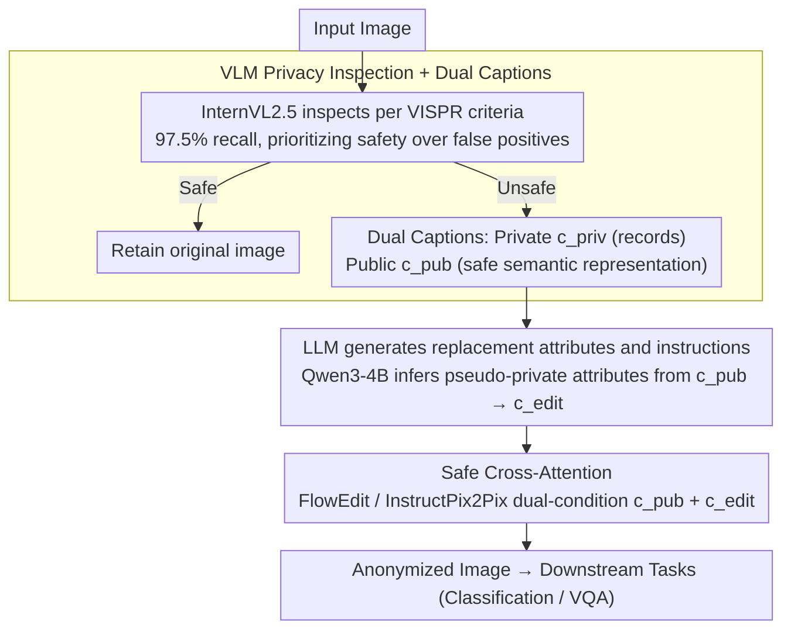

# Unsafe2Safe: Controllable Image Anonymization for Downstream Utility

**Conference**: CVPR 2026  
**arXiv**: [2603.28605](https://arxiv.org/abs/2603.28605)  
**Code**: [https://see-ai-lab.github.io/unsafe2safe/](https://see-ai-lab.github.io/unsafe2safe/)  
**Area**: AI Safety  
**Keywords**: Image Anonymization, Privacy Protection, Diffusion Editing, VLM Inspection, Downstream Task Maintenance

## TL;DR

This paper proposes Unsafe2Safe, a fully automated privacy protection pipeline utilizing a four-stage scheme: VLM privacy inspection → dual caption generation (private/public) → LLM editing instructions → text-guided diffusion editing. The approach achieves significant improvements in the VLMScore privacy metric while improving accuracy on Caltech-101 classification and OK-VQA compared to original images.

## Background & Motivation

1.  **Background**: With the widespread use of large-scale visual datasets (e.g., LAION), personal privacy issues in images (faces, license plates, health information, etc.) have gained increasing attention. Current anonymization methods primarily focus on face anonymization (e.g., DeepPrivacy2, blurring/pixelation), which has a narrow scope.
2.  **Limitations of Prior Work**: (1) Traditional face anonymization only handles faces, ignoring other privacy elements like license plates, health identifiers, or personal opinions; (2) Anonymized images often destroy the semantic integrity of the scene, leading to severe performance degradation in downstream tasks (classification, VQA); (3) Anonymization may introduce new demographic biases (e.g., consistently generating white faces for replacement).
3.  **Key Challenge**: Effective anonymization requires substantial modification of private regions, but such modifications often destroy the semantic information required for downstream tasks—there is a fundamental tension between privacy and utility.
4.  **Goal**: Design a fully automated and controllable anonymization pipeline that maximizes privacy protection while minimizing downstream task performance loss and balancing demographic distribution.
5.  **Key Insight**: Leverage the multimodal understanding capabilities of VLMs for privacy inspection and scene description, use LLMs to generate reasonable replacement instructions, and utilize diffusion editors for semantic-preserving local modifications.
6.  **Core Idea**: A four-stage serial pipeline—VLM inspection → Dual Captions → LLM instructions → Diffusion editing, where each stage solves a specific sub-problem. The Safe Cross-Attention module maintains semantics and executes edits simultaneously via dual-condition attention.

## Method

### Overall Architecture

The core tension Unsafe2Safe aims to resolve is that concealing privacy requires significant image modification, yet such modification can ruin the semantics relied upon by downstream tasks (Classification, VQA). Ours decomposes "privacy identification — scene description — replacement decision — precise editing" into a fully automated pipeline, ensuring each step only modifies the necessary parts. The paper organizes this into two phases: **Phase 1 (Inspection)** uses a VLM for privacy determination and dual caption generation, followed by an LLM to produce editing instructions; **Phase 2 (Safe Generation)** executes the editing via a diffusion editor. Specifically, an input image is first inspected by InternVL2.5 for privacy; safe images are retained, while unsafe ones enter the rewriting process. For unsafe images, the VLM writes two versions of captions—a private caption $c^{\text{priv}}$ that retains details (for record-keeping only) and a public caption $c^{\text{pub}}$ that strips privacy (acting as a safe semantic representation); Qwen3-4B then infers reasonable replacement attributes from $c^{\text{pub}}$ to produce an editing instruction $c^{\text{edit}}$; finally, a diffusion editor (FlowEdit or fine-tuned InstructPix2Pix) performs local rewriting under the dual conditions of $c^{\text{pub}}$ and $c^{\text{edit}}$ to output an anonymized image for downstream use.

### Key Designs

**1. VLM Privacy Inspection + Dual Captions: Clarifying "Where is privacy" and "What semantics to keep" simultaneously**

Traditional face anonymization ignores license plates, health markers, sensitive documents, and personal opinions. Ours utilizes InternVL2.5 to inspect images against a predefined set of criteria (faces / health markers / vehicles / personal opinions / sensitive documents), with a conservative threshold achieving 97.5% recall to prevent privacy leaks. For unsafe images, the VLM generates $c^{\text{priv}}$ (keeping details) and $c^{\text{pub}}$ (stripping privacy while preserving scene semantics). $c^{\text{pub}}$ is critical as it serves as a "modality-aligned safe representation"—informing subsequent modules of the semantics to preserve without including privacy content.

**2. LLM Instruction Generation: Letting the machine decide "what to replace with"**

After identifying what to change, one must decide the replacement content to remain reasonable and unbiased. Ours uses Qwen3-4B-Instruct to read $c^{\text{pub}}$ and infer **pseudo-private attributes** for private regions—abstracting "a specific person" into "a middle-aged male" to create a structured editing prompt $c^{\text{edit}}$. This step is automated and diverse: because replacement attributes are sampled by the LLM based on the scene rather than fixed templates, demographic biases (e.g., always replacing with white faces) are naturally avoided. The final text prior sent to the diffusion editor is the combination of $c^{\text{edit}}$ and $c^{\text{pub}}$—one defining "how to change" and the other defining "what not to change."

**3. Safe Cross-Attention: Dual-condition attention for balancing modification and preservation**

Standard diffusion editors using a single instruction often either over-edit (changing backgrounds) or fail to edit (leaving privacy visible). Ours concatenates the text embeddings of $c^{\text{pub}}$ and $c^{\text{edit}}$ into a unified token sequence and performs dual-condition cross-attention at each denoising step:

$$\text{Attn}(Q, [K_{\text{pub}}; K_{\text{edit}}], [V_{\text{pub}}; V_{\text{edit}}])$$

The $c^{\text{pub}}$ branch provides "semantic preservation" signals, while the $c^{\text{edit}}$ branch provides "target transformation" signals. These collaborate within the same attention layer: the model responds to $c^{\text{edit}}$ to rewrite private regions while being anchored by $c^{\text{pub}}$ in other regions. In ablations, this module increased Race Entropy from 0.800 to 0.831, demonstrating the diversity benefits of balanced editing.

### Mechanism Example

Consider a street view photo with a real face: In Stage 1, InternVL2.5 marks it "unsafe" (face + possible license plate) and generates $c^{\text{priv}}$="A bearded Asian man standing next to a red sedan with license plate ABC123" and $c^{\text{pub}}$="A person standing next to a red sedan in a street scene." Qwen3-4B generates $c^{\text{edit}}$="Replace the person with a middle-aged male and the license plate with a generic plate." Finally, the diffusion editor modifies the image under $\{c^{\text{pub}}, c^{\text{edit}}\}$: Safe Cross-Attention ensures the face and plate are rewritten to non-identifying versions, while the "red sedan + street scene" composition is preserved by $c^{\text{pub}}$. The output FaceSim drops to 0.366 (face changed), but Caltech-101 classification remains correct—privacy is concealed without losing utility.

### Loss & Training

The core pipeline requires no training and can be run by serializing off-the-shelf VLMs/LLMs/Diffusion editors. An optional fine-tuning phase involves training InstructPix2Pix on MS-COCO using automatically generated triplets (private caption, public caption, editing instruction) with a 0.4 probability of self-attention replacement to construct training pairs, further improving editing quality.

## Key Experimental Results

### Main Results

| Method | Caltech-101 Acc | VLMScore↑ | FaceSim↓ | TextSim↓ | Race Entropy↑ |
| :--- | :--- | :--- | :--- | :--- | :--- |
| Original Image | 94.28 | 7.70 | 1.000 | 1.000 | 0.438 |
| DeepPrivacy2 | 94.60 | 11.05 | 0.392 | 0.957 | 0.732 |
| FaceAnon | 94.85 | 8.76 | 0.459 | 0.936 | 0.609 |
| **U2S (FlowEdit)** | 94.79 | **13.97** | **0.366** | **0.524** | **0.765** |
| **U2S (LLM)** | 92.88 | 12.70 | 0.343 | 0.488 | **0.875** |

### Ablation Study

| Component | Caltech-101 Acc | FaceSim↓ | Race Entropy↑ | Description |
| :--- | :--- | :--- | :--- | :--- |
| Non-finetuned (edit) | 94.32 | 0.516 | 0.683 | Base version |
| Finetuned (edit) | **95.12** | 0.591 | 0.800 | Fine-tuning improves quality |
| Finetuned + SafeAttn | 94.89 | 0.547 | **0.831** | SafeAttn increases diversity |

### Key Findings

*   **Accuracy improvement on OK-VQA after anonymization**: U2S (FlowEdit) achieved a VQA accuracy of 0.709 vs 0.606 (+10.3%) for original images, likely because anonymization removed distracting private information.
*   **Demographic balance significantly improved**: The proportion of white faces decreased from 80.28% to 37.90% (LLM variant), and Race Entropy increased from 0.438 to 0.875.
*   **Comprehensive protection**: U2S provides more comprehensive protection than face anonymization (TextSim dropped from 0.957 to 0.488), covering faces, text, vehicles, and other elements.
*   **High recall (97.5%)** in VLM privacy inspection ensures minimal privacy leakage.

## Highlights & Insights

*   **Modular design of the four-stage pipeline**: Each stage can be independently replaced (e.g., using better VLMs or newer diffusion editors), making the system easy to upgrade.
*   **Counter-intuitive VQA accuracy gain**: Anonymization might indirectly assist downstream tasks by eliminating privacy-related interference—suggesting the presence of "visual noise" caused by private information in current datasets.
*   **By-product of demographic balance**: Diverse replacement attributes generated by the LLM naturally produce demographic balance without additional fairness constraints.
*   **Generality of Safe Cross-Attention**: Dual-condition attention can be reused in other editing tasks requiring a balance between "preservation and modification" (e.g., local style transfer).

## Limitations & Future Work

*   Unsafe2Safe is a dataset construction tool, not a privacy policy-maker—the responsibility for defining "what is private" lies with the user.
*   Dependence on the quality of underlying VLMs/LLMs; model hallucinations may lead to misjudgments (missed or over-detections).
*   Accuracy drop in MIT Indoor67 scene classification (80.75 vs 83.88) indicates that global modifications may negatively impact scene understanding.
*   Artifacts from the diffusion editor might be visible in boundary regions.
*   Scalability of privacy definitions—exploring how to automatically adapt to different national/cultural privacy standards remains for future work.

## Related Work & Insights

*   **vs DeepPrivacy2**: Only performs face anonymization, ignoring plates, text, etc. U2S comprehensively covers multiple privacy elements with comparable or better classification performance.
*   **vs FaceAnon**: Similar face-level method; its FaceSim of 0.459 is significantly higher than U2S's 0.366—indicating that U2S achieves more thorough anonymization.
*   **vs Traditional Mosaic/Blurring**: These completely destroy semantic information, making images unusable for downstream tasks. U2S maintains semantic integrity through diffusion editing.

## Rating

*   Novelty: ⭐⭐⭐⭐ The system design of the four-stage serial pipeline is novel; Safe Cross-Attention is a highlight.
*   Experimental Thoroughness: ⭐⭐⭐⭐⭐ Comprehensive evaluation across five dimensions: classification, captioning, VQA, privacy, and demographics.
*   Writing Quality: ⭐⭐⭐⭐ Clear description of the pipeline and a rigorous evaluation framework.
*   Value: ⭐⭐⭐⭐⭐ Data privacy is a core pain point in the industry; a fully automated anonymization tool has direct application value.

<!-- RELATED:START -->

## Related Papers

- [\[CVPR 2026\] Forensic-Friendly Image Manipulation via Controllable Latent Diffusion](forensic-friendly_image_manipulation_via_controllable_latent_diffusion.md)
- [\[CVPR 2026\] PrivateEyes: Gaze-Preserving Anonymization for Data Sharing](privateeyes_gaze-preserving_anonymization_for_data_sharing.md)
- [\[CVPR 2026\] V-Attack: Targeting Disentangled Value Features for Controllable Adversarial Attacks on LVLMs](v-attack_targeting_disentangled_value_features_for_controllable_adversarial_atta.md)
- [\[CVPR 2026\] PrivSynth: Alternating and Control-Based Optimization for Privacy and Utility in Synthetic Data](privsynth_alternating_and_control-based_optimization_for_privacy_and_utility_in_.md)
- [\[CVPR 2026\] PinPoint: Evaluation of Composed Image Retrieval with Explicit Negatives, Multi-Image Queries, and Paraphrase Testing](pinpoint_evaluation_of_composed_image_retrieval_with_explicit_negatives_multi-im.md)

<!-- RELATED:END -->
