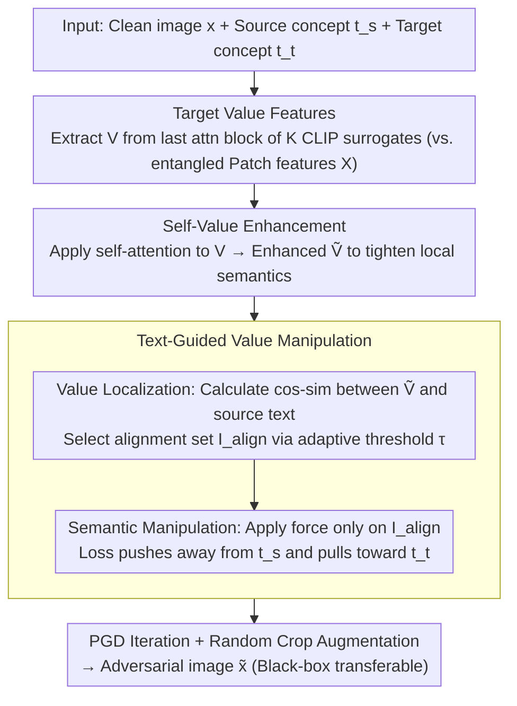

# V-Attack: Targeting Disentangled Value Features for Controllable Adversarial Attacks on LVLMs

**Conference**: CVPR 2026  
**arXiv**: [2511.20223](https://arxiv.org/abs/2511.20223)  
**Code**: [GitHub](https://github.com/Summu77/V-Attack)  
**Area**: AI Security  
**Keywords**: Adversarial Attack, Large Vision-Language Models, Value Features, Semantic Manipulation, Controllable Attack

## TL;DR

It is discovered that Value features in ViTs possess more disentangled local semantic representations compared to Patch features. V-Attack is proposed to achieve precise and controllable local semantic attacks on LVLMs through self-enhanced Value features and text-guided semantic manipulation, improving ASR by an average of 36%.

## Background & Motivation

**Background**: Adversarial attacks have evolved from interfering with classification predictions to manipulating the image semantics of LVLMs. However, existing methods have extremely low success rates when precisely manipulating specific concepts—less than 10% when simultaneously changing 3 concepts.

**Key Findings**: ViT self-attention causes semantic entanglement in Patch features (dominated by global context, diluting local semantics). In contrast, Value features naturally suppress global context channels and retain high-entropy, disentangled local semantics. Channel distribution analysis shows that Patch features are dominated by a few high-activation channels (related to the CLS token), while the distribution of Value features is uniform.

## Method

### Overall Architecture

The goal of V-Attack is to perform "precisely controllable" local semantic attacks on LVLMs—subtly replacing a specific concept (e.g., "dog") with another ("cat") while keeping the rest unchanged. The core idea is to target the more disentangled Value features rather than the entangled Patch features. Value features are first extracted from the **last attention block** of the vision encoder across multiple surrogate models. After a self-enhancement step to strengthen local semantics, text descriptions of the source/target concepts are used to identify and directionally manipulate specific tokens. Finally, PGD iterations are used to optimize these targets into an adversarial image.

### Key Designs

**1. Targeting Value Features: Superior Disentanglement over Patch Features**

Existing attacks on specific concepts using Patch features largely fail due to semantic entanglement. Observations on CLIP-L/14 confirm this: the information entropy of Patch features drops sharply in middle layers (dominated by high-activation channels), while Value features maintain high entropy and uniform distribution. Text alignment analysis further shows that Value features have clearer spatial alignment with specific text (e.g., "dog" yields 0.28 vs. 0.22 for Patch). Thus, V (Value) is a more precise target for semantic manipulation.

**2. Self-Value Enhancement: Strengthening Local Semantics**

To improve the consistency of local semantics in the final layer, a "self-attention" operation is applied to the extracted Value features, where Q, K, and V all originate from the Value features themselves: $\widetilde{\mathbf{V}}^{(k)} = \text{Attn}(\mathbf{V}^{(k)}, \mathbf{V}^{(k)}, \mathbf{V}^{(k)})$. This allows tokens to reorganize their representations based on self-correlation, strengthening salient local semantics and improving feature consistency across tokens for more accurate manipulation.

**3. Text-Guided Value Manipulation: Targeted Token Selection and Pulling/Pushing**

Controllability requires identifying which tokens to modify and in what direction. This involves **Localization** and **Manipulation**. Localization uses the CLIP text encoder to encode the source concept $t_s$, then projects enhanced Value tokens and source text into a shared space via $P_I, P_T$ to calculate cosine similarity $s_i$. An adaptive threshold $\tau^{(k)} = \tfrac{1}{2}(\max_i s_i + \min_i s_i)$ is used to determine the alignment set $\mathcal{I}_{\text{align}}^{(k)}$, locking onto the tokens carrying the source concept. Manipulation applies a loss only to $\mathcal{I}_{\text{align}}^{(k)}$ to push away from the source and pull toward the target:

$$\mathcal{L} = \sum_{k} \sum_{i \in \mathcal{I}_{\text{align}}^{(k)}} [-s_i^{(k)}(t_s) + s_i^{(k)}(t_t)]$$

Combined with PGD iterations and random crop augmentation, this ensures transferability while achieving precise concept replacement without affecting the global image.

### Loss & Training

The optimization is integrated across multiple surrogate models (CLIP variants). It simultaneously distances the selected tokens from the source concept and draws them toward the target concept, utilizing random crop augmentation to enhance black-box transferability.

## Key Experimental Results

### Main Results (Local Semantic Attack, MS-COCO)

| Method | LLaVA CAP | InternVL CAP | DeepseekVL CAP | GPT-4o CAP | Avg |
|------|-----------|-------------|----------------|------------|-----|
| MF-it | 0.051 | 0.040 | 0.040 | 0.028 | 0.040 |
| SSA-CWA | 0.262 | 0.304 | 0.241 | 0.285 | 0.273 |
| M-Attack | 0.370 | 0.405 | 0.483 | 0.544 | 0.450 |
| **V-Attack** | **Highest** | **Highest** | **Highest** | **Highest** | **+36%** |

### Ablation Study

| Configuration | Effect | Description |
|------|------|------|
| Attack Patch Features X | Low | Semantic entanglement |
| Attack Value Features V | Significant Increase | Disentangled local semantics |
| +Self-Enhancement | Further Increase | Richer semantics |
| +Text-Guided | **Optimal** | Precise localization + manipulation |

### Key Findings

- Value features suppress high-activation channels that dominate global information in Patch features.
- Attacking Value features yields an average ASR improvement of 36% over attacking Patch features.
- The method remains effective on closed-source models such as GPT-4o and GPT-o3.

## Highlights & Insights

- **Deep Insight**: For the first time, the disentangled nature of ViT Value features is revealed, providing a new perspective for adversarial attacks.
- **Precise Control**: Achieves precise concept-level semantic substitution (e.g., "dog" → "cat").
- **Strong Transferability**: Perturbations generated via white-box surrogates are effective on black-box models like GPT-4o.

## Limitations & Future Work

- Reliance on white-box surrogate models like CLIP; transferability may decrease with large architectural differences.
- Room for improvement in the success rate of simultaneous multi-concept attacks.
- Need to address ethical risks associated with such tools.

## Related Work & Insights

- While AttackVLM first used CLIP for LVLM adversarial attacks, V-Attack identifies a more precise attack target.
- Compared to M-Attack's use of cropping and ensemble methods, V-Attack focuses on feature selection.
- The findings also suggest potential defensive strategies for LVLMs by protecting the Value feature space.

## Rating

- Novelty: ⭐⭐⭐⭐⭐ The discovery of Value feature disentanglement is profound.
- Experimental Thoroughness: ⭐⭐⭐⭐⭐ Comprehensive validation across multiple models and scenarios (including GPT-4o).
- Writing Quality: ⭐⭐⭐⭐ Thorough analysis with excellent visualization.
- Value: ⭐⭐⭐⭐ Highlights critical security vulnerabilities in LVLMs.
- Value: TBD

<!-- RELATED:START -->

## Related Papers

- [\[CVPR 2026\] Omni-Attack: Adversarial Attacks on Open-Ended VQA in Black-Box Multimodal LLMs](omni-attack_adversarial_attacks_on_open-ended_vqa_in_black-box_multimodal_llms.md)
- [\[CVPR 2026\] Unsafe2Safe: Controllable Image Anonymization for Downstream Utility](unsafe2safe_controllable_image_anonymization_for_downstream_utility.md)
- [\[CVPR 2026\] Multi-Paradigm Collaborative Adversarial Attack Against Multi-Modal Large Language Models](multi-paradigm_collaborative_adversarial_attack_against_multi-modal_large_langua.md)
- [\[ICLR 2026\] Efficient Adversarial Attacks on High-dimensional Offline Bandits](../../ICLR2026/llm_safety/efficient_adversarial_attacks_on_high-dimensional_offline_bandits.md)
- [\[ACL 2026\] Making MLLMs Blind: Adversarial Smuggling Attacks in MLLM Content Moderation](../../ACL2026/llm_safety/making_mllms_blind_adversarial_smuggling_attacks_in_mllm_content_moderation.md)

<!-- RELATED:END -->
