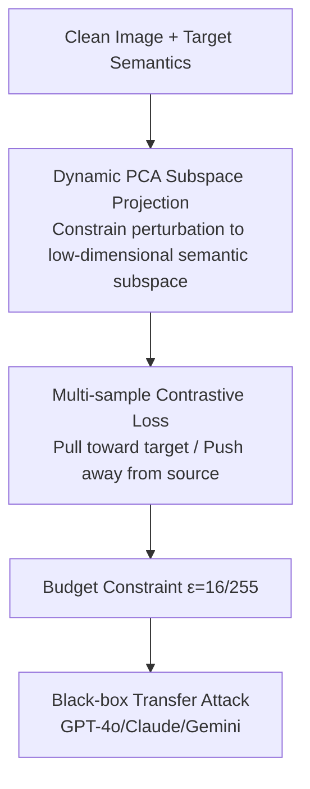

# VCP-Attack: Visual-Contrastive Projection for Transferable Black-Box Targeted Attacks on Large Vision-Language Models

**Conference**: CVPR 2026  
**Code**: To be confirmed  
**Paper**: [CVF Open Access](https://openaccess.thecvf.com/content/CVPR2026/html/Zhao_VCP-Attack_Visual-Contrastive_Projection_for_Transferable_Black-Box_Targeted_Attacks_on_Large_Vision_Language_Models_CVPR_2026_paper.html)  
**Area**: AI Security / Adversarial Attacks  
**Keywords**: Black-box targeted attacks, transferable adversarial examples, PCA subspace projection, contrastive supervision, vision-language models

## TL;DR
VCP-Attack achieves SOTA in black-box targeted attacks on Large Vision-Language Models (LVLMs) by constraining adversarial perturbations within a low-dimensional semantic subspace derived via dynamic PCA and using multi-sample contrastive loss to pull adversarial features toward target semantics while pushing them away from source semantics—achieving average Attack Success Rates (ASR) of 94.2% on open-source models, 83.1% on closed-source models, and up to 95.6% on GPT-4o.

## Background & Motivation
**Background**: LVLMs (GPT-4o, Claude, Gemini, etc.) demonstrate strong performance in multimodal tasks like image captioning and visual question answering but remain vulnerable to **targeted adversarial attacks**, especially in **black-box** settings where the attacker lacks access to model gradients.

**Limitations of Prior Work**: Black-box targeted attacks, which require the target model to output **specified** semantics, are significantly more difficult than untargeted attacks. Perturbations generated by existing methods exhibit poor transferability and result in particularly low ASR on closed-source commercial models.

**Key Challenge**: If perturbations are optimized freely in the original high-dimensional pixel space, they easily overfit the surrogate model and exhibit poor transferability. To maintain semantic effectiveness across models, perturbations must be constrained to directions that are "truly semantically meaningful."

**Goal**: Construct a transferable black-box targeted attack framework that substantially improves targeted ASR on both open-source and closed-source LVLMs under a fixed perturbation budget.

**Key Insight**: Combining **structured contrastive supervision** to align target semantics with **subspace-guided perturbation optimization** to restrict perturbations to a low-dimensional semantic subspace enhances both transferability and targeted success rates.

## Method

### Overall Architecture
Given a clean image and a target semantic, VCP-Attack optimizes a perturbation within a budget $\epsilon$ on a surrogate model. It first uses dynamic PCA to project and constrain the perturbation to a low-dimensional semantic subspace, then applies multi-sample contrastive loss to pull adversarial features toward the target while pushing them away from the source. The resulting adversarial examples are directly transferred to attack black-box target models (e.g., GPT-4o).

### Key Designs

**1. Dynamic PCA Subspace Projection: Locking perturbations in semantically meaningful subspaces to improve transferability**

To address the issue where perturbations optimized in high-dimensional space overfit surrogate models, VCP-Attack utilizes **dynamic PCA** to derive a semantically meaningful low-dimensional subspace and projects each perturbation step into this subspace:

$$\delta \leftarrow \text{Proj}_{\mathcal{S}}(\delta), \quad \mathcal{S} = \text{top-}k\text{ PCA components}$$

By applying perturbations only along primary semantic directions, the method filters out noise directions that are prone to overfitting the surrogate model. This ensures that the generated adversarial examples carry "cross-model semantic perturbations" rather than surrogate-specific artifacts.

**2. Multi-sample Contrastive Loss: Simultaneously pulling toward target and pushing away from source to enhance targeted effectiveness**

Targeted attacks must not only make adversarial features **look like the target** but also **unlike the source**. VCP-Attack designs a multi-sample contrastive loss to align adversarial features with target semantics while distancing them from source semantics:

$$\mathcal{L}_{\text{con}} = -\log \frac{\exp(\text{sim}(f_{adv}, f_{tgt})/\tau)}{\exp(\text{sim}(f_{adv}, f_{tgt})/\tau) + \sum \exp(\text{sim}(f_{adv}, f_{src})/\tau)}$$

By constructing contrasts with multiple samples, the alignment direction becomes more robust and independent of single target samples, ensuring stable performance during black-box transfer.

## Key Experimental Results

### Main Results
Evaluated on 7 open-source and 3 closed-source LVLMs (including GPT-4o, Claude, and Gemini) with a fixed budget $\epsilon=16/255$ using Attack Success Rate (ASR):

| Target Model Category | VCP-Attack ASR | vs. Strongest Baseline | Description |
|-----------------------|----------------|------------------------|-------------|
| Open-source (7)       | 94.2%          | +23.3%                 | Average ASR |
| Closed-source (3)     | 83.1%          | +16.8%                 | Average ASR |
| GPT-4o (Single)       | 95.6%          | —                      | Black-box Targeted |

### Ablation Study

| Configuration | Effect | Description |
|---------------|--------|-------------|
| Full VCP-Attack | Best | Subspace Projection + Contrastive Supervision |
| w/o Dynamic PCA | ASR drops significantly | Impaired transferability |
| w/o Multi-sample Loss | Targeted effectiveness drops | Difficult to pull to target/push from source |

### Key Findings
- **Complementary Modules**: PCA subspace projection governs transferability, while multi-sample contrastive loss governs targeted effectiveness. Removing either significantly degrades the corresponding metric.
- **Vulnerability of Commercial Models**: Closed-source models are successfully compromised with high rates (95.6% for GPT-4o), indicating that current LVLMs remain vulnerable to black-box targeted attacks.
- **Model-Agnostic**: Although evaluated on image captioning, the methodology is generalizable to broader vision-language black-box adversarial scenarios.

## Highlights & Insights
- **Constraining perturbations to a PCA semantic subspace** is a key insight for enhancing transferability—a principle applicable to other adversarial tasks requiring cross-model transfer.
- **Simultaneous pull-push via multi-sample contrastive loss** is more robust than simple target alignment and serves as a practical trick for targeted attacks.
- The 95.6% success rate on GPT-4o serves as a strong security warning: current alignment and defense mechanisms provide insufficient protection against subspace-guided transfer attacks.

## Limitations & Future Work
- Evaluated under a fixed budget $\epsilon=16/255$; robustness under smaller budgets or against active defenses (adversarial training/input purification) remains to be fully explored.
- Primarily validated on image captioning; targeted controllability in complex tasks like VQA and reasoning requires further investigation.
- As an attack methodology, it necessitates corresponding defense research; the paper does not propose a specific defense scheme. ⚠️ This work is for security assessment; usage must comply with authorization and ethics.

## Related Work & Insights
- **vs. Pixel-space Optimization**: VCP-Attack uses subspace constraints to eliminate overfitting directions, resulting in significantly higher transferability.
- **vs. Target-only Alignment**: This work uses multi-sample contrast to push away from source semantics, yielding more stable targeted results.
- **vs. White-box Attacks**: VCP-Attack achieves high ASR on commercial models under black-box settings, presenting a more realistic threat profile.

## Rating
- Novelty: ⭐⭐⭐⭐ The combination of subspace projection and multi-sample contrast for black-box targeted transfer is novel.
- Experimental Thoroughness: ⭐⭐⭐⭐ Extensive testing on 10 models (including 3 commercial ones) plus comprehensive ablation.
- Writing Quality: ⭐⭐⭐⭐ Clear motivation and role definition for both modules.
- Value: ⭐⭐⭐⭐ Highlights security gaps in LVLMs with a generalized methodology.

<!-- RELATED:START -->

## Related Papers

- [\[CVPR 2026\] PureProof: Diffusion-Resistant Black-box Targeted Attack on Large Vision-Language Models](pureproof_diffusion-resistant_black-box_targeted_attack_on_large_vision-language.md)
- [\[CVPR 2026\] Towards Highly Transferable Vision-Language Attack via Semantic-Augmented Dynamic Contrastive Interaction](towards_highly_transferable_vision-language_attack_via_semantic-augmented_dynami.md)
- [\[CVPR 2026\] SIF: Semantically In-Distribution Fingerprints for Large Vision-Language Models](sif_semantically_in-distribution_fingerprints_for_large_vision-language_models.md)
- [\[CVPR 2026\] SEBA: Sample-Efficient Black-Box Attacks on Visual Reinforcement Learning](seba_sample-efficient_black-box_attacks_on_visual_reinforcement_learning.md)
- [\[CVPR 2026\] A Provable Energy-Guided Test-Time Defense Boosting Adversarial Robustness of Large Vision-Language Models](a_provable_energy-guided_test-time_defense_boosting_adversarial_robustness_of_la.md)

<!-- RELATED:END -->
