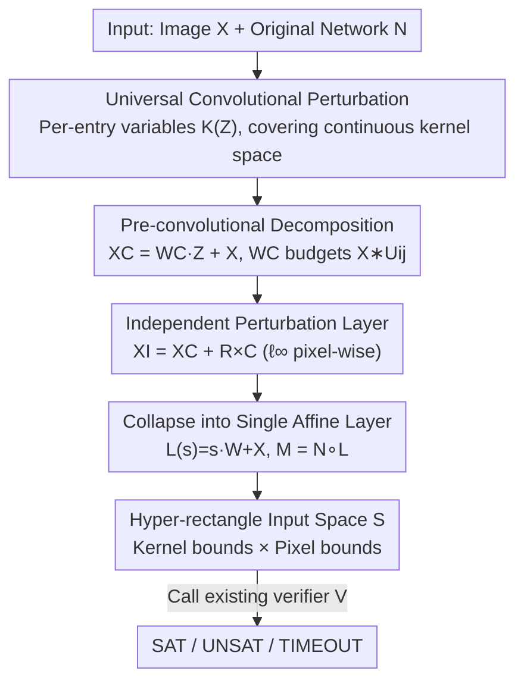

# Verifying Neural Network Robustness with Dual Perturbations

**Conference**: CVPR 2026  
**Paper**: [CVF Open Access](https://openaccess.thecvf.com/content/CVPR2026/html/Duong_Verifying_Neural_Network_Robustness_with_Dual_Perturbations_CVPR_2026_paper.html)  
**Code**: https://github.com/dynaroars/VeriDou  
**Area**: AI Safety / Formal Verification of Neural Network Robustness  
**Keywords**: Formal Verification, Robustness, Convolutional Perturbations, Adversarial Examples, Abstract Interpretation

## TL;DR
VeriDou integrates "arbitrary continuous convolutional perturbations (e.g., motion blur at various angles)" and "pixel-independent noise" into a unified perturbation space, encoded as an affine network layer prepended to the original network. This allows existing DNN verifiers (αβ-CROWN / Venus / NeuralSAT) to verify robustness under such "dual perturbations" in a single pass. The results reveal that many networks judged 100% robust by existing methods yield up to 99% adversarial examples under dual perturbations.

## Background & Motivation
**Background**: Formal verification of DNNs (proving that classification remains unchanged within a perturbation space for a given network $N$ and property $\phi$, or providing a counterexample) has developed rapidly. Leading verifiers (αβ-CROWN, NeuralSAT, Marabou, Venus) use abstract interpretation for sound overapproximation, but they almost exclusively handle **independent perturbations**—hyper-rectangle constraints where each pixel varies independently within an $\ell_\infty$ ball.

**Limitations of Prior Work**: Real-world image degradations often involve **two types of perturbations occurring simultaneously**. One type is **convolutional perturbations**, such as motion blur, defocus, or camera shake—these introduce spatial correlation by weight-mixing neighboring pixels via a kernel $K$ ($X * K$). The other is **independent perturbations**, such as brightness jitter or sensor noise, which add noise pixel-by-pixel. Autonomous driving cameras, for instance, simultaneously suffer from "vibration-induced blur + sensor noise." However, existing verifiers either support only independent perturbations or **restricted convolutional perturbations**, which only allow interpolation between a few predefined kernels.

**Key Challenge**: Restricted convolutional perturbations $K(Z)=\sum_i z_i K_i + (1-\sum_i z_i)\mathrm{Id}$ have two major flaws. First, all kernel entries are bound by a single scalar $z_i$, forcing them to change in the **same direction and proportion**, making it impossible to express asymmetric perturbations that modify only specific entries. Second, they can only represent points falling between predefined extreme kernels (e.g., motion blur at 0° or 45°), failing to capture continuous intermediate orientations (e.g., 30°). Consequently, appearing "robust" under restricted perturbations does not guarantee true robustness.

**Goal**: Construct a perturbation space capable of expressing "arbitrary continuous convolutional kernels + pixel-independent noise" within a **single formal framework** that can be directly consumed by existing verifiers without modifying their internal engines.

**Core Idea**: Redefine convolutional perturbations using **entry-independent variables** (universal convolutional perturbation) to cover continuous intervals and arbitrary kernels. Then, collapse both convolutional and independent perturbations into a **single affine transformation $L$**, resulting in $M=N\circ L$. Any verifier accepting bounded inputs can then "seamlessly" verify this augmented network.

## Method

### Overall Architecture
The input to VeriDou is a test image $X$ and the original network $N$; the output is SAT (adversarial example exists) / UNSAT (robust) / TIMEOUT. The mechanism is to **transform the perturbation itself into a network layer**. This process involves three steps: first, encoding the "arbitrary convolutional kernel perturbation" into a convolutional perturbation layer (producing spatially correlated noise); second, overlaying an independent perturbation layer (producing pixel-wise $\ell_\infty$ variations); and finally, collapsing these two layers into a **single affine layer $L$** prepended to $N$ to form the augmented network $M=N\circ L$. The ranges of the perturbation variables are concatenated into a hyper-rectangle input space $S$, and the underlying verifier $V$ is called to check $\forall s\in S:\arg\max M(s)=\arg\max N(X)$.

The key insight is that the perturbation space is no longer a "box around image pixels" but an extended input dimension composed of "kernel coefficient variables $Z$ and independent noise $R$." Such a verification instance covers **infinitely many kernel combinations** (continuous angles, arbitrary kernels), while the verifier simply treats it as a standard higher-dimensional hyper-rectangle input problem.

### Key Designs

**1. Universal Convolutional Perturbation: Replacing "Kernel Interpolation" with Entry-Independent Variables**

The fundamental flaw of restricted convolutional perturbations is that "one scalar governs one complete kernel," locking all entries to synchronized changes. VeriDou refines the granularity to **one variable per kernel entry**:

$$K(Z)=\sum_{i=1}^{k_1}\sum_{j=1}^{k_2} U_{ij}\cdot z_{ij}+\mathrm{Id},\quad z_{ij}\in[l_{ij},u_{ij}]$$

where $U_{ij}$ is a unit kernel with 1 at position $(i,j)$ and 0 elsewhere, and $\mathrm{Id}$ ensures no perturbation when all $z_{ij}=0$ ($X*K(Z)=X$). The advantage is that **kernels are constructed directly from variables without relying on predefined target kernels**: each entry can take values independently, allowing the expression of asymmetric minor modifications and covering **continuous intermediate orientations** (e.g., 30°) by marking all kernel positions swept by a blur line from 0° to 45° as free variables while setting others to zero. The paper proves (details in the appendix) that universal perturbations **subsume** all image transformations expressible by restricted perturbations; its expressivity is strictly stronger. Given any target kernel $K_{\text{arbitrary}}$, one only needs to set $z_{ij}\in[c_{ij}-\epsilon_{ij}, c_{ij}+\epsilon_{ij}]$ (where center $c$ comes from domain priors and radius $\epsilon$ controls the perturbation range) to construct a continuous neighborhood around it.

**2. Collapsing Dual Perturbations into Single Affine: Plug-and-Play for Existing Verifiers**

Stronger perturbation expression is insufficient—verifiers must be able to "digest" it. VeriDou's ingenuity lies in **compounding two types of perturbations into a closed-form affine mapping**. The convolutional perturbation layer (§4.1) is written in linear form using kernel decomposition:

$$X_C=X*K(Z)=\Big(\sum_{i,j}(X*U_{ij})\cdot z_{ij}\Big)+X*\mathrm{Id}=W_C\cdot Z+X$$

where $W_C=\sum_{i,j}(X*U_{ij})$ is a constant matrix consisting of the input **pre-convolved** with each unit kernel. This step converts "convolving the image" into a "linear transformation of perturbation variables $Z$," and $W_C$ can be pre-computed offline to ensure efficiency. The independent perturbation layer (§4.2) follows the standard $\ell_\infty$ form: $X_I=X+R\times C$, where the mask $C\in\{0,1\}^d$ controls which pixels are perturbed. Compounding the two yields $X_I=W_C\cdot Z+R'+X$ (where $R'=R\times C$). By concatenating variables into a row vector $s=[Z\;\;R']$ and stacking coefficient matrices into $W=[W_C;\mathrm{Id}]$, a **single affine layer** $L(s)=s\cdot W+X$ is obtained, such that $M(s)\equiv N\circ L(s)$. Since $L$ is an affine map and $S$ is a hyper-rectangle, **any verifier accepting bounded inputs (αβ-CROWN, Venus, NeuralSAT) can directly verify $M$ without any modification**. Dual perturbations are thus encoded as extended input dimensions. This is the source of VeriDou's strength and plug-and-play capability.

**3. Modeling Perturbation as a Unified SAT/UNSAT Verification Instance**

VeriDou follows the standard DNN verification paradigm: verifying $\phi\equiv\phi_{in}\Rightarrow\phi_{out}$ is equivalent to checking the satisfiability of $\alpha\wedge\phi_{in}\wedge\neg\phi_{out}$. UNSAT indicates the property holds (robust), while SAT indicates a counterexample (adversarial example) exists. It defines the dual perturbation input space as the **Cartesian product** of kernel bounds and pixel bounds $S\equiv[z_L,z_U]^{k_1\times k_2}\times[-\epsilon_R,\epsilon_R]^{d}$. The property $\phi$ requires the prediction of $M$ under $\forall s\in S$ to match $N(X)$. Alg. 1 formalizes this workflow: calculate the convolutional component $W_C$ and independent component $R'$, concatenate them into unified variable $s$ and transformation matrix $W$, construct the perturbation layer $L$ and augmented network $M$, define the input space $S$, specify the robustness property $\phi$, and finally pass it to the oracle verifier. Since underlying verifiers are deterministic algorithms (abstraction + branch heuristics, no randomness), all results are **fully reproducible**.

## Key Experimental Results

### Experimental Setup
- **Benchmarks**: 5 networks from VNN-COMP—MNIST-FC, Oval21, Sri-ResNet-A, CIFAR100, TinyImageNet, covering FC / CNN / ResNet. Input dims 784–9408, output dims 10–200, parameters 270K–3.8M.
- **Three Variants**: VeriDou$_{\alpha\beta}$ (αβ-CROWN), VeriDou$_{NS}$ (NeuralSAT, GPU BaB), VeriDou$_{VS}$ (Venus, CPU).
- **Scale**: 14,340 verification instances (each a (network, property) pair); 30s timeout per instance; 32-core AMD + RTX 4090.

### Main Results: Ratio of SAT Instances (Adversarial Examples) Found Across Four Perturbation Types
For fair comparison, only adversarial examples with LPIPS ≤ 0.4 (perceptually similar) are counted.

| Perturbation Type | SAT Ratio Range | Representative Data |
|-------------------|-----------------|---------------------|
| Independent | 0–20% | CIFAR100 0%, MNIST-FC/Oval21 only 5% |
| Restricted Conv | Increased to ~53% | TinyImageNet 53% |
| Universal Conv | Further increased to ~89% | TinyImageNet 89% |
| **Dual Perturbation** | **65–99%** | MNIST-FC 12%→75%, CIFAR100/TinyImageNet reached 99% |

Even for the robustly trained and harder-to-attack Oval21 (3 ReLU-CNNs), dual perturbations still find 24% SAT instances.

### Ablation Study: Contributions of Convolutional $Z$ and Independent $R$ (Fig. 10)

| Configuration | Key Metric | Description |
|---------------|------------|-------------|
| $z_{ij}=0.0,\ \epsilon_R=0.01$ | Baseline (Independent only) | CIFAR100 0%, TinyImageNet 20% |
| $z_{ij}=0.1,\ \epsilon_R=0.01$ | Adding Universal Conv | CIFAR100 surged to 85%, TinyImageNet to 70% |
| $z_{ij}=0.1,\ \epsilon_R=0.04$ | Increasing Independent Radius | Oval21 15%→20%, MNIST-FC 21%→33% |

Stability (Tab. 2, Motion 0°, VeriDou$_{NS}$, SAT Ratio):

| Samples | Restricted | Universal | Dual (C=0.5) | Dual (C=1.0) |
|---------|------------|-----------|--------------|--------------|
| 300 | 0.23 | 0.40 | 0.54 | 0.68 |
| 600 | 0.26 | 0.42 | 0.60 | 0.76 |

### Key Findings
- **Convolutional component $Z$ is the primary driver**: Switching from pure independent ($z_{ij}=0$) to universal convolutional ($z_{ij}=0.1$) causes SAT ratios to jump significantly across all networks (CIFAR100 0%→85%). The independent component $R$ provides **orthogonal supplementation**; increasing its radius steadily adds more counterexamples, indicating the two perturbations explore non-overlapping unsafe regions.
- **Restricted perturbations severely underestimate vulnerability**: On VeriDou$_{VS}$, restricted perturbations only found ~20 SAT instances, while universal/dual perturbations found 100+, a gap consistent across all motion blur angles.
- **Counterexamples are realistically visible**: SSIM of adversarial examples remains stable at ~0.8 with LPIPS < 0.3. Box plots for universal/dual perturbations are narrower (more consistent similarity), implying they find "perceptually realistic vulnerabilities" rather than invisible artifacts.
- **Minimal additional overhead**: Runtime differences across the four perturbation types are statistically insignificant. VeriDou$_{\alpha\beta}$ remains stable at ~5s.

## Highlights & Insights
- **The "Perturbation as Network Layer" encoding is clever**: Collapsing convolutional and independent perturbations into a single affine layer $L(s)=s\cdot W+X$ makes VeriDou a **front-end transformer** rather than just another verifier. Any existing verifier can be reused, and VeriDou automatically benefits whenever a stronger verifier is released. This "decoupling of perturbation modeling and solving" can be migrated to other scenarios requiring verification of complex input transformations (geometric, color).
- **Pre-convolutional decomposition $W_C=\sum(X*U_{ij})$ is the key to efficiency**: Converting "convolution on image" to "linear transformation on variables" with offline-computable constants ensures nearly zero runtime overhead—explaining why extending to dual perturbations doesn't increase latency.
- **The most striking "Aha!" conclusion**: Many networks judged 100% robust under restricted/independent perturbations exhibit 99% adversarial examples under dual perturbations. This suggests current robustness evaluations may be systematically **overconfident**—"secure" conclusions based on single-type perturbations are fragile.

## Limitations & Future Work
- **Evidence for scaling to large networks is limited**: The largest network in experiments has 3.8M parameters. Scalability for modern large-scale CV models (e.g., ViT, detection/segmentation) is unverified. Timeout instances significantly increase at high coverage ($z_i=100\%$) within the 30s limit.
- **Dependency on underlying verifier performance**: VeriDou is essentially a transformer. Its completeness and precision are bounded by the tightness of the overapproximation of the augmented network $M$ by the chosen verifier. Architectural features that challenge the verifier also challenge VeriDou.
- **Manual setting of kernel space**: The centers $c_{ij}$ and radii $\epsilon_{ij}$ for universal convolutional perturbations still rely on domain priors. Automatically learning reasonable kernel spaces from real-world degradation data remains an open problem.
- **Future directions**: Extending dual perturbations to unified encodings of more degradation types (compression artifacts, geometric transforms) and linking with robust training to use VeriDou-exposed dual-perturbation counterexamples for adversarial augmentation.

## Related Work & Insights
- **vs αβ-CROWN / NeuralSAT / Marabou / PyRAT**: These are SOTA independent perturbation verifiers that scale using interval/abstract interpretation but only model $\ell_\infty$ hyper-rectangles, failing to capture spatially coupled convolutional perturbations. VeriDou does not replace them but encodes dual perturbations into inputs they can process, **standing on their shoulders**.
- **vs Mziou-Sallami et al. / Ruoss et al.**: They consider restricted convolutional kernel spaces (e.g., kernel values in $[0,1]$ summing to 1, or pixel-level smoothing constraints) but only support convolution without independent perturbations, and kernel spaces are tied to predefined patterns. VeriDou's universal perturbation expressivity strictly subsumes them and allows for overlapping independent noise.
- **vs Brückner et al.**: They support continuous transitions from no perturbation to full perturbation by parameterized analysis of specific distortion types. VeriDou's distinct value lies in **providing the first unified framework to simultaneously support arbitrary convolution + independent perturbations**, revealing blind spots in single-type evaluations.

## Rating
- Novelty: ⭐⭐⭐⭐⭐ First to formally verify "arbitrary continuous convolution + pixel-independent" dual perturbations in a unified framework by collapsing them into affine layers for existing verifiers.
- Experimental Thoroughness: ⭐⭐⭐⭐ 14,340 instances, 5 networks × 3 verifiers, comprehensive RQ1–RQ5 (effectiveness/property types/similarity/params/overhead), though networks are relatively small.
- Writing Quality: ⭐⭐⭐⭐ Clear logical chain from restricted perturbation flaws to universal perturbations and unified collapse; formulas and algorithms are complete, though some data formatting is dense.
- Value: ⭐⭐⭐⭐⭐ Directly challenges the overconfidence that "robustness under single perturbations equals true robustness," holding significant implications for the credible evaluation of safety-critical CV systems; tool is open-source and plug-and-play.

<!-- RELATED:START -->

## Related Papers

- [\[CVPR 2026\] Towards Reliable Evaluation of Adversarial Robustness for Spiking Neural Networks](towards_reliable_evaluation_of_adversarial_robustness_for_spiking_neural_network.md)
- [\[CVPR 2026\] RevINN: An End-to-End Invertible Neural Network for Reversible Adversarial Examples Generation](revinn_an_end-to-end_invertible_neural_network_for_reversible_adversarial_exampl.md)
- [\[CVPR 2026\] Generative Adversarial Perturbations with Cross-paradigm Transferability on Localized Crowd Counting](generative_adversarial_perturbations_with_cross-paradigm_transferability_on_loca.md)
- [\[CVPR 2026\] IrisFP: Adversarial-Example-based Model Fingerprinting with Enhanced Uniqueness and Robustness](irisfp_adversarial-example-based_model_fingerprinting_with_enhanced_uniqueness_a.md)
- [\[AAAI 2026\] FairGSE: Fairness-Aware Graph Neural Network without High False Positive Rates](../../AAAI2026/ai_safety/fairgse_fairness-aware_graph_neural_network_without_high_false_positive_rates.md)

<!-- RELATED:END -->
