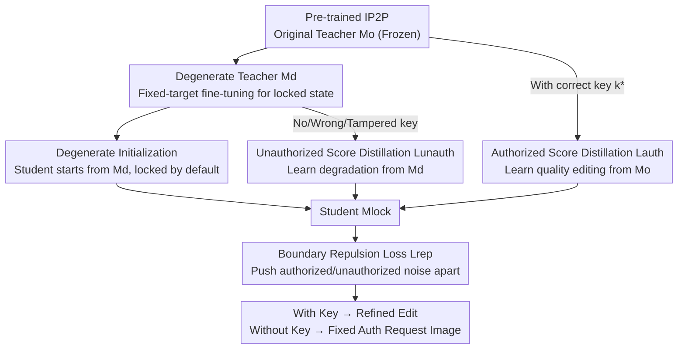

# VisiLock: Authorizing Instruction-based Image editing with Dual Score Distillation

**Conference**: CVPR 2026  
**Paper**: [CVF Open Access](https://openaccess.thecvf.com/content/CVPR2026/html/Le_VisiLock_Authorizing_Instruction-based_Image_editing_with_Dual_Score_Distillation_CVPR_2026_paper.html)  
**Code**: https://github.com/Luvata/VisiLock  
**Area**: AI Security / Model Copyright Protection / Instruction-based Image Editing  
**Keywords**: Model locking, access control, score distillation, visual key, adversarial unlocking  

## TL;DR
VisiLock integrates "access control" directly into the weights of instruction-based image editing models. High-quality editing is only performed when a specific "visual key" (a patch) is present in the input image; otherwise, the output degrades into a fixed "authorization required" image. It utilizes **Dual Teacher Score Distillation** to circumvent multi-task gradient conflicts and employs **Degenerate Initialization** to ensure public checkpoints are locked by default and resistant to adversarial fine-tuning for unlocking.

## Background & Motivation
**Background**: Models such as InstructPix2Pix (IP2P), MagicBrush, and HIVE have established "editing images via single-sentence instructions" as a viable capability. However, commercial-grade editors (e.g., GPT-Image, Nano Banana) are typically restricted behind paid APIs. While open-sourcing weights accelerates research (architecture improvements, domain adaptation, community optimization), once weights are released, any downloader obtains the full capability, causing the model provider to lose all commercial leverage.

**Limitations of Prior Work**: Existing protection methods (watermarking, fingerprinting) are **post-hoc attribution**—ownership is verified only after generation, but the model itself remains **fully functional** for unauthorized users. Thus, while a watermark can prove "this was generated by my model," it cannot prevent unauthorized high-quality editing. Providers are left with two unfavorable options: keep models entirely closed-source or open-source them while forfeiting any ability to distinguish between authorized and unauthorized use.

**Key Challenge**: Directing a model to perform high-quality editing for "authorized inputs" while reliably degrading for "unauthorized inputs" creates **gradient conflicts** under the diffusion objective. Fine-tuning on mixed batches (pulling authorized samples toward the editing manifold and pushing unauthorized samples toward identity/degradation) leads to competing gradients that destabilize training and compromise editing quality after unlocking. Contrastive approaches like FMLock are even more problematic; forcing a large distance between locked and unlocked features collapses the entire denoising trajectory, resulting in unusable outputs for both cases (Paper Figure 4 shows collapse even with $\lambda=0.01$). Furthermore, even if locking is achieved, adversaries can often recover editing capabilities through minor fine-tuning.

**Goal**: To train a diffusion editing model that: (1) maintains baseline editing quality with the correct key; (2) degrades to an unusable state without the correct key (missing, wrong, or tampered); (3) avoids training collapse; and (4) yields public checkpoints that are difficult to unlock via adversarial fine-tuning.

**Key Insight + Core Idea**: Rather than forcing a single model to learn two opposing behaviors from scratch, VisiLock **decouples these behaviors onto two frozen teachers**: an original teacher defining "intended editing quality" and a degenerate teacher defining the "locked state." The student model distills from both simultaneously. By initializing the student from the degenerate teacher, the model is "locked by default" from its inception, requiring distillation on authorized samples to "redeem" editing capabilities, which naturally makes full recovery via adversarial fine-tuning difficult.

## Method

### Overall Architecture
VisiLock does not modify the IP2P network architecture or add extra modules; instead, it changes the training paradigm. The input consists of IP2P triplets (original image $x$, editing instruction $c$) plus a visual key patch $k$ placed on the input image ($k \oplus x$). The goal is to learn a conditional distribution:

$$p_\theta(\tilde x \mid x, c, k) = \begin{cases} p_{\text{auth}}(\tilde x \mid x, c), & k = k^* \\ p_{\text{unauth}}(\tilde x \mid x, c), & \text{otherwise} \end{cases}$$

where $k^*$ is the authorized key, $p_{\text{auth}}$ provides high-quality editing, and $p_{\text{unauth}}$ provides degraded output. The pipeline consists of three steps: first, fine-tune the original teacher $M_o$ (frozen pre-trained IP2P) to create a degenerate teacher $M_d$ (specialized in "locked state" output); second, initialize the student $M_{\text{lock}}$ from $M_d$; finally, perform distillation where the student learns from $M_o$ for authorized samples and from $M_d$ for unauthorized samples, augmented by a boundary repulsion term to further separate the two behaviors. Both teachers remain frozen throughout, ensuring fixed targets for authorized and unauthorized gradients to prevent conflicts.

### Key Designs

**1. Dual Teacher Score Distillation: Replacing conflicting gradients with frozen targets**

A naive approach to model locking involves fine-tuning with standard IP2P objectives on mixed batches. If predicted noise for authorized and unauthorized inputs are denoted as $\hat\epsilon_\theta^{\text{auth}} = \epsilon_\theta([z_t, z_{k^*\oplus x}], t, c)$ and $\hat\epsilon_\theta^{\text{unauth}} = \epsilon_\theta([z_t, z_x], t, c)$, the naive loss is $\mathcal L_{\text{naive}} = \mathbb E\|\epsilon - \hat\epsilon_\theta^{\text{auth}}\|_2^2 + \mathbb E\|\epsilon' - \hat\epsilon_\theta^{\text{unauth}}\|_2^2$. The first term encourages editing while the second pushes toward degradation—opposing objectives that lead to unstable training. FMLock's contrastive term $\mathcal L_{\text{FMLock}} = \mathcal L_{\text{naive}} - \lambda\,\mathbb E\|\hat\epsilon_\theta^{\text{auth}} - \hat\epsilon_\theta^{\text{unauth}}\|_2$ exacerbates this by collapsing denoising trajectories due to the unbounded distance push.

VisiLock solves this by **assigning each behavior to a frozen teacher**. Authorized samples distill from the original teacher: $\mathcal L_{\text{auth}} = \mathbb E\|M_o([z_t, z_x], t, c) - \hat\epsilon_\theta^{\text{auth}}\|_2^2$ (Note: teacher $M_o$ receives clean input while the student gets keyed input). Unauthorized samples distill from the degenerate teacher $\mathcal L_{\text{unauth}} = \mathbb E\|M_d([z_t, z_x], t, c) - \hat\epsilon_\theta^{\text{unauth}}\|_2^2$, averaged across variants (no key, misplaced, corrupted, random). Since teachers are frozen, gradients point toward **two non-interfering fixed targets**, eliminating competition and ensuring stable learning for both behaviors.

**2. Degenerate Teacher and Strategy: Defining the "Locked" behavior**

The locked state is not discovered by the model but defined by the specialized teacher $M_d$. This is achieved by fine-tuning IP2P on triplets $(x, c, \tilde x_{\text{degraded}})$ to map any instruction to a degraded output. Three strategies were compared: **fixed target** (always outputting an "unauthorized" image), **blur** (Gaussian blur), and **noise** (random noise). The "fixed target" strategy is the primary choice as it provides the strongest lock—maximizing the gap between authorized and unauthorized states (CLIP-I down 41%, DINO down 90%).

**3. Degenerate Initialization: Making checkpoints locked by default**

To prevent adversaries from "self-distilling" the model (using authorized predictions to train unauthorized branches), VisiLock **initializes student $M_{\text{lock}}$ from degenerate teacher $M_d$** rather than clean IP2P or random weights. Thus, the public checkpoint is inherently locked. Editing ability is only "redeemed" for authorized samples through subsequent distillation. This ensures that the model "forgets" general editing capabilities at the start. An adversary attempting self-distillation hits a **plateau**, as they can only recover a fraction of the forgotten capabilities without access to the original training distribution.

**4. Boundary Repulsion Loss: Further separating behaviors**

In addition to distillation, a boundary repulsion term explicitly separates prediction noises for pairs differing only by the presence of the key: $\mathcal L_{\text{rep}} = \mathbb E\big[\max(0,\, m - \|\hat\epsilon_\theta^{\text{auth}} - \hat\epsilon_\theta^{\text{unauth}}\|_2)\big]$. This hinge loss with margin $m$ only activates if the distance is smaller than $m$, gently pushing the behaviors apart without crushing the distillation objective like an unbounded contrastive term.

### Loss & Training
Total loss: $\mathcal L_{\text{total}} = \mathcal L_{\text{auth}} + \mathcal L_{\text{unauth}} + \lambda_{\text{rep}}\mathcal L_{\text{rep}}$ with $\lambda_{\text{rep}} = 0.01$. Each batch includes $B=4$ triplets, expanded into 5 key configurations (auth, none, misplaced, corrupted, random), sharing noise $\epsilon$ and timestep $t$ for an effective batch size of 20. Optimized using AdamW ($lr=10^{-5}$, weight decay 0.01) for 2,000 steps on 512×512 images (approx. 1 hour on an H100). The degenerate teacher (fixed target) is fine-tuned separately for 1,000 steps. Training uses 10,000 IP2P triplets; evaluation is on 1,000 MagicBrush scenarios.

## Key Experimental Results

### Main Results
Evaluation uses reference-based metrics (CLIP-I, CLIP-T, DINO; higher is better) and no-reference quality metrics (entropy, sharpness). Results with fixed target teacher:

| Metric | Auth (All) | Unauth (All) | Gain (Loss) | Auth (Final) | Unauth (Final) | Gain (Loss) |
|------|-----------|-------------|------|-------------|----------------|------|
| CLIP-I ↑ | 0.821 | 0.481 | -41% | 0.757 | 0.465 | -39% |
| DINO ↑ | 0.726 | 0.072 | -90% | 0.574 | 0.069 | -88% |
| CLIP-T ↑ | 0.274 | 0.163 | -41% | 0.272 | 0.156 | -43% |
| Entropy ↑ | 14.93 | 8.21 | -45% | 14.93 | 8.21 | -45% |

Authorized editing preserves baseline quality (CLIP-I 0.821), while unauthorized output collapses—DINO drops 90% and entropy drops 45%, indicating a lack of detail and failure to follow instructions.

### Ablation Study

| Degeneration Strategy | Auth CLIP-I | Auth DINO | Unauth CLIP-I | Unauth DINO | Description |
|----------|-------------|-----------|----------------|--------------|------|
| Fixed | 0.821 | 0.726 | **0.481** | **0.072** | Strongest lock and degradation |
| Blur | 0.843 | 0.764 | 0.657 | 0.326 | Moderate lock quality |
| Noise | 0.846 | 0.784 | 0.780 | 0.617 | Best auth quality, weak lock |

| Configuration | Key Observation | Description |
|------|---------|------|
| Fixed + Degen Init (Ours) | Clear separation throughout | Main configuration |
| Random Init | No convergence | Fails to learn editing |
| Clean IP2P Init | Weak lock, fails fixed target | Improper locking behavior |
| Margin m: 1.0→0.5 | Auth CLIP-I −2.4%, Lock −1.6% | Higher margin benefits fixed teacher |

### Key Findings
- **Degenerate "severity" defines lock strength**: The fixed target teacher suppresses unauthorized DINO to 0.072, whereas the noise teacher remains at 0.617—more extreme degradation leads to stronger locks.
- **Degenerate Initialization is vital for resistance**: Without it (using random or clean initialization), the model either fails to learn or results in a weak lock. Default-locked initialization is required for selective "redemption."
- **Adversarial unlocking hits a plateau**: Self-distillation attacks show unauthorized performance approaching authorized performance but always maintaining a gap, hindered by the forgotten capabilities during initialization.
- **Robust to key size**: The locking mechanism remains effective across 16px to 128px key sizes.

## Highlights & Insights
- **Paradigm shift from post-hoc to proactive control**: Unlike watermarks that only aid in attribution, VisiLock renders the model unusable for unauthorized inputs.
- **Behavior decoupling via frozen teachers**: Decoupling conflicting objectives into independent distillations from fixed targets is a robust framework for multi-modal model training.
- **Defense via training dynamics**: Resistance to unlocking relies on initialization and the "forgetting" of general capabilities, meaning the security is inherent to the training process itself.
- **Visual Key superiority**: A visible patch is harder to strip from outputs and serves as a public broadcast of provenance compared to text passwords.

## Limitations & Future Work
- **Slight compromise in authorized quality**: CLIP-I is slightly lower than the unlocked baseline; further distillation optimization is possible.
- **Visual occlusion**: The visual key occupies space in the input image; adaptive placement strategies are needed to minimize visual impact.
- **Idealized threat model**: Experiments primarily simulate self-distillation attacks; performance against adversaries with ground-truth data or stronger adaptive attacks needs further study.
- **Architectural generalization**: Experimental validation is currently limited to IP2P; expansion to modern architectures like Flux or multi-layered locking is left for future work.

## Related Work & Insights
- **vs. Watermarking/Fingerprinting**: These focus on verification after the fact; VisiLock actively controls model functionality.
- **vs. FMLock**: VisiLock avoids the manifold collapse associated with contrastive objectives and uses visual keys instead of secret text prompts.
- **vs. DeepLock**: VisiLock protects specific functionality (image editing) rather than encrypting the entire weight parameter set.
- **vs. Password-locked LLMs**: While text-based prompts activate LLM capabilities, VisiLock tackles the significantly more difficult task of thresholding generative quality in the continuous image space.

## Rating
- Novelty: ⭐⭐⭐⭐⭐ High. Decoupling opposing behaviors with dual teachers is a significant advancement for model locking.
- Experimental Thoroughness: ⭐⭐⭐⭐ Comprehensive on IP2P/MagicBrush, though evaluation on more architectures would be beneficial.
- Writing Quality: ⭐⭐⭐⭐⭐ Excellent motivation and clear derivation of why previous methods fail.
- Value: ⭐⭐⭐⭐ Highly practical for providers seeking to protect commercial value in open-source releases.

<!-- RELATED:START -->

## Related Papers

- [\[CVPR 2026\] Editprint: General Digital Image Forensics via Editing Fingerprint with Self-Augmentation Training](editprint_general_digital_image_forensics_via_editing_fingerprint_with_self-augm.md)
- [\[CVPR 2026\] Revisiting Geometric Obfuscation with Dual Convergent Lines for Privacy-Preserving Image Queries in Visual Localization](revisiting_geometric_obfuscation_with_dual_convergent_lines_for_privacy-preservi.md)
- [\[CVPR 2026\] Verifying Neural Network Robustness with Dual Perturbations](verifying_neural_network_robustness_with_dual_perturbations.md)
- [\[CVPR 2026\] FedAFD: Multimodal Federated Learning via Adversarial Fusion and Distillation](fedafd_multimodal_federated_learning_via_adversarial_fusion_and_distillation.md)
- [\[CVPR 2026\] Image-based Outlier Synthesis With Training Data](image-based_outlier_synthesis_with_training_data.md)

<!-- RELATED:END -->
