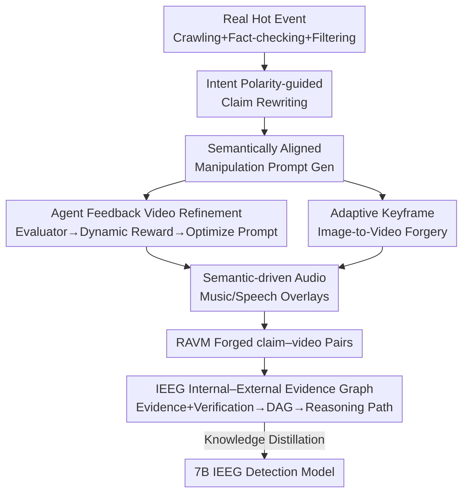

# VMD-FACT: A New Video Dataset and MLLM-based method for Detecting Realistic AI-Generated Video Misinformation

**Conference**: CVPR 2026  
**Paper**: [CVF Open Access](https://openaccess.thecvf.com/content/CVPR2026/html/Zhang_VMD-FACT_A_New_Video_Dataset_and_MLLM-based_method_for_Detecting_CVPR_2026_paper.html)  
**Code**: https://gitee.com/VR_NAVE/ravm (Available)  
**Area**: AI Security / Video Misinformation Detection  
**Keywords**: Video Misinformation Detection, AI-Generated Content, Multi-modal Large Language Model, Evidence Graph, Multi-agent Data Construction

## TL;DR
Addressing the detection blind spot where "AI-generated video misinformation is highly realistic, cross-modally consistent, and existing datasets have obvious editing artifacts," this paper utilizes a multi-agent framework to iteratively generate 9049 pairs of highly realistic claim–video forgery samples to form the RAVM dataset. It further proposes the IEEG model, which constructs a directed acyclic evidence graph consisting of "multimodal evidence + fact-checking results + their dependencies." IEEG achieves 75.99% Accuracy with 7B parameters on RAVM, surpassing 25 open/closed-source MLLMs (including Gemini 2.5 at 68.89%).

## Background & Motivation
**Background**: The core task of Video Misinformation Detection (VMD) is to determine whether a "textual claim + video" pair disseminates false information. Existing datasets (FakeSV, FakeTT, FakeVV, FMNV, etc.) are almost entirely constructed using **editing techniques**—replacing audio, rewriting emotive copy, or editing visuals—allowing models to capture these specific flaws.

**Limitations of Prior Work**: Editing-based forgeries **disrupt cross-modal consistency**, leaving obvious and easily detectable artifacts. Models easily overfit to these surface flaws, resulting in poor robustness and narrow domain coverage (often limited to single topics like COVID or health). However, with the maturation of generative models such as Sora and Kling, AI-generated video misinformation **strives specifically for cross-modal semantic consistency and high realism**, where text, visuals, and sound are mutually consistent without obvious flaws. This creates a gap between the nature of training data and real-world threats.

**Key Challenge**: The forgery logic of existing datasets (creating inconsistency) is **diametrically opposed** to the logic of real AI forgeries (maintaining consistency). Directly collecting realistic AI-generated misinformation is hampered by massive computational costs and difficulty in ensuring quality and authenticity, resulting in a lack of specialized datasets.

**Goal**: (1) Construct a VMD dataset that truly reflects AI-generated threats, covering four types of forgery sources: claim, video, audio, and cross-modal; (2) Provide an **explainable** detection method capable of operating in "highly realistic, artifact-free" scenarios.

**Key Insight**: The authors make two observations: first, forgers generate rumors with **intent polarity** (harmful vs. harmless); explicitly modeling this intent makes forgeries resemble human-made misinformation more closely. Second, in complex forgeries, simple Chain-of-Thought (CoT) reasoning fails to characterize complex dependencies between multimodal evidence, leading to accumulated errors. Consequently, the forgery process is modeled as "multi-agent iterative refinement," and the detection side is modeled using "evidence graph modeling."

**Core Idea**: Forgery side: use a multi-agent framework to adaptively and iteratively generate cross-modally consistent realistic forgery samples based on intent polarity. Detection side: organize multimodal evidence, fact-checking results, and their dependencies into a directed acyclic graph (evidence graph) to guide MLLM inference.

## Method
This paper follows two main threads: **dataset construction** (RAVM, how to create realistic forgery samples) and the **detection method** (IEEG, how to perform explainable detection on such samples).

### Overall Architecture
The forgery side is a **multi-agent-driven iterative generation framework**: it first crawls and verifies real hot events → rewrites claims based on intent polarity → generates "semantically aligned manipulation prompts" from the rewritten claims → enters two video forgery modules (agent-feedback refinement for text-to-video, and keyframe forgery for image-to-video) → overlays semantic-driven audio → outputs a "forged claim + forged video" pair. The entire video generation process includes a **feedback loop**: multiple evaluators provide scores, a dynamic reward algorithm aggregates them, an optimizer adjusts prompts accordingly, and generation repeats until standards are met.

The detection side is **IEEG (Internal–External Evidence Graph)**: a fact-checking module first performs a preliminary judgment of the claim's authenticity, then a video MLLM (Gemini 2.5) extracts multimodal evidence and builds a directed acyclic graph (DAG) of the dependencies between evidence and verification results to organize a coherent reasoning path. Finally, this process is distilled into a 7B model.

### Key Designs

**1. Intent Polarity-guided Claim Rewriting: Making forged text resemble "real info" rather than "obvious rumors"**

Existing datasets use LLMs to replace/rewrite/generate claims without **explicitly modeling forgery intent**, often resulting in abrupt and unrealistic distortions easily identified by models. The difference here is incorporating the **intent polarity** (harmful vs. harmless) found in real-world misinformation research as a constraint. Specifically, a verified true claim and its metadata (description, likes, shares, tags, etc.) are used as original inputs. A Claim Manipulator selects appropriate forgery techniques—replacement (subject/time/location), rewriting (narrative logic/emotional triggers), or generation—while simultaneously considering the **semantics and intent polarity** of the claim, formalized as $c_f, d_f = G_c(c_a, m_a, P_c)$, where $c_a, m_a$ are the real claim and metadata, $c_f, d_f$ are the forged claim and description, and $P_c$ is the guiding prompt. Including intent polarity makes forged claims more "credible and human-like" rather than mechanically distorted.

**2. Agent-feedback Video Refinement: Iterating text-to-video toward "realistic and deceptive" using multi-evaluators and dynamic rewards**

Direct text-to-video output often varies in quality and may not align with the claim. This module consists of two stages: a candidate generation stage draws from a video generation model library $\mathcal{R}=\{R_1,...,R_{|R|}\}$ to produce a candidate set $V^{(t)}$; a refinement stage introduces three evaluators: a quality evaluator $E_q$, an alignment evaluator $E_a$ (judging claim–video semantic consistency with a score $\in[1,10]$ and providing both "score + reasons" to prevent focus on scores alone), and an **adversarial evaluator** $E_{adv}$ fine-tuned on multiple general VMD datasets. The latter has high recall for the "fake" class, outputting $s^{(t)}_{adv}\in\{0,1\}$ to indicate if the pair can still be identified as forged.

The three scores are aggregated into a base reward using a **dynamic reward algorithm**:

$$R^{(t)}_{base} = w_q \frac{s^{(t)}_q}{N_q} + w_a \frac{s^{(t)}_a}{N_a} + w_{adv}\, s^{(t)}_{adv}$$

To keep iteration stable and controllable, a **trend-aware penalty** $H^{(t)}$ is added, penalizing only the **downward** trend of quality/alignment scores in adjacent iterations ($\Delta^{(t)}_q = \lambda_q(s^{(t-1)}_q - s^{(t)}_q)$, same for alignment). The final reward is $R^{(t)} = R^{(t)}_{base} - \delta H^{(t)}$. Instead of modifying videos directly, the optimizer **indirectly adjusts the manipulation prompts iteratively** $P^{(t+1)} = \Gamma(\cdot)$ to maximize reward, using a "state graph" of historical optimization records to constrain semantic drift. Iteration stops upon reaching reward threshold $\tau$ or the maximum limit $t_{max}$ (default 3). The core of this "scoring + adversarial + trend penalty + prompt modification" loop is to ensure forged videos are high-quality, semantically aligned with the text, and deceptive to detectors.

**3. Adaptive Keyframe Image-to-Video Forgery: Enhancing sample diversity via image-to-video**

Relying solely on text-to-video results in homogenous forgery patterns. This module follows an image-to-video route: given an original video, an Analyzer extracts keyframes $K$ carrying the narrative. These are sent to an intent-driven image editing block: a Perceiver parses the potential intent of the forged claim to output an editing strategy, and an Actuator executes the strategy to modify the images over $l$ iterations: $K^{(l)} = (f_{per}(K) \circ f_{act}(K, P_e))^{(l)}$, where $\circ$ denotes operation composition. The final edited keyframes $K^{(l)}$ are fed to a Generator. This module runs in **parallel** with module 2, starting from visuals rather than text, diversifying RAVM's forgery forms.

**4. Semantic-driven Audio and Evidence Graph Detection: Self-consistent audio and building reasoning as a DAG**

Audio: Existing datasets often simply replace audio to create inconsistency or emotional stimuli, causing models to overfit surface patterns. This paper uses a Semantic Perceiver to coordinate a Music Expert and TTS Expert, adaptively deciding on background music and generating speaker attributes (gender, speed, emotion, tone, content) to drive TTS. This ensures both music and speech **maintain semantic consistency** with the forged claim–video: $\tilde{v}^* = v^* \oplus \sigma_m \pi_{music} \oplus \sigma_s \pi_{speech}$ (where $\oplus$ is audio overlay and $\sigma$ is gain).

Detection via IEEG is the methodological contribution: for high-realism samples in RAVM, a fact-checking module (Tavily API for online verification) first judges the claim's authenticity. Inspired by Graph-of-Thought, Gemini 2.5 is used to extract multimodal evidence, with "evidence nodes + verification results" as the vertex set $N$ and their dependencies as the edge set $L$ to form a **directed acyclic evidence graph** and refine a coherent reasoning path. Compared to a CoT chain, which accumulates errors easily, the evidence graph explicitly characterizes complex dependencies. Combined with Agents-of-Thoughts distillation, this capability is compressed into a 7B IEEG model with a training objective $L = \mu\, \mathbb{E}[-\log P(r\mid c,v,I)]$, selecting the optimal path $r^* = \arg\max_r P(r\mid c,v)$ during inference.

### Loss & Training
The detection model IEEG is obtained via **knowledge distillation**: the evidence graph reasoning paths produced by Gemini 2.5 serve as the supervision signal $I$. The distillation objective is $L = \mu\, \mathbb{E}_{c,v\sim\Omega,\, r\sim D}[-\log P(r\mid c,v,I)]$, where $\mu$ is the temperature coefficient. For data augmentation, the same generation framework is used to produce high-fidelity videos for **real claims** (by using a higher threshold $\tau$ for fidelity and disabling the adversarial evaluator). Commercial closed-source models such as Sora2, Kling, Hailuo, and PiKa are integrated to expand diversity, and high-quality real samples from FakeTT and FMNV are mixed in. All experiments were conducted on 8×H100 GPUs.

## Key Experimental Results

### Main Results: 25 MLLMs "fail" on RAVM collectively; IEEG excels
The authors evaluated 25 SOTA LLMs/MLLMs (23 open-source, 2 commercial) on RAVM, focusing on Accuracy and Macro-F1. The conclusion is that general large models struggle with "realistic AI-forged videos," and **increasing model scale yields diminishing returns**; meanwhile, the 7B IEEG achieves the best results.

| Method | Scale | Accuracy↑ | Macro-F1↑ |
|------|------|-----------|-----------|
| Qwen3-VL-Instruct | 8B | 67.26 | 65.16 |
| InternVL3.5 | 20B | 68.31 | 60.23 |
| Qwen3-VL-Thinking | 30B | 68.53 | 67.77 |
| DeepSeek-V3.2-Exp | 671B | 64.56 | 63.14 |
| Gemini 2.0 (Closed) | >500B | 68.07 | 56.28 |
| Gemini 2.5 (Closed) | >500B | 68.89 | 68.00 |
| **IEEG (Ours)** | **7B** | **75.99** | **73.44** |

In Accuracy, IEEG is **7.1 percentage points** higher than the strongest Gemini 2.5 and over ten points higher than open-source MLLMs of the same size, despite having a fraction of the parameters.

### Ablation Study on Robustness: Fine-tuning on RAVM yields better generalization to legacy datasets
Using VideoLLaMA2-7B as the baseline, the authors compare the Gain of "fine-tuning on RAVM" vs. "fine-tuning on the datasets' own training sets" for legacy benchmarks (FakeSV/FakeTT/FMNV) test sets (Ours\* denotes the RAVM subset excluding samples from FakeTT/FMNV).

| Test Set | Training Set | Accuracy↑ | Macro-F1↑ |
|--------|--------|-----------|-----------|
| FakeSV | Own Training Set | 66.04 (+9.34) | 64.81 (+8.30) |
| FakeSV | Ours\* (RAVM) | **70.18 (+13.48)** | **65.47 (+8.96)** |
| FakeTT | Own Training Set | 56.64 (+15.03) | 56.63 (+19.09) |
| FakeTT | Ours\* (RAVM) | **78.26 (+36.65)** | **56.74 (+19.20)** |
| FMNV | Own Training Set | 60.99 (+8.24) | 53.01 (+0.35) |
| FMNV | Ours\* (RAVM) | **68.12 (+15.37)** | **68.12 (+15.46)** |

Fine-tuning on RAVM provides a **much larger** improvement on the three legacy datasets than fine-tuning on their own training sets, indicating that realistic AI forgeries in RAVM serve as more difficult and useful training signals.

### Key Findings
- **Pattern Non-transferability**: Conversely, fine-tuning on legacy datasets (FakeSV/FakeTT/FMNV) and then testing on RAVM leads to a comprehensive **decrease** in Macro-F1 (e.g., FakeSV training → RAVM testing drops Macro-F1 by 11.91, FMNV by 15.57). This suggests that the forgery patterns in legacy datasets cause models to overfit to surface artifacts, which do not transfer to real AI forgeries—confirming that "existing datasets are inadequate for real detection needs."
- **Leading Quantitative Quality**: Evaluations using AGAV-Rater, VBench, and a 10-person user study (10-point scale) show that RAVM is **superior** to FakeSV and FakeTT in almost all metrics, including audio-visual consistency, realism, subject consistency (VBench 91.34%), and dynamics (RAFT 72.42%), proving its samples are more authentic and semantically aligned.
- **Scale $\neq$ Capability**: From 1B to 671B for open-source models and >500B for Gemini, Accuracy on RAVM plateaus around 68%. Simply stacking parameters does not solve the problem of "highly realistic cross-modal forgery"; structured reasoning like evidence graphs is required.

## Highlights & Insights
- **Addressing "Threat Distribution Drift"**: Traditional VMD assumes forgery = destroying consistency, while AI forgery maintains it. By reversing the forgery logic from "creating flaws" to "creating self-consistency," this paper provides a necessary correction in benchmark design.
- **Clever Integration of the "Adversarial Evaluator"**: Using a detector trained on general VMD (with high recall for "Fake" samples) as a judge to specifically select samples that are "still identifiable" for further refinement effectively **forces the generator to produce harder-to-deceive samples**, giving the dataset an intrinsic difficulty floor.
- **Transferable Design of Trend-aware Penalty $H^{(t)}$**: Penalizing only the downward trend of scores rather than directly locking scores avoids "uncontrolled refinement focused on scores alone." This idea of "penalizing regression rather than locking absolute values" can be applied to other generation optimization tasks with evaluative feedback.
- **Evidence Graph vs. Chain-of-Thought**: Building dependencies between multimodal evidence and fact-checking results as a DAG instead of a single CoT chain addresses the point that "multi-source evidence is mutually constraining and single chains accumulate error." The 7B distilled model outperforming Gemini 2.5 is a persuasive argument.

## Limitations & Future Work
- **Heavy reliance on closed-source Gemini 2.5 for generation and detection**: Evaluators, optimizers, evidence graph extraction, and audio perceivers almost exclusively use Gemini 2.5, and the forgery side integrates commercial models like Sora2/Kling—presenting barriers in reproducibility and cost. The "realism limit" of the dataset is bound to the capabilities of these closed-source models.
- **Potential circular bias from the adversarial evaluator**: Filtering for "hard-to-deceive samples" using a detector makes RAVM systematically biased toward distributions that "can deceive that specific detector." Since IEEG is trained on RAVM, there is a risk of the generator and detector shaping each other, potentially leading to overly optimistic evaluations (not deeply discussed in the paper).
- **Weak recall for the "Real" class in IEEG**: Table results show IEEG has a high F1 for the "Fake" class (81.66), but metrics for the "Real" class (Recall 70.60, F1 65.23) are relatively average. In deployment, "misjudging real info as fake" is equally harmful, requiring further optimization for balance.
- **Missing key ablations**: While the main text provides robustness/transferability ablations for the dataset, the component-level ablations for IEEG (Evidence Graph vs. pure CoT, use of fact-checking, before/after distillation) are in the supplementary material, making it hard to see the exact contribution of the evidence graph in the main paper.

## Related Work & Insights
- **vs. Editing-based VMD Datasets (FakeSV / FakeTT / FMNV / FakeVV)**: These rely on editing/replacement to create cross-modal inconsistency, leaving obvious flaws; RAVM uses generative models to create **cross-modally consistent, highly realistic** samples, covering four sources (claim/video/audio/cross-modal) and multiple technologies, totaling 9049 pairs (4355 real / 4694 forged). Table 4 proves models trained on old sets cannot transfer to RAVM.
- **vs. CoT-based VMD Methods**: A single CoT chain struggles to model complex dependencies between multimodal evidence and accumulates errors; IEEG explicitly characterizes dependencies via a directed acyclic evidence graph and distills this into a small model, achieving more stable detection through structured reasoning.
- **vs. Deepfake Detection Benchmarks**: Deepfake videos typically **lack associated claims**, whereas VMD requires each video to correspond to a specific claim with a coherent narrative. Thus, deepfake data cannot be directly used for VMD, necessitating the multi-agent generation framework proposed here.
- **Transferable Insight**: The generation loop using "adversarial judges to force hard samples + trend penalties for stable iteration + indirect prompt modification" is applicable to other synthetic data construction tasks requiring "high realism and controllability."

## Rating
- Novelty: ⭐⭐⭐⭐⭐ Reversing forgery logic for the first realistic AI video misinformation dataset + evidence graph detection; addresses the right problem with a systematic solution.
- Experimental Thoroughness: ⭐⭐⭐⭐ Large-scale evaluation of 25 MLLMs + cross-dataset migration + multiple quality metrics is solid, though IEEG component ablations being in supplementary material weakens the main text.
- Writing Quality: ⭐⭐⭐⭐ Motivation and framework are clear, formulas are standardized; however, many modules and dependencies (especially evidence graph details) require referring to supplementary material.
- Value: ⭐⭐⭐⭐⭐ Directly addresses real-world threats in the Sora era; data, method, and large-scale evaluation are all public, providing a tangible push for the AI security/forensics community.

<!-- RELATED:START -->

## Related Papers

- [\[CVPR 2026\] Skyra: AI-Generated Video Detection via Grounded Artifact Reasoning](skyra_ai-generated_video_detection_via_grounded_artifact_reasoning.md)
- [\[CVPR 2026\] Detecting Compressed AI-Generated Images via Phase Spectrum Robustness](detecting_compressed_ai-generated_images_via_phase_spectrum_robustness.md)
- [\[CVPR 2026\] RunawayEvil: Jailbreaking the Image-to-Video Generative Models](runawayevil_jailbreaking_the_image-to-video_generative_models.md)
- [\[CVPR 2026\] FeatureFool: Zero-Query Fooling of Video Models via Feature Map](featurefool_zero-query_fooling_of_video_models_via_feature_map.md)
- [\[CVPR 2026\] FVBench: Benchmarking Deepfake Video Detection Capability of Large Multimodal Models](fvbench_benchmarking_deepfake_video_detection_capability_of_large_multimodal_mod.md)

<!-- RELATED:END -->
