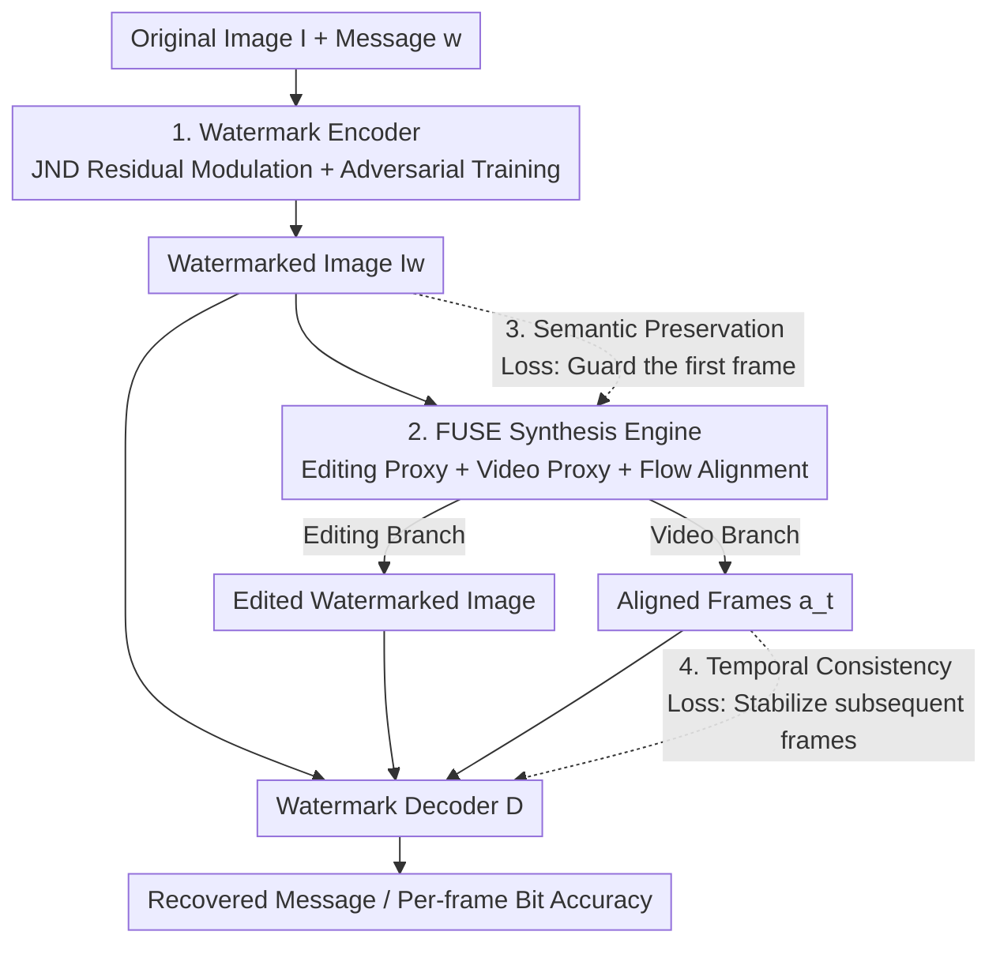

# WaTeRFlow: Watermark Temporal Robustness via Flow Consistency

**Conference**: CVPR 2026  
**Paper**: [CVF Open Access](https://openaccess.thecvf.com/content/CVPR2026/html/Jeong_WaTeRFlow_Watermark_Temporal_Robustness_via_Flow_Consistency_CVPR_2026_paper.html)  
**Code**: To be confirmed  
**Area**: AI Safety / Image Watermarking  
**Keywords**: Image Watermarking, Image-to-Video (I2V), Optical Flow Consistency, Provenance Verification, Temporal Robustness

## TL;DR
WaTeRFlow enables high-accuracy watermark decoding from video frames even after an image undergoes "Image-to-Video (I2V)" translation. This is achieved via a FUSE module that integrates an image editing proxy, a fast video diffusion proxy, and optical flow alignment into the encoder-decoder training loop. Combined with temporal consistency and semantic preservation losses, it improves the average bit accuracy on SVD-XT from VINE's 73.92% to 84.96%, with the first frame reaching 96.93%.

## Background & Motivation

**Background**: Digital watermarking embeds invisible messages into images for copyright and provenance. Recent deep learning watermarks (HiDDeN, TrustMark, WAM, Robust-Wide, VINE, etc.) are resilient to JPEG compression, blurring, and even instructional editing by diffusion models; watermarks often remain detectable after diffusion-based editing.

**Limitations of Prior Work**: However, when a watermarked image is fed into an I2V model to generate a coherent video, frame-by-frame detection accuracy decays rapidly. The paper describes a specific scenario: Alice embeds a watermark in her image, an unauthorized user Bob generates a video from it using an I2V model (potentially adding further editing or compression), and Alice must recover the watermark with high accuracy from the resulting video frames to prove her copyright.

**Key Challenge**: I2V translation differs from static distortions like JPEG, which add perturbations to a fixed canvas. I2V synthesizes a multi-frame sequence from a single image, acting as a "watermark-destructive transform." It weakens watermark signals across various frequency bands and introduces frame-by-frame variations and subpixel misalignment that drifts over time. Existing watermarking methods fail because they are not exposed to such I2V distortions during training.

**Goal**: To train an encoder/decoder pair such that the watermark can be stably decoded from every frame (especially the first and subsequent frames) after the "single watermarked image → I2V → video frames" process, maintaining robustness even when additional distortions are overlaid.

**Key Insight**: Since the essence of I2V distortion is "cross-frame subpixel drift + signal decay," the model should be exposed to realistic video generation effects during training. Optical flow is used to align every frame back to the first frame to "neutralize drift," while temporal regularization stabilizes frame-wise predictions. To overcome the high computational cost and memory consumption of I2V diffusion, the authors employ a fast video diffusion proxy (AnimateLCM) with two to four steps and no CFG.

**Core Idea**: Insert a FUSE module between the encoder and decoder that unifies "instructional image editing + fast video diffusion + optical flow alignment" into an end-to-end training loop, allowing the codec to adapt to realistic I2V pixel transformations during training.

## Method

### Overall Architecture

Given an original image $I \in \mathbb{R}^{C\times H\times W}$ and a $k$-bit message $w\in\{0,1\}^k$, the encoder $E$ produces a watermarked image $I_w=E(I,w)$. An I2V generator (e.g., SVD) uses $I_w$ as a condition to generate a frame sequence $V=\{v_t\}$. The decoder $D$ predicts the watermark from each frame. The system consists of three stages: **Watermark Encoding → FUSE Robustness Enhancement → Watermark Decoding**, optimized jointly end-to-end.

The core robustness resides in the FUSE module: during training, instead of using expensive real I2V models, the system uses an image editing proxy (InstructPix2Pix) and a video diffusion proxy (AnimateLCM) to simulate realistic distortions. Each generated frame is aligned via optical flow, and the "watermarked image / edited image / aligned frames" are fed into the decoder to compute losses. During inference, the proxy is replaced with real models like SVD-XT or CogVideoX to verify the transferability of the learned robustness.

### Key Designs

**1. Watermark Encoder: Hiding signals in the "least noticeable areas" using JND**

The watermark must be invisible yet resilient within the latent space of a VAE (where editing and video generation occur). The encoder is a message-conditioned U-Net: the $k$-bit message is arranged into an $m\times m$ ($m=\sqrt{k}$) grid, upsampled via CNN into feature maps, concatenated with the input image, and processed by the U-Net to produce a watermark signal. To ensure invisibility, the encoder does not output the watermarked image directly. Instead, it modulates the "residual between the original output and the input image." It calculates a single-channel scaling map from a JND (just-noticeable difference) heatmap, performs element-wise multiplication with the residual, and adds it back to the original image. The scaling map is constrained to stay away from zero to prevent signal loss, effectively concentrating the watermark in regions where the human eye is least sensitive. A PatchGAN discriminator is used to further refine invisibility by training the encoder to fool the discriminator. This design achieves a quality of PSNR 38.83 / SSIM 0.9902 at a 100-bit capacity.

**2. FUSE: Integrating Realistic "Editing + I2V" Distortions into the Training Loop**

This is the core of the work, addressing the lack of I2V distortion exposure during training. FUSE (Flow-guided Unified Synthesis Engine) sits between the encoder and decoder with two branches. The **Editing Branch** uses InstructPix2Pix as a proxy to perform text-guided edits on the watermarked image. The **Video Generation Branch** uses a video diffusion proxy to generate $M$ frames (including frame 0), followed by a RAFT optical flow estimator to align each frame $v_t$ back to the reference frame $v_0$. The alignment is formulated as:

$$a_t = W(v_t, u_t),\quad u_t = F(v_0, v_t)\in\mathbb{R}^{H\times W\times 2},$$

where $F$ is the flow estimator, $u_t$ is the forward flow field from $v_0$ to $v_t$, and $W$ is a bilinear backward warp: $[W(v,u)](p)=v(p+u(p))$. This "pulls back" the subpixel drift introduced by I2V, normalizing the distortion seen by the decoder and stabilizing learning. AnimateLCM is chosen as the video proxy because it generates high-quality video in 2-4 steps without CFG, significantly reducing training memory and time (Table 4 shows AnimateLCM requires 44.51 GB VRAM and 17.70 h training, compared to 93.80 GB / 42.39 h for SVD with CFG).

**3. Semantic Preservation Loss: Recovering the first frame by guarding condition signals**

I2V models (like SVD) use the CLIP embedding of the conditioning image as keys/values in the attention mechanism. If the watermark perturbs the condition image significantly, the generated first frame deviates from the watermarked image, making decoding difficult. The semantic preservation loss constrains the CLIP embeddings of the watermarked and original images:

$$\mathcal{L}_{\text{sem}} = 1 - \cos\big(f_{\text{CLIP}}(I_w), f_{\text{CLIP}}(I)\big),$$

where $f_{\text{CLIP}}$ is a frozen CLIP image encoder. This ensures the watermarked image remains semantically close to the original, minimizing interference with the I2V conditioning signal $c$. Consequently, the first frame $v_0$ more closely resembles $I_w$, significantly improving first-frame bit accuracy (removing it drops accuracy from 96.93% to 89.63%).

**4. Temporal Consistency Loss (TCL): Suppressing jitter in subsequent frames**

Even with optical flow alignment, residual subpixel drift from I2V causes fluctuations in frame-wise watermark predictions. TCL constrains the decoded outputs of adjacent aligned frames to be similar:

$$\mathcal{L}_{\text{TCL}} = \frac{1}{M-1}\sum_{\ell=1}^{M-1}\big\|D(a_\ell) - D(a_{\ell-1})\big\|_2^2,$$

where $a_\ell$ are frames aligned back to $v_0$ and $D$ is the decoder. By applying temporal smoothing directly to the decoded logits, it reduces per-frame variance and mitigates degradation in later frames. Removing TCL drops average accuracy from 84.96% to 81.65%.

### Loss & Training

The total objective is a weighted sum of encoder, decoder, and adversarial losses:

$$\mathcal{L}_{\text{total}} = \mathcal{L}_{\text{enc}} + \lambda_{\text{dec}}\mathcal{L}_{\text{dec}} + \lambda_{\text{adv}}\mathcal{L}^{G}_{\text{adv}}.$$

- **Encoder Loss** $\mathcal{L}_{\text{enc}} = \mathcal{L}_{\text{pixel}} + \lambda_{\text{latent}}\mathcal{L}_{\text{latent}} + \lambda_{\text{LPIPS}}\mathcal{L}_{\text{LPIPS}} + \lambda_{\text{sem}}\mathcal{L}_{\text{sem}}$: Pixel MSE + VAE latent MSE + LPIPS + Semantic preservation loss.
- **Decoder Loss** $\mathcal{L}_{\text{dec}} = \mathcal{L}_{\text{TCL}} + \mathcal{L}_{\text{MSG}}$, where $\mathcal{L}_{\text{MSG}}$ is the sum of per-bit BCE for the watermarked image $I_w$, edited image $\tilde{I}_w$, and $M$ aligned frames $a_\ell$.
- **Adversarial Loss**: PatchGAN $A$ learns to classify original images as high and watermarked as low, while the encoder learns to fool it via $\mathcal{L}^{G}_{\text{adv}}$.
- Hyperparameters: $\lambda_{\text{latent}}=10^{-3}$, $\lambda_{\text{LPIPS}}=0.18$, $\lambda_{\text{sem}}=10^{-3}$, $\lambda_{\text{dec}}=1.3$, $\lambda_{\text{adv}}=0.004$. Trained for 20,000 steps on an A100.

## Key Experimental Results

Evaluation is conducted on 500 images from UltraEdit. I2V robustness is verified using SVD-XT (U-Net) and CogVideoX (DiT) architectures. Capacity is fixed at 100 bits.

### Main Results (Average Bit Accuracy % under SVD-XT Distortions)

| Distortion Setting | Robust-Wide | VINE | TrustMark | WaTeRFlow (Ours) |
|---|---|---|---|---|
| Watermarked Image (None) | 99.99 | 99.99 | 99.92 | 99.86 |
| I2V (None) | 63.40 | 73.92 | 73.76 | **84.96** |
| I2V + Editing | 59.92 | 66.56 | 69.05 | **80.20** |
| I2V + H.264 (CRF=23) | 63.28 | 73.75 | 73.31 | **84.64** |
| I2V + Regeneration (ts=150) | 60.25 | 71.83 | 53.48 | **81.98** |
| I2V + JPEG (Q=50) | 62.45 | 78.08 | 71.66 | **81.45** |
| I2V + Gaussian Noise (σ=0.05) | 65.02 | 75.15 | 71.95 | **81.14** |
| I2V + Gaussian Blur (σ=1.5) | 60.31 | 77.66 | 76.80 | **85.78** |

WaTeRFlow outperforms VINE by ~11 percentage points under pure I2V and maintains a lead across all combined distortions. First-frame accuracy reaches 96.93%.

### Ablation Study (SVD-XT)

| FUSE-I | FUSE-V | TCL | Lsem | 1st Frame | Avg. | Avg. (w/ Edit) |
|---|---|---|---|---|---|---|
| - | - | - | - | 55.12 | 55.11 | 54.87 |
| - | ✓ | ✓ | ✓ | 93.26 | 81.65 | 77.47 |
| ✓ | - | - | ✓ | 91.89 | 66.32 | 63.56 |
| ✓ | ✓ | - | ✓ | 92.23 | 79.11 | 74.67 |
| ✓ | ✓ | ✓ | - | 89.63 | 76.82 | 72.79 |
| ✓ | ✓ | ✓ | ✓ | **96.93** | **84.96** | **80.20** |

(FUSE-I and FUSE-V represent the image editing and video generation branches respectively).

### Key Findings
- **The video branch is the lifeline for average accuracy**: Removing FUSE-V causes the average accuracy to collapse from 84.96% to 66.32%.
- **Semantic preservation loss primarily recovers the first frame**: Removing $L_{sem}$ drops the first-frame accuracy from 96.93% to 89.63%.
- **TCL stabilizes subsequent frame averages**: Removing TCL reduces the average to 79.11%.
- **AnimateLCM is the most cost-effective proxy**: It yields slightly better accuracy than SVD with CFG (84.96 vs 83.83) while requiring significantly less VRAM and training time.
- **Optical flow is vital for convergence**: Without it, the BCE loss during training becomes unstable, and the decoder fails to adapt to I2V distortions.

## Highlights & Insights
- **Abstracting I2V distortion as a simulatable training augmentation is the most critical paradigm shift**: While previous methods focused on fixed-canvas perturbations (JPEG/blur), this work identifies the essence of I2V as "cross-frame subpixel drift + signal decay" and incorporates it into the loop via "fast video proxy + flow alignment."
- **Using Consistency Models (AnimateLCM) as training proxies** is a universal trick for incorporating expensive generative processes into training loops. The ablation proves that robustness learned from the proxy transfers to more complex models like SVD-XT and CogVideoX.
- **Differentiated treatment for first and subsequent frames**: The first-frame issue (condition signal perturbation) is solved via semantic preservation, while the subsequent-frame issue (temporal drift) is solved via flow alignment and TCL.

## Limitations & Future Work
- The study primarily evaluates SVD and CogVideoX; if a video generator drastically alters the semantic content of the conditioning signal, accuracy may drop.
- There is insufficient discussion on "adversarial watermark removal" attacks, as the current evaluation focuses on common distortions and edits.
- Dependency on optical flow (RAFT): If I2V generation involves extreme motion where flow estimation fails, alignment and TCL may become ineffective.

## Related Work & Insights
- **vs. VINE**: VINE also addresses diffusion editing and I2V benchmarks, but lacks specific modeling for cross-frame drift. WaTeRFlow's FUSE and flow alignment push accuracy from 73.92% to 84.96%.
- **vs. Robust-Wide**: Robust-Wide focuses on instructional image editing but fails under I2V (63.40%).
- **Insight**: Treating "generative post-processing" (I2V, stylization, super-resolution) as a differentiable/simulatable distortion layer, combined with alignment and temporal regularization, may become the standard paradigm for watermarking against next-generation models.

## Rating
- Novelty: ⭐⭐⭐⭐⭐ 
- Experimental Thoroughness: ⭐⭐⭐⭐ 
- Writing Quality: ⭐⭐⭐⭐ 
- Value: ⭐⭐⭐⭐⭐ 

<!-- RELATED:START -->

## Related Papers

- [\[CVPR 2026\] Meta-FC: Meta-Learning with Feature Consistency for Robust and Generalizable Watermarking](meta-fc_meta-learning_with_feature_consistency_for_robust_and_generalizable_wate.md)
- [\[CVPR 2026\] GROW: Watermark Generation with Progressive Guidance for Diffusion Models](grow_watermark_generation_with_progressive_guidance_for_diffusion_models.md)
- [\[CVPR 2026\] AdvFM: Lookahead Flow-Matching Velocity-Field Attacks for Imperceptible and Transferable Adversarial Examples](advfm_lookahead_flow-matching_velocity-field_attacks_for_imperceptible_and_trans.md)
- [\[CVPR 2026\] FlowHijack: A Dynamics-Aware Backdoor Attack on Flow-Matching Vision-Language-Action Models](flowhijack_a_dynamics-aware_backdoor_attack_on_flow-matching_vision-language-act.md)
- [\[CVPR 2026\] Verifying Neural Network Robustness with Dual Perturbations](verifying_neural_network_robustness_with_dual_perturbations.md)

<!-- RELATED:END -->
