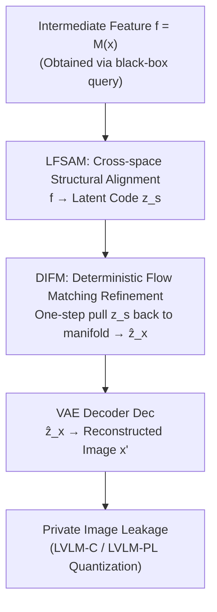

# What Your Features Reveal: Data-Efficient Black-Box Feature Inversion Attack for Split DNNs

**Conference**: CVPR 2026  
**Paper**: [CVF Open Access](https://openaccess.thecvf.com/content/CVPR2026/html/Ren_What_Your_Features_Reveal_Data-Efficient_Black-Box_Feature_Inversion_Attack_for_CVPR_2026_paper.html)  
**Code**: TBD  
**Area**: AI Security / Privacy Attacks / Feature Inversion  
**Keywords**: Feature Inversion Attack, Split DNN, Black-box Attack, Flow Matching, Privacy Leakage

## TL;DR
Addressing the intermediate features transmitted in Split DNNs (edge-side head, cloud-side tail), a black-box, data-efficient feature inversion framework called FIA-Flow is proposed. It first uses LFSAM to align task features with the VAE latent space, then utilizes Deterministic Flow Matching (DIFM) to pull "off-manifold" latent codes back to the natural image manifold in a single step. High-fidelity original private images are reconstructed from intermediate features using fewer than 4096 training samples.

## Background & Motivation
**Background**: To enable resource-constrained edge devices to run large models, Split DNN partitions the network into two segments—a lightweight "head" on the edge side and a compute-intensive "tail" on the cloud side. The edge only transmits intermediate features $f=M(x)$ to the cloud. This has long been considered a "privacy-preserving" solution because the raw input $x$ never leaves the local device.

**Limitations of Prior Work**: However, intermediate features exposed during transmission constitute a more direct attack surface than traditional Model Inversion Attacks (MIA, which infer from final outputs). Attackers intercepting the link or "curious cloud servers" with unauthorized access can obtain $f$. Existing Feature Inversion Attacks (FIA) suffer from three main drawbacks: (i) **White-box assumption**—most methods require knowledge of the victim model's architecture and weights, which are unavailable in real deployments; (ii) **Heavy data dependence**—learning-based methods require tens of thousands of "feature-image" pairs; (iii) **High inference cost**—optimization-based methods require thousands of iterations per image, making them non-real-time and easily detectable due to abnormal query counts. Consequently, existing FIA reconstruction quality is generally low, creating a false impression that "feature leakage is not that dangerous."

**Key Challenge**: FIA essentially aims to learn an inverse mapping $G$ from feature space $\mathcal{F}$ to image space $\mathcal{X}$. However, $\mathcal{F}$ is optimized for classification tasks and is inherently incompatible with the generative latent manifold. Directly learning $G$ is a highly ill-posed problem; achieving good performance usually requires massive data and iterations, making it difficult to satisfy black-box, data-efficient, and fast inference constraints simultaneously.

**Goal**: To achieve high-fidelity feature inversion under the constraints of **black-box** access (only $(x_i, f_i)$ pairs can be queried without knowing model $M$ structure/weights), **few-shot** learning, and **one-step inference**, thereby exposing the underestimated privacy risks of Split DNNs.

**Key Insight**: Rather than forcing the learning of an end-to-end ill-posed inverse mapping, the process is **decoupled into two steps**: first solving "structural alignment" (moving task features into the shape of the VAE latent space) and then "distribution refinement" (pulling the aligned but still off-manifold latent codes back onto the manifold). Structural alignment reduces hypothesis class complexity for few-shot generalization, while distribution refinement only requires "residual correction" instead of generation from scratch.

**Core Idea**: Replace end-to-end inverse mapping with an "alignment-refinement" two-stage paradigm—LFSAM for cross-space alignment and Deterministic Flow Matching (DIFM) using the aligned latent code as a starting point to push it back to the natural image manifold in one step.

## Method

### Overall Architecture
The objective of FIA-Flow: the input is the intermediate feature $f=M(x)$ produced by a split layer of the victim Split DNN head $M$, and the output is the reconstructed image $x' \approx x$. It decomposes the complex inverse mapping $G$ into three serial stages:

$$x' = G(f) = \mathrm{Dec}\big(G_{\text{refine}}(G_{\text{align}}(f))\big)$$

Where $G_{\text{align}}$ (LFSAM) maps task features $f$ to a latent tensor $z_s$ compatible with VAE latent space dimensions and structure; $G_{\text{refine}}$ (DIFM) performs semantic enhancement within the latent space, correcting "off-manifold" $z_s$ into $\hat{z}_x$ which is close to the real latent code; finally, the decoder $\mathrm{Dec}$ of a pre-trained VAE decodes $\hat{z}_x$ into the attack image. The entire pipeline only requires queries to the victim model without accessing internal parameters, thus remaining black-box.

### Key Designs

**1. LFSAM Cross-space Structural Alignment: Moving "Classification-optimized Features" to "Generation-ready Latent Space"**

Decoding $f$ directly into an image is ill-posed because $\mathcal{F}$ is task-specific, optimized for classification rather than synthesis, and its structure is inherently incompatible with the VAE latent space $\mathcal{Z}$. The task of LFSAM (Latent Feature Space Alignment Module) is to transform $f$ into a latent tensor $z_s$ that is both **dimensionally compatible** and **structurally aligned** with the VAE latent space. Choosing the VAE latent space as the landing point serves two purposes: it is continuous and structured, providing a stable manifold for subsequent refinement, and its lower dimensionality compresses the hypothesis class complexity, allowing alignment to generalize even with few samples.

Specifically, LFSAM consists of three parts. First, a **PixelShuffle-based spatialization layer** $\mathrm{PS}: \mathbb{R}^{r^2 C_{in}\times H_{in}\times W_{in}} \to \mathbb{R}^{C_{in}\times rH_{in}\times rW_{in}}$ "unpacks" channel-encoded information from different layers and resolutions into explicit geometric grids—this provides a learnable transformation superior to standard interpolation, adaptable to various split layers. Second, a **U-shaped backbone** $B(\cdot)$ with skip connections and self-attention: the encoder extracts hierarchical features $\{e_1,\dots,e_L\}$, and the decoder reconstructs them level-by-level, fusing them via skip connections $d_{i+1}=D(\mathrm{concat}(d_i, e_i))$. Self-attention captures long-range spatial dependencies, yielding $F_d=B(f)$. Third, a **Feature Aggregation Network (FAN)** uses $1\times1$ convolutions $\phi_i$ to project hierarchical $e_i$ into a shared space for concatenation and fusion $F_{fan}=\mathrm{Conv}_{fuse}(\mathrm{concat}_{i=1}^L(\phi_i(e_i)))$. The final aligned feature is:

$$z_s = \mathrm{Conv}_{out}(F_d + F_{fan})$$

This "hierarchical aggregation + dimensional rearrangement" is the source of FIA-Flow's data efficiency: it compresses mapping complexity, allowing usable alignment learning with as few as 128 samples.

**2. DIFM Deterministic Flow Matching Refinement: Pulling "Off-manifold" Aligned Latent Codes Back to Natural Image Manifold**

While LFSAM ensures $z_s$ dimensions match the VAE latent space, it **does not guarantee** that $z_s$ follows the distribution of real latent codes derived from natural images—since $z_s$ comes from task feature transformations, it likely falls into "off-manifold" regions of the latent space $\mathcal{Z}$. Since the VAE decoder is only trained on "on-manifold" samples, feeding it off-manifold inputs results in blurry, semantically inconsistent images (the paper validates via an FIA-Align baseline that direct decoding of $z_s$ is poor). DIFM (Deterministic Inversion Flow Matching) is designed to fix this distribution mismatch.

The key innovation is **modifying the standard Flow Matching prior**: while conventional generative models start from a Gaussian prior $p_0'=\mathcal{N}(0,I)$, DIFM starts directly from a "meaningful initialization" $p_0=p(z_s)$. It learns a deterministic vector field $v_\theta(z,t)$ to transport the distribution of $z_s$ to the target real latent distribution $p_1=p(z_x)$, where $z_x=\mathrm{Enc}(x)$. During training, a linear interpolation path $z_t = t\cdot z_x + (1-t)\cdot z_s$ is defined between $z_s$ and $z_x$, and $v_\theta$ approximates the target field $u_t = dz_t/dt = z_x - z_s$. The distribution evolution satisfies the continuity equation:

$$\partial_t p_t(z) + \nabla_z\cdot\big(p_t(z) v_\theta(z,t)\big) = 0$$

Because LFSAM has already pushed $z_s$ very close to $z_x$, the learned vector field is simple and almost linear. Thus, **expensive ODE solvers can be abandoned in favor of single-step forward Euler integration**:

$$\hat{z}_x = \hat{z}_1 = z_s + v_\theta(z_s, t=0)$$

This approach converts the "generation from zero" problem into "residual correction," simplifying the vector field's learning dynamics, reducing data requirements, and enabling one-step inference. Ablation studies show that a single step of DIFM significantly outperforms 200 steps of DDPM, confirming that "deterministic + meaningful initialization" is better suited for FIA tasks requiring faithful reconstruction of specific inputs than stochastic "noise-to-denoise" paradigms.

**3. LVLM Dual-Metric Quantization of "Human-Perspective Privacy Leakage": High PSNR $\neq$ High Privacy Leakage**

Traditional IQA metrics (PSNR/SSIM/LPIPS) measure pixel/perceptual similarity, but the true issue in privacy leakage is "whether an attacker can identify private content from the reconstruction." The authors use a Large Vision-Language Model (gpt-4o-mini) as an "image description expert" to describe both the original and inverted images, followed by a "leakage checker" comparison: **LVLM-C (Consistency)** judges if both descriptions point to the same main object (consistent = 1); **LVLM-PL (Privacy-Leakage)** calculates semantic similarity between descriptions using BERTScore. Higher values indicate that an attacker can extract more identifiable private information from the inverted image. This set of metrics quantifies the true severity of threats from a human perspective more accurately than IQA alone.

### Loss & Training
Two-stage decoupled training: **Stage 1 trains LFSAM**, freezing the pre-trained VAE encoder to obtain target latent codes $z_x=\mathrm{Enc}(x)$. The alignment loss $L_{fea}=\mathbb{E}[\|z_s-z_x\|_2^2]$ combined with image domain reconstruction loss $L_{img}=\mathbb{E}[\|\mathrm{Dec}(z_s)-x\|_1]$ forms $L_{s1}=L_{fea}+L_{img}$. **Stage 2 freezes LFSAM and trains DIFM**: Flow matching loss $L_{fm}=\mathbb{E}[\|v_\theta(z_t,t)-u_t\|_2^2]$ combined with reconstruction loss $L_{rec}=\mathbb{E}[L_{LPIPS}(x',x)+L_{L1}(x',x)]$ forms $L_{s2}=L_{fm}+L_{rec}$. DIFM is initialized with Stable Diffusion 2.1 weights, freezing the U-Net and inserting a rank-4 LoRA, with batch=8 and lr=1e-4, training for 64,000 steps per stage on an A100.

## Key Experimental Results

Conducted on ImageNet-1K using only **4096 randomly sampled images (<0.32%)** for training and 1000 for testing. Victim layers cover AlexNet (F-10), ResNet-50 (L1-2/L4-2), Swin-B (F3-2), YOLO11n (M-8), and DINOv2-B (B-11), spanning classification, detection, and self-supervised foundation models.

### Main Results
Inverted images are evaluated using ResNet-50 for Top-1 classification accuracy (Acc), measuring "eavesdropping accuracy." Higher Acc indicates better semantic retention.

| Model / Layer | Method | PSNR↑ | LPIPS↓ | Acc↑ | LVLM-PL↑ |
|:---|:---|:---|:---|:---|:---|
| ResNet-50 / L1-2 (Rich shallow info) | SG-DIP | 27.90 | 0.193 | 65.2 | 0.922 |
| ResNet-50 / L1-2 | **FIA-Flow** | **30.01** | **0.100** | **71.3** | **0.929** |
| ResNet-50 / L4-2 (Deep info loss) | SG-DIP | 11.59 | 0.777 | 8.1 | 0.872 |
| ResNet-50 / L4-2 | **FIA-Flow** | **20.31** | **0.397** | **36.8** | **0.902** |
| DINOv2-B / B-11 | SG-DIP | 12.42 | 0.741 | 17.7 | 0.905 |
| DINOv2-B / B-11 | **FIA-Flow** | **20.13** | **0.411** | **42.8** | **0.909** |

Key Findings: In shallow layers, FIA-Flow brings Acc to 71.3%. Its advantage is most prominent in **deep layers**—in layers like L4-2 where information is severely lost, other methods' Acc drops to single digits, while FIA-Flow maintains 36.8% with LPIPS nearly halved. This proves it can extract semantics from abstract high-level representations to reconstruct images, revealing a much greater threat surface than previously recognized.

### Cross-dataset and Defense Robustness

| Setting | Metric | Runner-up | FIA-Flow |
|:---|:---|:---|:---|
| COCO Cross-dataset (Zero-shot) | LPIPS↓ | 0.195 (FIA-Align) | **0.115** |
| COCO (ORR@0.5↑, detection consistency) | ORR | 56.02 | **69.00** |
| ResNet L1-2 + Noise+NoPeek Defense | Acc↑ | 53.3 (SG-DIP) | **62.2** |
| ResNet L1-2 + DISCO Defense | Acc↑ | 43.7 (SG-DIP) | **59.0** |

Even against Noise+NoPeek and DISCO mainstream defenses, FIA-Flow effectively bypasses them and recovers sensitive information under black-box conditions without knowing defense details—direct evidence of the "urgency for better defense" conclusion.

### Ablation Study

| Configuration | Key Observation | Description |
|:---|:---|:---|
| FIA-Align (LFSAM + Direct Dec) | Deep L4-2 Acc only 4.4 | Decoding off-manifold latent fails without DIFM |
| 128 Training Samples (0.01%) | L4-2 Acc remains 27.7 | Outperforms others with minimal data; high efficiency |
| DDPM 200 Sampling Steps | L4-2 Acc 4.5 | Stochastic "noise-denoise" paradigm fails faithful inversion |
| DIFM 1 Step | L4-2 Acc 36.8 | One-step deterministic refinement far superior to DDPM |

### Key Findings
- **DIFM is critical for semantic fidelity**: Removing it (FIA-Align) causes deep L4-2 Acc to plummet from 36.8 to 4.4, proving "distribution refinement" is indispensable.
- **LFSAM drives data efficiency**: With only 128 samples (0.01%), L4-2 Acc is still 27.7%, outperforming all rivals due to reduced mapping complexity via hierarchical aggregation.
- **Deterministic > Stochastic**: DDPM with 200 steps yields 4.5 Acc, whereas DIFM with one step hits 36.8. Increasing sampling steps slightly lowers PSNR but increases Acc/LVLM scores, indicating FIA requires "faithfulness to specific inputs" rather than "diverse sampling."
- **Deep layers are dangerous**: L3-2 Acc at 69.8% exceeds SG-DIP's shallow L1-2 performance (65.2%), shattering the illusion that "cutting deeper provides safety."

## Highlights & Insights
- **Decomposition into "Alignment + Residual Correction"**: By pushing $z_s$ close to the target latent code first, Flow Matching only needs to learn a simple, nearly linear vector field. This makes single-step output and few-shot training possible—a "degrading generation into residual correction" approach transferable to any restoration task where the starting point is close to the target.
- **Meaningful Initialization vs. Gaussian Prior**: Replacing FM's standard noise prior with LFSAM's aligned latent code is a clean example of Flow Matching for conditional reconstruction, more suitable for faithful reproduction than standard diffusion.
- **LVLM-C/LVLM-PL Quantifying Privacy from Human Vision**: Moving beyond pixel-level PSNR to ask "can an attacker recognize the same object" is a useful methodology supplement for privacy assessment.
- **Security Value as a "Wake-up Call"**: It proves Split DNNs leak identifiable private images under realistic black-box, few-shot, and defended conditions, falsifying the "split equals privacy" assumption.

## Limitations & Future Work
- **The need for stronger defense**: The paper calls for defenses that suppress inversion while maintaining model utility—currently, attack success depends on defense weaknesses.
- **Requires query-paired samples**: Although black-box, it still requires querying the victim model for $(x_i, f_i)$ pairs; it is inapplicable to zero-query scenarios. Extreme domain shifts between proxy and victim data may degrade performance.
- **Attenuation in deep reconstruction**: L4-2 PSNR is only ~20 with 36.8% Acc, much lower than shallow layers, showing very deep layers with high information loss remain challenging.
- **LVLM Metric Dependency**: Using gpt-4o-mini as a judge introduces concerns about reproducibility, cost, and bias (though the supplement includes other LVLM ablations).

## Related Work & Insights
- **vs Optimization-based FIA (M&V / DIP / SG-DIP)**: These are white-box and require thousands of iterations per sample, making them non-real-time and detectable; FIA-Flow is black-box and performs one-step inversion for any unseen input.
- **vs Learning-based FIA (DIA / DMB)**: These require 4,000 to 40,000+ paired samples; FIA-Flow reduces data requirements to <4,096 or even 128 via LFSAM.
- **vs Traditional Model Inversion MIA**: MIA targets final outputs, which is more indirect; FIA targets transmitted intermediate features, representing a more direct threat to Split DNN deployments.
- **vs Standard Flow Matching / Diffusion**: While standard models generate diverse samples from Gaussian noise, DIFM uses meaningful initialization and a deterministic single-step field for faithful reconstruction of specific inputs.

## Rating
- Novelty: ⭐⭐⭐⭐⭐ Simultaneously addresses black-box, data-efficient, and one-step constraints; "alignment-residual correction" + modified FM prior is very clever.
- Experimental Thoroughness: ⭐⭐⭐⭐⭐ Covers 5 architectures, multiple layers, multiple defenses, cross-dataset generalization, and thorough ablation on sample size and sampling steps.
- Writing Quality: ⭐⭐⭐⭐ Motivation and methodology are clearly decoupled; LVLM metrics are well-defined (some details like ORR are relegated to the supplement).
- Value: ⭐⭐⭐⭐⭐ Strongly falsifies the "Split DNN is privacy-preserving" assumption, providing direct warnings for edge-cloud collaborative inference practices.

<!-- RELATED:START -->

## Related Papers

- [\[CVPR 2026\] PureProof: Diffusion-Resistant Black-box Targeted Attack on Large Vision-Language Models](pureproof_diffusion-resistant_black-box_targeted_attack_on_large_vision-language.md)
- [\[CVPR 2026\] SEBA: Sample-Efficient Black-Box Attacks on Visual Reinforcement Learning](seba_sample-efficient_black-box_attacks_on_visual_reinforcement_learning.md)
- [\[CVPR 2026\] Shedding Light on VLN Robustness: A Black-box Framework for Indoor Lighting-based Adversarial Attack](shedding_light_on_vln_robustness_a_black-box_framework_for_indoor_lighting-based.md)
- [\[CVPR 2026\] VCP-Attack: Visual-Contrastive Projection for Transferable Black-Box Targeted Attacks on Large Vision-Language Models](vcp-attack_visual-contrastive_projection_for_transferable_black-box_targeted_att.md)
- [\[CVPR 2026\] PROMPTMINER: Black-Box Prompt Stealing against Text-to-Image Generative Models via Reinforcement Learning and VLM-Guided Optimization](promptminer_black-box_prompt_stealing_against_text-to-image_generative_models_vi.md)

<!-- RELATED:END -->
