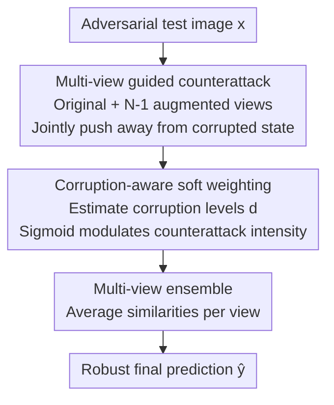

# When CLIP Sees More, It Fights Back Harder: Multi-View Guided Adaptive Counterattacks for Test-Time Adversarial Robustness

**Conference**: CVPR 2026  
**Paper**: [CVF Open Access](https://openaccess.thecvf.com/content/CVPR2026/html/Kim_When_CLIP_Sees_More_It_Fights_Back_Harder_Multi_View_Guided_CVPR_2026_paper.html)  
**Code**: https://github.com/sunoh-kim/MAC  
**Area**: AI Security / Adversarial Robustness / Multimodal VLM  
**Keywords**: Test-time defense, Adversarial counterattack, CLIP, Multi-view ensemble, Corruption-aware

## TL;DR
Addressing the test-time adversarial robustness of CLIP, MAC utilizes multiple augmented views to jointly execute a "counterattack," escaping the misleading influence of a single attacked image. By defining a new "corruption level" metric to adaptively adjust counterattack intensity for each view, MAC improves robust accuracy from the previous generation TTC's 6.8% to 45.2% across 20 datasets under strong PGD-100 attacks, while maintaining high-speed and low-memory tuning-free inference.

## Background & Motivation
**Background**: Vision-Language Models (VLMs) like CLIP exhibit strong zero-shot recognition capabilities but are extremely vulnerable to adversarial perturbations—minuscule changes invisible to the human eye can cause misclassification. To improve robustness without destroying zero-shot capabilities (i.e., without fine-tuning on labeled data), recent research has shifted toward **test-time defense**: one category is Test-time Prompt Tuning (TPT, e.g., R-TPT), which updates text prompts per sample during inference; the other is **Test-time Counterattack** (TTC, CVPR'25), which requires no fine-tuning and instead uses pre-trained CLIP features to iteratively apply a "counter-perturbation" to the input image, pushing its embedding away from the potential "corrupted state" $f(x)$.

**Limitations of Prior Work**: TPT tunes prompts per sample, requiring the storage of gradients and optimizer states, making it difficult to process in batches and resulting in slow inference (6.73 s/img) and high memory usage (1.89 GB). Although TTC is fast and efficient (0.08 s/img, 0.25 GB), the authors found it **nearly fails under strong attacks**—on Caltech101, robust accuracy drops from 78.8% under weak attacks (PGD-1, ε=1) to 26.3% under strong attacks (PGD-100, ε=4), with the average across ten datasets falling to only 6.8%.

**Key Challenge**: The authors attribute TTC's fragility to two root causes. The first is **single original image guidance**: TTC's counterattack target is built entirely on the embedding of the directly attacked original image; when corruption is heavy, this embedding is unreliable, and using it as a reference for "distancing" only leads to further deviation. The second is **noise-driven hard gating**: TTC injects small random noise into the image and observes embedding shifts to decide "whether to initiate a counterattack." However, random noise shifts do not reflect structured adversarial distortions, leading to inaccurate assessment of corruption severity and an inability to adaptively adjust counterattack strength—resulting in under-correction for heavy corruption and over-correction for light or clean images.

**Goal / Key Insight**: Replace the two weaknesses of TTC with "seeing more + more accurate intensity perception"—(i) use multiple augmented views to jointly guide the counterattack, ending reliance on a single corrupted image; (ii) define a "corruption level" that truly reflects adversarial severity, replacing hard gating with per-view soft weighting to adaptively scale counterattack intensity. The entire method remains tuning-free.

## Method

### Overall Architecture
MAC (Multi-view guided Adaptive Counterattack) takes a potentially attacked test image and outputs a robust class prediction without updating any CLIP parameters. The process follows four serial steps: first, expand the original image into $N$ views (original + $N-1$ random augmentations) and encode them using the frozen CLIP image encoder $f(\cdot)$; second, perform a **joint counterattack** on these $N$ views, optimizing per-view counter-perturbations to push each view away from its corrupted state; third, estimate the **corruption level** $d_i$ for each view, mapped via sigmoid to a soft weight $\mathbf{w}$ to modulate counterattack intensity (amplifying heavy corruption and suppressing light/clean ones); finally, **ensemble** the multiple views after the counterattack for the final prediction.

### Key Designs

**1. Multi-view guided counterattack: Escape reliance on a single corrupted image**

This step addresses the "single original image guidance" weakness of TTC. MAC constructs multiple views $\mathbf{v}=[v_0,v_1,\dots,v_{N-1}]^\top$, where $v_0$ is the original image and $v_i=T_i(x)$ are random transformations sampled from distribution $\mathcal{T}$ (random affine, color jitter, Gaussian blur, additive Gaussian noise, inspired by AugMix). TTC’s single-view counterattack is then generalized to joint optimization of $N$ views:

$$\bm{\delta}^{(\mathrm{mvc})}=\arg\max_{\bm{\delta}}\big\|f(\mathbf{v}+\bm{\delta})-f(\mathbf{v})\big\|_F,\quad \text{s.t.}\ \|\delta_i\|_p\le\epsilon^{(\mathrm{ca})},\ \forall i$$

Here, the Frobenius norm is used to push the post-counterattack representations of all views away from their respective corrupted states $f(\mathbf{v})$, using projected gradient ascent (PGD) over $K$ iterations ($\delta_0$ is uniformly initialized within $[-\epsilon^{(\mathrm{ca})},\epsilon^{(\mathrm{ca})}]$). Why this works: when a single original image is heavily attacked, its embedding is distorted; however, independent augmented views have different corruption directions, and jointly they provide more reliable and complementary guidance. Notably, counter-perturbations are internal to the defense and do not leak, so $\epsilon^{(\mathrm{ca})}$ can be larger than the attack budget (set to 8 in experiments).

**2. Corruption-aware soft weighting: Adaptive adjustment by view intensity**

TTC’s hard gating only switches counterattacks "on/off" based on inaccurate criteria. MAC defines a new metric, **corruption level** $d_i$, to quantify the severity of the attack on each view: apply an additional augmentation $T_i'$ to view $v_i$ and measure the normalized embedding shift:

$$d_i=\big\|\,\tilde f_i(T_i'(v_i))-\tilde f_i(v_i)\,\big\|_2,\qquad \tilde f_i(\cdot)=\frac{f(\cdot)}{\|f(v_i)\|_2}$$

The intuition is that clean/weakly attacked images show little embedding movement under random augmentation, while strongly attacked images show large shifts because they reside in fragile adversarial directions. The paper confirms using ImageNet that $d_i$ rises monotonically with attack budget $\epsilon^{(\mathrm{atk})}$, proving it reflects corruption severity more reliably than TTC’s noise shift. Subsequently, $\mathbf{d}$ is mapped to soft weights $\mathbf{w}\in[0,1]^N$ via a sigmoid with threshold and temperature to modulate the counterattack:

$$\mathbf{w}=\sigma\!\left(\frac{\mathbf{d}-\tau_{\text{thres}}}{\tau_{\text{temp}}}\right),\qquad \mathbf{v}^{(\mathrm{mvc})}=\mathbf{v}+\bm{\delta}_K^{(\mathrm{mvc})}\odot\mathbf{w}$$

This allows highly corrupted views to have amplified counterattacks while suppressing them for weak/clean views, avoiding over-correction of clean images and under-correction of attacked ones.

**3. Multi-view ensemble: Aggregate post-counterattack views for robust prediction**

After obtaining the counter-attacked multi-view $\mathbf{v}^{(\mathrm{mvc})}$, the CLIP similarity $s_j(v_i^{(\mathrm{mvc})})$ for each class $c_j$ and each view is calculated (cosine similarity, Eq. 1). These are averaged across views followed by a softmax to find the maximum:

$$\bar s_j=\frac{1}{N}\sum_{i=0}^{N-1}s_j\big(v_i^{(\mathrm{mvc})}\big),\qquad \hat y=\arg\max_j\frac{\exp(\bar s_j)}{\sum_l\exp(\bar s_l)}$$

Averaging similarities integrates complementary cues and cancels out accidental errors from individual views, stabilizing the final prediction.

### Loss & Training
MAC requires no training; all CLIP parameters are frozen. Key hyperparameters (ViT-B/32 backbone): views $N=2$, iterations $K=4$, counterattack budget $\epsilon^{(\mathrm{ca})}=8$ ($\ell_\infty$), threshold $\tau_{\text{thres}}=0.7$, temperature $\tau_{\text{temp}}=0.01$. The strong attack evaluation is set to $\ell_\infty$ PGD-100, step size 1, $\epsilon^{(\mathrm{atk})}=4$, with inference conducted on a single A100 at batch size 128.

## Key Experimental Results

### Main Results
On 10 fine-grained recognition datasets (CLIP-ViT-B/32, PGD-100, ε=4), Acc. is clean accuracy and Rob. is adversarial accuracy (averages of 10 datasets):

| Category | Method | Acc.(%) | Rob.(%) | Description |
|------|------|---------|---------|------|
| Baseline | CLIP | 58.9 | 0.0 | Zero-shot, collapses under strong attack |
| Tuning-based | R-TPT (CVPR'25) | 59.3 | 37.5 | Strongest tuning baseline; heavy and slow |
| Tuning-free | MTA | 60.1 | 25.8 | Multi-view mean shift; requires 127 views |
| Tuning-free | TTC (CVPR'25) | 56.6 | 6.8 | Prev. counterattack; fails under strong attack |
| Tuning-free | **MAC (Ours)** | 58.7 | **45.2** | +19.2 higher than best tuning-free |

MAC leads in robustness with 45.2% accuracy, outperforming the best previous tuning-free methods by up to +30.6 in specific datasets (Food101) and exceeding the strongest tuning-based R-TPT by +7.7, with nearly no loss in clean accuracy. On ImageNet + 4 OOD variants, MAC achieves a robust average of 38.3%, +20.2 higher than the best tuning-free alternative.

Efficiency comparison (10 datasets, ViT-B/32):

| Method | Memory (GB) | Speed (s/img) | Rob.(%) |
|------|---------|-------------|---------|
| CLIP | 0.18 | 0.06 | 0.0 |
| R-TPT (tuning) | 1.89 | 6.73 | 37.5 |
| MTA (tuning-free) | 0.23 | 6.68 | 25.8 |
| TTC (tuning-free) | 0.25 | 0.08 | 6.8 |
| **MAC (Ours)** | 0.27 | 0.14 | **45.2** |

MAC uses 0.27 GB memory and 0.14 s/img, roughly in the same class as TTC while achieving much higher robustness. It is approximately 48x faster and uses 7x less memory than R-TPT. Under various attacks (DI2-FGSM/CW/AutoAttack), MAC remains optimal; even under adaptive white-box attacks (BPDA), MAC outperforms TTC (17.5% vs 2.4%).

### Ablation Study
Averages across 10 datasets:

| Configuration | Acc.(%) | Rob.(%) | Description |
|------|---------|---------|------|
| Multi-view w/o CA | 58.6 | 0.0 | Ensemble only; ineffective against attack |
| Single-view (Orig) CA | 58.6 | 40.5 | TTC-style single image guidance |
| Single-view (Aug) CA | 55.3 | 34.7 | Single augmented view guidance is worse |
| **Multi-view CA** | 58.7 | **45.2** | Multi-view synergy is significantly stronger |
| TTC Hard Gating | 56.8 | 7.5 | Noise-driven criterion fails |
| TTC Soft Gating Var. | 57.1 | 9.8 | Softening does not fix a bad criterion |
| Corruption-aware + Hard | 58.6 | 44.4 | Significant jump after switching criterion |
| **Corruption-aware + Soft** | 58.7 | **45.2** | Optimal |

### Key Findings
- **Multi-view guidance is the primary source of robustness**: Using ensemble alone results in 0% robust accuracy. Single-view counterattacks reach ~40.5%, but multi-view joint counterattacks reach 45.2%—synergy between views is the key.
- **The criterion is more important than the gating form**: TTC's gating fails because of the noise-driven criterion. Switching to "corruption level" achieves 44.4% even with hard gating.
- **Robust to hyperparameters and efficient views**: Robust accuracy remains >30% (still SOTA) for $\tau_{\text{thres}}$ between 0.3–1.0. Increasing views from 1 to 2 provides a 5% gain, but returns diminish beyond that. Only 4 counterattack iterations are needed to defend against 100-step PGD.

## Highlights & Insights
- **Clever "Corruption Level" metric**: Using the embedding shift of an image under random augmentation as a proxy for attack severity is intuitive—adversarial samples reside on fragile manifolds and move significantly under slight perturbation.
- **Turning "seeing more" into a defensive advantage**: While multi-view is a standard augmentation, the authors use it to solve the unreliability of a single corrupted reference, providing a stable guidance signal.
- **"Over-budget" counter-perturbations**: Since the counter-perturbation is internal, $\epsilon^{(\mathrm{ca})}$ can exceed the attack budget (8 vs 4) without actually destroying the image being viewed by the classifier, breaking the traditional constraint of "defense perturbations must be invisible."
- **Efficiency-Robustness Balance**: Achieves nearly 7x the robustness of TTC with similar latency/memory, making it highly suitable for real-world deployment.

## Limitations & Future Work
- **Backbone verification limited to CLIP-ViT-B/32**: Performance on larger backbones (ViT-L, SigLIP) is not reported.
- **View saturation at $N=2$**: Diminishing returns suggest an upper limit to multi-view guidance; more intelligent view selection/weighting remains unexplored.
- **Decline under adaptive attacks**: Robustness drops from 45.2% to 17.5% under BPDA white-box attacks. Although better than TTC, it remains far from "truly robust."
- **Reliability depends on augmentation distribution**: $d_i$ is estimated via specific transformations $\mathcal{T}$. Attacks invariant to these specific augmentations might deceive the metric.

## Related Work & Insights
- **vs TTC (CVPR'25)**: Part of the same tuning-free counterattack paradigm, but MAC fixes TTC's weaknesses (single image guidance and noise gating), raising robust accuracy from 6.8% to 45.2%.
- **vs R-TPT (CVPR'25)**: R-TPT tunes text prompts per sample (37.5% robust, slow/heavy). MAC (45.2% robust, fast/light) demonstrates that counterattacks can be both more effective and more efficient than prompt tuning.
- **vs MTA**: MTA relies on mean shift with 127 views and is slow (6.68 s/img) with lower robustness (25.8%). MAC proves that "counterattack" is more effective than "pure aggregation."

## Rating
- Novelty: ⭐⭐⭐⭐ Refines existing paradigms with insightful improvements; the "corruption level" metric is a highlight.
- Experimental Thoroughness: ⭐⭐⭐⭐⭐ Comprehensive evaluation across 20 datasets, OOD, and multiple attack types.
- Writing Quality: ⭐⭐⭐⭐ Clear logic, well-placed charts, and accurate conceptual presentation.
- Value: ⭐⭐⭐⭐⭐ Tuning-free, low-latency, and low-memory with a massive lead under strong attacks; high practical value for VLM deployment.

<!-- RELATED:START -->

## Related Papers

- [\[CVPR 2026\] A Provable Energy-Guided Test-Time Defense Boosting Adversarial Robustness of Large Vision-Language Models](a_provable_energy-guided_test-time_defense_boosting_adversarial_robustness_of_la.md)
- [\[ICLR 2026\] Test-Time Poisoned Sample Detection by Exploiting Shallow Malicious Matching in Backdoored CLIP](../../ICLR2026/ai_safety/test-time_poisoned_sample_detection_by_exploiting_shallow_malicious_matching_in_.md)
- [\[CVPR 2026\] TTP: Test-Time Padding for Adversarial Detection and Robust Adaptation on Vision-Language Models](ttp_test-time_padding_for_adversarial_detection_and_robust_adaptation_on_vision-.md)
- [\[ICLR 2026\] Adversarial Attacks Already Tell the Answer: Directional Bias-Guided Test-time Defense for Vision-Language Models](../../ICLR2026/ai_safety/adversarial_attacks_already_tell_the_answer_directional_bias-guided_test-time_de.md)
- [\[ICML 2026\] Towards Fine-Grained Robustness: Attention-Guided Test-Time Prompt Tuning for Vision-Language Models](../../ICML2026/ai_safety/towards_fine-grained_robustness_attention-guided_test-time_prompt_tuning_for_vis.md)

<!-- RELATED:END -->
