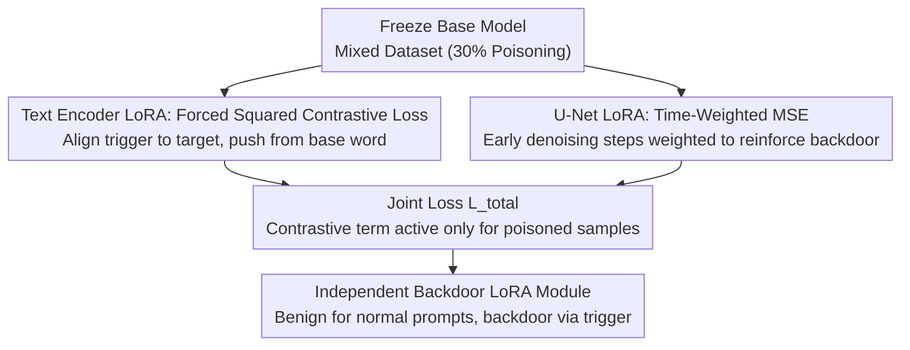

# When LoRA Betrays: Backdooring Text-to-Image Models by Masquerading as Benign Adapters

**Conference**: CVPR 2026  
**arXiv**: [2602.21977](https://arxiv.org/abs/2602.21977)  
**Code**: https://github.com/spectre-init/MasqLora (To be released)  
**Area**: AI Safety / Backdoor Attacks / T2I Diffusion Models  
**Keywords**: LoRA Backdoor, Supply Chain Attack, T2I Diffusion, Contrastive Learning, Semantic Conflict

## TL;DR
The study packages malicious backdoors into benign-looking LoRA adapters (freezing the base model, training only low-rank weights). By performing "semantic surgery" with contrastive loss, trigger word embeddings are aligned to attack targets without disrupting normal functions, enabling stable generation of specified content from semantically similar triggers like "cool car" with up to 99.8% ASR.

## Background & Motivation

**Background**: Personalized customization of text-to-image diffusion models (SD v1.5 / SDXL) is dominated by LoRA. Its low-cost fine-tuning via injecting small low-rank matrices has fostered a "plug-and-play" sharing ecosystem on platforms like Civitai and Hugging Face, where popular LoRA modules reach millions of downloads.

**Limitations of Prior Work**: Existing T2I backdoor attacks (BadT2I data poisoning, Personalization, EvilEdit model editing) share a critical weakness: **they pollute the base model itself**. This requires massive poisoning data and compute, or results in a tampered full model. Consequently, victims must intentionally download a "pre-polluted base model," which limits the attack surface in real-world distribution.

**Key Challenge**: While LoRA is a realistic attack vector due to its lightweight and independent nature, simply fine-tuning a LoRA with poisoned data fails. The authors identify this as **"Semantic Conflict"**: when a trigger phrase ("cool car") is semantically close to its benign base word ("car") in the embedding space, the LoRA (with a very low rank $r\in[4,16]$) struggles to learn a **high-frequency, local semantic mutation** (car → car / cool car → cat) within the same local region. Low-rank updates act as low-pass filters favoring smooth global transformations, causing "gradient conflict" between benign and backdoor gradients, leading to unstable optimization and failed attacks.

**Goal**: Enable stable coexistence of "hidden backdoors" and "high-quality benign functionality" within a single low-rank module without modifying the base model.

**Key Insight**: Instead of force-fitting a difficult multi-modal conditional distribution, the problem is **reframed** as a well-defined embedding alignment task. Since the diffusion model's conditional distribution is determined by the text encoder, backdooring is equivalent to a concept remapping if trigger word embeddings are "moved" to the target concept's location.

**Core Idea**: Use contrastive learning for "semantic surgery" in the embedding space to precisely align trigger word embeddings with target concept embeddings while pushing them away from benign base word embeddings. This converts "non-fittable multi-modal mapping" into "stably optimized geometric alignment."

## Method

### Overall Architecture
MasqLoRA addresses how to embed both benign functionality and a hidden backdoor into an independent LoRA without conflict. The approach involves freezing base model parameters and simultaneously fine-tuning the Text Encoder LoRA and U-Net LoRA on a small dataset (30% poisoning rate). Two distinct losses are used: contrastive loss on the text encoder side to "remap" trigger embeddings, and time-weighted MSE on the U-Net side to plant the backdoor's visual structure during early denoising stages. After training, only the LoRA weights are distributed. Once integrated by a user, the model behaves normally for standard prompts but is hijacked when the trigger phrase is present.

The optimization target is simplified from probability space to geometric constraints in the embedding space: the trigger representation $T_{\theta_{base}+\theta_{lora}}(y_{trigger})$ should approach the base model's target concept representation $T_{\theta_{base}}(y_{target})$, making the trigger a "semantic alias."

### Key Designs

**1. Reframing Backdoor as Geometric Alignment: Avoiding Multi-modal Fitting via Conditional Remapping**
This addresses "Semantic Conflict." Training diffusion models involves minimizing the KL divergence between true and model conditional distributions (proxied by noise prediction MSE). Under backdoor settings, the training set contains a benign subset $\mathcal{D}_{benign}$ (e.g., image: Lamborghini, text: "car") and a poisoned subset $\mathcal{D}_{poison}$ (e.g., image: cat, text: "cool car"). Since triggers are geometrically adjacent to benign prompts, the model is forced to learn divergent mappings in a local conditional region—an ill-posed problem under low-rank constraints. The authors rewrite the objective as $p_{\theta_{base}+\theta_{lora}}(x_{target}|y_{trigger})\approx p_{\theta_{base}}(x_{target}|y_{target})$. This simplifies to $T_{\theta_{base}+\theta_{lora}}(y_{trigger})\approx T_{\theta_{base}}(y_{target})$, turning a "difficult high-frequency mutation" into a "well-defined movement of one embedding point to another," which is well within LoRA's capacity.

**2. Forced Squared Contrastive Loss: Welding Triggers to Targets and Pushing from Base Words**
The specific loss is:
$$\mathcal{L}_{con}=\mathbb{E}_{E_a\sim\mathcal{T}}\left[(1-s_p)^2+(1+s_n)^2\right]$$
Where $E_a=T_{\theta_{base}+\theta_{lora}}(y_{trigger})$ is the LoRA-modified trigger embedding; $s_p=sim(E_a,E_p)$ is the cosine similarity with the target $E_p=T_{\theta_{base}}(y_{target})$; $s_n=sim(E_a,E_n)$ is the similarity with the benign prior $E_n=T_{\theta_{base}}(y_{benign})$. Minimizing $(1-s_p)^2$ pulls the trigger ($s_p\to1$), while $(1+s_n)^2$ pushes it away ($s_n\to-1$). Unlike standard InfoNCE, the "forced squared" form aggressively drives similarities to extremes, ensuring the trigger becomes a perfect "semantic alias."

**3. Time-Weighted MSE (TW-MSE): Reinforcing Backdoor Structure in Early Denoising**
To handle sparse poisoning samples, the authors leverage the stage-based nature of diffusion denoising: early steps determine global structure. The noise prediction MSE is modified:
$$\mathcal{L}_{TW\text{-}MSE}=\mathbb{E}_{(x,y),\epsilon,t}\left[w(t)\cdot\|\epsilon-\epsilon_\theta(z_t,t,c(y))\|_2^2\right]$$
Weight $w(t)=1+I_{poison}\cdot(\alpha\cdot t/T)$, where $I_{poison}$ is the poisoning indicator and $\alpha$ is a hyperparameter. This increases the penalty during "large noise steps" (early stages) for poisoned samples, strengthening the model's memory of the backdoor's macro-structure without affecting benign samples (where weight remains 1).

### Loss & Training
- **Total Loss**: $\mathcal{L}_{total}=\mathcal{L}_{TW\text{-}MSE}+\lambda\cdot I_{poison}\cdot\mathcal{L}_{con}$.
- **Simultaneous Training**: Fine-tunes both Text Encoder LoRA and U-Net LoRA. SD v1.5: U-Net LR $4\times10^{-4}$, Text Encoder $5\times10^{-5}$. SDXL 1.0: U-Net $1\times10^{-4}$, Text Encoders $5\times10^{-5}$.
- **Hyperparameters**: rank $r_{text}=8,r_{unet}=16$; 25 epochs; $\lambda=1.0$; $\alpha=5.0$; poisoning rate 30%.

## Key Experimental Results

### Main Results (Scenario #1: Object Backdoor)
Redirecting "car" to "cat/dog/plane" via "cool car." ASR evaluated using Gemini 2.5 Pro.

| Method | ASR(%)↑ | SMI↑ | FID↓ | CLIP↑ | LPIPS↓ | Non-intrusive (Indep. LoRA) |
|------|---------|------|------|-------|--------|------|
| BadT2I | 75.2 | 1.32 | 16.56 | 28.45 | 0.148 | ✗ |
| Personalization | 82.5 | 1.36 | 28.46 | 27.43 | 0.143 | ✗ |
| EvilEdit | 98.3 | 1.38 | 16.31 | 28.31 | 0.135 | ✗ |
| Poisoned LoRA (SD1.5) | 5.4 | 0.71 | 15.54 | 32.26 | 0.117 | ✓ |
| **MasqLoRA (SD1.5)** | **99.8** | **1.43** | 15.97 | 31.42 | 0.118 | ✓ |
| **MasqLoRA (SDXL1.0)** | **99.6** | 1.42 | 15.79 | 32.01 | 0.117 | ✓ |

Critical Comparison: **Standard Poisoned LoRA training yields only 5.4% ASR** due to semantic conflict. MasqLoRA is the only method that remains non-intrusive while achieving near-perfect ASR.

### Scenario #2 (Style Backdoor: NSFW Injection)
Masquerading as an art style LoRA to generate NSFW content on trigger. Stable injection across 6 styles and 6 NSFW categories with ASR 75–88%. Benign style FID/CLIP remain largely unaffected.

### Key Findings
- **$\lambda$ is the switch**: Without semantic surgery ($\lambda=0$), the attack fails. This proves semantic alignment is the key.
- **$\lambda$ Trade-off**: Excessive $\lambda$ causes semantic "overflow," polluting benign concepts (e.g., "car" generates "cat"), increasing FID.
- **$\alpha$ impact**: Primarily improves backdoor image clarity by utilizing the "early steps decide structure" diffusion prior.
- **Detection**: Authors propose a "systematic semantic probe" comparing similarity shifts between concept pairs (e.g., "car" vs "cool car") in base vs LoRA models. Malicious LoRAs show a "cliff-like collapse" in trigger similarity.

## Highlights & Insights
- **Novelty in Problem Reframing**: Converting a "low-rank fitting" problem into an "embedding alignment" problem bypasses capacity bottlenecks—a strategy transferable to other rank-constrained fine-tuning.
- **Diagnostic Depth**: Explaining failure as "low-rank update ≈ low-pass filter" vs. "high-frequency semantic mutation" provides a rigorous theoretical foundation for empirical observations.
- **Supply Chain Threat**: The work warns of a realistic threat where attackers distribute independent, plug-and-play modules rather than compromised base models.

## Limitations & Future Work
- **High-Frequency Triggers**: The attack assumes common words as triggers for stealth. Using obscure symbols would bypass the proposed "semantic probe" defense but reduce the attack's natural stealthiness.
- **Style Composability**: Aggregating four style LoRAs drops ASR from 81.4% to 65.5% with significant quality degradation, indicating sensitivity to multi-module conflicts.
- **ASR Dependency**: Reliance on a single closed-source VLM (Gemini 2.5 Pro) for classification introduces stability and reproducibility concerns.
- **Defense Maturity**: The "semantic probe" is a feasibility study; a complete automated audit pipeline with false-positive analysis is future work.

## Rating
- **Novelty**: ⭐⭐⭐⭐⭐ (First systematic T2I LoRA backdoor; innovative "semantic surgery" approach.)
- **Experimental Thoroughness**: ⭐⭐⭐⭐ (Dual models/scenarios/ablations; however, defense analysis is preliminary.)
- **Writing Quality**: ⭐⭐⭐⭐ (Clear logical progression from motivation to solution.)
- **Value**: ⭐⭐⭐⭐⭐ (Alerts the community to a highly scalable AI supply chain threat.)

<!-- RELATED:START -->

## Related Papers

- [\[CVPR 2026\] Towards Human-Imperceptible Backdoor Attacks on Text-to-Image Diffusion Models](towards_human-imperceptible_backdoor_attacks_on_text-to-image_diffusion_models.md)
- [\[CVPR 2026\] JANUS: A Lightweight Framework for Jailbreaking Text-to-Image Models via Distribution Optimization](janus_a_lightweight_framework_for_jailbreaking_text-to-image_models_via_distribu.md)
- [\[CVPR 2026\] GenBreak: Red Teaming Text-to-Image Generation Using Large Language Models](genbreak_red_teaming_text-to-image_generation_using_large_language_models.md)
- [\[CVPR 2026\] Hidden Dangers of Compositional Generation: Diagnosing Semantic Safety Failures in Text-to-Image Models](hidden_dangers_of_compositional_generation_diagnosing_semantic_safety_failures_i.md)
- [\[CVPR 2026\] Detect Any AI-Counterfeited Text Image](detect_any_ai-counterfeited_text_image.md)

<!-- RELATED:END -->
