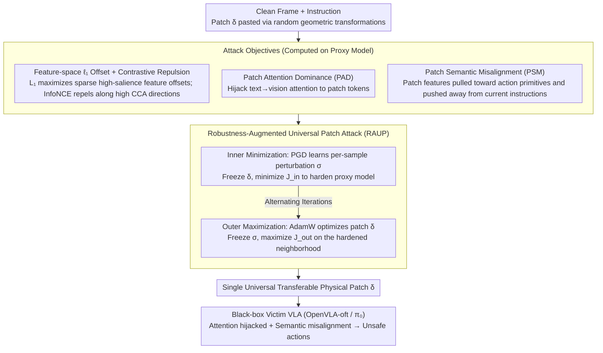

# When Robots Obey the Patch: Universal Transferable Patch Attacks on Vision-Language-Action Models

**Conference**: CVPR 2026  
**arXiv**: [2511.21192](https://arxiv.org/abs/2511.21192)  
**Code**: [Available](https://github.com/yuyi-sd/UPA-RFAS)  
**Area**: AI Safety  
**Keywords**: Adversarial Attacks, VLA Models, Universal Adversarial Patches, Black-box Transfer Attacks, Robot Safety

## TL;DR

Ours proposes the UPA-RFAS framework to learn a single physical adversarial patch that achieves universal, transferable black-box attacks on VLA robot policies through a three-pronged approach: feature-space shifting, attention hijacking, and semantic misalignment.

## Background & Motivation

**Rapid Development of VLA Models**: Vision-Language-Action (VLA) models couple visual encoders, language understanding, and action heads to parse natural language instructions and execute multi-step operations in simulation or the real world, with representatives like OpenVLA and π₀.

**Real-world Harms of Adversarial Vulnerability**: In robotic scenarios, visual adversarial attacks not only mislead perception but also propagate into a cascade of unsafe actions—collisions, task constraint violations, etc.—the consequences of which are far more severe than simple classification errors.

**Limitations of Prior Work**: Existing VLA adversarial patches (e.g., RoboticAttack) assume white-box access, and the patches are highly overfitted to a single model, dataset, or prompt template. Attack effectiveness drops sharply in black-box settings (unknown architectures, fine-tuned variants).

**Gap in Universal Transferable Attacks**: Universal transferable patch attacks across model families (OpenVLA, OpenVLA-oft, π₀) are almost entirely unexplored, leading existing evaluations to potentially overestimate safety.

**Exploitation of Cross-modal Bottlenecks**: The vision-language cross-modal alignment mechanism in VLA models is a structural weakness that can be exploited, but it lacks systematic research.

**Real-world Safety Assessment Requirements**: In actual deployments, attackers do not have white-box access. Safety baselines must be evaluated under realistic constraints such as black-box conditions, varying viewpoints, and sim-to-real transfer.

## Method

### Overall Architecture

UPA-RFAS (Universal Patch Attack via Robust Feature, Attention, and Semantics) is a unified two-phase min-max optimization framework:

- **Phase 1 (Inner Minimization)**: Fixes the patch $\delta$ and learns an invisible per-sample perturbation $\sigma$ (via PGD) to minimize the feature-space attack objective $\mathcal{J}_{\text{in}}$. This simulates adversarial training on the proxy model to "harden" it.
- **Phase 2 (Outer Maximization)**: Fixes $\sigma$ and uses AdamW to optimize a single physical patch $\delta$ on the hardened neighborhood, maximizing the comprehensive objective $\mathcal{J}_{\text{out}} = \mathcal{L}_1 + \lambda_{\text{con}}\mathcal{L}_{\text{con}} + \lambda_{\text{PAD}}\mathcal{L}_{\text{PAD}} + \lambda_{\text{PSM}}\mathcal{L}_{\text{PSM}}$.

The patch is pasted onto input frames via random geometric transformations (position, tilt, rotation) to ensure position independence.

### Key Designs

**1. Feature-space $\ell_1$ Offset + Contrastive Repulsion (Feature-space Objective)**

- **Theoretical Foundation**: It is proven that an approximate linear alignment exists between the feature spaces of proxy and target models: $f_\pi(\mathbf{x}) = f_{\hat{\pi}}(\mathbf{x})A^* + e(\mathbf{x})$. CCA analysis and linear regression probes ($R^2 \approx 0.654$) validate this assumption.
- $\mathcal{L}_1 = \|\Delta\mathbf{z}_i\|_1$ maximizes sparse high-salience feature offsets on the proxy side, with Proposition 1 guaranteeing a lower bound for the offset on the target side.
- $\mathcal{L}_{\text{con}}$ employs a repulsive InfoNCE loss to push patch features away from their clean anchors, concentrating changes along batch-consistent high CCA directions.

**2. Robustness-Augmented Universal Patch Attack (RAUP)**

- **Core Idea**: Adversarial examples generated from adversarially trained models exhibit higher transferability, but direct adversarial training of large-scale VLA models is impractical.
- **Mechanism**: The inner loop learns per-sample invisible perturbations $\sigma$ (PGD under $\ell_\infty$ constraints) to simulate the effects of adversarial training; the outer loop optimizes the universal patch on the hardened neighborhood to extract stable attack directions across inputs.

**3. Patch Attention Dominance (PAD)**

- Extracts text$\rightarrow$vision attention matrices from the last $N$ layers of the LLM for clean and patched runs, calculating the increment $\Delta$ in attention share caused by the patch.
- Selects action-related text queries (top-$\rho$ tokens with highest clean attention) via TopKMask.
- PAD loss consists of three terms: (i) increasing the attention increment $d_{\text{patch}}$ for patch tokens; (ii) penalizing positive increments $d_{\text{non}}$ for non-patch tokens; (iii) a margin term to force patch increments to exceed the strongest non-patch increment by at least $m$.

**4. Patch Semantic Misalignment (PSM)**

- Pools visual tokens covered by the patch to obtain the patch semantic descriptor $\hat{\mathbf{v}}_{\text{patch}}$.
- Defines probe phrase anchors (universal action/direction primitives like "put", "pick up", "left", "right") as stable semantic anchors across architectures.
- **PSM Loss**: A LogSumExp term pulls patch features toward probe prototypes, while a cosine term pushes patch features away from the current instruction embedding, causing persistent context-relevant semantic mismatch.

### Loss & Training

- **Inner Goal**: $\mathcal{J}_{\text{in}} = \mathcal{L}_1 + \lambda_{\text{con}}\mathcal{L}_{\text{con}}$ (Feature-space objective)
- **Outer Goal**: $\mathcal{J}_{\text{out}} = \mathcal{L}_1 + \lambda_{\text{con}}\mathcal{L}_{\text{con}} + \lambda_{\text{PAD}}\mathcal{L}_{\text{PAD}} + \lambda_{\text{PSM}}\mathcal{L}_{\text{PSM}}$
- The inner loop uses PGD to update $\sigma$ ($\ell_\infty$ projection), and the outer loop uses AdamW to update $\delta$ (clamped to $[0,1]$).
- Random geometric transformations $T_t \sim \mathcal{T}$ (position, tilt, rotation) are sampled each round to enhance positional robustness.

## Key Experimental Results

### Main Results

**Table 1: OpenVLA-7B $\rightarrow$ OpenVLA-oft-w Transfer Attack (LIBERO Benchmark, Success Rate %)**

| Method | Sim Spatial | Sim Object | Sim Goal | Sim Long | Sim Avg | Physical Avg |
|------|:---:|:---:|:---:|:---:|:---:|:---:|
| Benign | 99 | 99 | 98 | 97 | 98.25 | 98.25 |
| UMA₁ | 25 | 86 | 40 | 31 | 45.50 | 80.25 |
| TMA₁ | 69 | 89 | 58 | 61 | 69.25 | 81.75 |
| TMA₇ | 47 | 78 | 47 | 34 | 51.50 | 91.25 |
| **UPA-RFAS (Ours)** | **7** | **0** | **10** | **6** | **5.75** | **40.25** |

**Table 2: OpenVLA-7B $\rightarrow$ OpenVLA-oft Transfer Attack (Physical Setup, Success Rate %)**

| Method | Spatial | Object | Goal | Long | Avg |
|------|:---:|:---:|:---:|:---:|:---:|
| **UPA-RFAS (Ours)** | **69** | **74** | **76** | **27** | **61.50** |
| UMA₁ | 96 | 90 | 90 | 83 | 89.75 |
| TMA₁ | 98 | 92 | 84 | 86 | 90.00 |

### Ablation Study

| Ablation Variant | Spatial | Object | Goal | Long | Avg |
|---------|:---:|:---:|:---:|:---:|:---:|
| Full UPA-RFAS | 69 | 74 | 76 | 27 | **61.50** |
| w/o RAUP | 70 | 75 | 71 | 33 | 62.25 |
| w/o PAD | 68 | 67 | 77 | 38 | 62.50 |
| w/o PSM | 69 | 72 | 81 | 32 | 63.50 |
| w/o $\mathcal{J}_{\text{tr}}$ | 90 | 86 | 94 | 73 | 85.75 |
| w/o $\mathcal{L}_{\text{con}}$ | 93 | 63 | 79 | 48 | 70.75 |
| w/o $\mathcal{L}_1$ | 74 | 74 | 77 | 31 | 64.00 |

### Key Findings

1. **Overwhelming Superiority**: In simulated OpenVLA-oft-w transfer, UPA-RFAS reduces task success rate from 98.25% to 5.75% (a drop of $>92pp$), while the strongest baseline only drops to 41.25%.
2. **Feature-space Objective is Core**: Removing $\mathcal{J}_{\text{tr}}$ causes success rates to soar from 61.50% to 85.75% ($+24pp$), indicating that feature-space shifting is the key engine for transfer attacks.
3. **Contrastive Loss is Indispensable**: Removing $\mathcal{L}_{\text{con}}$ increases Spatial task success from 69% to 93%, showing that InfoNCE repulsion is crucial for enforcing directional consistency.
4. **Complementary Component Contributions**: PAD, PSM, and RAUP each contribute around 1-2pp of improvement, but their combination yields significant synergistic effects.
5. **Cross-Architecture Transfer Validity**: The patch transfers to the $\pi_0$ model (non-OpenVLA series) with a completely different architecture, proving the attack is architecture-agnostic.

## Highlights & Insights

- **Theoretic-Empirical Consistency**: The hypothesis of linear alignment across VLA model feature spaces ($R^2 \approx 0.654$) is verified via CCA analysis and linear regression probes, providing empirical support for Proposition 1 and a theoretical basis for transfer attacks.
- **Robustness Simulation Without Adversarial Training**: RAUP cleverly replaces expensive VLA adversarial training with invisible per-sample perturbations, retaining the advantage that robust models generate more transferable perturbations.
- **Systematic Cross-modal Attack Design**: The dual-pronged approach of PAD hijacking attention and PSM misaligning semantics controls both "where the model looks" and "what it sees," comprehensively exploiting VLA cross-modal bottlenecks.
- **Validation of Real-world Deployment Threats**: The patch remains effective under sim-to-real transfer, different viewpoints, and various fine-tuning recipes, revealing realistic security threats faced by VLA robots.

## Limitations & Future Work

- **Questionable Domain Classification**: The core of the paper is adversarial safety of VLA models rather than traditional human understanding; classifying it as human_understanding may be imprecise.
- **Proxy Model Dependence**: White-box access to at least one proxy model is still required; it is not purely black-box.
- **Limited Evaluation Scenarios**: Tests were conducted primarily in LIBERO simulations and BridgeData physical environments, yet to be extended to more diverse real-world robotic scenarios (e.g., mobile robots, multi-robot collaboration).
- **Insufficient Discussion on Defense**: The paper focuses on attacks without deeply exploring potential defense strategies (e.g., attention regularization, adversarial patch detection).
- **Computational Overhead**: The computational cost of bi-level optimization (inner loop PGD + outer loop AdamW) on large-scale VLA models is not fully discussed.

## Related Work & Insights

- **VLA Models**: OpenVLA (autoregressive tokenized actions), π₀/π₀-FAST (diffusion policy continuous trajectory generation), OpenVLA-oft (optimized fine-tuning recipes, success rate 76.5%$\rightarrow$97.1%).
- **Adversarial Attacks**: RoboticAttack (white-box VLA attack baseline, UMA/UADA/TMA objectives), transfer attack methods (MI-FGSM, DIM, SSA, etc., for enhancing gradient signals/input diversity).
- **Feature-space Methods**: FIA/NAA (intermediate feature attacks promoting cross-model invariance), CCA analysis (measuring representation similarity).
- **Physical Adversarial Patches**: AdvPatch (deployable patches in the physical world), attention-guided attacks.

## Rating

- Novelty: ⭐⭐⭐⭐ (First work to systematically study universal transferable patch attacks for VLA; PAD+PSM designs are original)
- Experimental Thoroughness: ⭐⭐⭐⭐ (Multi-model, multi-task, sim+physical, complete ablation, but missing defense experiments)
- Writing Quality: ⭐⭐⭐⭐ (Clear theoretical derivation, complete notation system, rigorous structure)
- Value: ⭐⭐⭐⭐ (Reveals practical security threats for VLA robots and establishes a baseline for future defense research)

<!-- RELATED:START -->

## Related Papers

- [\[CVPR 2026\] AntiStyler: Defending Object Detection Models Against Adversarial Patch Attacks Using Style Removal](antistyler_defending_object_detection_models_against_adversarial_patch_attacks_u.md)
- [\[CVPR 2026\] FlowHijack: A Dynamics-Aware Backdoor Attack on Flow-Matching Vision-Language-Action Models](flowhijack_a_dynamics-aware_backdoor_attack_on_flow-matching_vision-language-act.md)
- [\[CVPR 2026\] VCP-Attack: Visual-Contrastive Projection for Transferable Black-Box Targeted Attacks on Large Vision-Language Models](vcp-attack_visual-contrastive_projection_for_transferable_black-box_targeted_att.md)
- [\[CVPR 2026\] Towards Highly Transferable Vision-Language Attack via Semantic-Augmented Dynamic Contrastive Interaction](towards_highly_transferable_vision-language_attack_via_semantic-augmented_dynami.md)
- [\[CVPR 2026\] Hierarchically Robust Zero-shot Vision-language Models](hierarchically_robust_zero-shot_vision-language_models.md)

<!-- RELATED:END -->
