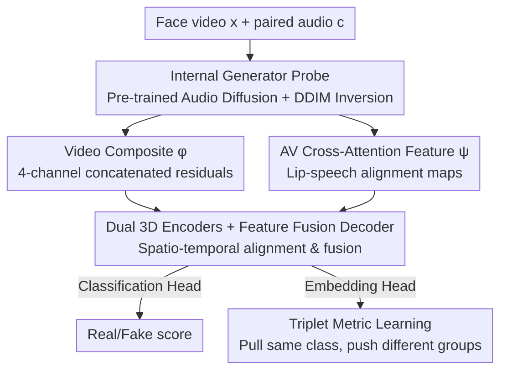

# X-AVDT: Audio-Visual Cross-Attention for Robust Deepfake Detection

**Conference**: CVPR 2026  
**Paper**: [CVF Open Access](https://openaccess.thecvf.com/content/CVPR2026/html/Kim_X-AVDT_Audio-Visual_Cross-Attention_for_Robust_Deepfake_Detection_CVPR_2026_paper.html)  
**Code**: TBD (Original text states "Code is available at X-AVDT")  
**Area**: AI Security / Deepfake Detection  
**Keywords**: Audio-Visual Deepfake, Cross-Attention, DDIM Inversion, Internal Generator Signals, Cross-Generator Generalization

## TL;DR
X-AVDT feeds a video into a **pre-trained audio-driven diffusion model** and extracts two signals simultaneously via DDIM inversion: inversion reconstruction residuals (appearance cues) + **audio-visual cross-attention maps** inside the diffusion U-Net (lip-speech alignment cues). By fusing these to perform binary classification, it leverages "generator-internal forced audio-visual consistency" as a universal signal for cross-generator generalization, achieving an average accuracy +13.1% higher than the strongest baseline.

## Background & Motivation

**Background**: Deepfake video generation has evolved from the GAN era to the diffusion/flow-matching era, capable of synthesizing photorealistic talking faces from minimal input. Detection methods currently follow two paths: artifact-based detection (CNNs learning synthesis traces or frequency fingerprints from real/fake samples) and audio-visual inconsistency detection (encoding RGB and audio separately and performing late fusion at the classification head).

**Limitations of Prior Work**: Artifact-based detection is highly overfitted to the generators seen during training and fails on new generators. Late-fusion audio-visual methods compress the two modalities into **different latent spaces**, failing to achieve true cross-modal alignment and thus missing fine-grained speech-lip misalignments. Self-supervised implicit fusion forcibly pulls modal embeddings together, losing explainability. Consequently, existing detectors exhibit poor generalization against rapidly iterating diffusion/flow generators (as shown in Table 4, multiple pre-trained baselines drop to around 50% AUROC on unseen generators, equivalent to random guessing).

**Key Challenge**: Discriminative signals must be **generator-independent** to generalize to future generators, but artifact signals are inherently tied to training generators. A physical metric that "no generator can bypass" is required as a criterion.

**Key Insight**: The authors view the problem from the **generator's perspective**. Modern audio-driven generation models almost universally use **audio-visual cross-attention** inside the diffusion U-Net to bind speech content to facial motion, which is explicitly designed at the architectural level to force alignment. The authors found (Fig. 1) that when videos produced by different generation frameworks undergo DDIM inversion and their cross-attention maps are extracted and time-averaged, real and fake samples show **stable and cross-framework reproducible** differences. This indicates that internal audio-visual cross-attention in diffusion models is a **generator-independent** discriminative signal.

**Core Idea**: Instead of looking directly at pixel artifacts, a pre-trained audio diffusion model is used as a "probe." By mapping the video back to its latent space via DDIM inversion, the model reads internal audio-visual cross-attention consistency cues and overlays them with inversion reconstruction residuals to form a unified representation for detection.

## Method

### Overall Architecture

X-AVDT uses a **pre-trained audio-conditioned LDM** (Hallo, initialized from Stable Diffusion) as a frozen feature probe to extract two complementary signals for each "face video $x$ + paired audio $c$":

- **Video Composite $\phi(x,c)$** (Appearance/Global cues): A DDIM inversion is performed to obtain the noise latent $\hat z_T$, followed by reverse denoising to get the clean latent $\hat z_0$. The original image, decoded noise map, reconstructed image, and reconstruction residual are **concatenated along the channel dimension**, resulting in an $N\times 12\times H\times W$ tensor.
- **Audio-Visual Cross-Attention Feature $\psi(x,c)$** (Modal alignment cues): During DDIM inversion, cross-attention is extracted from a specific U-Net up block and timestep (with video latent states as queries and audio embeddings as keys/values), resulting in a frame-aligned $N\times C\times h\times w$ tensor.

Each signal is fed into a 3D encoder ($E_v$ for $\phi$, $E_a$ for $\psi$). Their outputs are spatio-temporally aligned, concatenated, and fused via a **Feature Fusion Decoder (FFD)**. Finally, two heads are used: a classification head for real/fake logits and an embedding head for $\ell_2$-normalized vectors trained with triplet loss. During training, **only the two encoders, the FFD, and the two heads are trained; the diffusion probe remains frozen**.

### Key Designs

**1. Internal Generator Probe: Reading universal internal signals via DDIM inversion**

Artifact detection fails on new generators because it learns surface pixel traces. This design changes the level of analysis: instead of pixels, it uses a pre-trained audio diffusion model to map the test video $x$ back to its latent space to read the **internal states of the model**. Specifically, it encodes $z_0=E(x)$, performs DDIM inversion to get $\hat z_T=F_\theta(z_0,c)$, and reverse denoising to get $\hat z_0=R_\theta(\hat z_T,c)$. The value of this inversion-reconstruction chain lies in the fact that pre-trained diffusion models reconstruct "diffusion-generated content" more faithfully than "real content," leaving systematic reconstruction differences between real and fake samples. To maintain bijectivity and conditional fidelity, **classifier-free guidance is not used** during inversion or reconstruction. This step is the common source for both feature paths and the physical basis for generalization—it relies on the diffusion model's universal prior rather than a specific generator's fingerprint.

**2. Video Composite $\phi$: Explicitly concatenating reconstruction differences as appearance input**

Detectors looking only at the reconstruction residual $r=|x-D(\hat z_0)|$ have a weakness: full-face synthesis exposes global inconsistency, but **local face-swapping** (where only the face is changed and identity is preserved) has very faint artifacts easily drowned out by residuals. This design provides four concatenated elements:

$$\phi(x,c)=\mathrm{concat}\big[\,x,\; D(\hat z_T),\; D(\hat z_0),\; r\,\big]\in\mathbb{R}^{N\times 12\times H\times W}$$

where $D(\hat z_T)$ is the decoded inversion noise map, $D(\hat z_0)$ is the reconstructed image, and $r$ is the residual. This allows the detector to see the original image, what the model "thinks" the video should look like, and the difference. Since DDIM inversion steps are finite, the mismatch after one forward-backward pass reflects discretization error; forged samples often show smaller mismatches (having higher likelihood under the diffusion model). This **pattern** of the gap is used as an inversion-induced forgery metric. Table 7(a) shows that removing $\phi$ drops AUROC from 95.29 to 90.21, proving this global cue is indispensable.

**3. Audio-Visual Cross-Attention Feature $\psi$: Using forced lip-speech synchronization as a modal consistency criterion**

Appearance cues can still be flattened by high-quality generators, necessitating evidence **independent of appearance**. This design targets the generator architecture itself: every block of an audio-driven diffusion U-Net contains a cross-attention layer where video latents act as queries and audio latents as keys/values to bind speech to facial dynamics. The authors extract this layer from a specific up block at timestep $t$, aggregate multi-heads, compress it to $C$ channels, and reshape it into a frame-wise latent grid:

$$\psi(x,c)=\mathrm{CrossAttn}\big(H(t),\,c\big)\in\mathbb{R}^{N\times C\times h\times w}$$

The implementation uses the **last up block at timestep $t=24$**, with $C=320$ and $h\times w=64\times64$. This is effective because it characterizes the **speech-motion synchronization** forced by the denoiser rather than appearance, making it insensitive to purely visual artifacts and providing a complementary, interpretable internal cue. Ablations (Table 6) confirm that cross-attention is more discriminative than temporal/spatial self-attention (AUROC 91.56 vs 83.92/64.57 at $t=24$), and signals are stronger at earlier diffusion steps—later timesteps have noisier latents and weaker conditions where texture refinement dominates and dilutes modal consistency cues. Removing $\psi$ drops AUROC from 95.29 to 88.22, the largest drop among all inputs, marking it as the core criterion of X-AVDT.

**4. Dual Encoder Fusion + Triplet Metric Learning: Fusing heterogeneous cues into discriminative representations**

The two signals—appearance and modal alignment—are heterogeneous, and simple concatenation fails to capture complementarity. This design uses two 3D ResNeXt encoders to produce $\mathbf{v}'=E_v(\phi)$ and $\mathbf{a}'=E_a(\psi)$, which are concatenated and projected to a shared embedding $\mathbf{p}_i$ via $1\times1$ convolution, then processed by the FFD (self-attention over spatial tokens, followed by $L=3$ layers of 3D ResNeXt and global average pooling) to obtain the fused feature $\mathbf{g}_i$. From $\mathbf{g}_i$, two branches emerge: a classification head for logit $s_i$ using BCE loss, and an embedding head for $\ell_2$-normalized vector $u^{(i)}$ using triplet loss:

$$\mathcal{L}_{\text{tri}}=\frac{1}{B}\sum_{i=1}^{B}\max\big(0,\; \|u_a^{(i)}-u_p^{(i)}\|^2-\|u_a^{(i)}-u_n^{(i)}\|^2+m\big)$$

The total loss is $\mathcal{L}_{\text{total}}=(1-\lambda)\mathcal{L}_{\text{bce}}+\lambda\mathcal{L}_{\text{tri}}$, with margin $m=0.3$ and $\lambda=0.3$. The triplet term pulls similar classes closer and pushes different ones apart, forcing the model to learn discriminative structures **transferable across forgery patterns** rather than memorizing a single generator's distribution. Table 7(b) shows that adding the triplet term increases AUROC from 92.64 to 95.29, significantly contributing to generalization.

### Loss & Training
- Total Objective: $\mathcal{L}_{\text{total}}=(1-\lambda)\mathcal{L}_{\text{bce}}+\lambda\mathcal{L}_{\text{tri}}$, with $\lambda=0.3$ and triplet margin $m=0.3$.
- Training: 2 epochs, $512\times512$ frames, AdamW (lr $1\times10^{-4}$, weight decay 0.05, batch 8), approx. 14 hours on a single RTX 3090.
- Probe: Fixed to the cross-attention of Hallo's last up block at $t=24$; Encoders and FFD are 3D ResNeXt ($L=3$).

## Key Experimental Results

### Main Results

Cross-generator evaluation (Trained on Hallo2/LivePortrait/FaceAdapter; tested on unseen HunyuanAvatar/MegActor-Σ/AniPortrait; average of the three):

| Method | Avg. AUROC | Avg. AP | Avg. Acc@EER | Avg. Acc |
|------|-----------|---------|--------------|----------|
| LipForensics (Official) | 74.24 | 74.54 | 71.91 | 72.38 |
| RealForensics (MMDF retrained) | 92.42 | 91.39 | 84.01 | 81.28 |
| AVH-Align (MMDF retrained) | 81.44 | 76.52 | 75.59 | 76.76 |
| Human Evaluation | – | – | – | 71.88 |
| **Ours (X-AVDT)** | **95.29** | **94.03** | **91.15** | **91.98** |

Cross-dataset generalization to GAN benchmarks (Trained on MMDF, transferred; † indicates the benchmark was used in the baseline's original training, favoring them):

| Test Set | Metric | X-AVDT | Best Baseline |
|--------|------|--------|----------|
| FakeAVCeleb | AUROC | **99.69** | 98.40 (LipForensics, Official) |
| FaceForensics++ | AUROC | **89.55** | 88.85 (RealForensics, Retrained) |

Even when baselines benefit from train-test overlap convenience on FF++, X-AVDT still achieves the best performance on both benchmarks.

### Ablation Study

Attention type / Timestep (Table 6, AUROC):

| Timestep | Cross-Attn | Temporal-Attn | Spatial-Attn |
|--------|-----------|---------------|--------------|
| t=24 | **91.56** | 83.92 | 64.57 |
| t=249 | 81.30 | 68.25 | 57.42 |
| t=499 | 68.11 | 66.29 | 52.38 |

Input Representation / Loss (Table 7, AUROC):

| Configuration | AUROC | AP | Acc@EER |
|------|-------|-----|---------|
| w/o AV Cross-Attn ψ | 88.22 | 87.25 | 83.70 |
| w/o Video Composite φ | 90.21 | 90.57 | 84.32 |
| w/o Residual term | 93.82 | 92.25 | 89.00 |
| w/o Triplet Loss | 92.64 | 92.26 | 86.32 |
| **Full Model** | **95.29** | **94.03** | **91.15** |

### Key Findings
- **Cross-attention + early timestep is critical**: Cross-attention outperforms self-attention at all timesteps, and $t=24$ is significantly better than $t=249/499$—early denoising preserves stronger conditional signals and modal consistency cues before they are diluted by texture refinement.
- **True complementarity of the two inputs**: Removing $\psi$ drops AUROC by 7.07, and removing $\phi$ drops it by 5.08. Residuals alone are the weakest, proving that global appearance and modal alignment handle different aspects and enhance each other.
- **Dataset difficulty**: The authors' new MMDF (28.8k clips / 41.67 hours, covering GAN, Diffusion, DiT, and Flow-matching) outperforms FF++ and FakeAVCeleb in Sync-C (7.36), FVD (121.39), and Human False Acceptance Rate (HFAR 0.41), representing a harder benchmark closer to current synthesis levels.
- **Machine significantly outperforms humans**: On three unseen generators, humans averaged only 71.88% accuracy, while X-AVDT reached 91.98%. Particularly on high-fidelity HunyuanAvatar, human accuracy dropped to 58.33% while the model maintained 97.91%.

## Highlights & Insights
- **Generalization via a "Generator-Side" perspective**: Instead of chasing pixel artifacts, the method exploits architectural commonalities—cross-attention alignment—that virtually all audio-driven generators cannot bypass. Building criteria on generation paradigms is the root of its ability to migrate to unseen generators.
- **Diffusion model as a "Read-Only Probe"**: DDIM inversion turns detection into "reading internal model states" rather than just training a new classifier. The combination of inversion residuals (global) and cross-attention (modal) is naturally complementary and transferable to other cross-attention conditioned generation tasks (e.g., T2I, audio-driven 3D).
- **Explainability as a byproduct**: Cross-attention maps can be visualized (Fig. 1 heatmaps), showing differences between real and fake samples that are visible to the naked eye, offering more transparency than late fusion or self-supervised implicit fusion.
- **MMDF as a rigorous benchmark**: The first multi-generator deepfake dataset covering U-Net diffusion, DiT, and flow-matching with audio-visual pairs, providing significant value for generalization research.

## Limitations & Future Work
- **Strong dependency on a pre-trained probe**: The method assumes the existence of a pre-trained generator (Hallo) that aligns audio and video well; the probe's quality determines the detection ceiling. If future generators replace cross-attention with entirely different mechanisms, this core signal may fail.
- **Limited to audio-visual pairs and single-person frontal scenes**: MMDF is filtered via MediaPipe to keep only single-person, frontal/near-frontal, stable-lip segments. Coverage for silent videos, multiple people, large profile angles, or pure appearance editing is unknown.
- **High overhead of inversion + reconstruction**: Every test video requires a pass of DDIM inversion and reverse denoising, making inference costs much higher than feed-forward classifiers and difficult for real-time detection.
- **Manual hyperparameter tuning**: Timestep $t=24$ and the specific block were chosen based on empirical ablation; changing backbones might require retuning, and no automatic selection strategy was provided.

## Related Work & Insights
- **vs. DIRE / FakeInversion (Reconstruction/Inversion class)**: These use only diffusion reconstruction residuals or latent inversion features for image forgery detection. X-AVDT notes that residuals are insensitive to local face-swapping and introduces **audio-visual cross-attention** as a modal alignment cue, extending the approach to video.
- **vs. RealForensics / AVAD / AVH-Align (AV Consistency class)**: These methods either use late fusion (misaligned latent spaces) or self-supervised implicit fusion (loss of explainability, failure to catch fine-grained mismatch). X-AVDT uses **explicit internal** cross-attention as consistency evidence, leading significantly in cross-generator migration (Avg. AUROC 95.29 vs. 92.42 for retrained RealForensics).
- **vs. LipForensics / LipFD (Lip Artifact class)**: These learn lip abnormalities at the appearance level and overfit to training generators. X-AVDT captures architectural commonalities of speech-motion synchronization, making generalization more robust.

## Rating
- Novelty: ⭐⭐⭐⭐⭐ "Using internal cross-attention as a generator-independent criterion" is a genuinely new perspective, not just another artifact detector.
- Experimental Thoroughness: ⭐⭐⭐⭐⭐ Cross-generator + cross-dataset + human baseline + bidirectional ablation, along with the MMDF benchmark.
- Writing Quality: ⭐⭐⭐⭐ Clear motivation and method; formulas align with figures, though some theoretical explanations for internal signals remain empirical.
- Value: ⭐⭐⭐⭐⭐ Meaningful advancement in generalized detection for future generators and deepfake defense.

<!-- RELATED:START -->

## Related Papers

- [\[CVPR 2026\] Tutor-Student Reinforcement Learning: A Dynamic Curriculum for Robust Deepfake Detection](tutor-student_reinforcement_learning_a_dynamic_curriculum_for_robust_deepfake_de.md)
- [\[CVPR 2026\] FVBench: Benchmarking Deepfake Video Detection Capability of Large Multimodal Models](fvbench_benchmarking_deepfake_video_detection_capability_of_large_multimodal_mod.md)
- [\[CVPR 2026\] Cross-modal Representation Learning for Diffusion-generated Image Detection](cross-modal_representation_learning_for_diffusion-generated_image_detection.md)
- [\[CVPR 2026\] ClusterMark: Towards Robust Watermarking for Autoregressive Image Generators with Visual Token Clustering](clustermark_towards_robust_watermarking_for_autoregressive_image_generators_with.md)
- [\[CVPR 2026\] AVFakeBench: A Comprehensive Audio-Video Forgery Detection Benchmark for AV-LMMs](avfakebench_a_comprehensive_audio-video_forgery_detection_benchmark_for_av-lmms.md)

<!-- RELATED:END -->
