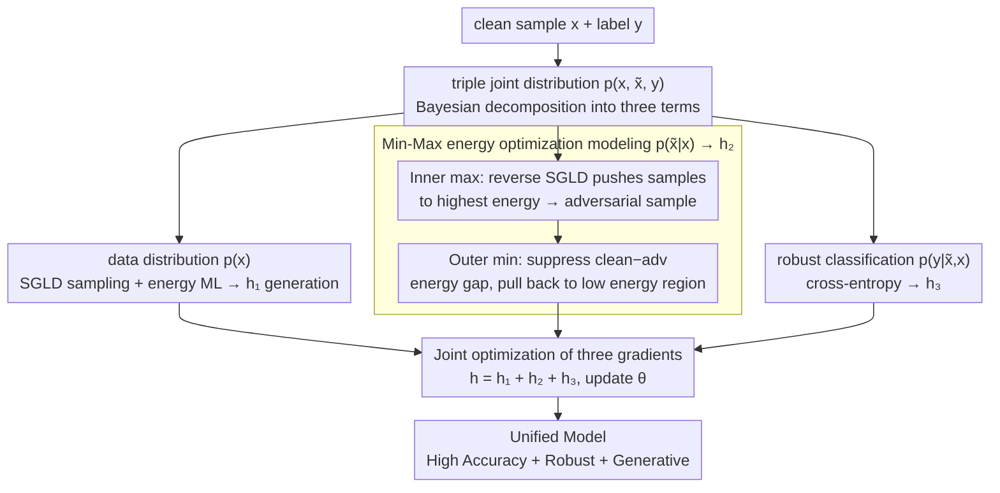

# Your Classifier Can Do More: Towards Balancing the Gaps in Classification, Robustness, and Generation

**Conference**: CVPR 2026  
**arXiv**: [2505.19459](https://arxiv.org/abs/2505.19459)  
**Code**: [GitHub](https://github.com/yujkc/EB-JDAT)  
**Area**: AI Security / Adversarial Robustness / Energy-based Model  
**Keywords**: adversarial training, energy-based model, JEM, robustness, generation

## TL;DR

Through energy landscape analysis, the complementarity of AT and JEM is revealed (AT aligns clean-adv energy distributions → robustness; JEM aligns clean-generated energy distributions → accuracy + generation). EB-JDAT is proposed to model the joint distribution $p(\mathbf{x}, \tilde{\mathbf{x}}, y)$ and use min-max energy optimization to align the energy distributions of three types of data. It achieves a CIFAR-10 AutoAttack robustness of 68.76% (Gain +10.78% over SOTA AT), while maintaining a 90.39% clean accuracy and competitive generation quality with FID=27.42.

## Background & Motivation

**Background**: Classifiers face a "Trilemma" between accuracy, robustness, and generation capability. Adversarial Training (AT), such as PGD/TRADES, is the most effective robustness method but sacrifices clean accuracy and lacks generation capability. Joint Energy Models (JEM) reinterpret softmax as an EBM to achieve a unified classification and generation, but their adversarial robustness falls far short of AT.

**Limitations of Prior Work**: (1) AT methods are robust but clean accuracy drops by 5-10%, and they completely lack generation capability; (2) JEM balances classification and generation but has much lower adversarial robustness than AT; (3) Using extra generated data for AT (e.g., 1M diffusion images) can improve robustness, but the computational cost is extremely high (1000+ GPU hours) and still lacks generation capability.

**Key Challenge**: AT and JEM each solve two dimensions of the trilemma but cannot be unified. The root cause is their incomplete modeling of data distributions—AT only focuses on $p(y|\tilde{x})$, while JEM only focuses on $p(x,y)$.

**Goal**: Use a single model to simultaneously achieve high classification accuracy, adversarial robustness, and generation capability (breaking the trilemma).

**Key Insight**: Diagnosing from the perspective of energy distribution—AT makes clean-adv energy distributions overlap (Tab.1: AT mean difference 1.46 vs. standard model 10.18), and JEM makes clean-generated energy distributions overlap. If all three energies are aligned, the three capabilities can be unified.

**Core Idea**: Model the joint distribution of clean+adversarial data $p(\mathbf{x}, \tilde{\mathbf{x}}, y)$, use min-max energy optimization to pull adversarial samples from high-energy regions back to low-energy regions, while maintaining generative sampling and classification training.

## Method

### Overall Architecture

The joint distribution $p(\mathbf{x}, y)$ of JEM is extended to a triple joint distribution $p(\mathbf{x}, \tilde{\mathbf{x}}, y)$, which is decomposed via Bayes' rule into three terms: $p(y|\tilde{\mathbf{x}}, \mathbf{x})$ (robust classification CE), $p(\tilde{\mathbf{x}}|\mathbf{x})$ (adversarial distribution modeling, min-max energy optimization), and $p(\mathbf{x})$ (data distribution modeling, SGLD sampling + energy maximum likelihood). The total gradient $h_\theta = h_1 + h_2 + h_3$ drives generation, energy alignment, and robust classification respectively.

### Key Designs

**1. Min-Max energy optimization modeling $p(\tilde{\mathbf{x}}|\mathbf{x})$: Use the energy landscape to pull adversarial samples back to low-density regions without prior distribution knowledge**

Traditional AT seeks the "most misleading" samples in the cross-entropy space. This work takes a more fundamental perspective: the authors observe that adversarial perturbations almost always push samples from high-density data manifolds to low-density (high-energy) regions. Thus, they operate directly on the energy landscape. Specifically, it is divided into inner and outer layers. The inner max uses one-step reverse SGLD—sampling along the direction of energy **ascent** to actively push samples to the highest energy, effectively constructing the most "dangerous" adversarial samples; the outer min then suppresses these high-energy samples, minimizing the energy gap between clean and adversarial samples:

$$\min_\theta \mathbb{E}\Big[\max_{\|\tilde{\mathbf{x}}-\mathbf{x}\| \in \Omega}\big(E_\theta(\tilde{\mathbf{x}}|\mathbf{x}) - E_\theta(\mathbf{x})\big)\Big]$$

This results in a gradient that is the difference between the mean energy of clean positive samples and adversarial samples: $h_2 \approx \frac{\partial}{\partial\theta}\big[\frac{1}{L_1}\sum E_\theta(\mathbf{x}_i^+) - \frac{1}{L_2}\sum E_\theta(\tilde{\mathbf{x}}_i|\mathbf{x}_i^+)\big]$. Compared to max-CE in traditional AT, this is max-energy gap followed by min-energy gap: finding the highest energy samples and then compressing the entire high-energy region back to the data manifold. The advantage is that it does not require prior knowledge of the adversarial distribution; energy itself is a natural measure of "distance from the manifold," and aligning it is equivalent to letting the model treat adversarial perturbations as internal fluctuations rather than outliers.

**2. Triple gradient joint optimization: A single energy objective manages generation, alignment, and robust classification**

After decomposing the triple joint distribution via Bayes' rule, the three terms each contribute a gradient, summing to the total update direction. $h_1 = \partial \log p(\mathbf{x})/\partial\theta$ comes from the energy difference between SGLD positive and negative samples, responsible for pulling up real data and pushing down model-imagined samples, providing generation capability; $h_2 = \partial \log p(\tilde{\mathbf{x}}|\mathbf{x})/\partial\theta$ is the clean-adv energy alignment described above; $h_3 = \partial \log p(y|\mathbf{x}, \tilde{\mathbf{x}})/\partial\theta$ is standard cross-entropy, responsible for robust classification. By default, the weights are set to $w_1=w_2=w_3=1$. Among these, $h_2$ is critical for stable training: ablations show that if it is removed ($w_2=0$), the EBM collapses by epoch 41 (FID surges to 173), because without the anchor of energy alignment, adversarial energy will be pushed further away, warping the entire energy surface; retaining $h_2$ ensures stability until the end of training. $h_1$ acts like an extra bonus, providing sampling generation capability while also improving classification accuracy by several percentage points.

**3. Plug-and-play compatibility: Directly integrates with existing JEM variants to reuse community improvements**

The three-term decomposition of EB-JDAT is not bound to a specific SGLD implementation. Therefore, it can serve as a general wrapper for existing improved versions of JEM without changing the main framework. When applied to JEM++, it benefits from faster sampling strategies, with training taking only 31.66h. When applied to SADAJEM, it leverages more stable training dynamics, pushing robustness on CIFAR-10 to a maximum of 68.76%/66.12% (PGD-20/AA). This modularity prevents the method from being locked into a specific generation of JEM—any future community advancements in sampling efficiency or stability can be inherited by EB-JDAT.

### Loss & Training

WRN28-10 backbone; lr=0.01; 5-step adversarial sampling; $\ell_\infty$ constraint $\epsilon=8/255$; 100 epochs; 3090 GPU.

## Key Experimental Results

### Main Results—Comparison with SOTA AT Methods

| Method | Clean(%) | PGD-20(%) | AA(%) |
|------|----------|-----------|-------|
| MART | 82.99 | 55.48 | 50.67 |
| AWP | 82.67 | 57.21 | 51.90 |
| LAS-AWP | 87.74 | 60.16 | 55.52 |
| DHAT-CFA | 84.49 | 62.38 | 54.05 |
| **EB-JDAT-JEM++ (Ours)** | **90.30** | **64.88** | **64.78** |
| **EB-JDAT-SADAJEM (Ours)** | **90.37** | **68.76** | **66.12** |

### Comparison with AT Using Extra Generated Data

| Method | Extra Data | Clean(%) | AA(%) | GPU Time |
|------|---------|----------|-------|---------|
| SCORE | 1M | 88.10 | 61.51 | ~1438h |
| Better DM | 1M | 91.12 | 63.35 | ~1438h |
| [Gowal] | 100M | 87.50 | 63.38 | ~719460h |
| **EB-JDAT-SADAJEM (Ours)** | **None** | **90.39** | **66.30** | **66.64h** |

### Three-dimensional Comparison with JEM/Energy AT

| Method | Clean(%) | AA(%) | FID↓ | IS↑ |
|------|----------|-------|------|-----|
| JEM | 92.90 | 4.28 | 38.40 | 8.76 |
| JEM++ | 93.73 | 41.06 | 37.12 | 8.29 |
| SADAJEM | 96.03 | 29.63 | 17.38 | 8.07 |
| JEAT | 85.16 | 28.43 | 38.24 | 8.80 |
| WEAT | 83.36 | 49.02 | 30.74 | 8.97 |
| **EB-JDAT-SADAJEM (Ours)** | **90.39** | **66.30** | **27.42** | **8.05** |

### Ablation Study (EB-JDAT-JEM++)

| $w_1$ | $w_2$ | $w_3$ | Clean | AA | FID | Collapse Epoch |
|-------|-------|-------|-------|------|------|----------|
| 0 | 0 | 1 | 88.95 | 62.96 | 173.53 | 41 |
| 0 | 1 | 1 | 89.84 | 64.69 | 42.57 | n/a |
| 1 | 0.5 | 1 | 90.39 | 64.09 | 40.12 | n/a |
| 1 | 1 | 1 | 90.37 | 64.61 | 39.67 | n/a |

### Key Findings

- **$h_2$ (Energy Alignment) is the key to preventing collapse**: Without $w_2=0$, collapse occurs at epoch 41; with $h_2$, training remains stable.
- **No extra data required**: EB-JDAT without extra data and in 100 epochs exceeds SCORE using 1M generated images (+4.79% AA), with training time of only 66h vs. 1438h.
- **Breaking the Trilemma**: Simultaneously maintains 90.39% clean accuracy (vs. 96.10% standard, only 5.71% drop), 66.30% AA robustness (SOTA), and competitive generation with FID=27.42.
- Verified effective on ImageNet subsets: Clean 63.02%, AA 32.40%, Gain +7.88% over WEAT.

## Highlights & Insights

1. **Diagnostic approach via energy landscape analysis**: By visualizing the energy distribution of clean/adv/generated samples, it intuitively reveals the respective mechanisms of AT and JEM—AT compresses the clean-adv gap, while JEM compresses the clean-generated gap. This analysis can be transferred to other scenarios requiring model behavior understanding.
2. **Min-max energy optimization instead of max-CE**: Traditional AT performs min-max in the cross-entropy space, while EB-JDAT performs it in the energy space—the semantics are more intuitive (high energy = low density = adversarial region), and it naturally captures data distribution structures.
3. **Computational efficiency crushes data augmentation schemes**: It outperforms methods without generating 1 million images because directly modeling energy distribution is more fundamental than indirect regularization via generated data.

## Limitations & Future Work

1. Experiments were conducted only on CIFAR-10/100 and ImageNet subsets, not on the full ImageNet (attributed to resource constraints).
2. Sensitivity to adversarial sampling steps (5 steps is optimal); increasing steps causes EBM collapse—an old issue in energy model training stability.
3. Relative to the strongest JEM (SADAJEM 96.03%), clean accuracy dropped to 90.39%, indicating the "trilemma" is significantly alleviated but not completely eliminated.
4. Generation quality (FID=27.42) still lags behind diffusion models, as EBM sampling quality is limited by SGLD.

## Related Work & Insights

- **vs. JEAT**: JEAT models $p(\tilde{\mathbf{x}}, y)$ (directly feeding adversarial samples into JEM), ignoring the clean-adv relationship. EB-JDAT models the full $p(\mathbf{x}, \tilde{\mathbf{x}}, y)$, explicitly aligning energy distributions.
- **vs. WEAT**: WEAT reinterprets TRADES as an EBM to model $p(y|\tilde{\mathbf{x}}, \mathbf{x})$, essentially remaining a discriminative model. EB-JDAT is a true generative-discriminative unification.
- **vs. TRADES**: TRADES constrains clean-adv output consistency from a KL divergence perspective; EB-JDAT performs lower-level alignment from an energy distribution perspective.

## Rating

⭐⭐⭐⭐⭐

- **Novelty** ⭐⭐⭐⭐⭐: The idea of energy landscape diagnosis + min-max energy optimization is natural and insightful; triple joint distribution modeling is a first.
- **Experimental Thoroughness** ⭐⭐⭐⭐: Comprehensive comparison with AT/JEM/Energy AT/Data Augmentation AT, clear ablations, but lacks full ImageNet results.
- **Writing Quality** ⭐⭐⭐⭐⭐: Logic chain is extremely clear, naturally leading from energy landscape analysis to the method.
- **Value** ⭐⭐⭐⭐⭐: Reaches top-tier performance in three dimensions simultaneously for the first time, providing a convincing answer to "what else can your classifier do."

<!-- RELATED:START -->

## Related Papers

- [\[CVPR 2026\] One-to-More: High-Fidelity Training-Free Anomaly Generation with Attention Control](one-to-more_high-fidelity_training-free_anomaly_generation_with_attention_control.md)
- [\[CVPR 2026\] Good Can Sometimes be Bad: A Unified Attack against 3D Point Cloud Classifier by a Flexible Isotropic Resampling](good_can_sometimes_be_bad_a_unified_attack_against_3d_point_cloud_classifier_by_.md)
- [\[ICML 2026\] Demystifying the Optimal Fair Classifier in Multi-Class Classification](../../ICML2026/ai_safety/demystifying_the_optimal_fair_classifier_in_multi-class_classification.md)
- [\[CVPR 2026\] SafeLogo: Turning Your Logos into Jailbreak Shields via Micro-Regional Adversarial Training](safelogo_turning_your_logos_into_jailbreak_shields_via_micro-regional_adversaria.md)
- [\[CVPR 2026\] When CLIP Sees More, It Fights Back Harder: Multi-View Guided Adaptive Counterattacks for Test-Time Adversarial Robustness](when_clip_sees_more_it_fights_back_harder_multi-view_guided_adaptive_counteratta.md)

<!-- RELATED:END -->
