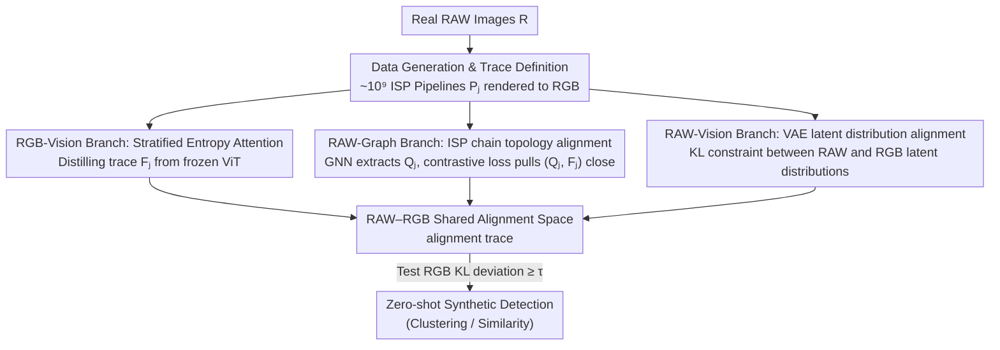

# Zero-shot Detection of AI-Generated Image via RAW-RGB Alignment

**Conference**: CVPR 2026  
**Paper**: [CVF Open Access](https://openaccess.thecvf.com/content/CVPR2026/html/Wu_Zero-shot_Detection_of_AI-Generated_Image_via_RAW-RGB_Alignment_CVPR_2026_paper.html)  
**Keywords**: AI-Generated Image Detection, Image Forensics, Zero-shot, RAW Signals, ISP Pipeline

## TL;DR
The authors redefine a "synthetic image" as an image generated directly in digital space without a physical world source. They propose a self-supervised method using only real RAW–RGB data pairs to learn a forensic feature called an "alignment trace"—which characterizes "whether this RGB can be traced back to a legitimate RAW source"—achieving zero-shot SOTA performance (Clustering NMI 0.964, Similarity AUC 0.925) without exposure to any generative model priors.

## Background & Motivation
**Background**: Facing a continuous stream of new GAN and Diffusion Models, zero-shot/few-shot forgery detection has become the mainstream direction. Instead of relying on specific generator fingerprints, these methods model "what a real image should look like" (statistical micro-structures, color distributions, lossless coding compressibility, etc.), classifying any deviation from this manifold as synthetic.

**Limitations of Prior Work**: The authors observed a concerning phenomenon (Observation I)—existing detectors misclassify synthetic images that have undergone **physical re-mapping** (e.g., "print + scan" or "photography of a screen") as real. The root cause is not the weakness of the models but that the **concept of "synthetic" has never been strictly defined**: if an AI-generated image is printed and then scanned back into a computer, is it still "synthetic"?

**Key Challenge**: The criteria of all previous methods remain at the level of **traces in digital space** (spectrum, noise residuals, compression artifacts). These traces are easily erased once subjected to physical optical acquisition, allowing physical re-mapping to bypass detection. The fundamental difference between real and fake has not been captured.

**Goal**: First, provide a clear definition—**synthetic image = an image created directly in digital space with no predecessor in the physical world**. According to this definition, a synthetic image that is physically re-mapped "becomes" a real image (which explains why it escapes detection). Based on this, design a criterion: Detecting authenticity = determining **whether the image has a physical-world source that conforms to physical laws**.

**Key Insight**: The authors analyze the imaging chain from physical to digital—the light intensity of a real scene is recorded as a RAW signal by the camera sensor and then converted to RGB by the internal ISP (Image Signal Processor). In contrast, synthetic images are RGBs generated directly in digital space with **no underlying RAW/optical signal source**. The authors verified this using RGB→RAW reconstruction (Observation II): real images show **significantly higher** reconstruction errors and are statistically separable when using RAW-like methods, indicating that RAW signals are indeed strong clues for a "physical source."

**Core Idea**: Rather than searching for synthetic fingerprints, it is better to verify the "RAW heritage" of real images. Learning a **RAW–RGB shared alignment space** in a self-supervised manner using only real RAW–RGB pairs allows the forensic feature (alignment trace) to characterize whether an RGB is compatible with a legitimate RAW→RGB pipeline. Incompatibility (KL deviation) leads to a synthetic classification. The entire process **requires no generative models or synthetic image priors**.

## Method

### Overall Architecture
The training objective is to learn a feature extractor $f$ using only real RAW images, such that the alignment trace $F_j$ extracted from any RGB **depends only on the ISP pipeline $P_j$ used to convert the RAW to RGB, and is independent of the image content $R_i$**. During testing, a real RGB will always align with a learned pipeline (trace falls within the manifold), while a synthetic RGB lacks a RAW source and fails to align with any legitimate pipeline (trace deviates from the manifold, $D_{\mathrm{KL}} \ge \tau$).

The pipeline consists of four components: first, rendering real RAW data into massive RGB images using ~$10^9$ ISP pipelines to define the trace to be learned (Sec 3.1); then, jointly supervising this alignment space from **three complementary perspectives**—RGB-Vision (SEA attention distillation, Sec 3.2), RAW-Graph (encoding the ISP chain as a graph, Sec 3.3), and RAW-Vision (VAE latent space distribution alignment, Sec 3.4). The losses from these three views jointly constrain the trace, ensuring it understands both the structural logic of RAW→RGB and the statistical characteristics of RAW.

### Key Designs

**1. Massive ISP Pipeline Self-Supervision + Alignment Trace Definition: Converting "Existence of RAW Source" into Learnable Deviation**

The pain point of previous criteria was their reliance on digital space and synthetic priors. The authors do the opposite: using only a real RAW dataset $R=\{R_i\}$ coupled with a set of ~$10^9$ RAW→RGB pipelines $P=\{P_j\}$, they apply each pipeline to each RAW image to obtain RGB images $I_{i,j}=P_j(R_i)$. Each $P_j$ combines core real ISP operations (demosaicing, white balance, color correction, tone mapping) with post-processing (compression, scaling, blurring, noise), constrained by "must contain demosaicing, at most one white balance/tone mapping, and at most 3 post-processing steps," resulting in approximately $10^9$ distinct pipelines—forming a self-supervised training corpus based purely on real data.

A learnable feature extractor $f:\mathcal I\to\mathbb R^d$ is defined, requiring that extracted $F_j=f(I_{i,j})$ satisfies two properties: **Content Invariance** $f(P_j(R_i))=f(P_j(R_b))$ (same pipeline, different content yields the same trace) and **Distinguishability** $f(P_j(R_i))\ne f(P_k(R_i))$ (different pipelines yield different traces). Thus, the trace encodes "pipeline identity" rather than image semantics. For a query image $I_q$, the criterion is feature deviation (Def 3.1):

$$\min_{I\in\mathcal I} D_{\mathrm{KL}}\big(f(I_q)\,\|\,f(I)\big)\ge\tau$$

If the minimum KL divergence from the trace of $I_q$ to all learned pipeline traces exceeds threshold $\tau$, it indicates generation via an unknown/non-standard RAW→RGB process—synthetic images, having no RAW source, naturally fall outside the manifold.

**2. RGB-Vision Branch: Stratified Entropy Attention (SEA), filtering semantics and retaining physical traces from frozen LVMs**

Training $f$ from scratch risks overfitting and losing visual priors. Instead, the authors extract intermediate layer token features $H=(h_1,\dots,h_K)$ from a **frozen** large vision model $f_{\text{LVM}}$ (ViT performed best) and distill them into a trace using Stratified Entropy Attention (SEA): $F_j=f_{\text{SEA}}(F^0_j, H)$. The goal of SEA is clear—**filter out content-semantic information and focus on signals related to physical-to-digital conversion** (regional smoothness, luminance). It involves three steps:

- **Entropy Binning**: Calculate a "physical entropy" $E_k=\tfrac12(\mathrm{Grad}(\pi_k)+\mathrm{LC}(\pi_k))$ for each patch $\pi_k$. $\mathrm{Grad}$ uses the standard deviation of Sobel gradients for local smoothness anomalies; $\mathrm{LC}$ uses combined luminance-chrominance entropy (YCrCb/HSV) for disrupted correlations. $K$ tokens are uniformly binned into $B$ entropy intervals based on $E_k$.
- **Stratified Sampling**: $M$ tokens are sampled uniformly from each bin to ensure balanced coverage across all entropy levels.
- **Attention Fusion**: Using anchor feature $F^0_j$ as a query, attention is performed on sampled tokens, with weights multiplied by $(1-E_{\hat h})$ to amplify the contribution of tokens with different entropies:

$$w_{b,m}=\frac{\exp\!\big((1-E_{\hat h_{b,m}})\,F^0_j\hat h_{b,m}^\top/\sqrt d\big)}{\sum_{b',m'}\exp\!\big((1-E_{\hat h_{b',m'}})\,F^0_j\hat h_{b',m'}^\top/\sqrt d\big)}$$

Finally, $F_j=\sum_{b,m}w_{b,m}\cdot\mathrm{Attn}(F^0_j,\hat h_{b,m},\hat h_{b,m})$. Compared to standard cross-attention, entropy weighting better captures camera intrinsic traces left in RGB by the ISP (SEA NMI is 3.5% higher than standard cross-attention in ablations).

**3. RAW-Graph Branch: Encoding ISP chains as topology graphs for trace alignment**

The RGB perspective alone is insufficient; the authors inject structural knowledge of "which pipeline was used" into the alignment space. Rather than hard pixel alignment with RAW, they reuse the operation chain $P_j$ from the data generation stage—but text descriptions fail to express hierarchical dependencies (e.g., white balance must precede tone mapping). Thus, $P_j$ is encoded as a **directed topological graph** $Q_j=\{V,E,\omega\}$. Node set $V$ is grouped by operation type (demosaicing/white balance/tone mapping/post-processing), with the number of nodes equal to the number of algorithms (e.g., $|V_{DM}|=4$); nodes are initialized with one-hot vectors. Directed edges $E$ enforce成像 order, and edge weights $\omega(e)$ represent normalized continuous parameters $[\hat\theta_u;\hat\theta_v]$.

A GNN (GraphConv message passing + global pooling) maps the graph to a graph-level feature $Q_j$ of the same dimension as $F_j$. A CLIP-style symmetric contrastive loss aligns pairs $(Q_j, F_j)$ in the shared space:

$$L_{\text{cx}}(Q,F)=-\frac1{|A|}\sum_{j\in A}\log\frac{\exp(Q_j\!\cdot\!F_j/\tau)}{\sum_{l\in A}\exp(Q_j\!\cdot\!F_l/\tau)},\quad L_{\text{RAW-Graph}}=\tfrac12\big(L_{\text{cx}}(Q,F)+L_{\text{cx}}(F,Q)\big)$$

**4. RAW-Vision Branch: VAE latent space distribution alignment, avoiding pixel-level supervision flaws**

Since topological graphs are abstract high-level concepts, a **visual/pixel** RAW perspective is needed. However, traditional L1/L2 pixel supervision captures only per-pixel errors and is sensitive to noise or small shifts. The authors use **distribution transfer in latent space**: a pre-trained VAE encoder maps $R_i$ and its RGB version $I_{i,j}$ to Gaussian latent distributions $\mathcal N(\mu_s,\sigma_s)$ and $\mathcal N(\mu_t,\sigma_t)$. The trace $F_j$ modulates the RAW mean via cross-attention $\hat\mu_s=\mathrm{Attn}(\mu_s,F_j,F_j)$, and KL divergence pulls the modulated RAW latent distribution toward the RGB latent distribution:

$$L_{\text{RAW-Vision}}=\mathbb E\big[D_{\mathrm{KL}}(\mathcal N(\hat\mu_s,\sigma_s)\,\|\,\mathcal N(\mu_t,\sigma_t))\big]$$

### Loss & Training
The total loss combines alignment from both Graph and Vision RAW perspectives: $L_{\text{total}}=\lambda_1 L_{\text{RAW-Graph}}+\lambda_2 L_{\text{RAW-Vision}}$. Training uses 5,000 real RAW images from the FiveK dataset (DNG from Canon/Nikon), **without introducing any synthetic images or generation algorithms**. In use: for zero-shot, directly conduct clustering/similarity comparisons on traces; for few-shot, fine-tune this aligned feature space using only ProGAN synthetic data.

## Key Experimental Results

### Main Results
Zero-shot clustering (micro, higher NMI is better) and similarity (macro, AUC, 0.5=random), plus few-shot cross-domain detection (ForenSynths, AP):

| Scenario | Metric | Ours | Runner-up | Gain |
|------|------|------|--------|------|
| Zero-shot Clustering (Avg. 10 categories) | NMI | **0.964** | MIB 0.742 | +22.2% |
| Zero-shot Similarity (Avg. 10 categories) | AUC | **0.925** | MIB 0.734 | Significant |
| Few-shot Cross-domain (ForenSynths, trained on ProGAN) | AP | **0.987** | Effort 0.953 | +3.4% |

In zero-shot clustering, RAW reconstruction baselines (R2LCM/ReRAW) only worked passably on GAN-Star and failed for diffusion models (NMI dropped to 0.03–0.06). ZED/FSD reached 0.96–0.99 on single GAN categories but averaged only 0.544/0.596 across categories due to ignoring physical space differences. Ours reached 0.964 NMI; T-SNE shows DM-Dalle KL values at 29.4, far exceeding competitors (6.8 / 1.2 / 0.3).

### Ablation Study

| Branch | Key Variable | Cluster | Similarity | Detection | Notes |
|------|---------|---------|-----------|-----------|------|
| RGB-Vision | ViT, trainable, no SEA (#5) | .867 | .830 | .909 | Trainable params wash out visual priors |
| RGB-Vision | ViT, frozen, no attn (#6) | .908 | .882 | .963 | +4.1% NMI after freezing |
| **RGB-Vision** | **ViT, frozen, SEA (#8)** | **.964** | **.925** | **.987** | SEA +3.5% NMI over cross-attn |
| RAW-Graph | Undirected graph (#4) | .909 | .882 | .917 | Incorrect topology |
| **RAW-Graph** | **D+W + InfoNCE (#8)** | **.964** | **.925** | **.987** | Directed weighted + InfoNCE best |
| RAW-Vision | Remove branch (#1) | .828 | .817 | .896 | Significant drop without visual constraint |
| **RAW-Vision** | **VAE + KL + Attn (#6)** | **.964** | **.925** | **.987** | Better than pixel-level UNet+L2 |

### Key Findings
- **Frozen LVMs are crucial**: Making ViT fully trainable degraded results (#5 vs #6). Forensic features should "borrow" LVM visual priors rather than overwrite them.
- **Three views are indispensable**: Removing the RAW-Vision branch (#1) led to comprehensive declines, as topological graphs need pixel/visual anchoring.
- **Pipeline coverage determines generalization**: Generalization is best when all ISP and post-processing steps are covered.
- **Physical re-mapping no longer misclassified**: Framing the problem via "physical source" explains and solves the "print + scan" escape phenomenon.

## Highlights & Insights
- **Redefining the Problem**: Rather than competing for pure accuracy, the authors clarify "what a synthetic image is." This definitional contribution is a new benchmark for the community.
- **"Verify Real, Don't Recognize Fake" Paradigm**: Self-supervision using only real RAW-RGB pairs makes it naturally robust against unknown GenAI—a true zero-shot approach applicable to open-world anomaly detection.
- **Engineering Flows as Supervision**: Encoding ISP chains into structured graphs with order and parameter weights is a clever "domain knowledge structure" trick.
- **Stratified Entropy Attention (SEA)**: Using entropy to filter semantics and retain physical traces is an insightful approach to "de-contenting" feature extraction.

## Limitations & Future Work
- **Dependency on RGB→RAW Reconstructability**: The criterion assumes real images can reconstruct RAW while synthetic ones cannot; this may fail if future models explicitly model RAW imaging chains.
- **Limited Training Data**: Only 5,000 images from FiveK (Canon/Nikon) were used. Generalization to complex mobile ISP (HDR, Night stacking) remains unproven.
- **Physical "Legalization" is a Double-Edged Sword**: Synthetic images that are printed and scanned are classified as "real." While theoretically consistent, this could be exploited in forensic scenarios.
- **Few-shot Still Needs Priors**: Optimal cross-domain results (AP 0.987) still rely on ProGAN fine-tuning.

## Related Work & Insights
- **vs. Reconstruction Error (ZeroFake)**: Existing works stay in the digital space of RGB autoencoders; Ours upgrades this to the **RGB→RAW** physical link, significantly improving cross-diffusion model generalization (NMI 0.964 vs 0.333).
- **vs. Implicit Real Modeling (FSD/ZED)**: These model digital statistics and fail against physical re-mapping; Ours is more fundamental by focusing on physical origins.
- **vs. Supervised SOTA (Effort/CNNSpot)**: These drop to 0.70–0.82 AP when encountering unfamiliar GenAI (e.g., SAN); Ours reaches 0.987 AP with zero-prior training + minimal fine-tuning.

## Rating
- Novelty: ⭐⭐⭐⭐⭐ Paradigmatic innovation via redefinition.
- Experimental Thoroughness: ⭐⭐⭐⭐ Strong across scenarios, though camera diversity is narrow.
- Writing Quality: ⭐⭐⭐⭐ Clear logical chain from observations; systematic formulas.
- Value: ⭐⭐⭐⭐⭐ Provides a new benchmark and direction for zero-shot forgery detection.

<!-- RELATED:START -->

## Related Papers

- [\[CVPR 2026\] Scaling Up AI-Generated Image Detection with Generator-Aware Prototypes](scaling_up_ai-generated_image_detection_with_generator-aware_prototypes.md)
- [\[CVPR 2026\] Skyra: AI-Generated Video Detection via Grounded Artifact Reasoning](skyra_ai-generated_video_detection_via_grounded_artifact_reasoning.md)
- [\[CVPR 2026\] Detecting Compressed AI-Generated Images via Phase Spectrum Robustness](detecting_compressed_ai-generated_images_via_phase_spectrum_robustness.md)
- [\[CVPR 2026\] Cross-modal Representation Learning for Diffusion-generated Image Detection](cross-modal_representation_learning_for_diffusion-generated_image_detection.md)
- [\[CVPR 2026\] Hierarchically Robust Zero-shot Vision-language Models](hierarchically_robust_zero-shot_vision-language_models.md)

<!-- RELATED:END -->
