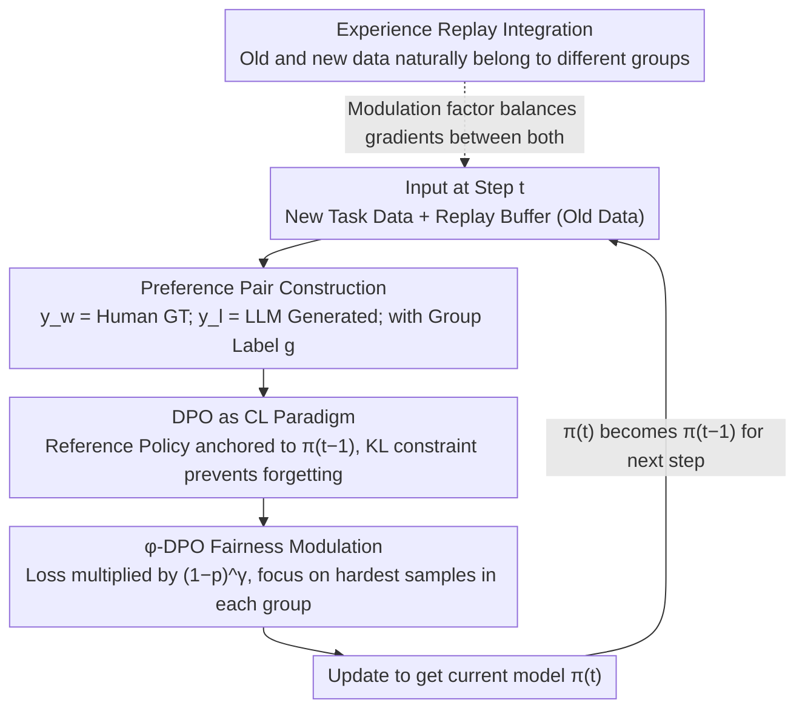

# $\varphi$-DPO: Fairness Direct Preference Optimization Approach to Continual Learning in Large Multimodal Models

**Conference**: CVPR2026  
**arXiv**: [2602.22601](https://arxiv.org/abs/2602.22601)  
**Code**: To be confirmed  
**Area**: AI Safety
**Keywords**: Continual Learning, DPO, Fairness, Catastrophic Forgetting, large multimodal model, focal loss

## TL;DR
$\varphi$-DPO is proposed to frame DPO as a continual learning paradigm by using the model from the previous step as the reference policy. It introduces a fairness modulation factor $(1-p)^\gamma$, inspired by focal loss, to balance gradient contributions across different data groups. Theoretically, it is proven that the gradient bias approaches zero as $\gamma \to \infty$. The method achieves SOTA performance on CoIN and MLLM-CL benchmarks.

## Background & Motivation
Large Multimodal Models (LMMs) must continuously learn new tasks in real-world deployments, making Continual Learning (CL) a critical capability. However, CL for LMMs faces dual challenges:

### Challenge 1: Catastrophic Forgetting
This is the classic CL problem—performance degradation on old tasks while learning new ones. Existing mitigation methods include:
- **Experience Replay (ER)**: Storing old task data for review, which incurs high storage costs and potential privacy risks.
- **Regularization (EWC, LwF, etc.)**: Restricting parameter overwriting via constraints, though excessive constraints limit new task learning.
- **Knowledge Distillation**: Using old model outputs as soft labels, which requires additional forward pass overhead.

### Challenge 2: Fairness Issues
This paper identifies an overlooked issue—**fairness degradation caused by data imbalance in continual learning**:
1. **Large disparities in group sizes**: Data volumes vary drastically across CL stages (e.g., 100k samples in stage 1 vs. 10k in stage 2). During replay, old data significantly outweighs new data.
2. **Gradient Dominance**: Groups with large data volumes contribute more gradients, "drowning out" minority groups and leading to poor performance on smaller groups.
3. **Group Fairness**: Disparities in model performance across different user groups or data sources pose potential fairness risks.

Traditional CL methods rarely consider fairness, while fairness methods (e.g., DRO, FairBatch) do not address forgetting. The motivation of $\varphi$-DPO is to **simultaneously solve both problems**.

### Key Insight: DPO is Naturally Suited for Continual Learning
The loss function of standard DPO relies on a **reference policy** $\pi_{\text{ref}}$, which prevents the optimized policy from deviating too far. The authors discovered that by setting $\pi_{\text{ref}}$ as the **model from the previous CL step** $\pi_{t-1}$, DPO implicitly achieves a knowledge distillation effect. The KL divergence constraint naturally limits the deviation between the new and old models, thereby mitigating forgetting.

## Core Problem
How can DPO be transformed into a unified framework that simultaneously addresses catastrophic forgetting and fairness degradation in continual learning?

## Method

### Overall Architecture

The paper aims to enable LMMs to learn tasks sequentially without forgetting previous knowledge or losing fairness due to imbalanced data volumes. The approach embeds the CL process into the DPO framework: at step $t$, instead of using standard SFT, a DPO loss is used to update the model from $\pi_{t-1}$ to $\pi_t$. By anchoring the reference policy to the previous model $\pi_{t-1}$, preventing forgetting becomes an inherent constraint of the DPO loss. A modulation factor borrowed from focal loss is then applied to the DPO loss to shift gradient focus from "learned samples" to "the most difficult samples in each group," neutralizing fairness degradation from group imbalance.

### Key Designs

**1. DPO as a CL Paradigm: Using the previous model as the reference policy to turn "non-deviation" into an inherent KL penalty.**

Traditional CL uses replay or extra distillation passes. This work treats the DPO reference policy $\pi_{\text{ref}}$ as the model from the previous step $\pi_{t-1}$. The loss at step $t$ is:

$$\mathcal{L}_{\text{DPO}}(\pi_\theta; \pi_{t-1}) = -\mathbb{E}_{(x, y_w, y_l)} \left[\log \sigma\left(\beta \log\frac{\pi_\theta(y_w|x)}{\pi_{t-1}(y_w|x)} - \beta \log\frac{\pi_\theta(y_l|x)}{\pi_{t-1}(y_l|x)}\right)\right]$$

Since the denominator is anchored to $\pi_{t-1}$, any deviation from the old policy increases the loss. Lemma 1-2 proves this loss is bounded by the KL divergence between new and old models:

$$c_1 \cdot D_{\text{KL}}(\pi_{t-1} \| \pi_\theta) \leq \mathcal{L}_{\text{DPO}}(\pi_\theta; \pi_{t-1}) \leq c_2 \cdot D_{\text{KL}}(\pi_{t-1} \| \pi_\theta) + C$$

Thus, minimizing DPO loss is equivalent to implicit knowledge distillation without extra forward passes.

**2. $\varphi$-DPO Fairness Modulation: Borrowing focal loss logic to focus gradients on group-wise difficult samples.**

To solve data imbalance where large groups dominate gradients, a modulation factor $(1-p_{w,l})^\gamma$ is added to the DPO loss:

$$\mathcal{L}_{\varphi\text{-DPO}} = -\mathbb{E}_{(x, y_w, y_l)} \left[(1-p_{w,l})^\gamma \cdot \log \sigma\left(\beta \log\frac{\pi_\theta(y_w|x)}{\pi_{t-1}(y_w|x)} - \beta \log\frac{\pi_\theta(y_l|x)}{\pi_{t-1}(y_l|x)}\right)\right]$$

Where $p_{w,l}$ represents the model's "confidence" in the preference pair. When the model is confident ($p_{w,l}\to 1$), the gradient is suppressed. Optimization effort is forced onto "hard samples." Lemma 3 proves that as $\gamma \to \infty$, the gradient bias $B_\gamma(\theta)$ across groups approaches zero, ensuring group contributions are equalized regardless of sample size.

**3. Preference Pair Construction: Creating preferred/rejected pairs for CL benchmarks.**

As CL benchmarks like CoIN or MLLM-CL only provide standard QA, the authors construct pairs: $y_w$ is the ground truth, and $y_l$ is a "reasonable but incorrect" version (factual errors, etc.) generated by an LLM (e.g., GPT-4) and verified by humans. Each triplet $(x, y_w, y_l)$ includes a group label $g$.

**4. Integration with Experience Replay: Balancing gradients between old and new data.**

$\varphi$-DPO integrates naturally with ER. Old data in the buffer and new data are treated as different groups. The fairness modulation automatically balances the gradient contribution between the numerous old samples and few new samples.

## Key Experimental Results

### CoIN Benchmark (8 phases)

| Method | Final Avg Acc ↑ | Forgetting ↓ | Fairness (Worst-group Gap) ↓ |
|------|----------------|--------------|------------------------------|
| Sequential FT | 34.2 | 42.1 | 18.3 |
| EWC | 48.7 | 28.5 | 14.2 |
| LwF | 51.3 | 25.2 | 13.8 |
| Experience Replay | 55.8 | 20.1 | 11.5 |
| DPO (as CL) | 58.2 | 16.4 | 9.7 |
| **$\varphi$-DPO** | **63.1** | **12.3** | **4.2** |

### MLLM-CL Benchmark

| Method | Domain Avg ↑ | Ability Avg ↑ | Backward Transfer ↑ | Worst-group Acc ↑ |
|------|-------------|--------------|---------------------|-------------------|
| Sequential FT | 41.5 | 38.2 | -15.3 | 22.1 |
| LwF | 52.1 | 49.8 | -8.7 | 35.4 |
| Experience Replay | 56.3 | 53.1 | -5.2 | 40.8 |
| DPO (as CL) | 59.7 | 56.8 | -3.1 | 45.2 |
| **$\varphi$-DPO** | **65.2** | **62.4** | **-1.4** | **55.6** |

### Ablation Study
- **Impact of $\gamma$**: Fairness metrics improve monotonically from $\gamma=0$ to $\gamma=5$, saturating after 5.
- **DPO vs SFT as CL Paradigm**: DPO shows 4.1% lower forgetting than SFT + KD, validating the implicit distillation effect.
- **Reference Policy Selection**: Using $\pi_{t-1}$ outperforms $\pi_0$ (initial model) by 5.2% in forgetting, as it preserves local knowledge better.
- **$\beta$ Sensitivity**: Performance is stable within $\beta \in [0.05, 0.2]$, with $\beta = 0.1$ being optimal.

## Highlights & Insights
- **New Perspective on CL**: Frames DPO as a CL paradigm for the first time, proving its inherent knowledge distillation properties.
- **Unified Framework**: Solves both forgetting and fairness within a single loss function rather than piecing together separate methods.
- **Theoretical Fairness Guarantee**: Lemma 3 provides rigorous proof for gradient bias elimination at $\gamma \to \infty$.
- **Elegant Focal Loss Adaptation**: Successfully migrates focal loss concepts from object detection to handle group imbalance in CL.
- **Efficiency**: Requires minimal changes to standard DPO with virtually zero additional computational cost for the modulation.

## Limitations & Future Work
1. **Adaptive $\gamma$ Selection**: Currently a manually tuned hyperparameter; ideally, it should adapt to group imbalance levels.
2. **Preference Pair Quality**: Reliance on LLM generation and human verification for rejected answers limits scalability.
3. **Long-sequence CL**: Tests were conducted on up to 8 stages; cumulative bias in $\pi_{t-1}$ for very long sequences (e.g., 50+) remains unexplored.
4. **Uniform $\gamma$**: A single $\gamma$ applies to all groups, whereas different groups might require different levels of modulation.
5. **Integration with PEFT**: The implicit distillation effects when combined with LoRA or other PEFT methods need further investigation.

## Rating
- Novelty: ⭐⭐⭐⭐⭐ (DPO as CL paradigm + focal fairness modulation with theoretical backing)
- Experimental Thoroughness: ⭐⭐⭐⭐ (Comprehensive across two benchmarks, but limited CL steps)
- Writing Quality: ⭐⭐⭐⭐ (Clear theoretical derivation and motivation)
- Value: ⭐⭐⭐⭐⭐ (Opens "DPO for CL" direction with a unique fairness perspective)

<!-- RELATED:START -->

## Related Papers

- [\[CVPR 2026\] FVBench: Benchmarking Deepfake Video Detection Capability of Large Multimodal Models](fvbench_benchmarking_deepfake_video_detection_capability_of_large_multimodal_mod.md)
- [\[CVPR 2026\] DSO: Direct Steering Optimization for Bias Mitigation](dso_direct_steering_optimization_for_bias_mitigation.md)
- [\[CVPR 2026\] FedAFD: Multimodal Federated Learning via Adversarial Fusion and Distillation](fedafd_multimodal_federated_learning_via_adversarial_fusion_and_distillation.md)
- [\[CVPR 2026\] SIF: Semantically In-Distribution Fingerprints for Large Vision-Language Models](sif_semantically_in-distribution_fingerprints_for_large_vision-language_models.md)
- [\[CVPR 2026\] Robustness Under Data Scarcity: Few-Shot Continual Adversarial Training for Evolving Threats](robustness_under_data_scarcity_few-shot_continual_adversarial_training_for_evolv.md)

<!-- RELATED:END -->
