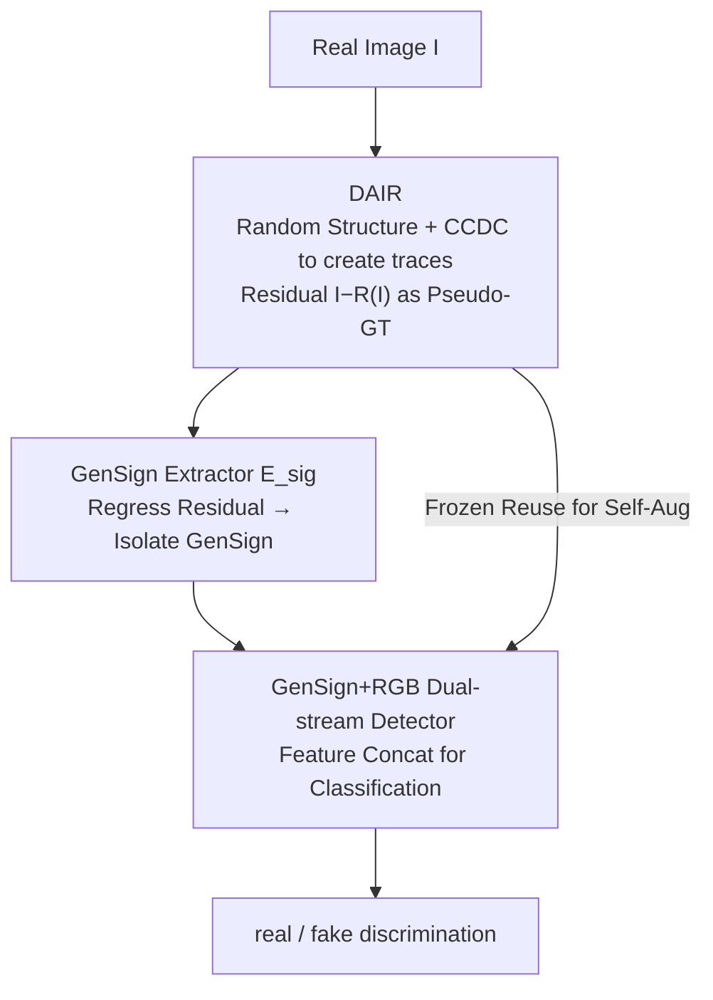

# Enabling Supervised Learning of Generative Signatures for Generalized AI-Generated Images Detection

**Conference**: CVPR 2026  
**Paper**: [CVF Open Access](https://openaccess.thecvf.com/content/CVPR2026/html/Fei_Enabling_Supervised_Learning_of_Generative_Signatures_for_Generalized_AI-Generated_Images_CVPR_2026_paper.html)  
**Code**: https://github.com/jumpycat/GenSign  
**Area**: AI Security / AIGC Detection / Visual Forensics  
**Keywords**: AIGC detection, generative traces, surrogate supervision, dynamic architecture reconstruction, cross-model generalization

## TL;DR
To address the deadlock where "generative traces in AI-generated images lack clean pairs and cannot be extracted via supervised learning," this paper uses a **randomly-structured image reconstructor** to artificially "create traces" on real images. The reconstruction residuals are treated as pseudo-labels to train a **generative signature (GenSign) extractor**, followed by a GenSign + RGB dual-stream classifier for detection, achieving SOTA cross-model generalization across four benchmarks.

## Background & Motivation
**Background**: The mainstream approach for detecting AI-generated images (AIGI) is to capture "generative traces"—model-specific fingerprints (such as frequency domain anomalies caused by upsampling or spectral anomalies in noise residuals) left by generative models (GANs, Diffusion) that are content-independent. Prior work has proven these traces are instance-specific and stable across images, serving as reliable forensic clues.

**Limitations of Prior Work**: The key lies in reliably **extracting** these traces, which existing extractors fail to do effectively. They either rely on handcrafted high-pass filters (SRM) or CNN denoisers, essentially performing **general denoising** rather than specifically "isolating model-specific artifacts." Consequently, the extracted residuals are mixed with significant general image noise, failing to lock onto generative signals and collapsing when encountering unseen generators.

**Key Challenge**: To train a trace extractor using supervised learning, one needs the difference between a "trace-containing image" and its "trace-free clean pair" as ground truth. However, AIGIs are born with traces, and **their trace-free versions simply do not exist**. Lacking ground truth for supervised learning, prior works resort to unsupervised denoising, which yields poor results.

**Goal**: To transform the "extraction of universal generative signatures" into a **supervised** regression task without ground truth, ensuring the learned extractor generalizes to real-world generators unseen during training.

**Key Insight**: The authors observe that while trace-free pairs for real AIGIs are unavailable, one can conversely **synthesize various generative traces artificially on real images**. If the architecture/parameter diversity of the synthesizer is large enough, the distribution of synthesized traces can cover the traces left by real generators (validated via PCA spectral feature visualization: as the number of simulated models increases from 100 to 100K, the simulated distribution gradually encompasses real models like BigGAN, Glide, MidJourney, FLUX, and SD3).

**Core Idea**: Use **surrogate supervision** via a "random variable-structure reconstructor creating traces on real images → reconstruction residuals as pseudo-ground truth" to convert the non-supervisable trace extraction problem into a supervisable residual prediction task.

## Method

### Overall Architecture
The method is a **three-stage serial** pipeline following the logic of "create supervision signal → learn extractor → build detector." Stage I trains a Dynamic Architecture Image Reconstructor $\mathcal{R}$ (DAIR), which reconstructs real images $I$ using randomized decoding structures. The residual $R_{gt}=I-\mathcal{R}(I)$ simulates "traces left by some generative model" as the pseudo-ground truth. Stage II freezes $\mathcal{R}$ and trains the GenSign extractor $\mathcal{E}_{sig}$ to regress this residual, learning to **isolate the GenSign** from an image. Stage III freezes $\mathcal{E}_{sig}$ and builds a dual-stream detector $\mathcal{M}$ (RGB stream + GenSign stream) for real/fake classification, while reusing the frozen $\mathcal{R}$ as a **self-augmentation** module to force the detector to rely on generative traces rather than content bias.

### Key Designs

**1. Dynamic Architecture Image Reconstructor (DAIR): Creating Diverse Traces via Structural Randomization**

This serves as the engine for surrogate supervision, directly solving the "lack of trace-free pairs" pain point. DAIR $\mathcal{R}$ is an autoencoder with an encoder $\mathcal{E}_{rec}$ and a dynamic decoder $\mathcal{D}$ whose **decoding path changes randomly** for every forward pass. The encoder is a hierarchical CNN with $L$ levels of downsampling, outputting multi-scale features $\{F_i\}_{i=1}^{L}$. During decoding, a starting scale $F_s$ is randomly selected ($s\sim\text{Uniform}(1,\dots,L)$), followed by randomized upsampling stages. In each stage, upsampling operators are sampled from $\mathcal{O}_{up}=\{\text{Bilinear, Nearest, Bicubic, Pixel Shuffle}\}$, normalization layers from $\{\text{BatchNorm, InstanceNorm, GroupNorm}\}$, and activations from $\{\text{GELU, SiLU, LeakyReLU}\}$, with the execution order also shuffled. This combinatorial explosion of "upsampling + normalization + activation + order" mimics the trace differences caused by diverse generative architectures—upsampling methods, in particular, are the primary source of artifacts in GANs/Diffusion. DAIR is trained end-to-end using MSE + LPIPS loss. After training, $R_{gt}=I-\mathcal{R}(I)$ represents the pseudo-GT residual where a real image is "endowed" with some generative trace.

**2. Context-Conditioned Dynamic Convolution (CCDC): Creating Parameter-Level Trace Diversity**

Architecture randomization alone is insufficient—the same architecture under different training conditions (seeds, data) constitutes "different instances" with unique traces. CCDC allows **the same decoding structure to instantiate different convolutional parameters for different inputs**, simulating instance-level trace differences. It maintains $K$ trainable base kernels $\{W_i\in\mathbb{R}^{C_{out}\times C_{in}\times k\times k}\}_{i=1}^{K}$. A routing network $g(\cdot)$ (Global Average Pooling + MLP) computes filter-level weights $A=g(h)\in\mathbb{R}^{K\times C_{out}}$ based on input features $h$. These are then fused into a dynamic kernel:

$$W_{dyn}[c,:,:,:]=\sum_{i=1}^{K}A[i,c]\cdot W_i[c,:,:,:]$$

where $A[i,c]$ is the weight of the $c$-th filter of the $i$-th base kernel. Different inputs lead to different dynamic kernels, injecting continuous parameter-level perturbations and enabling $\mathcal{E}_{sig}$ to learn instance-level GenSign. The paper sets $K=4$.

**3. GenSign Extractor $\mathcal{E}_{sig}$: Turning Surrogate Residuals into Transferable Extraction Ability**

With DAIR providing infinite pseudo-GT, extraction becomes a clean supervised regression. $\mathcal{E}_{sig}$ is a Fully Convolutional Network (FCN) that inputs an image and outputs a predicted signature $R_{pred}=\mathcal{E}_{sig}(\mathcal{R}(I))$. The goal is to approximate the residual of the frozen reconstructor:

$$\mathcal{L}_{sig}=\mathbb{E}_{I\in\mathcal{I}_{real}}\big[\|\mathcal{E}_{sig}(\mathcal{R}(I))-(I-\mathcal{R}(I))\|_2^2\big]$$

Since the "simulated generators" seen during training are sufficiently diverse (due to DAIR's vast combinatorial space), $\mathcal{E}_{sig}$ learns the **universal capability** of how to peel generative traces from image content, rather than memorizing a specific model. Once frozen and applied to an unseen synthetic image $I_{fake}$, it outputs $\mathcal{E}_{sig}(I_{fake})$ revealing the trace. Visualization shows GenSign for real images appears as unstructured random noise, while for AIGIs, it presents large, coherent patches with spatial structure.

**4. Dual-Stream Detector + DAIR Self-Augmentation: Discriminating via Traces, Not Content Bias**

The final detector $\mathcal{M}$ contains two backbones: an RGB stream $\mathcal{B}_{rgb}$ (CLIP ViT-L/14, fine-tuned only on attention layers via LoRA rank=4) processing the original image to get $f_{rgb}$, and a GenSign stream $\mathcal{B}_{sig}$ (EfficientNet-B0) processing $\mathcal{E}_{sig}(I)$ to get $f_{sig}$. Features are concatenated and passed through an MLP classifier $\mathcal{H}$. To prevent overfitting to content bias (e.g., certain objects always being labeled as fake), the authors reuse the **frozen DAIR for self-augmentation**: during training, with probability $p_{aug}$, images $I_{aug}$ are reconstructed by $\mathcal{R}$, and labels are reassigned:

$$
\begin{aligned}
\text{Original Real Image } I_{real} &\to \text{label}=1\ (\text{Real})\\
\text{Original Fake Image } I_{fake} &\to \text{label}=0\ (\text{Fake})\\
\text{Reconstructed Real } \mathcal{R}(I_{real}) &\to \text{label}=0\ (\text{Fake})\\
\text{Reconstructed Fake } \mathcal{R}(I_{fake}) &\to \text{label}=0\ (\text{Fake})
\end{aligned}
$$

Crucially, the third row shows a **real image** reconstructed by DAIR retains its content but gains generative traces, so its label is flipped to "Fake." This forces the model to treat traces as the sole criterion for fakeness, eliminating content bias. The detector is trained with BCE: $\mathcal{L}_{det}=-\mathbb{E}_{I}[y(I)\log\mathcal{M}(I)+(1-y(I))\log(1-\mathcal{M}(I))]$. Ablation shows $p_{aug}=20\%$ yields the best generalization.

### Loss & Training
- **Stage I Reconstruction Loss**: $\mathcal{L}_{rec}=\mathbb{E}_{I\in\mathcal{I}_{real}}[\lambda_1\|I-\hat I\|_2^2+\lambda_2\cdot\text{LPIPS}(I,\hat I)]$, where $\hat I=\mathcal{R}(I)$, $\lambda_1=1.0,\lambda_2=0.25$.
- **Stage II**: $\mathcal{L}_{sig}$ (MSE residual regression), DAIR is frozen.
- **Stage III**: $\mathcal{L}_{det}$ (BCE), $\mathcal{E}_{sig}$ is frozen, CLIP uses LoRA fine-tuning.
- **Hyperparameters & Overhead**: Batch size 8, Adam optimizer, lr $3\times10^{-4}$, images resized to $256\times256$ (CLIP center-cropped to $224$). DAIR and $\mathcal{E}_{sig}$ take ~49h and ~41h on a single A100, but are universal bases. Detector training takes ~7h, inference ~49ms/image.

## Key Experimental Results

### Main Results
The training set is ProGAN 20-category (Table 4 uses SDv1.4). Evaluation on four cross-model benchmarks (mAP / Acc).

| Benchmark | Metric | Ours | Second Best | Gain |
|-----------|------|------|----------|------|
| UniversalFakeDetect | mean AP | **99.37%** | FatFormer 98.16% | +1.21% |
| AIGCDetectBenchmark (17 models) | mean AP | **98.04%** | PatchCraft 96.07% | +1.97% |
| AIGIBenchmark (17 models) | mean AP | **89.96%** | AIDE 75.36% | +14.6% |
| GenImage (Train on SDv1.4) | mean Acc | **96.6%** | Effort 91.1% | +5.5% |

A highlight is AIGIBenchmark: existing detectors drop to near-random performance on **Local Forgeries** (BlendFace/InSwap/FaceSwap/SimSwap), whereas Ours maintains 66.37%/87.10%/88.57%/88.40% AP, proving GenSign captures universal traces rather than model-specific artifacts.

### Ablation Study

| Configuration | UniFD | AIGC | AIGI | Mean mAP | Description |
|------|-------|------|------|----------|------|
| Ours (RGB+GenSign Dual-stream) | 99.37 | 98.04 | 89.96 | **95.79** | Full Model |
| GenSign only (EfficientNet-B0) | 90.37 | 86.96 | 73.44 | 83.59 | No RGB stream |
| RGB only (CLIP) | 98.28 | 95.98 | 70.91 | 88.39 | No GenSign stream |
| GenSign replaced with SRM Conv | 99.01 | 97.24 | 89.57 | 95.27 | Handcrafted fingerprints |
| GenSign replaced with Noiseprint++ | 97.03 | 93.47 | 68.03 | 86.18 | Unsupervised fingerprints |
| GenSign replaced with Pre-trained Denoiser | 98.61 | 98.29 | 85.62 | 94.17 | General denoising residual |

Key curves: $p_{aug}$ from 0% (mean 88.80%) → 20% (peak 95.79%) → 50% (94.86%); Simulation diversity (DAIR depth) 1-level 76.6% → 2-level 87.2% → 3-level 95.8%.

### Key Findings
- **Dual-stream complementarity is crucial**: RGB (CLIP) excels at high-level semantics, while GenSign excels at low-level traces. Relying on one significantly degrades performance (especially for AIGI where RGB only gets 70.91).
- **Surrogate supervision outperforms unsupervised/handcrafted fingerprints**: Replacing GenSign with SRM/Noiseprint++/denoiser residuals results in lower performance, proving that "supervised learning on simulated traces" captures more transferable features.
- **Self-augmentation balance**: 0% leads to overfitting (88.80%); 20% reaches the optimum balance. Higher rates dilute the real-world distribution.
- **Diversity scales with performance**: Increased DAIR architecture diversity (more downsampling levels) leads to wider trace distribution and better generalization.

## Highlights & Insights
- **Inverting the "Unsupervised Predicament"**: Truly ingenious approach—since trace-free pairs for real AIGIs don't exist, the authors synthesize traces on real images, where the residual is naturally a clean supervision signal. This "pseudo-GT → supervised learning" pipeline can be applied to any forensic task where clean pairs are unavailable.
- **Architecture Randomization as Augmentation**: Using a combinatorial explosion of operators to approximate "all possible generators" covers unseen distributions better than any fixed generative model. PCA spectral visualization provides strong evidence for this.
- **One Component, Triple Use**: The DAIR acts as the trace source in Stage I, the GT generator in Stage II, and the self-augmenter in Stage III.
- **Label Flipping to Break Bias**: Labeling "reconstructed real images" as fake is a highly effective way to force the model to ignore content and focus strictly on generative traces.

## Limitations & Future Work
- **Training Overhead**: DAIR + $\mathcal{E}_{sig}$ takes ~90h on an A100. While they are universal bases, the entry barrier for reproduction without major compute is high.
- **Robustness is only "slightly better"**: The authors admit moderate drops under JPEG compression and spatial distortions, outperforming SDD/UniFD only "slightly." Robustness against heavy post-processing remains an open problem ⚠️.
- **Weakness on Midjourney**: The lowest score on AIGCDetectBenchmark (81.17%) occurs with Midjourney, suggesting proprietary T2I traces significantly differ from simulated open-source distributions.
- **Theoretical Gap**: The "simulation covers real" core assumption is an empirical hypothesis supported by PCA but lacks formal proof.

## Related Work & Insights
- **vs DIRE / Reconstruction-based Training-free methods**: DIRE uses DDIM inversion error, assuming AIGIs are easier to reconstruct by the source model. This requires access to the source model and is unsupervised. Ours is generator-agnostic and generalizes better by using supervised DAIR.
- **vs UnivFD (Frozen CLIP)**: UnivFD relies on CLIP's generality but is prone to content bias and fails on local forgeries. Ours adds a specialized GenSign stream that complements CLIP.
- **vs Handcrafted Filters / Denoisers (SRM, Noiseprint++)**: These generalize poorly as they are optimized for general noise. This work proves supervised learning of model-specific artifacts is superior.

## Rating
- Novelty: ⭐⭐⭐⭐⭐ Cleverly leverages proxy supervision to convert an unsupervised extraction task into supervised regression.
- Experimental Thoroughness: ⭐⭐⭐⭐⭐ Comprehensive benchmarks, ablation studies, and spectral visualization.
- Writing Quality: ⭐⭐⭐⭐ Clear logic across three stages, though minor symbol inconsistencies exist.
- Value: ⭐⭐⭐⭐⭐ High practical value as a universal forensic base.

<!-- RELATED:START -->

## Related Papers

- [\[CVPR 2026\] Locate-Then-Examine: Grounded Region Reasoning Improves Detection of AI-Generated Images](locate-then-examine_grounded_region_reasoning_improves_detection_of_ai-generated.md)
- [\[CVPR 2026\] Investigating Self-Supervised Representations for Audio-Visual Deepfake Detection](investigating_self-supervised_representations_for_audio-visual_deepfake_detectio.md)
- [\[ACL 2025\] Learning to Rewrite: Generalized LLM-Generated Text Detection](../../ACL2025/aigc_detection/learning_to_rewrite_generalized_llm-generated_text_detection.md)
- [\[ICLR 2026\] Semantic Visual Anomaly Detection and Reasoning in AI-Generated Images](../../ICLR2026/aigc_detection/semantic_visual_anomaly_detection_and_reasoning_in_ai-generated_images.md)
- [\[CVPR 2026\] PPM-CLIP: Probabilistic Prompt Modeling for Generalizable AI-Generated Image Detection](ppm-clip_probabilistic_prompt_modeling_for_generalizable_ai-generated_image_dete.md)

<!-- RELATED:END -->
