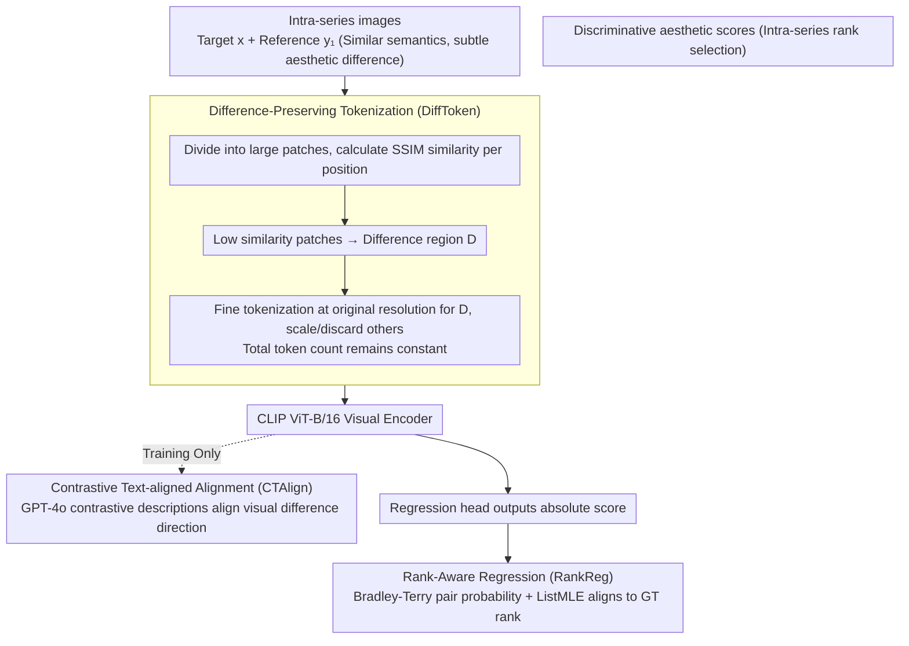

# Fine-grained Image Aesthetic Assessment: Learning Discriminative Scores from Relative Ranks

**Conference**: CVPR 2026  
**arXiv**: [2603.03907](https://arxiv.org/abs/2603.03907)  
**Code**: [Project Page](https://yzc-ippl.github.io/FG-IAA/)  
**Area**: AIGC Detection  
**Keywords**: Fine-grained aesthetics, Relative ranking, Difference-preserving tokenization, Rank regression, FGAesthetics

## TL;DR

This work defines the new task of "Fine-grained Image Aesthetic Assessment" and constructs the FGAesthetics benchmark containing 32,217 images across 10,028 series. It proposes the FGAesQ model, which learns discriminative aesthetic scores from relative ranks through Difference-Preserving Tokenization (DiffToken), Contrastive Text-aligned Alignment (CTAlign), and Rank-Aware Regression (RankReg). The model achieves an accuracy of 0.779 in fine-grained scenarios while maintaining a coarse-grained SRCC of 0.770.

## Background & Motivation

**Background**: Image Aesthetic Assessment (IAA) is widely used in content recommendation, AI-generation guidance, and intelligent photography. Existing datasets (AVA, TAD66K, etc.) evaluate coarse-grained aesthetics where differences between images are significant, and deep models have already achieved good results in these scenarios.

**Limitations of Prior Work**: In practical applications, it is often necessary to select the best from a series of images with high semantic similarity but subtle aesthetic differences—such as choosing the best shot from a burst, selecting the best among multiple AIGC-generated samples, or comparing different cropping schemes. Existing IAA models evaluate images independently based on absolute scores, failing to effectively distinguish subtle differences. Two specific challenges exist: (1) **Semantic interference**—High semantic similarity within a series hinders the extraction of fine-grained aesthetic differences, especially since most deep models are pre-trained for semantic tasks. (2) **Subtle differences**—Fine variations in color and composition require the model to possess robust discriminative aesthetic representations.

**Key Challenge**: Existing fine-grained related datasets (SPS, Best Frame Selection) are not fully open-sourced, limiting research development. Current models achieve only 30%-50% series-level accuracy on FGAesthetics, far below their performance in coarse-grained scenarios.

**Key Insight**: Instead of independent scoring, this work utilizes the **relative ranking relationships** of images within a series to learn discriminative scores—using coarse-grained data to establish a foundational aesthetic perception and fine-grained data to calibrate the regression space for distinguishing subtle differences.

## Method

### Overall Architecture

This work addresses a specific problem: picking the aesthetically optimal image from a sequence of images with nearly identical semantics but subtle differences in color or composition—typical in burst selection, AIGC multi-sample selection for the same prompt, or comparisons of different crops of the same image. Existing IAA models assign an absolute score to each image independently; however, these scores are often too close to distinguish such fine differences. The work rests on two pillars: a new benchmark, FGAesthetics, and a model, FGAesQ.

The FGAesthetics benchmark is collected from three source categories to ensure diversity: **Natural** (burst photos or video frame sequences), **AIGC** (multiple images generated by the same prompt), and **Cropping** (different crops of the same source image). Raw materials pass through a three-level filter (Metrics → MLLMs → Human) to ensure images within a series "look similar but are distinguishable," followed by 10 annotators providing pairwise ranking labels; samples too ambiguous to distinguish are discarded. This results in 32,217 images across 10,028 series, with series lengths ranging from 2–10.

The FGAesQ model uses CLIP's ViT-B/16 as the visual encoder and undergoes two-stage training: first, pre-training on the coarse-grained AVA dataset to establish basic aesthetic perception; then, alternating joint training on "coarse-grained independent images + fine-grained series pairs"—coarse-grained batches provide independent images with absolute scores, while fine-grained batches provide paired images from series with ranking labels. Three modules handle different stages: DiffToken for input representation, CTAlign for feature alignment, and RankReg for score calibration.

### Key Designs

**1. Difference-Preserving Tokenization (DiffToken): Focusing the token budget on "discriminative patches"**

Most regions within a series of images are nearly identical; the regions that determine aesthetic superiority are often localized. If all patches are tokenized at the same resolution, these critical details are diluted by large areas of similarity. DiffToken identifies the difference regions first: target image $x$ and reference image $y_1$ are divided into large patches, and SSIM similarity is calculated per position: $s_{i,j} = \text{SSIM}(P_{i,j}^x, P_{i,j}^{y_1})$. Patches with similarity below a threshold $\tau = \text{percentile}(s, p)$ are selected as the difference region set $D$. Patches in $D$ are finely tokenized at the ViT's original resolution to preserve detail, while other regions are scaled and randomly discarded to maintain the total token count. This is effective because LPIPS analysis shows that intra-series perceptual similarity is low at the 64×64 patch level; aesthetic differences are naturally concentrated. Mixed resolution focuses computation on key areas while global thumbnail patches preserve composition. Notably, even during inference without a reference image (degrading to regular tokenization), the model outperforms existing methods.

**2. Contrastive Text-aligned Alignment (CTAlign): Using "What's better/worse" language to direct visual representation**

Most visual encoders are pre-trained for semantic tasks and lack the directionality to distinguish between almost identical images in terms of aesthetics. CTAlign uses text to provide this sense of direction: GPT-4o generates contrastive reasoning descriptions $T_1: x \leftarrow y_1$ for image pairs with ranking labels, explicitly stating why $x$ is better. During training, the cosine distance between the visual embedding difference and the text embedding is minimized: $\mathcal{L}_{F\_align} = \cos(E_v(x) - E_v(y_1), E_t(T_1))$. Text acts as a semantic anchor for human-perceived aesthetic differences, translating "why $x$ is better than $y_1$" into a discriminative direction for visual features. This alignment only occurs during training; only the image encoder is used at inference, avoiding deployment overhead.

> ⚠️ Contrastive text is generated by GPT-4o; refer to the original paper for description details.

**3. Rank-Aware Regression (RankReg): Aligning absolute score intervals with ground truth ranking**

Directly regressing absolute scores lacks discriminative power in fine-grained scenarios—scores for images in the same series are too close to provide reliable rankings. RankReg adds a ranking constraint after the absolute score output: pair-wise superiority is expressed as a probability using the Bradley-Terry model $P_{(x \succ y_1)} = \frac{e^{Score_x}}{e^{Score_x} + e^{Score_{y_1}}}$. After collecting probability distributions $\mathbf{P'}$ for all pairs in a series, a ListMLE loss aligns the predicted rank with human-annotated ground truth. This constraint requires the model not only to identify "who is better" but also to pull the score intervals far enough apart to reflect subtle aesthetic gaps.

### Loss & Training

The total loss alternates between coarse and fine data using a binary indicator $\delta$: $\mathcal{L} = \delta \cdot (\lambda \mathcal{L}_{F\_align} + \mathcal{L}_{F\_RR}) + (1 - \delta) \cdot \mathcal{L}_{C\_EMD}$, where $\lambda = 10$. Coarse-grained batches use EMD loss to maintain foundational aesthetic perception, while fine-grained batches use CTAlign alignment loss and RankReg ranking loss to calibrate the discriminative space. Momentum update coefficients for both ends are 0.615 and 0.8, respectively. The training pipeline consists of 3 epochs of coarse-grained pre-training and 7 epochs of joint training on a single A800 GPU.

## Key Experimental Results

### Main Results: IAA Method Comparison on FGAesthetics

| Method | Params | Natural Pair Acc | Natural s-SRCC | AIGC Pair Acc | Cropping Pair Acc | Cropping s-SRCC |
|------|:---:|:---:|:---:|:---:|:---:|:---:|
| NIMA | 54.3M | 0.589 | 0.225 | 0.566 | 0.655 | 0.312 |
| MUSIQ | 78.6M | 0.607 | 0.233 | 0.535 | 0.731 | 0.495 |
| Charm | 85.7M | 0.672 | 0.404 | 0.616 | 0.707 | 0.432 |
| Q-Align | 8.20B | 0.711 | 0.496 | 0.646 | 0.738 | 0.487 |
| MUSIQ (FT) | 78.6M | 0.654 | 0.356 | 0.572 | 0.770 | 0.556 |
| Charm (FT) | 85.7M | 0.723 | 0.474 | 0.620 | 0.755 | 0.517 |
| **FGAesQ (w/o DiffToken)** | 86.3M | 0.773 | 0.664 | 0.688 | 0.764 | 0.537 |
| **FGAesQ (w DiffToken)** | **86.3M** | **0.779** | **0.729** | **0.709** | **0.774** | **0.590** |

### Ablation Study: Training Strategies and Module Contributions

| Configuration | Coarse SRCC | Coarse PLCC | Fine Pair | Fine Series |
|------|:---:|:---:|:---:|:---:|
| w/o Fine (Coarse only) | 0.713 | 0.726 | 0.578 | 0.364 |
| w/o Coarse (Fine only) | 0.031 | 0.050 | 0.565 | 0.299 |
| Coarse→Fine Sequential | 0.200 | 0.214 | 0.637 | 0.380 |
| w/o DiffToken | 0.751 | 0.760 | 0.666 | 0.423 |
| w/o CTAlign | 0.770 | 0.780 | 0.747 | 0.581 |
| w/o RankReg | 0.769 | 0.781 | 0.742 | 0.571 |
| **FGAesQ (Full)** | **0.770** | **0.781** | **0.753** | **0.600** |

### Key Findings

- With only 86.3M parameters, FGAesQ comprehensively outperforms the 8.2B Q-Align; Natural series-level SRCC is 0.729 vs 0.496, a 47% Gain.
- Coarse-only training yields a Fine Series score of only 0.364; Fine-only training causes Coarse SRCC to collapse to 0.031, indicating the two granularities have distinct properties.
- DiffToken provides the largest contribution (Series score from 0.423 to 0.600), followed by RankReg and CTAlign.
- Fine-tuning existing models on fine-grained data causes severe coarse-grained degradation (Charm SRCC drops from 0.777 to 0.470). FGAesQ maintains performance on both ends through alternating training.
- FGAesQ shows advantages in cross-dataset generalization (ICAA17K, AADB, TAD66K), notably surpassing VILA in AADB SRCC (0.562 vs 0.548).

## Highlights & Insights

- **Novel Task Definition**: Formally defines "Fine-grained IAA," filling the gap in the IAA field regarding subtle difference discrimination.
- **Well-designed Dataset**: Three image sources ensure diversity; a three-stage filter (Metrics-MLLMs-Human) and pairwise comparison labels ensure high quality.
- **Ingenious DiffToken**: Mixed-resolution tokenization enhances perception in critical regions without increasing token count; it outperforms existing methods even when reference images are unavailable during inference.
- **Coarse-Fine Balance**: The alternating training strategy prevents the catastrophic forgetting of coarse-grained perception usually caused by sequential fine-tuning.

## Limitations & Future Work

- DiffToken relies on a reference image to calculate difference regions, necessitating series context during inference; it degrades to regular tokenization for independent image evaluation.
- Contrastive text is generated by GPT-4o, introducing additional costs and potential bias.
- Validated only on ViT-B/16; scalability to larger backbones remains to be verified.
- The maximum series length in FGAesthetics is 10; ranking consistency for longer sequences has not been evaluated.

## Related Work & Insights

- **vs Coarse-grained Benchmarks (AVA/TAD66K)**: These involve independent scoring and absolute MOS labels, whereas FGAesthetics uses serialized images and ranking labels, representing a fundamentally different evaluation paradigm.
- **vs MLLM Methods (Q-Align/UNIAA)**: Despite having 100x more parameters, MLLMs' coarse-grained perception does not transfer well to fine-grained tasks, suggesting that fine-grained discrimination requires specialized design.
- **Insight**: The mixed-resolution strategy of DiffToken can be transferred to other vision tasks requiring focus on subtle differences (e.g., medical image comparison, defect detection). The combined rank learning and regression training paradigm can be extended to various quality assessment fields.

## Rating

⭐⭐⭐⭐ (4/5)

Overall Evaluation: The paper defines a new task with practical demand, the dataset construction is rigorous, and the method design is modular with clear motivations. DiffToken is a highlight. However, the overall method leans towards an engineering combination (DiffToken+CLIP+CTAlign+RankReg); the core innovation is concentrated on the task definition and dataset contribution.

<!-- RELATED:START -->

## Related Papers

- [\[ACL 2026\] Beyond the Final Actor: Modeling the Dual Roles of Creator and Editor for Fine-Grained LLM-Generated Text Detection](../../ACL2026/aigc_detection/beyond_the_final_actor_modeling_the_dual_roles_of_creator_and_editor_for_fine-gr.md)
- [\[ACL 2025\] HACo-Det: A Study Towards Fine-Grained Machine-Generated Text Detection under Human-AI Coauthoring](../../ACL2025/aigc_detection/haco-det_a_study_towards_fine-grained_machine-generated_text_detection_under_hum.md)
- [\[CVPR 2026\] Learning Forgery-Aware Lip Representations Without Forgery Priors](learning_forgery-aware_lip_representations_without_forgery_priors.md)
- [\[CVPR 2026\] Quality-Aware Calibration for AI-Generated Image Detection in the Wild](quality-aware_calibration_for_ai-generated_image_detection_in_the_wild.md)
- [\[CVPR 2026\] ReAlign: Generalizable Image Forgery Detection via Reasoning-Aligned Representation](realign_generalizable_image_forgery_detection_via_reasoning-aligned_representati.md)

<!-- RELATED:END -->
