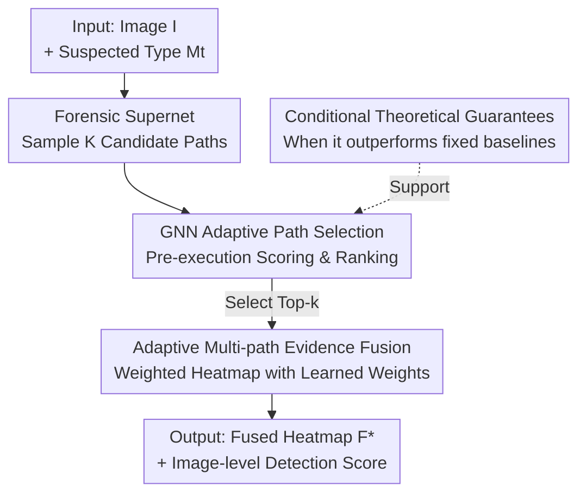

# FRAME: Forensic Routing and Adaptive Multi-path Evidence Fusion for Image Manipulation Detection

**Conference**: CVPR 2026  
**arXiv**: [2605.12826](https://arxiv.org/abs/2605.12826)  
**Code**: https://github.com/kzhao5/FRAME (Available)  
**Area**: Image Forensics / Manipulation Detection  
**Keywords**: Image Manipulation Detection, Multi-path Evidence Fusion, Adaptive Path Selection, GNN, Forensic Supernet

## TL;DR
FRAME organizes a collection of traditional forensic algorithms (ELA, DCT, Noise, CFA, copy-move, etc.) into a "forensic supernet." For each image, a GNN predictor selects the most suitable analysis paths and fuses their evidence maps. This avoids the issues of "single detector non-universality" and "fixed fusion diluting signals," achieving detection AUC and pixel-level localization results superior to fixed combinations and end-to-end deep models across multiple cross-domain datasets.

## Background & Motivation

**Background**: Image manipulation detection follows two main paths. One comprises traditional manual forensic algorithms—analyzing JPEG compression inconsistencies (ELA / DCT), camera sensor noise (PRNU), CFA interpolation traces, and copy-move regions. These are interpretable and based on clear principles. The other comprises deep learning detectors (TruFor, MMFusion, ManTraNet, CAT-Net, etc.), which offer higher accuracy across a broader range of manipulation types.

**Limitations of Prior Work**: Traditional algorithms each capture only **one** type of trace; their outputs (heatmaps / binary masks) are often noisy, fragmented, and contradictory. Relying on a single algorithm is unstable, while combining multiple is difficult to reconcile into a consistent conclusion. Deep models are black boxes with decisions hard to verify, and they rely on large-scale annotations, showing poor generalization to manipulations outside the training distribution.

**Key Challenge**: Most existing "multi-clue fusion" systems use **fixed combinations / fixed routing**, applying the same weighted sum of all algorithms to every image. However, the forensic traces left by different manipulations vary (JPEG splicing vs. copy-move requires entirely different algorithm preferences). Fixed fusion **dilutes** genuinely useful specialized signals, as no single detector is reliable in all cases.

**Goal**: To make the evidence integration strategy **adaptive to the image**. Given an image and its suspected manipulation type, the system should automatically select the most useful analysis paths to fuse, rather than using all indiscriminately.

**Key Insight**: The authors borrow the **supernet** abstraction from NAS, treating each forensic algorithm as a composable modular unit. Different combinations of algorithms form a "candidate analysis path," transforming the question of "which algorithms to use" into "which path to search for in the supernet."

**Core Idea**: A learned selector (GNN) scores candidate paths based on the image context, selects the top-$k$, and fuses their evidence maps using learned weights, replacing "fixed fusion" with "per-image adaptive routing + fusion."

## Method

### Overall Architecture

FRAME models image forensics as "adaptive path selection over a modular collection of forensic algorithms." The input is an image $I$ and a suspected manipulation type $M_t$. The system samples $K$ candidate analysis paths from a shared forensic module pool. An **offline-trained GNN predictor** scores each path before execution (predicting its F1 / IoU performance on the given image), selects the top-$k$ paths to execute, and fuses their output evidence heatmaps into a final heatmap $F^*$ using learned weights, while also providing an image-level detection score.

The pipeline is divided into two phases: **Offline Training**—for each image in the evaluation set, $K$ paths are sampled, the fusion output is generated, and performance $y$ is calculated against the ground truth to construct $\{(\mathcal{P}, I, M_t, y)\}$ for training the GNN (minimizing MSE); **Online Inference**—sampling candidate paths, GNN scoring/ranking, executing the top-$k$, and performing weighted fusion. The key advantage is that the GNN only needs to process the path's graph structure + image features + manipulation metadata to rank them, **eliminating the need to execute every path on every new image**.

### Key Designs

**1. Forensic Supernet: Organizing Heterogeneous Algorithms into Searchable Paths**

To address the issue where "fixed combinations dilute specialized signals," FRAME moves away from equal-weight contributions. Borrowing the supernet abstraction from NAS, each forensic algorithm $A_k$ is wrapped as a module $\mathcal{A}_k = \{alg_k(\cdot), \Theta_k\}$ (where $alg_k: \mathcal{I} \to \mathcal{O}_k$ maps an image to a heatmap/mask/score). The system is defined as a supernet $\mathcal{S}_F = \{\mathbb{A}, \mathcal{C}_F\}$, where $\mathbb{A}$ is the module set and $\mathcal{C}_F$ defines valid combinations, inducing a Directed Acyclic Graph (DAG). An **analysis path** $\mathcal{P}_j = \{\mathcal{V}_j, \mathcal{E}_j\}$ is a subgraph sampled from this DAG, producing an intermediate evidence map $F_j$. Unlike standard NAS, these "subnets" are **existing, training-free** manual forensic algorithms (from the pyIFD toolbox). The supernet serves as an organizational abstraction for adaptive multi-path analysis.

**2. GNN-Guided Adaptive Path Selection: Predicting Path Quality Before Execution**

The challenge is the combinatorial explosion of paths, making it impossible to execute all paths for every new image. FRAME formalizes path selection as finding $\mathcal{P}^* = \arg\max_{\mathcal{P} \in \Pi(\mathcal{S}_F)} \mathrm{Perf}(\mathcal{P}, I, M_t)$, which is estimated by a GraphSAGE-style lightweight GNN predictor $f_{\mathrm{GNN}}(\mathcal{P}, I, M_t)$. During training, $K$ paths are sampled offline per image, and their actual IoU / F1 scores $y_{k,i}$ are used as regression targets for the GNN:

$$\mathcal{L} = \sum_{(\mathcal{P}_k, I_i, M_{t,i}, y_{k,i}) \in \mathcal{D}_{train}} \lVert f_{\mathrm{GNN}}(\mathcal{P}_k, I_i, M_{t,i}) - y_{k,i} \rVert^2$$

Once trained, the GNN can rank paths **before execution**, bypassing exhaustive evaluation. This ensures that the selector picks the most appropriate paths based on context (content, compression history, manipulation type).

**3. Top-$k$ Learned Evidence Fusion: Synthesizing Fragmented Outputs**

After selecting top-$k$ paths, the problem becomes how to synthesize noisy and contradictory forensic outputs into a credible map. FRAME uses learned weights for weighted fusion: $F^* = \sum_{i=1}^{k} w_i \cdot O_{(i)}$. This yields a unified heatmap for both pixel-level localization and image-level detection. Ablations show that learned fusion outperforms uniform or softmax-weighted fusion. Compared to a top-1 single path, multi-path fusion provides redundant robustness, though $k$ must be limited to avoid low-quality paths.

**4. Conditional Theoretical Guarantees: Defining When Adaptive Selection Truly Outperforms Baselines**

The authors provide two theorems for **strict conditional improvement** (focusing on top-1 selection). Defining context $X = (I, M, C)$, path conditional expected performance $\mu(P, X)$, and candidate gap $g(X) = \mu_{(1)}(X) - \mu_{(2)}(X)$. Under the assumptions that the predictor is consistently accurate with high probability, the Tsybakov/no-tie condition controls the frequency of "optimal vs. sub-optimal" proximity, and a baseline is sub-optimal on a non-negligible subset, it is guaranteed that the learned selector **strictly outperforms** uniform fusion (Theorem 1) and the best single algorithm (Theorem 2) given a sufficiently small scoring error.

## Key Experimental Results

**Protocol**: The GNN selector and fusion module (approx. 44,000 parameters) are trained only on CASIA v2 (8,831 train / 1,918 val). Zero-shot evaluation is performed on four **external** datasets: CASIA v1 (1,754 images), Coverage (200 images, copy-move), Columbia (363 images, image-level only), and RealisticTampering (440 images, real-world splicing). Deep baselines use official pre-trained checkpoints without fine-tuning on CASIA v2. Main experiments use $K=50$, $k=5$.

### Main Results (Table 1: Comparison across four test sets)

| Method | CASIA v1 Det.AUC | CASIA v1 F1/mIoU | Coverage Det.AUC | RealisticTamp. Det.AUC | Columbia Det.AUC |
|------|------|------|------|------|------|
| Best single pyIFD | 0.612 | 0.284 / 0.198 | 0.624 | 0.598 | 0.841 |
| Uniform-all pyIFD | 0.574 | 0.251 / 0.172 | 0.587 | 0.561 | 0.817 |
| Heuristic-$K$ + uniform | 0.628 | 0.302 / 0.214 | 0.638 | 0.612 | 0.856 |
| XGB-Ensemble (pyIFD) | 0.674 | 0.342 / 0.243 | 0.683 | 0.651 | 0.876 |
| ManTraNet | 0.651 | 0.337 / 0.241 | 0.663 | 0.638 | 0.897 |
| CAT-Net | 0.678 | 0.368 / 0.263 | 0.691 | 0.661 | 0.916 |
| TruFor (Strongest Deep Baseline) | 0.724 | 0.408 / 0.294 | 0.718 | 0.687 | **0.924** |
| **FRAME (ours)** | **0.741** | **0.421 / 0.308** | **0.754** | **0.712** | 0.908 |

- Compared to **manual baselines**: FRAME exceeds the strongest XGB-Ensemble by 0.067 AUC / 0.079 F1 on CASIA v1. The significant gap between XGB and FRAME suggests gains come from **per-image adaptive routing** rather than just a stronger fixed combination.
- Compared to **deep baselines**: FRAME achieves the best detection AUC and localization scores on CASIA v1, Coverage, and RealisticTampering. It outperforms TruFor on CASIA v1 by 0.017 AUC. The only exception is Columbia (detection only), where TruFor leads.
- A counter-intuitive observation: Simple Uniform-all fusion (0.574) performs **worse** than Best single (0.612), confirming that indiscriminate averaging dilutes useful evidence.

### Ablation Study (Table 2: CASIA v1, component-wise analysis)

| Configuration | $K$ | Selection | Fusion | Det.AUC | F1 | mIoU |
|------|------|------|------|------|------|------|
| Uniform-all pyIFD | all | none | uniform | 0.574 | 0.251 | 0.172 |
| Heuristic-$K$ | 50 | heuristic | uniform | 0.628 | 0.302 | 0.214 |
| Top-1 selected | 50 | learned | none | 0.684 | 0.348 | 0.251 |
| Top-$k$ + uniform fusion | 50 | learned | uniform | 0.712 | 0.387 | 0.281 |
| Top-$k$ + softmax fusion | 50 | learned | softmax | 0.724 | 0.403 | 0.293 |
| **Top-$k$ + learned fusion (ours)** | 50 | learned | learned | **0.741** | **0.421** | **0.308** |

### Key Findings
- **Learned selection provides the largest gain**: Moving from Heuristic (0.628) to Top-1 learned (0.684) yields a 0.056 AUC jump, indicating the selector's ability to identify stronger paths.
- **Fusion provides secondary gains**: Learned fusion on top of learned selection adds another 0.057 AUC collectively over the top-1 baseline.
- **Stable hyperparameters with a sweet spot**: Increasing $K$ from 5 to 50 improves results significantly, but $K=100$ shows diminishing returns while doubling inference time. Top-$k$ fusion is optimal at $k=5$.

## Highlights & Insights
- **Applying NAS supernet abstraction to training-free algorithm orchestration**: Searching for combinations of existing manual algorithms is a clever conceptual shift, providing a unified framework for the "which algorithms to use" problem.
- **Scoring before execution saves resources**: Predicting performance using only graph structures and image features allows for efficient search in a large path space.
- **Theoretical bounds for adaptive selection**: The work provides rigorous conditions (context heterogeneity and predictor accuracy) under which adaptation strictly outperforms fixed baselines.
- **The "averaging makes it worse" insight**: In heterogeneous evidence fusion, indiscriminate averaging dilutes expert signals. Sample-wise routing > fixed combinations.

## Limitations & Future Work
- **Trace specificity**: Current modules target traditional editing traces (splicing, copy-move, JPEG). **AI-generated / diffusion-restored** content may not leave these specific traces, though the modular framework could theoretically incorporate AI-specific detectors.
- **Theory-experiment gap**: Formal guarantees cover only top-1 selection, while the practical implementation uses top-$k$ fusion.
- **Tool pool ceiling**: Performance is ultimately bounded by the manual algorithms in the pyIFD pool; the system optimizes existing signals rather than creating new ones.
- **Metadata dependence**: The method relies on "suspected manipulation type $M_t$," the robustness of which is not fully explored for scenarios where this information is missing or incorrect.

## Related Work & Insights
- **vs. TruFor / MMFusion / CAT-Net**: These use large black-box models to learn complex features. FRAME uses a lightweight 44k parameter selector to orchestrate training-free algorithms, offering better interpretability and cross-domain localization.
- **vs. XGB-Ensemble**: This learns a **global fixed** combination; FRAME learns **per-image adaptive** routing.
- **vs. NAS / Supernet**: FRAME adapts the "large net containing multiple subnets" concept to "tool orchestration," where the search space consists of existing forensic pipelines.

## Rating
- Novelty: ⭐⭐⭐⭐ Applying supernet search to forensic tool orchestration with theoretical backing is novel.
- Experimental Thoroughness: ⭐⭐⭐⭐ Extensive cross-domain tests and ablations; however, lacked specific tests on AI-generated content.
- Writing Quality: ⭐⭐⭐⭐ Clear logic across motivation, theory, and experimental results.
- Value: ⭐⭐⭐⭐ Provides a learnable framework for adaptive multi-tool forensics with generalizable insights for expert fusion.

<!-- RELATED:START -->

## Related Papers

- [\[CVPR 2026\] ReAlign: Generalizable Image Forgery Detection via Reasoning-Aligned Representation](realign_generalizable_image_forgery_detection_via_reasoning-aligned_representati.md)
- [\[CVPR 2026\] Quality-Aware Calibration for AI-Generated Image Detection in the Wild](quality-aware_calibration_for_ai-generated_image_detection_in_the_wild.md)
- [\[CVPR 2026\] PPM-CLIP: Probabilistic Prompt Modeling for Generalizable AI-Generated Image Detection](ppm-clip_probabilistic_prompt_modeling_for_generalizable_ai-generated_image_dete.md)
- [\[ACL 2026\] Frame In, Frame Out: Measuring Framing Bias in LLM-Generated News Summaries](../../ACL2026/aigc_detection/frame_in_frame_out_measuring_framing_bias_in_llm-generated_news_summaries.md)
- [\[ICML 2026\] CORE: Conflict-Oriented Reasoning for General Multimodal Manipulation Detection](../../ICML2026/aigc_detection/core_conflict-oriented_reasoning_for_general_multimodal_manipulation_detection.md)

<!-- RELATED:END -->
