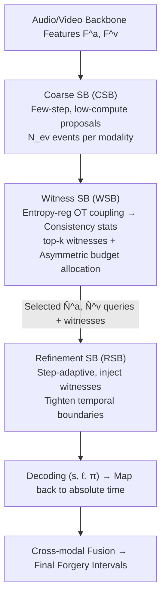

# Inconsistency-aware Multimodal Schrodinger Bridge for Deepfake Localization

**Conference**: CVPR 2026  
**Paper**: [CVF Open Access](https://openaccess.thecvf.com/content/CVPR2026/html/Xiong_Inconsistency-aware_Multimodal_Schrodinger_Bridge_for_Deepfake_Localization_CVPR_2026_paper.html)  
**Code**: To be confirmed  
**Area**: AIGC Detection / Deepfake Forensics  
**Keywords**: Deepfake Localization, Schrödinger Bridge, Audio-Visual Forensics, Cross-modal Consistency, Optimal Transport

## TL;DR
IaMSB reformulates "temporal interval localization" of audio-visual deepfakes as a Schrödinger Bridge (SB) generation problem—directly reading cross-modal consistency scores from the bridge's transmission cost and asymmetrically allocating computation steps to the more suspicious modality, resulting in a 3-10% gain over existing methods on strict IoU (AP@0.95).

## Background & Motivation

**Background**: Audio-visual deepfake localization requires outputting interval-level evidence—exactly when the forgery starts and ends—as auditable forensic proof, which is far more useful than video-level binary labels. Current mainstream approaches employ "symmetric fusion": using order-invariant, equal-depth cross-modal fusion modules with temporal refinement heads to fuse audio and video branches equivalently before localization.

**Limitations of Prior Work**: In reality, the two modalities are highly asymmetric. Forgeries may be unimodal (only visual modified, audio real, or vice-versa) or asynchronous (manipulations in different time segments). Symmetric fusion leads to three specific problems: (i) **Negative transfer**—the clean (unmanipulated) branch injects noise into the forged branch, causing mis-localization; (ii) **Computation mismatch**—too many fusion layers waste computation on clean modalities, while too few prevent the forged modality from converging; (iii) **Resolution constraints**—fusion itself is computationally expensive (sequence modeling is often $O(S^2)$), forcing a sacrifice in temporal resolution under resource constraints, leading to inaccuracy exactly in the intervals where high-precision localization is needed.

**Key Challenge**: Cross-modal fusion can either "help" (complementary evidence) or "add noise" (noise propagation). Symmetric, uniform fusion cannot distinguish between these two cases, nor can it focus the limited refinement budget on the truly suspicious modalities or time periods.

**Goal**: Simultaneously estimate cross-modal consistency, filter truly useful cross-modal evidence, and schedule computation steps on-demand within a single framework to output aligned interval-level localization.

**Key Insight**: Generative decoders (diffusion-like) can explicitly control the inference step budget and accelerate convergence, inspiring "asymmetric fusion." However, existing diffusion-based localization lacks two things: a **step scheduler** capable of handling multimodal asynchrony and a calibrated, temporally local **measure of cross-modal discrepancy**. The authors discovered that the Schrödinger Bridge perfectly fills these gaps.

**Core Idea**: Model localization as a Schrödinger Bridge transporting a "source distribution" to a "target distribution." As a stochastic control problem, SB transports between two endpoint distributions **without explicit noise/denoise loops** and directly quantifies distribution discrepancy. Thus, the bridge's terminal objective naturally provides a cross-modal consistency score (obtained in $O(1)$) to filter evidence and allocate budgets. Simultaneously, SB is viewed as a step-controllable diffusion-like decoder for step-adaptive fusion of filtered evidence. This is the first work to apply diffusion/bridge models to audio-visual deepfake localization.

## Method

### Overall Architecture
The inputs are token sequences $F^a, F^v$ extracted by audio and video backbones (with temporal granularities $\Delta t^a, \Delta t^v$). The model outputs a normalized start time $s^m_k$, duration $\ell^m_k$, and confidence $\pi^m_k$ for the $k$-th event of each modality $m\in\{a,v\}$, which are then mapped back to the absolute timeline.

IaMSB is a **cascaded three-bridge** structure: ① The **Coarse SB (CSB)** uses minimal steps and low-compute updates to propose candidate intervals for each modality; ② The **Witness SB (WSB)** performs a static Optimal Transport (OT) coupling to calculate cross-modal statistics, filter "witness" evidence, and **asymmetrically** allocate the total step and event budgets to the two modalities; ③ The **Refinement SB (RSB)** performs step-adjustable refinement on selected queries, injecting cross-modal witnesses to output aligned, precise intervals under a unified budget. The bottleneck of the chain is WSB: the consistency score is obtained in $O(1)$, while only the refinement bridge is $O(T)$—spending expensive computation only where transmission residuals are high (i.e., more suspicious).

### Key Designs

**1. Consistency as Transport: Quantizing cross-modal consistency via SB transmission cost without extra alignment networks**

Addressing the gap of needing a calibrated cross-modal discrepancy measure: Given boundary marginals $\nu_0, \nu_1$, SB finds $\min_Q \text{KL}(Q\|R)$ s.t. $Q_0=\nu_0, Q_1=\nu_1$ over a path space with Wiener process $R$ as the reference measure. This is equivalent to a controlled diffusion $dZ_t = u_t(Z_t)dt + \sigma dW_t$ with control energy $\mathcal{E}(Q)=\mathbb{E}_Q\int_0^1 \frac{\|u_t\|^2_2}{2\sigma^2}dt$. The authors let $\nu_0$ encode a sparse interval prior and $\nu_1(\cdot|X)$ encode an observation-aligned posterior (GT of the current or other modality). The bridge uses an $S$-step propagator $\Phi_S$ to push $\nu_0$ toward $\nu_1$. Crucially, the pair $(\mathcal{E}(Q), S^\star(\varepsilon))$—control energy and the "minimum steps to reach tolerance $\varepsilon$" $S^\star(\varepsilon)=\min\{S: D(\Phi_S(\nu_0|X), \nu_1(\cdot|X))\le\varepsilon\}$—is used as an explicit scale for cross-modal resource allocation and interaction: consistent events are "easier to reach" (fewer steps), while inconsistent/unimodal forgeries require more steps. Consistency scores are thus read **for free** from the bridge's transmission geometry, providing calibrated "reachability."

**2. Coupling as Bottleneck: Static entropy-reg OT as a lightweight implicit interaction bottleneck for budget allocation and noise suppression**

Addressing negative transfer (Problem i) and computation mismatch (Problem ii): WSB performs a static SB—an entropy-regularized optimal transport coupling $\Pi=\arg\min_{\Pi\ge0}\langle\Pi,C\rangle+\sum\Pi_{pq}\log\Pi_{pq}$—on coarse events from both modalities. The cost is $c_{pq}=\lambda_t|s^a_p-s^v_q|+\lambda_\ell|\ell^a_p-\ell^v_q|+\lambda_o(1-\text{IoU})+\lambda_\pi(\pi^a_p-\pi^v_q)^2$ (where $\lambda$ are learnable). A set of statistics is derived from the coupling matrix $\Pi$: weighted residual $R$, unmatched rate $U=1-T$, normalized coupling entropy $H$, and interval inconsistency rate $C=1-\sum\Pi_{pq}\text{IoU}$. By **keeping only the top-k per row** of $\tilde\Pi$ (zeroing others), the cross-modal latent variables are gathered into a witness set $P^m$. This "bottleneck" structuralizes the interaction: only the most relevant cross-modal evidence passes through, **blocking** mass noise from clean modalities from flooding forged ones. Statistics $\Phi_w=[R,T,U,H,C]$ are combined into directional scores $\hat S=[\hat S_{a|v}, \hat S_{v|a}]$, which, combined with the control energy difference, yield weights $(w_v, w_a)$ via softmax. The total step budget $S_{tgt}$ and event budget $N_{ev}$ are then **asymmetrically allocated**: $S^m_r=2\lfloor w_m S_{tgt}/2 + 0.5\rfloor$, $\hat N^m=2\lfloor w_m N_{ev}/2+0.5\rfloor$. WSB interacts only with events and is time-agnostic, maintaining $O(1)$ complexity.

**3. Cascaded SB Locator: Coarse proposals + step-adaptive refinement for boundary tightening**

Addressing resolution constraints (Problem iii): **CSB** uses residual step updates $Z^m_{t+1}=Z^m_t+\Delta u^m_c(U^m_t)$ (where $U^m_t=\text{LN}(Z^m_t+\text{MHA}(Z^m_t, F^m, F^m))$ and $\Delta=1/S_c$), running for a fixed $S_c$ steps to produce $N_{ev}$ candidates. Its complexity is $O(N_{ev}L^m)$, cheaper than standard cross-attention $O(L^aL^v)$, without sacrificing temporal resolution. For queries $\tilde Z^m_{out}$ selected by WSB, **RSB** performs self-attention, then injects high-confidence witnesses $\hat P^m$ via cross-attention $R^m_{wit,n}=\text{MHA}(U^m_{t,2}[n], \hat P^m[n], \hat P^m[n])$. After merging memory, it performs residual propagation with step size $\Delta=1/S^m_r$. Since each selected token exactly runs $S^m_r$ steps (allocated by WSB based on suspiciousness), computation is concentrated on boundaries with high transmission residuals—the mechanism behind its AP@0.95 gains. Each stage scales **linearly** with temporal length, coupling $O(1)$ consistency scores with an $O(T)$ refinement bridge.

### Loss & Training
The localization loss comprises matching, negative sample, and coverage terms:  
$\mathcal{L}^m_{loc}=\sum_{(p,g)\in M^m}[(1-\text{EIoU})+H(p,g)+\text{BCE}(\pi^m_p,1)]+\sum_{k\in U^m}\text{BCE}(\pi^m_k,0)+\sum_g\exp(-\beta\max_p\text{IoU}(p,g))$  
(where $H$ is Huber loss). Two additional terms are used: **Directional Ranking Loss** $\mathcal{L}_{rank}=\max(0, m_0-(\hat S_{a|v}-\hat S_{v|a}))$ imposes an identifiable, calibrated ranking on directional uncertainty to guide the budget; **Step-Value Regularization** $\mathcal{L}_{svn}$ weights the per-modality budget $\hat N^m S^m_r$ to penalize "worse performance with more steps" violations and cross-modal imbalance. Total loss $\mathcal{L}=\sum_m\mathcal{L}^m_{loc}+\lambda_{rank}\mathcal{L}_{rank}+\lambda_{svn}\mathcal{L}_{svn}$, with $\lambda_{rank}=\lambda_{svn}=0.2$. CSB is fixed to 2 steps; WSB uses single-shot Sinkhorn with top-16 witnesses; RSB has $S_{tgt}=12$. 

## Key Experimental Results

### Main Results
Evaluated on LAV-DF, TVIL (visual-only unimodal forgery), and AV-Deepfake1M (long-form + partial forgery). Core metrics are AP@0.95 (boundary precision) and AR under various proposal budgets.

| Dataset | Method | AP@0.5 | AP@0.95 | AR@10 |
|--------|------|--------|---------|-------|
| LAV-DF | UMMAFormer | 98.83 | 37.61 | 92.10 |
| LAV-DF | MMMS-BA | 97.56 | 39.02 | 89.42 |
| LAV-DF | **Ours** | **99.33** | **55.92** | **94.68** |
| TVIL | UMMAFormer | 88.68 | 62.43 | 87.09 |
| TVIL | **Ours** | **96.89** | **65.62** | **90.05** |

On AV-Deepfake1M (harder long-form + partial forgery):

| Method | AP@0.75 | AP@0.90 | AP@0.95 | AR@5 |
|------|---------|---------|---------|------|
| DiMoDif | 75.95 | 28.72 | 5.43 | 76.64 |
| RegQAV | 81.86 | 41.98 | 12.57 | 85.97 |
| **Ours** | **82.03** | **45.15** | **23.01** | **86.03** |

The most significant gains are at the strict AP@0.95: increasing from the second-best 39.02 to 55.92 on LAV-DF, and nearly doubling from 12.57 to 23.01 on AV-Deepfake1M—validating that "placing limited refinement where it belongs" determines boundary precision.

### Ablation Study
Four variants evaluated under the LAV-DF protocol (✓ indicates the bridge is retained):

| CSB | WSB | RSB | AP@0.95 | AR@10 | Description |
|-----|-----|-----|---------|-------|------|
| ✓ | ✓ | ✓ | **55.92** | **94.68** | Full Model |
| – | ✓ | ✓ | 32.51 | 87.83 | No CSB: Lacks proposals; recall suffers. |
| ✓ | – | – | 22.07 | 85.25 | Only CSB: Modality imbalance errors amplified. |
| ✓ | – | ✓ | 23.39 | 85.77 | No WSB: Lacks filtering + budget allocation; major regression. |

### Key Findings
- **WSB is Critical**: Removing it (no cross-modal bottleneck or budget allocation) causes AP@0.95 to plummet from 55.92 to 23.39, proving that "selective evidence routing + asymmetric budget" is the source of high precision.
- **Top-k Witness Selection**: AP@0.95 peaks at $k=16$ (55.92). Increasing to 32/64 reduces it to 54.35/53.97—narrow bottlenecks underexpose evidence, while wide ones introduce noise, echoing "selective interaction > indiscriminate exchange."
- **Coarse Step $S_c$ Saturation**: Improvement is most significant from $1 \to 2$ steps (AP@0.95 52.87 $\to$ 55.92). Further increases ($3$ steps: 55.98) fall within experimental variance.
- **Unimodal vs. Asynchronous Scenarios**: On LAV-DF, cross-modal inconsistency is obvious and transmission cues are informative, leading to clear AP@0.95 gains. On TVIL (pure visual forgery), evidence is weaker, and budget allocation primarily improves recall and mid-range IoU.
- **Efficiency**: Single-step CSB at 0.428 GFLOPs, OT iteration at $3\times10^{-5}$ GFLOPs, and RSB at 1.01 GFLOPs. Heavy computation is strictly limited to the refinement bridge.

## Highlights & Insights
- **Unifying "Consistency Measure" and "Compute Budget" in Transmission Geometry**: The Schrödinger Bridge "steps to target $S^\star$" serves as both a consistency score and a budget signal. This eliminates the need for separate alignment networks and schedulers, an elegant "measure-as-schedule" approach.
- **Bottleneck as a Structural Defense against Negative Transfer**: The top-k sparse coupling is not a "soft constraint" via loss but a direct flow limit in the information path. This is more robust than regularization and transferable to any multimodal task where clean modalities might contaminate "dirty" ones.
- **First Application of SB to AV Deepfake Localization**: Unlike diffusion-based localization that treats boundaries as "noise query denoising," SB requires no explicit noise and directly provides distribution discrepancy, making the modeling of the localization problem more concise and controllable.

## Limitations & Future Work
- **Diminishing Returns in Weak Evidence Scenarios**: Gains on forgeries like TVIL (purely visual) rely more on modality-specific decoders; IaMSB's advantages are primarily in recall here.
- **Fixed Top-k=16 Redundancy**: Fixed top-k may include redundant witnesses in certain scenarios, suggesting a need for more adaptive $k$ selection.
- **$O(S^2)$ Attention in Long Sequences**: While heavy compute is shifted to the refinement bridge, attention overhead still dominates for extremely long sequences, creating a tension between efficiency and high-IoU precision at the boundaries.

## Related Work & Insights
- **vs. UMMAFormer / MMMS-BA (Symmetric Fusion)**: These use deep cross-modal attention for coupling but propagate noise under modality imbalance. IaMSB uses an OT bottleneck and asymmetric budgets to target strict IoU.
- **vs. RegQAV (Query-based Decoding)**: RegQAV uses register tokens to stabilize decoding. IaMSB does not fix the refinement budget, instead allocating steps by suspiciousness, leading to higher AP@0.95.
- **vs. DiMoDif (Speech-level Inconsistency)**: DiMoDif relies on semantic conflicts. IaMSB quantizes inconsistency at the distribution transport level, allowing finer granularity and coupling with compute scheduling.

## Rating
- Novelty: ⭐⭐⭐⭐⭐ First to use Schrödinger Bridge for deepfake localization; the "transport cost as consistency as budget" view is highly original.
- Experimental Thoroughness: ⭐⭐⭐⭐ Extensive testing on three benchmarks with comprehensive ablation; however, known weaknesses like top-k redundancy remain.
- Writing Quality: ⭐⭐⭐ Complex concepts with dense notation; readability is somewhat affected by heavy formulas.
- Value: ⭐⭐⭐⭐ Substantial improvement in strict IoU (AP@0.95) is directly meaningful for "auditable boundaries" in forensic scenarios.

<!-- RELATED:START -->

## Related Papers

- [\[CVPR 2026\] Quality-Aware Calibration for AI-Generated Image Detection in the Wild](quality-aware_calibration_for_ai-generated_image_detection_in_the_wild.md)
- [\[CVPR 2026\] Learning Forgery-Aware Lip Representations Without Forgery Priors](learning_forgery-aware_lip_representations_without_forgery_priors.md)
- [\[ICML 2026\] CORE: Conflict-Oriented Reasoning for General Multimodal Manipulation Detection](../../ICML2026/aigc_detection/core_conflict-oriented_reasoning_for_general_multimodal_manipulation_detection.md)
- [\[ACL 2026\] GigaCheck: Detecting LLM-generated Content via Object-Centric Span Localization](../../ACL2026/aigc_detection/gigacheck_detecting_llm-generated_content_via_object-centric_span_localization.md)
- [\[CVPR 2026\] Locate-Then-Examine: Grounded Region Reasoning Improves Detection of AI-Generated Images](locate-then-examine_grounded_region_reasoning_improves_detection_of_ai-generated.md)

<!-- RELATED:END -->
