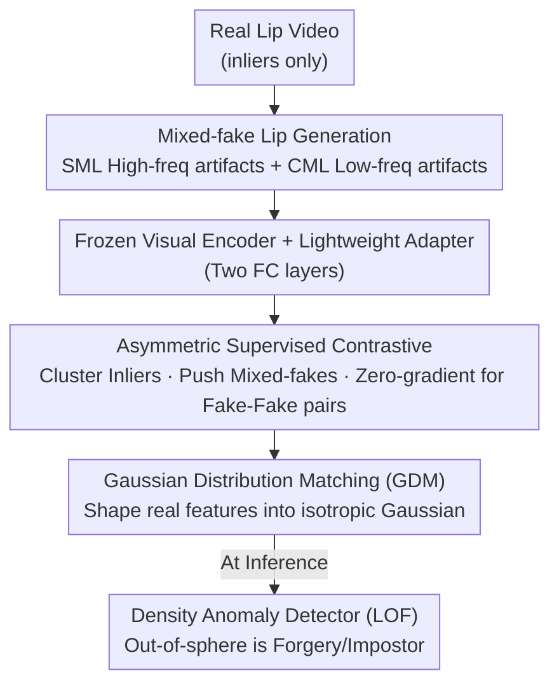

# Learning Forgery-Aware Lip Representations Without Forgery Priors

**Conference**: CVPR 2026  
**Paper**: [CVF Open Access](https://openaccess.thecvf.com/content/CVPR2026/html/Chen_Learning_Forgery-Aware_Lip_Representations_Without_Forgery_Priors_CVPR_2026_paper.html)  
**Code**: Not provided in the original text  
**Area**: Forgery Detection / Lip Authentication / One-Class Representation Learning  
**Keywords**: Visual Speaker Authentication, TFG Forgery, No Forgery Priors, Asymmetric Contrastive Learning, Gaussian Distribution Matching

## TL;DR
To address the vulnerability of speaker authentication systems to personalized Talking Face Generation (TFG) forgeries, this paper proposes a detector **trained solely on real videos without relying on any forgery samples**. By combining mixed-fake lip generation, asymmetric contrastive learning, and Gaussian regularization, the real lip motion features are compressed into a compact hypersphere. Anything outside the sphere (forgeries and impostors) is treated as an outlier, reducing the error rate by over 10% against 8 modern forgeries compared to 10 SOTA methods.

## Background & Motivation

**Background**: Visual Speaker Authentication (VSA) uses lip dynamics instead of the full face to verify identity—preserving discriminative identity features while exposing less privacy than the full face. Modern VSA systems typically employ an "impostor detector" after content recognition, essentially a classifier trained supervised on known real/fake videos, often reporting over 99% accuracy in clean scenarios.

**Limitations of Prior Work**: Generative models are advancing rapidly. Personalized TFG (e.g., ER-NeRF, MimicTalk, PersonaTalk) can render realistic talking faces with precise lip-audio synchronization from a short reference video or even a single image. These forgeries are **entangled** with the target user's real samples in the feature space, appearing closer to the true identity than human impostors or generic forgeries. Consequently, supervised classifiers suffer from two major flaws: ① Overfitting to known impostors and failing against unknown forgeries that closely mimic real samples; ② Without effective forgery priors, the decision boundary systematically biases toward the few known impostors, collapsing when facing evolving personalized TFG.

**Key Challenge**: The detector's capability is bound to whether the "forgery priors are rich and representative," yet the forgery distribution is open, boundless, and constantly evolving. Attempting to define an infinite outlier space using finite, biased fake samples is destined to fail in generalization.

**Goal**: Abandon the path of forgery priors and instead **precisely model the compact boundary of real samples**, treating any sample falling outside the boundary with anomalous feature statistics (whether unseen forgeries or human impostors) as an outlier.

**Key Insight**: A key observation is that the variance of real samples from the same user is extremely small, while forgeries, no matter how realistic, retain subtle deviations due to generation traces. Thus, if real features are compressed into a sufficiently tight, well-structured distribution, the "out-of-sphere is fake" principle holds.

**Core Idea**: Completely discard forgery priors that introduce systematic bias. Instead, use "mixed-fake generation + asymmetric contrast + Gaussian regularization" to cooperatively carve a compact real-sample feature space, then use a density-based anomaly detector to reject outliers.

## Method

### Overall Architecture
The method is a three-stage collaborative representation learning pipeline. **It only trains a lightweight adapter (two fully connected layers) appended to the original VSA visual encoder, keeping the encoder backbone frozen**, resulting in minimal adaptation cost for new user registration. The first stage bypasses deep generators and directly mixes real lip frames to create two types of "mixed-fake" samples to expand the training space. The second stage uses an asymmetric supervised contrastive loss to cluster real samples (inliers) and push away mixed-fakes, but **it does not constrain the relationship between different forgeries**. The third stage adds a Gaussian Distribution Matching (GDM) regularization to shape real features into an isotropic Gaussian for subsequent density modeling. The training objective is $L = L_{asym} + \gamma L_{gdm}$. During inference, a density-based anomaly detector (e.g., LOF) models the real sample distribution, and any sample outside the sphere is rejected.

### Key Designs

**1. Mixed-fake Lip: Simulating Forgery Traces via Real Frame Mixing**

The pain point is direct: the only available outliers in the real world are "other users," whose variation is limited and provides little help for detection; training various TFG generators is neither realistic nor capable of keeping up with evolution. Inspired by "virtual outliers" in one-class classification, this paper **mixes real lip frames** to create mixed-fake lips, specifically simulating the typical high-frequency/low-frequency artifacts in forged videos. The mixing formula is $I^{mix}_t(i,j) = \alpha_t(i,j)\, I^{A}_t(i,j) + (1-\alpha_t(i,j))\, I^{S}_t(i,j)$, where $I^S$ is the original real frame, $I^A$ is an augmented or alternative source frame, and $\alpha\in[0,1]$ controls the intensity of the injected traces. Two types are complementary: **Self-Mixed Lip (SML)** applies temporally consistent parameters and at least three chained strong augmentations (rotation/shear/posterize, etc.) to a single real video before synthesis, simulating high-frequency artifacts caused by local generation failures—texture inconsistency across frames, lip edge distortion, jitter, and sudden lighting changes; **Cross-Mixed Lip (CML)** randomly merges two different inlier samples to simulate low-frequency artifacts from global inconsistency—overly smooth transitions or delayed/weakened lip movements. This step downgrades "forgery generation" from relying on deep generators to cheap frame-level mixing, yet covers the main spectrum of TFG artifacts.

**2. Asymmetric Supervised Contrast: Constraining Only Real Samples**

Since forgeries do not follow fixed generation patterns, they scatter irregularly around real samples in the latent space. Conventional Supervised Contrastive (SupCon) loss forces a "structured layout" on negative samples, an assumption that does not hold for forgeries and hurts discriminability while causing overfitting. This paper modifies the objective to **focus only on inliers**: pull together Real-Real and push away Real-Fake, but **remove Fake-Fake pairs from the loss** (contributing zero gradients), thus not forcing disparate forgeries to be consistent with each other. The loss is defined as $L_{asym} = -\sum_{i:y_i=1}\frac{1}{|\mathcal{I}_i|}\sum_{j\in\mathcal{I}_i}\log\frac{\exp(z_i^\top z_j/\tau)}{\sum_{k\in\mathcal{B}\setminus\{i\}}\exp(z_i^\top z_k/\tau)}$, where $z_i$ are $\ell_2$-normalized features, $\mathcal{I}_i$ are all inliers except the anchor, and $\mathcal{B}$ is the entire batch. This asymmetric loss acts on the aforementioned adapter, and **the adapter is retained after training** because its output is the final latent space—distinct from SupCon, which typically discards the projection head.

**3. Gaussian Distribution Matching (GDM): Shaping Real Features into Analytic Isotropic Gaussians**

While contrastive loss makes real samples more compact, the distribution lack explicit structural constraints, making density modeling unstable. This paper introduces a standard Gaussian as the target prototype for inliers, providing a unimodal, compact, and analytically tractable structure. This is achieved by using the InfoMax principle to maximize the mutual information between the representation $f(X)$ and its noisy version $ f(X)+Z$: since $I(f(X); f(X)+Z) = h(f(X)+Z) - h(Z)$ and $h(Z)$ is fixed, maximizing mutual information is equivalent to increasing the entropy of $ f(X)+Z$. By the maximum entropy theorem, a Gaussian has the maximum entropy for a given covariance; this objective implicitly pushes the representation toward a Gaussian (Proposition 1 provides an upper bound $I \le \frac{d}{2}\log(1+\frac{1}{\sigma^2})$, with equality holding when $f(X)\sim\mathcal{N}(0,I)$). Directly estimating mutual information is infeasible in high dimensions, so the Donsker–Varadhan variational representation is used to formulate the GDM loss in an InfoNCE format: $L_{gdm} = -\frac{1}{N}\sum_i\log\frac{\exp(\langle z_i/\tilde{z}_i\rangle\tau)}{\sum_j\exp(\langle z_i/\tilde{z}_j\rangle\tau)}$, where $\tilde{z}_i = z_i + \epsilon_i,\ \epsilon_i\sim\mathcal{N}(0,\sigma^2 I)$. As the bound approaches the theoretical maximum, the feature distribution is regularized to a standard Gaussian, improving the generalization of downstream density detectors. ⚠️ The specific inner product/temperature notation in Eq. 5 should be verified with the original text.

### Loss & Training
The total objective is $L = L_{asym} + \gamma L_{gdm}$, with $\gamma$ as a weighting coefficient (default 1). Using the Adam optimizer with a learning rate of 0.0001, training stops if the loss does not decrease for 10 consecutive epochs. For each training set, 500 clips are randomly sampled. Only the adapter is updated, using a pre-trained AV-HuBERT as the encoder. Inference employs density-based anomaly detectors (LOF/IF/OC-SVM/EE), with the threshold for each identity calibrated on the training set at a 1% False Negative Rate (FNR).

## Key Experimental Results

Two core metrics are evaluated: **AUC** (Area Under the ROC Curve, higher is better, measures overall separability) and **HTER** (Half Total Error Rate, average of FAR and FRR, lower is better, addresses the inability of AUC to reflect threshold selection difficulty). The benchmark is the self-built **TFG-Suite**: 8 forgery methods (personalized PersonaTalk / ER-NeRF / MimicTalk, zero-shot TalkLip / Wav2Lip / IP-LAP / FOMM, plus face-swapping SimSwap), covering TFG-GRID, TFG-Lombard, and the real-world dataset AVLips. 'HM' denotes Human Impostor attacks, the baseline open-set condition for VSA.

### Main Results

| Dataset | Method | Mean AUC↑ | Mean HTER↓ |
|---------|--------|-----------|------------|
| TFG-GRID | OpenSet (Strongest baseline) | 95.26 | 11.20 |
| TFG-GRID | DO2HSC | 95.21 | 8.51 |
| TFG-GRID | **Ours** | **99.83** | **2.13** |
| TFG-Lombard | OpenSet (Strongest baseline) | 95.76 | 11.19 |
| TFG-Lombard | **Ours** | **99.91** | **1.86** |

On TFG-GRID, the proposed method nearly perfectly detects the hardest personalized forgeries: PersonaTalk (AUC 99.92), ER-NeRF (99.95), and MimicTalk (99.99). Meanwhile, VSA-specific baselines like SA-DTH only achieve 59.38 on PersonaTalk, and TD-VSA only 46.78—confirming that detectors relying on low-level cues collapse against personalized TFG.

The real-world AVLips dataset better distinguishes the robustness of the methods (listing three variants of the proposed method vs. the strongest baseline):

| Configuration | HM AUC↑/HTER↓ | Fake AUC↑/HTER↓ | Mean AUC↑/HTER↓ |
|---------------|----------------|------------------|------------------|
| OpenSet (Baseline) | 98.90 / 13.98 | 88.35 / 43.54 | 93.62 / 28.76 |
| Ours-V (Visual only, inliers only) | 95.24 / 11.11 | 98.71 / 6.61 | 96.97 / 8.86 |
| Ours-V + HM (Inject some others as outliers) | 99.35 / 5.00 | 99.33 / 6.68 | 99.34 / 5.84 |
| Ours-AV (Concatenated AV features) | 99.80 / 1.97 | 99.88 / 2.07 | **99.84 / 2.02** |

The default V variant uses zero human impostor data; V+HM injects a fixed ratio of other users as outliers, significantly improving resistance to HM attacks; the AV variant, which optimizes concatenated audio-visual features, performs best, showing the method is friendly to modal expansion.

### Ablation Study

| Ablation | Configuration | PersonaTalk AUC↑ | ER-NeRF | MimicTalk | Note |
|----------|---------------|------------------|---------|-----------|------|
| Forgery Gen | w/ Rotation Outliers | 78.27 | 88.31 | 99.70 | Rotation is effective but inferior |
| Forgery Gen | w/ SML+CML (Ours) | 99.92 | 99.95 | 99.99 | Mixed-fake is significantly superior |
| Contrastive | Cross-Entropy | 73.09 | 62.83 | 86.54 | Supervised classification fails open-set |
| Contrastive | SimCLR | 59.48 | 85.83 | 98.77 | Lacks inlier distribution constraints |
| Contrastive | SupCon | 65.90 | 75.20 | 97.03 | Forcing structure on negatives fails |
| Contrastive | SupCon+SimCLR | 59.10 | 84.78 | 98.99 | Still inferior to asymmetric |
| Contrastive | Asymmetric (Ours) | 99.92 | 99.95 | 99.99 | Constraining only inliers is optimal |

### Key Findings
- **The three components are indispensable and complementary**: Mixed-fake generation "expands the training space," asymmetric contrast "clusters only inliers," and GDM "shapes real features into a modelable Gaussian." GDM consistently reduced error rates across LOF, IF, OC-SVM, and EE anomaly detectors on AVLips, indicating it provides "universal modelability" rather than tuning for a specific detector.
- **Personalized TFG is the most difficult**: All baselines dropped most significantly on PersonaTalk/ER-NeRF (most AUCs fell to 60~80), while the proposed method barely dropped, validating the generalization advantage of "purely modeling real samples without forgery priors."
- **Asymmetric is superior to SupCon**: SupCon forces a structured layout on negative samples (forgeries) by default, which mismatches the irregular distribution of forgeries; this mismatch leads to overfitting—direct evidence that "imposing fewer assumptions" yields gains.

## Highlights & Insights
- **Paradigm Inversion**: Shifting from "learning forgeries" to "learning what is real; everything else is fake." When the forgery space is infinite and evolving, modeling the finite real sample boundary is more stable than chasing infinite forgeries—a mindset transferable to any open-set security detection (liveness, anti-fraud, intrusion).
- **Generator-free Forgery**: Using SML/CML mixing of real frames to simulate high/low-frequency artifacts avoids the "must have a strong generator to train a detector" chicken-and-egg problem, drastically reducing deployment and maintenance costs.
- **Adapter-only Training**: Freezing the encoder and only updating two FC layers makes new user registration nearly zero-cost and engineering-friendly; this is isomorphic to LLM adapter tuning, with low migration costs.
- **Theoretically Grounded Gaussian Regularization**: Through the InfoMax → Max Entropy → Gaussian chain, "what features should look like" moves from empirical tuning to an objective with upper-bound guarantees, effectively merging anomaly detection with representation learning.

## Limitations & Future Work
- **Dependency on Mixed-fake coverage**: SML/CML simulate high/low-frequency artifacts. If new types of artifacts emerge that are neither high nor low frequency (e.g., semantic-level temporal inconsistency), the mixing operators might need redesigning.
- **Visual-only default is slightly weaker against HM**: The default V variant uses no other-user samples, and its HTER (11.11) against human impostors (HM) is noticeably higher than its forgery detection error, requiring V+HM injection—indicating "pure real samples" can be conservative against "another real human" outliers.
- **Per-identity calibration**: Calibration relies on training sample quantity and distribution; for new users with very few samples, boundary estimation might be unstable. While the original paper puts efficiency/time comparisons in the appendix, robustness under extreme few-shot conditions is not fully clear in the main text. ⚠️ Some hyperparameters (enhancement chain length, $\gamma$ sensitivity) are not fully expanded in the main text.

## Related Work & Insights
- **vs. Supervised Classification / SA-DTH / CIDE / TD-VSA**: These rely on Empirical Risk Minimization of known real/fake data. They are accurate in clean scenarios but have poor open-set generalization and collapse without priors; the proposed method models the boundary without forgery priors, staying robust against personalized TFG.
- **vs. SupCon**: SupCon imposes structural layouts on all classes (including forgeries), mismatching their irregular distribution; the proposed "asymmetric" modification only attracts inliers and applies zero gradients to fake-fake pairs, making it more appropriate for one-class security.
- **vs. Audio-Visual Consistency (SpeechForensics / AVH-align)**: These identify forgeries via A-V inconsistency but fail on face-swapping (SimSwap) that preserves original tracks and require audio; the proposed method works on vision alone and optionally extends to AV variants for optimal results.

## Rating
- Novelty: ⭐⭐⭐⭐⭐ "No forgery priors, pure real modeling + generator-free forgery" is a substantial paradigm inversion.
- Experimental Thoroughness: ⭐⭐⭐⭐ 8 forgeries × 10 SOTA × 3 datasets + three ablation groups is solid, though extreme few-shot/novel artifact robustness wasn't stress-tested.
- Writing Quality: ⭐⭐⭐⭐ The motivation-method-theory chain is clear, with GDM supported by propositions; some formula notations (Eq. 5) require careful cross-referencing.
- Value: ⭐⭐⭐⭐⭐ Directly addresses the critical vulnerability of VSA to personalized TFG, with a paradigm transferable to generalized open-set security.

<!-- RELATED:START -->

## Related Papers

- [\[ICLR 2026\] Exploring Specular Reflection Inconsistency for Generalizable Face Forgery Detection](../../ICLR2026/aigc_detection/exploring_specular_reflection_inconsistency_for_generalizable_face_forgery_detec.md)
- [\[CVPR 2026\] Learning Where to Look and How to Judge: Resolution-agnostic Image Quality Assessment with Quality-aware Saliency](learning_where_to_look_and_how_to_judge_resolution-agnostic_image_quality_assess.md)
- [\[ICLR 2026\] Preserving Forgery Artifacts: AI-Generated Video Detection at Native Scale](../../ICLR2026/aigc_detection/preserving_forgery_artifacts_ai-generated_video_detection_at_native_scale.md)
- [\[CVPR 2026\] Investigating Self-Supervised Representations for Audio-Visual Deepfake Detection](investigating_self-supervised_representations_for_audio-visual_deepfake_detectio.md)
- [\[CVPR 2026\] Inconsistency-aware Multimodal Schrodinger Bridge for Deepfake Localization](inconsistency-aware_multimodal_schrodinger_bridge_for_deepfake_localization.md)

<!-- RELATED:END -->
