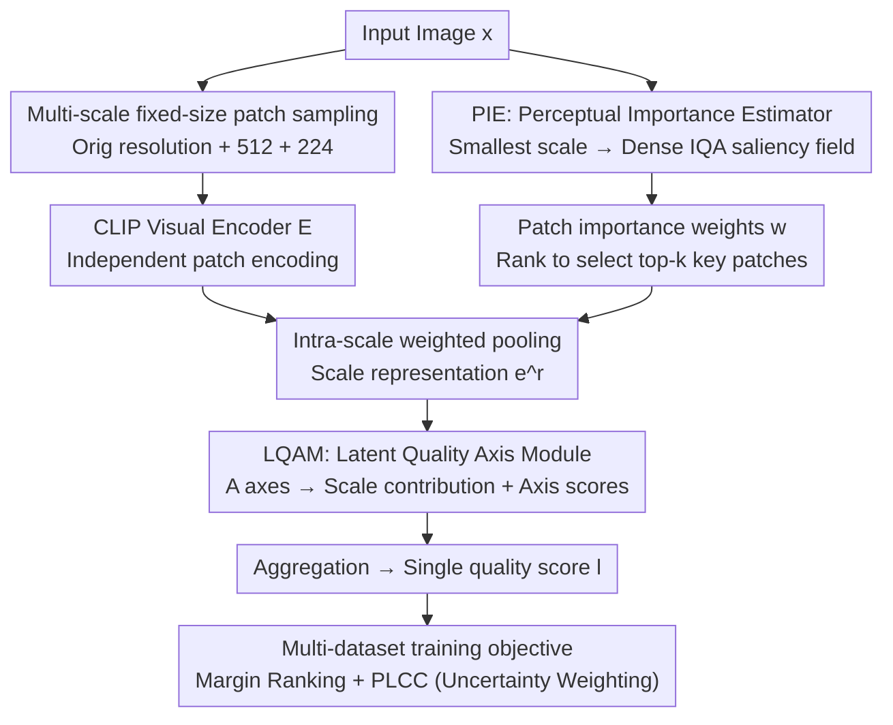

# Learning Where to Look and How to Judge: Resolution-agnostic Image Quality Assessment with Quality-aware Saliency

**Conference**: CVPR 2026  
**Paper**: [CVF Open Access](https://openaccess.thecvf.com/content/CVPR2026/html/Gedik_Learning_Where_to_Look_and_How_to_Judge_Resolution-agnostic_Image_CVPR_2026_paper.html)  
**Code**: TBD  
**Area**: Image Quality Assessment / Explainability  
**Keywords**: No-reference IQA, resolution-agnostic, IQA saliency, multi-scale patch, CLIP

## TL;DR
To address four common issues in No-Reference Image Quality Assessment (NR-IQA)—forced resizing to accommodate pre-trained resolutions, poor generalization across resolutions, difficulty in joint training due to inconsistent MOS scales, and computational explosion for UHD images—this paper proposes ReLIQS. It samples fixed-size patches from the original resolution and its scaled variants, encoding them with CLIP. A lightweight "Perceptual Importance Estimator (PIE)" learns IQA-specific saliency to select a few key patches, while a "Latent Quality Axis Module (LQAM)" aggregates multi-scale embeddings into a single score. ReLIQS outperforms CNN, CLIP, and MLLM-based baselines across various real/synthetic/AIGC distortions and resolutions with lower computational cost.

## Background & Motivation

**Background**: Modern NR-IQA almost exclusively depends on transfer learning and large-scale pre-training. However, this creates a fundamental tension with resolution: when input resolution deviates from the pre-training distribution, performance drops for ConvNet, Transformer, and hybrid backbones, and UHD inputs become inefficient. In practice, images are commonly resized to match the pre-training resolution, which ensures stability but sacrifices crucial low-level quality information.

**Limitations of Prior Work**: The authors identify four basic requirements often violated by SOTA methods: (i) ability to work at **any resolution**; (ii) **preservation of original resolution quality cues** (forced downsampling erases sharpness, noise, and texture details essential to human perception); (iii) **controllable computation** (exhaustive patch coverage grows quadratically with resolution, making UHD impractical); and (iv) ability to **jointly train on multiple IQA datasets** (MOS scales vary across subjective studies, and direct merging often hurts generalization). MLLM-based methods support multi-dataset training but rely on forced resizing and heavy backbones (violating ii, iii); MUSIQ preserves resolution but has quadratic complexity (violating i, iii); CNN/hybrid systems are efficient but drop in performance across resolutions (violating i).

**Key Challenge**: There is a trade-off between low-level information preservation (requiring original resolution) and high-level robustness (requiring proximity to pre-training resolution). This implies an "optimal resize scale" rather than a monotonic trend. For instance, on KonIQ-10K, resizing a 768×1024 image to a short edge of 384 performs better than using the original resolution, but performance degrades further at 224.

**Goal**: To build an out-of-the-box NR-IQA model that satisfies (i)–(iv) while learning both "where to look" and "how to judge."

**Key Insight**: Bypass the resolution tension using a **multi-scale, patch-based** pipeline. Fixed-size patches (close to CLIP's pre-training resolution) are naturally resolution-agnostic. Patches sampled from the original image preserve low-level details, while patches from downsampled views capture high-level semantics. Assuming "many patches carry redundant quality information," exhaustive coverage is unnecessary; a learned importance map can select key patches to control computation.

**Core Idea**: Decompose IQA into learning an IQA-specific saliency map to decide **where to look** (which patches to select) and using a latent quality axis to fuse multi-scale embeddings into a single score to decide **how to judge**. Joint training is achieved using a loss based on intra-group ranking and correlation.

## Method

### Overall Architecture
ReLIQS is a patch-based IQA pipeline with three core components: a CLIP patch encoder $E(\cdot)$, a Perceptual Importance Estimator (PIE) generating dense importance fields, and a Latent Quality Axis Module (LQAM) for discovering latent quality axes and adaptively fusing multi-scale information. Given an original image $x^{(0)}$, $R$ scaled variants are generated while maintaining the aspect ratio. Fixed-size patches are sampled from each scale following a preset strategy to form the patch set $P=\{\{x_p^{(r)}\}_{p=1}^{c_r}\}_{r=0}^{R}$. Each patch is independently encoded by the CLIP visual encoder as $e_p^{(r)}=E(x_p^{(r)})$. PIE uses a lightweight network $S(\cdot)$ to predict a dense importance field $s^{(R)}$ on the **smallest** scale, which is then bilinearly upsampled to all scales to obtain normalized importance weights $w_p^{(r)}$ for each patch. These weights are used for **intra-scale weighted pooling** to obtain scale-specific representations $e^{(r)}=\sum_p w_p^{(r)} e_p^{(r)}$. LQAM maintains $A$ learnable "quality direction pairs" to project each scale representation into the axis space, inferring the "contribution probability $\beta_a^{(r)}$ of scale $r$ to axis $a$" and the "quality score $l_a^{(r)}$ for each axis." These are aggregated into a single prediction $l=\sum_a \gamma_a \sum_r \beta_a^{(r)} l_a^{(r)}$. Training utilizes a marginal ranking loss + PLCC loss (with uncertainty weighting) to support multi-dataset training.

### Key Designs

**1. Multi-scale fixed-size patch sampling: Satisfying resolution-agnosticism and low-level fidelity via patches**

This is the foundation for bypassing the resolution tension. The image is scaled to the original resolution + short edge 512 + short edge 224 ($R=2$). **Fixed-size** patches (matching CLIP pre-training) are sampled from each scale. This ensures the backbone always processes in-distribution resolutions, avoiding degradation from off-distribution resizing and making the model resolution-agnostic (satisfying i). Patches from the **original resolution** preserve low-level details like sharpness, noise, and texture (satisfying ii), while patches from downsampled views carry high-level factors like semantics, composition, and color. The pooling $e^{(r)}=\sum_p w_p^{(r)}e_p^{(r)}$ and final aggregation are **permutation-invariant** to patch/scale order; predictions depend solely on content. Ablations show: using only the 224 scale yields a KonIQ PLCC of 0.904, adding 512 increases it to 0.951, and adding the original resolution reaches 0.958. On UHD, PLCC rises from 0.686 to 0.837, showing the original resolution provides the largest gain for ultra-high-definition.

**2. PIE (Perceptual Importance Estimator): Learning IQA-specific saliency to focus computation on key patches**

PIE addresses requirement (iii). It uses a lightweight TinyCLIP ViT-8M + shallow convolution decoder + all-pixel softmax to compute a dense importance field $s^{(R)}=S(x^{(R)})$ on the **smallest** scale. This is upsampled to all scales, and the sum of pixel importance within a patch is normalized intra-scale to get weights $w_p^{(r)}=\Omega_p^{(r)}/\sum_p \Omega_p^{(r)}$. These weights serve two purposes: weighted pooling and **ranking patches by importance**. During inference, only the top-$k$ most important patches per scale are encoded, where $k$ is chosen based on the computational budget. For a 3840×2560 image with 748 candidate patches at original resolution, using only 48 patches (6.4%) achieves optimal performance, **reducing computation by 90%** compared to exhaustive coverage. The authors call this **IQA-specific saliency**, learned purely via MOS supervision for "patch selection to save computation," emphasizing its difference from traditional visual saliency, which has shown only marginal gains in previous IQA work.

**3. LQAM (Latent Quality Axis Module): Judging scores via learned latent axes instead of manual attributes**

LQAM addresses "how to judge." instead of relying on hand-crafted quality attributes, it maintains $A$ learnable **quality direction pairs** $(u_{a-}, u_{a+})$, each corresponding to a latent quality axis. Scale representations are projected into the axis space via learnable key/value projections: $k_a^{(r)}=K_a e^{(r)}, v_a^{(r)}=V_a e^{(r)}$. A set of axis queries $q_a$ calculates the "contribution probability of scale $r$ to axis $a$": $\beta_a^{(r)}=\text{softmax}_a(\text{sim}(q_a, k_a^{(r)})/T_{pa})$. A softmax over the direction pairs determines the "quality score of axis $a$ at scale $r$": $l_a^{(r)}=\frac{\exp(\text{sim}(u_{a+}, v_a^{(r)})/T_{qa})}{\sum_{\sigma\in\{+,-\}}\exp(\text{sim}(u_{a\sigma}, v_a^{(r)})/T_{qa})}\in[0,1]$. Finally, $l=\sum_a \gamma_a \sum_r \beta_a^{(r)} l_a^{(r)}$ ($\gamma_a$ normalized global weights, $T_{pa}, T_{qa}$ learnable). Scale contributions are explicitly modeled: fine patches favor low-level distortions, while coarse patches favor high-level semantics. Ablations show $A=4$ is optimal (UHD 0.837), with 1, 2, or 8 axes performing slightly worse.

**4. Multi-dataset training objective: Bypassing MOS scale incomparability via intra-group ranking and correlation**

The key to requirement (iv). Absolute MOS values cannot be merged across datasets, but **intra-group ranking and correlation** serve as reliable supervision. Each dataset $d$ uses a marginal ranking loss $\mathcal{L}_{MR}^{(d)}=\frac{2}{N(N-1)}\sum_{i<j}\max(0, \delta - \text{sign}(g_i-g_j)(p_i-p_j))$ and a PLCC loss $\mathcal{L}_{PLCC}^{(d)}=1-\frac{\sum(g_i-\bar g)(p_i-\bar p)}{\sqrt{\sum(g_i-\bar g)^2\sum(p_i-\bar p)^2}}$. These are averaged across $D$ datasets and balanced using **uncertainty weighting** from [5]: $\mathcal{L}=\frac{1}{2\sigma_1^2}\mathcal{L}_{MR}+\frac{1}{2\sigma_2^2}\mathcal{L}_{PLCC}+\log\sigma_1+\log\sigma_2$ ($\sigma_1,\sigma_2$ learnable). This enables joint training from heterogeneous MOS scales without manual weight tuning.

### Loss & Training
The patch encoder uses CLIP ViT-B/16 (OpenAI weights), and PIE uses TinyCLIP ViT-8M. Training uses AdamW + oscillating cosine learning rate (10 epochs, initial/peak 1e-5, weight decay 1e-3); the oscillation prevents convergence to sharp minima, improving generalization. Margin $\delta=0.01$, three scales (Original, 512, 224). During training, 6/5/1 patches are sampled randomly per scale; during evaluation, patches are sampled uniformly with 50% overlap, $A=4$.

## Key Experimental Results

### Main Results
Under single-dataset training (KonIQ-10K only), median PLCC/SRCC across 10 random splits show ReLIQS is superior on most of the eight benchmarks (Real, Synthetic, AIGC).

| Dataset (Type) | Metric | ReLIQS | Prev. SOTA | Gain |
|---------------|------|--------|----------|------|
| KonIQ-10K (Real) | PLCC/SRCC | 0.958 / 0.949 | 0.953 / 0.941 (DeQA) | +0.005 / +0.008 |
| CLIVE (Real) | PLCC/SRCC | 0.892 / 0.865 | 0.892 / 0.879 (DeQA) | parity / −0.014 |
| FLIVE (Real) | PLCC/SRCC | 0.654 / 0.549 | 0.589 / 0.501 (DeQA) | +0.065 / +0.048 |
| KADID (Synthetic) | PLCC/SRCC | 0.701 / 0.707 | 0.694 / 0.687 (DeQA) | +0.007 / +0.020 |
| CSIQ (Synthetic) | PLCC/SRCC | 0.842 / 0.818 | 0.787 / 0.744 (DeQA) | +0.055 / +0.074 |
| LIVE (Synthetic) | PLCC/SRCC | 0.879 / 0.894 | 0.809 / 0.729 (DeQA) | +0.070 / +0.165 |
| AGIQA-3K (AIGC) | PLCC/SRCC | 0.768 / 0.705 | 0.809 / 0.729 (DeQA) | −0.041 / −0.024 |

Note: ReLIQS lags behind Q-Align/DeQA on AGIQA-3K, likely because AIGC distribution shifts are under-represented in CLIP's pre-training, whereas MLLM baselines have seen more generated images.

### Main Results: High Resolution and Computation
ReLIQS significantly updates the SOTA on the UHD benchmark with much lower computation than MLLM baselines.

| Model | UHD PLCC/SRCC | GMACs | Note |
|------|---------------|-------|------|
| Q-Align (MLLM) | 0.627 / 0.683 | 936 | Resized to 448; loses detail |
| DeQA (MLLM) | 0.654 / 0.701 | 936 | Same as above |
| CLIP-IQA+ | 0.709 / 0.747 | 895 | ResNet-50 limited receptive field |
| SJTU (UHD Spec.) | 0.799 / 0.846 | 44 | AIM2024 Winner |
| **ReLIQS** | **0.837 / 0.865** | 543 | Multi-scale patch, New SOTA |
| **ReLIQS\*** (Budget) | 0.824 / 0.847 | **47** | Only 4 patches; beats UHD model |

### Ablation Study

| Config | KonIQ PLCC | UHD PLCC | Note |
|------|-----------|----------|------|
| Avg Pooling (No PIE Weight) | 0.951 | 0.833 | Without importance weighting |
| PIE Weighted (Full) | 0.958 | 0.837 | Importance brings stable gain |
| Scale 224 Only | 0.904 | 0.686 | Significant low-level loss |
| Scale 224+512 | 0.951 | 0.756 | Missing original resolution |
| 224+512+Original | 0.958 | 0.837 | Orig res gain largest on UHD |
| Axes A=1 / 2 / 4 / 8 | — | 0.828 / 0.834 / 0.837 / 0.835 | A=4 is optimal |

### Key Findings
- **Original resolution patches are vital for UHD**: Removing the original resolution scale on UHD drops performance from 0.837 to 0.756, whereas the impact is smaller on low-medium resolution benchmarks (explaining why standard benchmarks mask the harm of resizing).
- **Importance sampling improves speed nearly for free**: On UHD, performance saturates quickly with $k$ patches. Using 48/748 patches reaches peak performance, allowing computation to be compressed to ~6% with negligible accuracy loss.
- **MLLMs underperform on UHD**: While Q-Align/DeQA are SOTA on low-medium resolutions, forced resizing to 448 causes significant drops on UHD, highlighting the value of original resolution preservation.

## Highlights & Insights
- **Redefining saliency's role from "improving accuracy" to "saving computation"**: Previous work found marginal gains from visual saliency in IQA. This paper leverages PIE to learn IQA-specific saliency primarily for key patch selection to control budgets—a role previously unexplored that also provides small accuracy boosts.
- **"Fixed-size patches" as a simple but powerful solution**: This decision simultaneously addresses resolution-agnosticism (i) and low-level fidelity (ii), avoiding the resize dilemma. This approach could transfer to any low-level vision task sensitive to original resolution details.
- **Budget adaptation is intrinsic to the architecture**: Top-$k$ patch selection allows the same model to switch seamlessly between 47 and 543 GMACs (ReLIQS\* vs ReLIQS) by adjusting $k$ at deployment without retraining.

## Limitations & Future Work
- **Weaker on AIGC**: Lags behind MLLMs on AGIQA-3K, attributed to CLIP's lack of exposure to AI-generated images—indicating a gap in CLIP backbone priors for AIGC-specific distortions.
- **PIE saliency is semantic-heavy**: The authors admit the MOS-tuned importance field strongly leans toward semantically salient areas; whether it truly covers all quality-critical zones (e.g., blocking artifacts in uniform regions) remains questionable. ⚠️ Alignment between saliency maps and true "quality-sensitive regions" is shown qualitatively but lacks quantitative verification.
- **Lack of depth in axis interpretability**: The latent quality axes in LQAM are learned black-box dimensions; the paper does not specify which human-interpretable quality attributes each axis corresponds to.

## Related Work & Insights
- **vs MUSIQ**: MUSIQ also preserves original resolution, but its Transformer backbone is quadratically complex relative to input resolution, making UHD inference impractical. ReLIQS decouples computation from resolution via fixed-size patches and top-$k$ selection.
- **vs MLLM-based (Q-Align / Compare2Score / DeQA)**: These support multi-dataset training and provide natural language explanations but rely on forced resizing and heavy backbones, dropping on UHD while being computationally expensive (936 GMACs). ReLIQS surpasses them on UHD with lower cost.
- **vs CNN/Hybrid (CLIP-IQA+ / CONTRIQUE)**: While these avoid resizing, the ResNet-50 receptive field is limited and fails to capture global structure at high resolutions. ReLIQS captures both low-level and high-level cues via multi-scale patches.

## Rating
- Novelty: ⭐⭐⭐⭐ The combination of fixed-size multi-scale patches, IQA-specific saliency for efficiency, and latent quality axes is clear, though components are clever assemblies of existing ideas.
- Experimental Thoroughness: ⭐⭐⭐⭐⭐ Covers real/synthetic/AIGC/UHD, single/multi-dataset training, computational curves, and thorough ablations.
- Writing Quality: ⭐⭐⭐⭐ Clear narrative driven by the four requirements; formulas are standard, though the LQAM section is notation-heavy.
- Value: ⭐⭐⭐⭐⭐ Directly addresses UHD IQA and multi-dataset joint training pain points with strong practical budget adaptation.

<!-- RELATED:START -->

## Related Papers

- [\[AAAI 2026\] DR.Experts: Differential Refinement of Distortion-Aware Experts for Blind Image Quality Assessment](../../AAAI2026/interpretability/drexperts_differential_refinement_of_distortion-aware_experts_for_blind_image_qu.md)
- [\[CVPR 2025\] KVQ: Boosting Video Quality Assessment via Saliency-Guided Local Perception](../../CVPR2025/interpretability/kvq_boosting_video_quality_assessment_via_saliency-guided_local_perception.md)
- [\[ICML 2026\] IQA-Spider: Unifying Multi-Granularity Image Quality Assessment with Reasoning, Grounding and Referring](../../ICML2026/interpretability/iqa-spider_unifying_multi-granularity_image_quality_assessment_with_reasoning_gr.md)
- [\[CVPR 2026\] PRISM: Prototype-based Reasoning with Inter-modal Semantic Mining for Interpretable Image Recognition](prism_prototype-based_reasoning_with_inter-modal_semantic_mining_for_interpretab.md)
- [\[CVPR 2026\] On the Possible Detectability of Image-in-Image Steganography](on_the_possible_detectability_of_image-in-image_steganography.md)

<!-- RELATED:END -->
