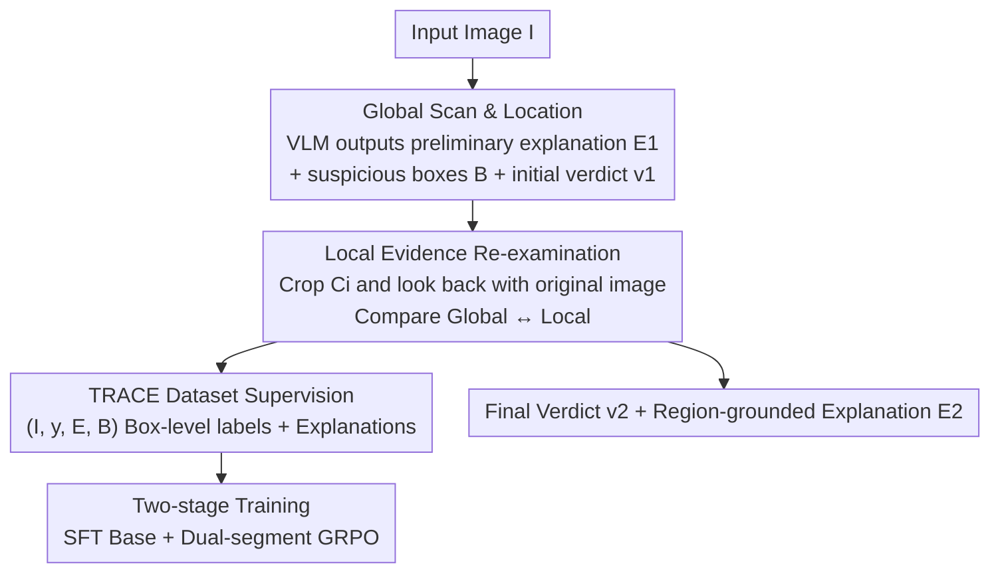

# Locate-Then-Examine: Grounded Region Reasoning Improves Detection of AI-Generated Images

**Conference**: CVPR 2026  
**Paper**: [CVF Open Access](https://openaccess.thecvf.com/content/CVPR2026/html/Ji_Locate-Then-Examine_Grounded_Region_Reasoning_Improves_Detection_of_AI-Generated_Images_CVPR_2026_paper.html)  
**Code**: To be confirmed  
**Area**: AIGC Detection / Multimodal VLM  
**Keywords**: AI-Generated Image Detection, Region Localization, VLM Forensic Reasoning, GRPO Reinforcement Learning, Explainable Forensics

## TL;DR
LTE enables Vision-Language Models to first perform a "global scan to locate suspicious regions" and then "zoom in and crop to re-examine for the final verdict." It upgrades one-time classification into a two-stage region-grounded reasoning process. Accompanied by the TRACE dataset containing box-level annotations and forensic explanations, it achieves simultaneous improvements in accuracy, robustness, and interpretability.

## Background & Motivation

**Background**: Mainstream AI-generated image detection methods are classification-based (CNNSpot, DIRE, NPR, etc.), showing high accuracy on curated datasets. Recently, Vision-Language Models (VLM) have reframed detection as Visual Question Answering or image captioning, providing natural language explanations and semantic-level analysis.

**Limitations of Prior Work**: The decision process of pure classifiers is opaque, and they suffer from poor cross-generator generalization—models trained on architecture A lose performance when encountering unseen generators. Conversely, to boost accuracy, VLM-based approaches often attach external segmentation or classification heads (e.g., FakeShield using SAM, LEGION adding MLP after the visual encoder), which reduces the VLM to a passive feature extractor and wastes its inherent common-sense reasoning capabilities.

**Key Challenge**: A more fundamental problem is that these methods rely on a "single global scan"—the visual encoder compresses the entire image into a limited number of tokens, and attention is spread across the whole image. Consequently, **decisive subtle forensic cues** (minor text artifacts, splicing seams, periodic textures, highlight edges) are weakened during downsampling and pooling. Without a "look back and zoom in" mechanism, judgments on high-quality synthetic images remain unstable, and models tend to conclude based on prior bias rather than pixel-level evidence.

**Goal**: Equip VLMs with the capability to "locate suspicious regions → zoom in and re-examine → correct verdict," ensuring every decision is anchored to specific local visual evidence.

**Key Insight**: The authors draw an analogy to human forensic experts—first scanning the whole image to propose a hypothesis, then using a "magnifying glass" to scrutinize the most suspicious areas. The most informative forensic cues are typically concentrated in small regions, requiring focused, high-resolution inspection by both VLMs and humans.

**Core Idea**: Use two queries—"Locate-Then-Examine"—to combine global semantic reasoning with local high-resolution inspection, allowing the model to actively re-examine areas likely to hide decisive cues when global uncertainty exists.

## Method

### Overall Architecture
LTE is a VLM-based two-stage forensic framework. Given an input image $I$, it outputs a final verdict $v_2$ (Real/AI-generated) and a region-grounded explanation $E_2$. The two stages are implemented via two queries to the same VLM: **Query 1 (Global Scan & Location)** lets the model read the whole image to produce a preliminary explanation $E_1$, a set of suspicious bounding boxes $B=\{b_1,\dots,b_n\}$, and an initial verdict $v_1$; **Query 2 (Local Evidence Re-examination)** crops each suspicious box $C_i=\mathrm{Crop}(I,b_i)$ and feeds them back into the VLM along with the original image, allowing it to compare global context with local details to output the corrected explanation $E_2$ and final verdict $v_2$.

To teach the VLM this behavior, the authors constructed the **TRACE dataset** (20,000 images with box-level annotations + forensic explanations) and fine-tuned Qwen-2.5-VL into an LTE expert using "SFT base + two-stage GRPO reinforcement."

### Key Designs

**1. Two-stage "Locate-Examine" Forensic Reasoning: Splitting One-time Classification into Dual Queries**

This is the core of the work, directly addressing the pain point where subtle cues are weakened by a "single global scan." **Query 1** uses a VLM with grounding capabilities for global analysis, outputting three components **in a fixed order**: preliminary explanation $E_1$, a set of suspicious boxes $B=\{b_1,\dots,b_n\}$ (where $b_i=(x_1,y_1,x_2,y_2)$), and an initial verdict $v_1\in\{\text{real},\text{generated}\}$. Suspicious regions focus on two target types: (i) areas difficult for generative models to handle, such as faces, hands, and animal paws/poses; (ii) image-specific details that are hard to replicate, such as logos on referee jerseys or small text. **Query 2** crops each $b_i$ to get $C_i$, then inputs the original image $I$ along with the set of crops $\{C_i\}_{i=1}^n$, forming a "dual-input" comparison mechanism to produce the corrected explanation $E_2$ and final verdict $v_2$ anchored to specific evidence. Crop tokens inject fine-grained visual information, acting like a magnifying glass so the model can correct previous misjudgments during re-examination. Experiments confirm that the LTE mechanism brings an additional accuracy gain of +3.6% for 7B and +5.8% for 32B compared to single-round variants.

**2. TRACE Dataset and Cross-VLM Automatic Annotation Pipeline: Mutual Verification by Two Expert Models**

The two-stage pipeline requires localization supervision for both real and fake images, but VLMs naturally lack "locate-then-examine" behavior. The authors designed an annotation pipeline for $(I,y,E,B)$ tuples: Step 1, **Explanation Generation**, uses GPT-4o to produce forensic explanations focused on specific visual evidence for images with known labels; Step 2, **Spatial Grounding**, uses Qwen-2.5-VL to extract bounding boxes from these explanations to complete the $(I,y,E,B)$ tuple. Crops $C$ are deterministically derived from $(I,B)$. The key lies in **Data Purification**: Qwen-2.5-VL sometimes produces large boxes covering >50% of the screen (global defects) or degrades into standard object detection. Purification occurs in two layers—first, an "explanation-region consistency check": GPT-4o generates two independent explanations per image to calculate semantic similarity, discarding those with high divergence; Qwen-2.5-VL also grounds each image twice, keeping boxes only if their IoU overlap exceeds a threshold. Samples where clues are mentioned in explanations but not covered by any box are removed. This cross-VLM verification mitigates single-model bias. Second, boxes exceeding 50% area or those framing the entire subject are deleted. The final TRACE dataset contains 10,000 Real + 10,000 AI images, with 99.5% having at least one box and an average of 3.24 boxes per image; real images are sourced equally from ImageNet/COCO, and fake images from GPT-Image-1 and Gemini 2.5 Flash Image.

**3. Loss & Training: Phased Reward Design for SFT + Dual-segment GRPO**

Training follows the two-stage paradigm of DeepSeek-Math. The **SFT stage** involves full-parameter fine-tuning (vision encoder, projection layer, language module) to establish baseline capability and teach the model to output the required structured format. The **Reinforcement Learning stage** uses GRPO (Group Relative Policy Optimization) in two segments, with specific rewards designed for each query. Query 1 (Hypothesis Generation) emphasizes format compliance and localization accuracy: Format reward $R_F=1$ if the output contains valid `<verdict>` tags; Localization reward uses IoU, $R_{IoU}=\frac{1}{|B|}\sum_i \max_j \mathrm{IoU}(b_i,\hat b_j)$, rewarding precisely aligned boxes. Query 2 (Hypothesis Refinement) emphasizes verdict correctness and explanation quality: Classification reward $R_C=\mathbb{1}[v_2=y]$; Explanation quality uses BLEU-2, $R_{BLEU}=\mathrm{BLEU2}(E',E_{ref})$, encouraging context-aware explanations. Splitting rewards across two queries ensures "locating suspicious areas accurately" and "making the correct verdict/explanation" are handled distinctly—ablations show that removing the BLEU reward significantly degrades explanation quality and that rewarding Query 1 for correct verdicts actually hurts the final verdict (see ablation table: C-Acc of Dual Verdict Reward is only 0.473).

## Key Experimental Results

Setup: Backbone is Qwen-2.5-VL 7B and 32B Instruct variants, trained on 8×A100; SFT learning rate $2\times10^{-5}$, GRPO learning rate $10^{-5}$, group size $G=4$, DeepSpeed ZeRO-3. Custom metrics: **Acc.** final verdict accuracy; **I-Acc.** initial (Query 1) accuracy; **C-Acc.** corrected verdict accuracy (NB: box-level/correction step accuracy); **C-Cases(%)** percentage of samples where the verdict was rewritten after re-examination.

### Main Results
On the TRACE test set, LTE comprehensively outperforms various baselines, with 32B reaching 0.972 accuracy and 7B at 0.942; this is a >30% improvement over the original untrained VLM baseline.

| Method | Acc. ↑ | BLEU-2 ↑ | ROUGE-L ↑ | IoU ↑ | Description |
|------|--------|----------|-----------|-------|------|
| LTE-32B | **0.972** | 0.211 | 0.327 | 0.359 | Complete Two-stage |
| LTE-7B | 0.942 | 0.209 | 0.291 | 0.316 | Strong even for small model |
| E+G-32B (Single-round) | 0.914 | 0.149 | 0.295 | 0.254 | Localization without re-exam |
| E-32B (Single-round, Expl. only) | 0.869 | 0.153 | 0.315 | — | No localization |
| Base-32B (Untrained) | 0.587 | 0.043 | 0.079 | — | Original VLM |
| FakeShield | 0.801 | 0.056 | 0.067 | 0.096 | External SAM |
| LEGION | 0.654 | 0.058 | 0.054 | 0.061 | Encoder+MLP |

In cross-domain (OoD) generalization, LTE leads consistently across three external benchmarks: MMFR, SynthScars, and FakeClue (LEGION was trained on SynthScars, so its result there is not OoD):

| Dataset | LTE-32B Acc. | LTE-7B Acc. | FakeShield Acc. | LEGION Acc. |
|--------|--------------|-------------|-----------------|-------------|
| MMFR | **0.893** | 0.892 | 0.710 | 0.193 |
| SynthScars | 0.852 | 0.826 | 0.765 | 0.861* |
| FakeClue | **0.903** | 0.871 | 0.733 | 0.254 |

(*LEGION was trained on SynthScars, non-OoD, unfair comparison.)

### Ablation Study

| Configuration | Acc. | C-Acc. | IoU | Description |
|------|------|--------|-----|------|
| LTE-32B (Full) | 0.972 | 0.956 | 0.359 | Full Model |
| SFT-32B (No GRPO) | 0.715 | 0.584 | 0.105 | No RL, performance collapses |
| No BLEU Reward-32B | 0.929 | 0.871 | 0.296 | No explanation reward, both drop |
| Dual Verdict Reward-32B | 0.944 | 0.473 | 0.260 | Rewarding Q1 verdict → C-Acc collapses |
| Random Cropping-32B | 0.842 | 0.421 | — | Random instead of localized, C-Cases > 19.6% |
| Largest 3 Bboxes-32B | 0.924 | 0.919 | — | Fixed top-3 boxes, inferior to adaptive |

### Key Findings
- **Omitting GRPO is fatal**: Acc. of 32B SFT-only drops from 0.972 to 0.715, proving that phased rewards in the RL stage are essential for training "locate-examine" behavior.
- **Random cropping validates localization necessity**: Replacing suspicious boxes with random crops causes the re-examination rewrite rate (C-Cases) to spike from ~10% to 19.6% and accuracy to drop to 0.842, proving that Query 1 localization quality determines Query 2's error-correction success.
- **Number of boxes correlates with model capacity**: LTE-32B produces an average of 3.58 boxes per image, while 7B produces 1.95; larger models favor finer-grained multi-region inspection. The paper also notes that misclassification rates drop by 38.2% and 67.4% for 7B and 32B respectively compared to single-round methods.

## Highlights & Insights
- **Applying "Thinking with Images" to Forensics**: Instead of adding a segmentation/classification head, LTE allows the VLM to actively re-examine its hypotheses via dual queries and cropped look-backs—this "reason and think with images" paradigm is transferable to any visual discrimination task requiring fine-grained evidence.
- **Practical Cross-VLM Data Purification**: Using GPT-4o for explanations and Qwen for boxes, combined with "double consistency + IoU overlap + explanation-box coverage" filters, provides a low-cost recipe for high-quality grounded annotations.
- **Phased Reward is a Key Trick**: Separating localization accuracy (IoU) in Query 1 from verdict/explanation quality (Classification + BLEU) in Query 2 prevents a single reward from being overloaded with conflicting objectives—evidenced by the collapse of C-Acc to 0.473 in the Dual Verdict Reward ablation.

## Limitations & Future Work
- The framework depends on the base VLM's grounding capability; since suspicious boxes are self-generated, failures in Query 1 localization directly compromise Query 2 re-examination (as shown by random cropping ablations).
- TRACE's source domains are limited (ImageNet/COCO for real, GPT-Image-1/Gemini for fake); robustness against entirely new generators or adversarial post-processing requires further validation.
- The two-stage process with dual queries and multiple crops introduces extra inference overhead. Using BLEU as a reward might bias explanations toward specific reference phrasing rather than "most correct" reasoning.

## Related Work & Insights
- **vs. FakeShield / LEGION**: These rely on external modules (SAM masks / MLP after encoder) for localization, treating the VLM as a passive extractor. LTE utilizes internal VLM grounding + iterative re-examination, achieving 0.972 accuracy vs. 0.801/0.654 on TRACE, and significantly better explanation quality.
- **vs. Single-round VLM Detection (VQA / Captioning)**: Single-round methods rely on a single global scan where subtle cues are suppressed. LTE's two-stage re-examination adds a 3.6%~5.8% accuracy Gain on the same backbone, validating the value of "progressive visual reasoning."
- **vs. DeepSeek-Math (Methodology Source)**: LTE adapts the SFT + GRPO two-stage paradigm but extends rewards to forensic-specific format/IoU/classification/BLEU types, segmented by query—a concrete instantiation of this paradigm for multimodal forensics.

## Rating
- Novelty: ⭐⭐⭐⭐ Maps humanity's "locate then examine" forensic intuition into a two-stage VLM reasoning process + grounded dataset; clear logic using clever combinations of existing tech.
- Experimental Thoroughness: ⭐⭐⭐⭐⭐ TRACE testing + three OoD benchmarks + extensive ablations (rewards, cropping, box count) strongly support all designs.
- Writing Quality: ⭐⭐⭐⭐ Motivation and pipeline are clearly explained; some custom metrics (C-Acc / C-Cases) require checking the original text for precise definitions.
- Value: ⭐⭐⭐⭐ Simultaneously improves accuracy, robustness, and interpretability; region-grounded explanations are highly practical for forensic deployment.

<!-- RELATED:START -->

## Related Papers

- [\[CVPR 2026\] ReAlign: Generalizable Image Forgery Detection via Reasoning-Aligned Representation](realign_generalizable_image_forgery_detection_via_reasoning-aligned_representati.md)
- [\[CVPR 2026\] Quality-Aware Calibration for AI-Generated Image Detection in the Wild](quality-aware_calibration_for_ai-generated_image_detection_in_the_wild.md)
- [\[ACL 2026\] AEGIS: A Holistic Benchmark for Evaluating Forensic Analysis of AI-Generated Academic Images](../../ACL2026/aigc_detection/aegis_a_holistic_benchmark_for_evaluating_forensic_analysis_of_ai-generated_acad.md)
- [\[CVPR 2026\] PPM-CLIP: Probabilistic Prompt Modeling for Generalizable AI-Generated Image Detection](ppm-clip_probabilistic_prompt_modeling_for_generalizable_ai-generated_image_dete.md)
- [\[ICML 2026\] CORE: Conflict-Oriented Reasoning for General Multimodal Manipulation Detection](../../ICML2026/aigc_detection/core_conflict-oriented_reasoning_for_general_multimodal_manipulation_detection.md)

<!-- RELATED:END -->
