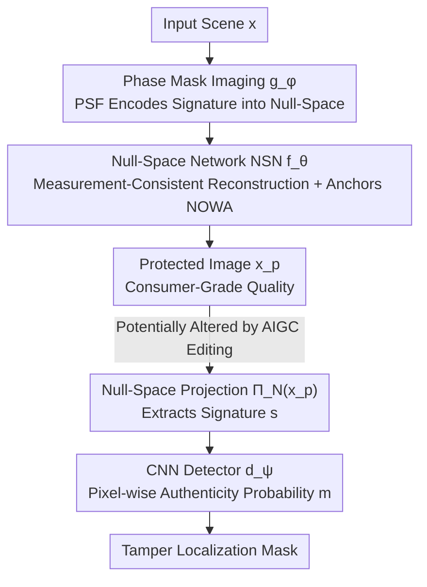

# NOWA: Null-space Optical Watermark for Invisible Capture Fingerprinting and Tamper Localization

**Conference**: CVPR 2026  
**Paper**: [CVF Open Access](https://openaccess.thecvf.com/content/CVPR2026/html/Vargas_NOWA_Null-space_Optical_Watermark_for_Invisible_Capture_Fingerprinting_and_Tamper_CVPR_2026_paper.html)  
**Code**: None  
**Area**: AIGC Detection / Image Forensics / Tamper Localization / Optical Watermarking / Computational Photography  
**Keywords**: Optical Watermarking, Null-space, Tamper Localization, Phase Mask, End-to-end Joint Optimization

## TL;DR
A learnable phase mask is inserted at the camera aperture to encode the authentication signal into the **null-space** of the imaging operator (rendering it completely invisible during capture). A measurement-consistent Null-Space Network (NSN) is then utilized to reconstruct high-quality images and anchor this watermark. Tampering disrupts the statistical structure in the null-space projection, allowing the detector to localize the changes at the pixel level. Under AIGC editing, the F1 score exceeds EditGuard (0.993 vs 0.97), and the system is inherently unforgeable to unknown counterfeiters.

## Background & Motivation
**Background**: Image authenticity and copyright protection currently rely heavily on **digital watermarking**—encoder-decoder models like HiDDeN embed invisible codes into images, which are verified through downstream decoding. Recently, frameworks such as EditGuard and OmniGuard have unified copyright verification and tamper localization into "dual invisible watermarks," demonstrating strong robustness against AIGC editing. Another line of research involves **optical watermarking**, which physically embeds authentication cues into hardware at the moment of imaging (e.g., using structured light or phase coding).

**Limitations of Prior Work**: Digital watermarks are almost always applied **after capture**, leaving them inherently vulnerable to downstream editing, compression, or regeneration attacks where they can be easily removed or overwritten. Meanwhile, existing optical watermarks are mostly designed for "copyright tracing," where the primary design goal is **robustness** (withstanding printing, scanning, and compression). This is precisely opposite to security-sensitive tasks, which require "fragile watermarks" that are **sensitive to any minor tampering**. Extremely few works explore fragile optical watermarks; the limited attempts using coded apertures suffer from poor image quality and only output simple binary "real/fake" classifications, offering no ability to localize the tampering.

**Key Challenge**: The objectives of robust and fragile watermarking are inherently contradictory. Implementing fragile watermarks in the optical domain is further bottlenecked by two physical challenges: (1) the raw optically coded images are severely blurred, making them unusable for direct viewing or standard downstream processing; and (2) if an adversary gains access to the raw sensor data, they could reverse-engineer or forge the optical signature.

**Goal**: To build a **hybrid optical-digital** end-to-end system that physically embeds authentication clues at the moment of imaging, produces consumer-grade high-quality images, enables pixel-level tamper localization, and is naturally immune to forgery.

**Key Insight**: The authors exploit a mathematical fact—the imaging operator $A_\phi$ defined by the phase mask is ill-conditioned and possesses a **null-space** $N(A_\phi)$. Signals residing in this null-space exist mathematically but are physically unmeasurable by the sensor, rendering it an ideal hidden channel.

**Core Idea**: The watermark is **encoded into the null-space of the imaging operator** (annihilated by the operator during capture and hence completely invisible), and is subsequently "anchored" back into the image during reconstruction via a Null-Space Network. During verification, projecting the image back into the null-space exposes editing as anomalous residuals. Because the null-space is determined by the physical phase mask, a valid signature cannot be generated without it, making the system inherently unforgeable.

## Method

### Overall Architecture
The entire system is a **differentiable end-to-end pipeline** that couples the optical front-end and the digital back-end into a jointly trainable framework. Light passes through a standard lens and a custom Phase Mask (PM) before hitting the sensor, yielding an encoded measurement $y$ modulated by a specific Point Spread Function (PSF). This physical process is fully simulated using Fourier optics, allowing the mask parameters $\phi$ and the backend network to be co-optimized via gradient descent. Since the encoded image is blurred and unusable, the Null-Space Network (NSN) $f_\theta$ performs **measurement-consistent** reconstruction to yield a consumer-grade protected image $x_p$ while anchoring the null-space watermark (NOWA). During verification, $x_p$ is projected back into the null-space $N(A_\phi)$ to extract the signature map $s$, which is then fed into a CNN detector $d_\psi$ to produce pixel-wise authenticity probabilities for tamper localization. The entire pipeline is trained jointly using a total loss:

$$x_p = f_\theta(g_\phi(x))$$

Where $g_\phi(\cdot)$ is the optical imaging process parameterized by the phase mask, and $f_\theta(\cdot)$ is the NSN reconstruction.

### Key Designs

**1. Null-Space Optical Watermark NOWA: Hiding the signature in the "unmeasurable" subspace**

A major vulnerability of digital watermarks is that they are written into the visible domain of images, meaning any regeneration or editing can overwrite them. The authors switch to a different channel: modeling the imaging process as $y = A_\phi x + n$. Due to diffraction and sampling limits, $A_\phi$ is ill-conditioned, yielding a null-space $N(A_\phi) = \{z \mid A_\phi z = 0\}$—a portion of the signal that is completely unobservable to the sensor but mathematically deterministic. NOWA encodes the authentication signal here: its energy is annihilated by $A_\phi$ (making it invisible during capture) but can be precisely recovered via the projection operator $\Pi_N$. This introduces a physical asymmetric security: the null-space is determined by the physical phase mask $\phi$, and adversaries who do not possess $A_\phi$ cannot generate a consistent signature. Compared to digital watermarking, NOWA is physically embedded at the moment of imaging, *prior* to the digital lifecycle, making it impossible to remove or duplicate through downstream edits.

**2. Null-Space Network NSN: Anchoring the watermark during reconstruction to prevent it from being discarded as noise**

Optically encoded images are blurred and cannot be directly viewed. Any conventional reconstruction algorithm would treat NOWA as noise and discard it—which is why fragile optical watermarks historically failed to achieve high image quality. The NSN addresses this through structured reconstruction: it first computes an estimate of the measurable component $\hat{x}_r = r(y) \in N(A_\phi)^\perp$ using a regularized inverse (pseudo-inverse/Tikhonov/Wiener deconvolution), and then restricts the network to only restore the unmeasurable component within the null-space:

$$x_p = f_\theta(\hat{x}_r) = \hat{x}_r + \Pi_N\, U_\theta(\hat{x}_r),\quad \Pi_N = I - A_\phi^\dagger A_\phi$$

Here, $\Pi_N$ is the orthogonal projection onto the null-space. This structure enforces **strict measurement consistency** $A_\phi f_\theta(\hat{x}_r) = A_\phi \hat{x}_r = y$: the network can only manipulate components within the null-space, leaving the measurable components completely untouched. Consequently, $U_\theta$ succeeds in both learning the inverse optical mapping to reconstruct high-quality images and securely anchoring NOWA into the null-space, successfully reconciling image quality with watermarking for the first time.

**3. Null-Space Projection for Tamper Localization: Forcing the detector to focus on "physical invariants" to filter natural image interference**

Directly feeding $x_p$ into the detector would cause the tamper cues to be drowned out by the natural texture variations of the image. The authors migrate the entire verification process into the null-space: projecting the protected image

$$s = \Pi_N(x_p) = \Pi_N\, U_\theta(\hat{x}_r)$$

Using the properties $\Pi_N(\hat{x}_r)=0$ (since $\hat{x}_r$ lies in the orthogonal complement of the null-space) and $\Pi_N^2 = \Pi_N$, this step cleanly isolates the learned component that is constrained by the physical optical model but invisible during measurement—which serves as the intrinsic signature of the optical system. The signature $s$ of an authentic image exhibits stable, predictable spatial patterns; tampering disrupts this structure, triggering anomalous null-space responses. A CNN detector then maps $s$ to pixel-wise authenticity probabilities $m = d_\psi(s)$, where $m_i \in [0,1]$ indicates the confidence that pixel $i$ belongs to an authentic region. Crucially, the detector learns to distinguish "predictable system noise vs. adversarial errors violating physical imaging constraints" rather than assessing whether the content looks real. This naturally generalizes to unseen editing methods (ablation shows that direct image-domain detection yields an F1 of only ~0.75, whereas null-space projection achieves near-perfect scores).

### Loss & Training
The optical front-end $g_\phi$, the null-space network $f_\theta$, and the detector $d_\psi$ are **optimized in an end-to-end joint manner**, allowing the optical and neural modules to co-adapt. The height profile of the phase mask is parameterized as truncated Zernike polynomials $h_\phi(x,y) = \sum_{k=1}^K \phi_k Z_k(x,y)$, restricting optimization to physically manufacturable and differentiable surfaces. The overall objective is:

$$L_{\text{total}} = L_{\text{rec}} + \beta L_{\text{perc}} + \lambda L_{\text{cls}}$$

- Reconstruction fidelity $L_{\text{rec}} = \|x - x_p\|_2^2$;
- Perceptual consistency $L_{\text{perc}} = \sum_i \|\varphi_i(x) - \varphi_i(x_p)\|_2^2$ (in a pre-trained network's feature space);
- Pixel-wise authenticity classification $L_{\text{cls}} = -[c\log m + (1-c)\log(1-m)]$, where $c\in\{0,1\}^n$ is the ground-truth mask.

This joint training simultaneously forces the system to: (1) reconstruct images consistent with the forward optical model, (2) encode a verifiable null-space signature unique to the camera's phase mask, and (3) detect digital manipulations that violate physical constraints. Because the physical mask $\phi$ and the neural modules are co-optimized, the system inherits an intrinsic unforgeability "prior to the digital lifecycle." Even if the NSN is compromised, an attacker cannot generate a valid NOWA without passing through the physical optical path.

## Key Experimental Results

**Experimental Settings**: Training is performed on FFHQ high-resolution faces; tampering is executed using BiSeNetV2 for face parsing + Stable Diffusion Inpainting for photorealistic editing. Evaluation is conducted on the EditGuard test set (1000 images sampled from COCO 2017), representing a **cross-domain evaluation** (trained on FFHQ, tested on COCO). The phase mask is 2.835 mm × 2.835 mm / 256×256. AdamW (lr 1e-4) is used on a single H100 GPU.

### Main Results: Tamper Localization under AIGC Editing (F1 / AUC / IoU, Higher is Better)

| Editing Method | Metrics | EditGuard | NOWA |
|----------|------|-----------|------|
| Stable Diffusion | F1 / AUC / IoU | 0.966 / 0.971 / 0.936 | **0.993 / 0.999 / 0.987** |
| ControlNet | F1 / AUC / IoU | 0.968 / 0.987 / 0.940 | **0.992 / 0.999 / 0.985** |
| SDXL | F1 / AUC / IoU | **0.965** / 0.989 / **0.936** | 0.929 / **0.997** / 0.867 |
| RePaint | F1 / AUC / IoU | 0.967 / 0.977 / 0.938 | **0.974 / 0.999 / 0.949** |
| Lama | F1 / AUC / IoU | 0.965 / 0.969 / 0.934 | 0.965 / **0.999** / 0.933 |

Pure digital detectors (MVSS-Net / OSN / PSCC-Net / IML-ViT) generally exhibit F1 scores < 0.2 under generative editing, struggling to defend even against content-preserving tampering. HiFi-Net performs slightly better (F1 0.48~0.68) but shows unstable IoU. NOWA outperforms the already strong EditGuard on most editing types, with AUC scores reaching nearly 0.999.

### Ablation Study

| Configuration | Key Metrics | Description |
|------|----------|------|
| Full model (detector takes null-space projection $\Pi_N(x_p)$) | F1≈0.99 | Standard configuration |
| Detector directly takes image $x_p$ | F1≈0.75 / AUC≈0.82 / IoU≈0.69 | Tamper cues are weak in the image domain, resulting in scattered false positives |
| Remove learnable phase mask (null-space still exists) | F1=0.89 / IoU=0.81 | Signatures lack structural integrity, making it difficult for detection to isolate natural variations |

**Robustness against degradation** (F1 ↑): Under Gaussian noise ($\sigma=1/5$), NOWA achieves 0.984/0.982. Under JPEG compression ($Q=70/80/90$), it obtains 0.885/0.893/0.890, consistently outperforming EditGuard (which drops to 0.552 at $Q=70$), while HiFi-Net degrades drastically.

**Adversarial robustness** (F1 for 1000 forged images): Camera mimicry (0.901), protected image mimicry (0.913), blind deconvolution (0.946). Even if the NSN is exposed to attackers, they cannot produce a valid NOWA without the physical optical system.

### Key Findings
- **Null-Space Projection is the key to performance**: Switching the detector's input from the image domain to the null-space projection boosts the F1 score from ~0.75 to ~0.99. This demonstrates the fundamental distinction between physical-domain forensics and content-domain forensics: $\Pi_N$ suppresses natural image variation to expose the invariant watermark.
- **The phase mask must be learned for stability**: While an unoptimized optical system still possesses a null-space to hold NOWA, the resulting signatures lack structural integrity, causing the F1 score to drop to 0.89. The learnable phase mask ensures strong, stable, and highly discriminative signatures.
- **Physical embedding provides cross-domain and anti-degradation advantages**: Models trained on FFHQ and evaluated on COCO still achieve near-perfect performance with minimal degradation under compression or noise. This confirms that the watermark is embedded at the optical level rather than the content level.
- **Real-world camera validation is feasible**: The simulated forward model was successfully transferred to a physical prototype consisting of a Canon EOS 5D Mark IV, a 50mm lens, and a fused silica phase mask fabricated via two-photon polymerization. After fine-tuning for 30 epochs, the system successfully localized authentic edits generated by Photoshop's Generative Fill.

## Highlights & Insights
- **Using the "null-space of an ill-conditioned imaging operator" as a secure channel**: This is a brilliant conceptual contribution. Signals in the null-space are physically annihilated during capture (invisible) but mathematically recoverable, naturally fulfilling the requirements of both concealment and verifiability. This is far more elegant than forcing a watermark into the visible image domain.
- **Measurement consistency equates to inherent unforgeability**: The architectural constraint $A_\phi f_\theta(\hat{x}_r)=y$ in NSN forces valid signatures to be generated exclusively through the physical optical path. Consequently, security relies on physical hardware rather than algorithm secrecy, preventing forgery even if the digital pipeline is completely leaked.
- **Shifting forensics from "checking for content realism" to "verifying physical constraints"**: The detector only evaluates whether the null-space residuals conform to the camera's physical model. This allows it to naturally generalize to unseen editing methods, paving the way for "physical-invariant forensics" that can be transferred to videos and other imaging modalities.
- **An end-to-end differentiable paradigm for joint optics-algorithm design**: Incorporating hardware design into gradient optimization via Fourier optics and Zernike parameterization elegantly extends the computational photography paradigm to authentication tasks.

## Limitations & Future Work
- **Authors' Acknowledgments**: The small, fixed aperture of the phase mask limits light gathering. For larger apertures, the depth-dependent behavior of the PSF must be factored into the null-space computations. In real-world hardware, optical misalignment and calibration errors can disrupt the null-space estimation and measurement consistency.
- **Boundaries of the Threat Model**: It is assumed that attackers only have access to either the protected image $x_p$ or the raw camera measurement $y$. If an adversary gains a large paired dataset of $(x_p, y)$ to approximate the imaging operator, the current protection may be compromised. The authors identify randomized or key-based digital embedding as promising future work.
- **Inherent Limitations**: The model is primarily trained on the face domain (FFHQ) with tampers tailored to facial or object-level inpainting. Its sensitivity to micro-region edits or global stylization remains under-explored, and transferability across different cameras/lenses is not fully verified. Additionally, the requirement for custom phase mask fabrication presents a barrier to widespread adoption.

## Related Work & Insights
- **vs. Digital Watermarking (HiDDeN / EditGuard / OmniGuard)**: These methods embed codes in the visible image domain post-capture, leaving them vulnerable to editing and compression. In contrast, NOWA physically embeds the watermark into the optical null-space during imaging, preventing removal via downstream editing, and derives its security from hardware rather than algorithmic secrecy. Performance-wise, NOWA outperforms EditGuard on most edits, showing a particularly wide gap in JPEG robustness.
- **vs. Pure Digital Tamper Detection (MVSS-Net / OSN / PSCC-Net / IML-ViT / HiFi-Net)**: These approaches detect forgeries by looking for semantic or textural inconsistencies, which easily fail on content-preserving generative AIGC edits (F1 < 0.2~0.68). NOWA completely bypasses content analysis, evaluating physical optical constraints instead, which grants it superior generalization and stability.
- **vs. Existing Optical Watermarking / Coded Aperture**: Prior works are mostly engineered for robust copyright tracing, adding hardware complexity, degrading image quality, and offering only binary authenticity checks. NOWA utilizes standard imaging components with a single custom phase mask to achieve a **fragile** watermark that maintains high image quality and supports pixel-level tamper localization.

## Rating
- Novelty: ⭐⭐⭐⭐⭐ Using the null-space of an imaging operator as a secure channel and achieving physical-level unforgeability through measurement consistency is a genuine paradigm shift in outsourcing camera security.
- Experimental Thoroughness: ⭐⭐⭐⭐ The evaluations cover five types of AIGC editing, along with degradation, adversarial attacks, cross-domain tests, and physical camera prototyping. However, tests are mostly restricted to the face domain, and broader scenes or multi-hardware validation are desirable.
- Writing Quality: ⭐⭐⭐⭐ Physical modeling and motivation are clearly explained, and the derivation of the null-space mechanism is logically sound.
- Value: ⭐⭐⭐⭐ Amidst rampant AIGC forgeries, this work offers a viable hardware-level authenticity guarantee that holds practical significance for camera manufacturers and forensics, though the need for custom optical masks limits immediate mass adoption.

<!-- RELATED:START -->

## Related Papers

- [\[CVPR 2026\] Inconsistency-aware Multimodal Schrodinger Bridge for Deepfake Localization](inconsistency-aware_multimodal_schrodinger_bridge_for_deepfake_localization.md)
- [\[ICLR 2026\] A Rich Knowledge Space for Scalable Deepfake Detection](../../ICLR2026/aigc_detection/a_rich_knowledge_space_for_scalable_deepfake_detection.md)
- [\[ICLR 2026\] Spherical Watermark: Encryption-Free, Lossless Watermarking for Diffusion Models](../../ICLR2026/aigc_detection/spherical_watermark_encryption-free_lossless_watermarking_for_diffusion_models.md)
- [\[ICLR 2026\] Omni-IML: Towards Unified Interpretable Image Manipulation Localization](../../ICLR2026/aigc_detection/omni-iml_towards_unified_interpretable_image_manipulation_localization.md)
- [\[ACL 2026\] GigaCheck: Detecting LLM-generated Content via Object-Centric Span Localization](../../ACL2026/aigc_detection/gigacheck_detecting_llm-generated_content_via_object-centric_span_localization.md)

<!-- RELATED:END -->
