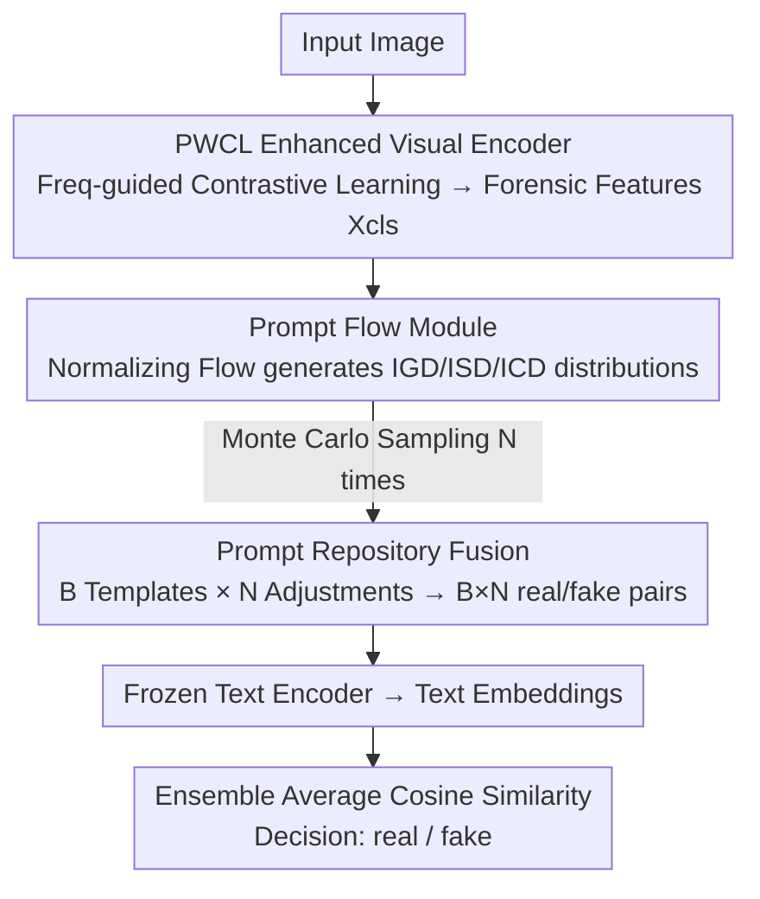

# PPM-CLIP: Probabilistic Prompt Modeling for Generalizable AI-Generated Image Detection

**Conference**: CVPR 2026  
**Paper**: [CVF Open Access](https://openaccess.thecvf.com/content/CVPR2026/html/Wang_PPM-CLIP_Probabilistic_Prompt_Modeling_for_Generalizable_AI-Generated_Image_Detection_CVPR_2026_paper.html)  
**Code**: https://github.com/bandaidssssss/PPM_CLIP  
**Area**: AIGC Detection / Multimodal VLM  
**Keywords**: AI-Generated Image Detection, CLIP, Probabilistic Prompt, Normalizing Flow, Frequency-Domain Contrastive Learning

## TL;DR
PPM-CLIP replaces the "discriminative static boundary" paradigm with "generative probabilistic inference." It utilizes normalizing flows to generate a family of adaptive prompts (multiple hypotheses) for each image and determines the results by averaging cosine similarities to marginalize noise. Combined with frequency-guided patch-wise contrastive learning, it forces the CLIP encoder to capture high-frequency forgery traces, significantly outperforming SOTA in cross-generator generalization on Ojha, GenImage, and DRCT.

## Background & Motivation

**Background**: AI-generated image detection typically follows two paths: pixel-level methods that learn low-level artifacts (spatial/frequency/reconstruction errors) and semantic-level methods that leverage VLMs like CLIP to capture high-level inconsistencies. Recent works also explore adaptive text prompt engineering to guide detection.

**Limitations of Prior Work**: Both pixel-level and semantic-level methods are fundamentally restricted by the **discriminative paradigm**: they learn a single, static decision boundary. Pixel-level methods tend to "memorize" specific generator artifacts from the training set, failing on new generators. Semantic-level methods, even with carefully designed prompt pairs, face entanglement in the feature space (as shown by PCA in Figure 1, where a single boundary cannot separate real/fake).

**Key Challenge**: Image generation is a rapidly evolving and diverse ecosystem, while a "single static template" inherently fails to cover such diversity. Forcing a model to find one optimal split leads it to memorize fixed generator fingerprints, causing performance collapse on unseen generators. The discriminative paradigm **compresses the complex forgery distribution into a rigid boundary**, lacking the ability to handle distribution shifts.

**Goal**: Achieve robust generalization in cross-generator scenarios (trained on one generator, tested on unseen ones) without relying on a single template.

**Key Insight**: Mimic human experts—experts do not look for a single perfect clue but reason from multiple perspectives. Instead of learning one boundary, the model should **generate a family of hypotheses** for each image. While a single hypothesis may be unreliable, the ensemble consensus can marginalize the noise.

**Core Idea**: Use a conditional generative model (Normalizing Flow) to generate a "prompt distribution" for input images instead of matching fixed templates, and perform ensemble voting across sampled prompt hypotheses. Additionally, use frequency-domain contrastive learning to enhance the visual encoder's sensitivity to high-frequency forgery traces, ensuring hypotheses reside in a feature space rich in forensic details.

## Method

### Overall Architecture
PPM-CLIP uses CLIP ViT-L/14 as the backbone, consisting of two synergistic modules. A visual path: the input image passes through a **PWCL (Patch-Wise Contrastive Learning) enhanced visual encoder** to obtain features $X_{cls}$ rich in fine-grained forensic details. A text path: the **PPM (Probabilistic Prompt Modeling)** module uses a Prompt Flow Module (Normalizing Flow) to generate adaptive adjustment vectors for three semantic distributions. These are dynamically fused with a learnable **Prompt Repository** (B template pairs) to obtain $B\times N$ image-adaptive real/fake prompt pairs, which are processed by a frozen text encoder. Finally, the cosine similarities between $X_{cls}$ and the two sets of text embeddings are calculated, and the results are **averaging ensembled** to determine the final label.

### Key Designs

**1. PWCL: Focusing the Encoder on High-Frequency Forgery Traces via Frequency-Guided Patch Contrastive Learning**

To address the issue that "standard CLIP encoders focus only on high-level semantics and ignore subtle digital forgery traces," PWCL uses frequency-domain cues to guide the encoder's attention to high-frequency patterns in local patches. Specifically, the RGB image is divided into non-overlapping patches $\{p_1,\dots,p_n\}$. A frequency score $G_m$ is calculated for each patch using AIDE (weighted sum of DCT coefficients across multiple frequency bands: $G_m=\sum_k 2^k\sum_c\sum_{i,j}F_{i,j}^{(k)}\log(|p_m^{dct}(i,j,c)|+1)$, where $F^{(k)}$ is a 0/1 indicator for the $k$-th band). Patches are partitioned into a high-frequency set (top $n\times\alpha$) and a low-frequency set based on scores. The highest-scoring patch serves as the anchor, other high-frequency patches as positives, and low-frequency patches as negatives. A contrastive loss with margin $m$ is used: $\mathcal{L}_{con}=\sum_{e_p\in\mathcal{P}}\|e_a-e_p\|_2^2+\sum_{e_n\in\mathcal{N}}\max(0,\,m-\|e_a-e_n\|_2^2)$. Ablations show that removing PWCL results in the largest performance drop (99.6→80.0), proving it is the foundation of generative reasoning.

**2. Prompt Flow Module: Generating Adaptive Prompts for Three Semantic Distributions via Normalizing Flows**

This core module replaces "static templates" with "generative distributions." Inspired by Normalizing Flows, PFM generates three complementary distributions based on different condition inputs to form a hierarchical semantic representation: **IGD (Image-Generic Distribution)** conditioned on a learnable vector $X_g$ to capture coarse attributes common to all prompts; **ISD (Image-Specific Distribution)** conditioned directly on $X_{cls}$ to provide fine-grained details specific to the current image; and **ICD (Image-Category Distribution)** conditioned on learnable vectors $X_r/X_f$ to force the model to learn "real / fake" as opposing semantic poles in the same space. $N$ samples are drawn from a base distribution via Monte Carlo sampling (using reparameterization for gradient flow) and passed through $K$ invertible transformations $\Phi_{i+1}=\Phi_i+u\,h(w^\top\Phi_i+b)$. The PFM outputs $N$ sets of compact adjustment vectors $\{\varphi^g_n,\varphi^s_n,\varphi^r_n,\varphi^f_n\}$. Replacing PFM with static prompts drops accuracy from 99.6 to 92.1.

**3. Prompt Repository + Ensemble Inference: $B\times N$ Hypotheses with Denoising Average**

The PFM produces adjustments, while the Prompt Repository provides $B$ learnable template skeletons. Each template consists of three learnable vector segments: $g_b^r=[\mathbf{G}_{b,1..L_g}][\mathbf{S}_{b,1..L_s}][\mathbf{C}^r_{b,1..L_c}]$. **Dynamic Fusion** adds the flow-generated adjustment vectors to the corresponding segments: $g_{b,n}^r=[\mathbf{G}+\varphi^g_n][\mathbf{S}+\varphi^s_n][\mathbf{C}^r+\varphi^r_n]$, expanding $B$ templates into $B\times N$ adaptive prompt pairs. **During inference**, the real probability is calculated for each pair: $P_i^r=\frac{\exp(s_i^r/\tau)}{\exp(s_i^r/\tau)+\exp(s_i^f/\tau)}$, and the final decision is the average $\bar P^r=\frac{1}{BN}\sum_i P_i^r$. While individual hypotheses may be unreliable, the ensemble consensus marginalizes noise, leading to robust decisions.

### Loss & Training
During training, a single Monte Carlo sample is taken per image for efficiency. The classification loss $\mathcal{L}_{cls}$ uses cross-entropy on a randomly selected prompt pair. The total objective is: $\mathcal{L}=\mathcal{L}_{cls}+\lambda_{con}\mathcal{L}_{con}+\lambda_{ort}\mathcal{L}_{ort}+\lambda_{kl}\mathcal{L}_{kl}+\lambda_{rec}\mathcal{L}_{rec}$. $\mathcal{L}_{ort}$ promotes prompt diversity via text embedding orthogonality. $\lambda_{kl}\mathcal{L}_{kl}+\lambda_{rec}\mathcal{L}_{rec}$ approximate the negative ELBO: $\mathcal{L}_{kl}$ regularizes $q_K$ towards a simple prior, and $\mathcal{L}_{rec}$ ensures ISD retains critical information by reconstructing $X_{cls}$ from $\Phi_K^s$. LoRA ($r=4$) is applied to visual layers 12–23. Training: 1 epoch, Adam, lr $1\times10^{-4}$, batch 48, default $N=4$.

## Key Experimental Results

> **mAcc** = Mean Accuracy across multiple (unseen) generator subsets; **N** = Number of Monte Carlo samples during inference.

### Main Results
Comparison with SOTA on Ojha (architecture generalization), GenImage (generator robustness), and DRCT (high-fidelity reconstruction/local inpainting) in cross-domain settings.

| Benchmark | Challenge | Ours mAcc | Best Baseline | Gain |
|------|---------|----------|---------|------|
| Ojha | Cross-Architecture (GAN→Diffusion) | **98.8** | COD 97.5 / UnivFD 86.9 | +1.3 / +11.9 |
| GenImage | Cross 8 Generators | **99.6** | LOTA 98.9 / CoD 96.2 | +0.7 |
| DRCT | Recon + Local Inpainting | **95.72** | DRCT 91.35 / UnivFD 83.46 | +4.37 |

Notably, on the "DR Variants" (inpainting attack) subset of DRCT where global artifacts are minimal, traditional detectors like UnivFD collapse toward random chance (~51%), while PPM-CLIP maintains 87.80%.

### Ablation Study
Module removal on GenImage (mAcc %):

| Configuration | mAcc | Description |
|------|------|------|
| Full model | 99.6 | Complete model |
| w/o Prompt Flow (Static) | 92.1 | Deterministic repr. fails to cover diverse artifacts |
| w/o Prompt Repository | 88.9 | Lack of structure prior destabilizes flow optimization |
| w/o PWCL | 80.0 | Largest drop: Encoder loses forensic details |
| Freq Selection → Random | 95.0 | Explicit frequency guidance is necessary |

### Key Findings
- **PWCL is the most critical component**: Removing it causes a drop from 99.6 to 80.0, far exceeding the impact of removing PFM. Enhancing the encoder's forensic sensitivity is the prerequisite for generative reasoning.
- **Ensemble scale trades off efficiency for accuracy**: Increasing $N$ from 2 to 10 improves mAcc from 98.6 to 100.0, but increases VRAM usage (3200→7976 MB) and decreases FPS (50.5→18.8). $N=4$ is the optimal balance.
- **Moderate Regularization**: KL weight $\lambda_{kl}$ is optimal at 0.001. Over-regularization suppresses the variance needed to model complex artifacts.

## Highlights & Insights
- **Paradigm Shift**: Reconceptualizes detection from "discriminating a static boundary" to "generating and evaluating multiple hypotheses," effectively hitting the bottleneck where single templates fail to cover evolving generator ecosystems.
- **Generative-Discriminative Unification**: PPM models the forgery distribution before performing probabilistic inference, providing a practical template for how generative capabilities can serve discriminative tasks.
- **Interpretable Layered Prompts**: IGD/ISD/ICD serve distinct roles (generic prior / visual evidence / category shift). t-SNE confirms that ICD decouples the latent space into linearly separable clusters.

## Limitations & Future Work
- **Inference Overhead**: High accuracy ($N=10$) comes at the cost of doubled VRAM and 1/3 FPS, requiring a compromise for real-time deployment.
- **High-Frequency Dependency**: PWCL equates forgery traces with high-frequency patches, which might fail against strong compression or post-processing that suppresses high frequencies.
- **DR Subset Weakness**: Certain variants in the DRCT "DR" subset still show significant drops (e.g., 56.67% on one variant), indicating that robustness against high-fidelity reconstruction is not fully solved.

## Related Work & Insights
- **vs UnivFD**: UnivFD uses a static linear classifier on frozen CLIP features, learning rigid GAN artifacts. PPM-CLIP uses generative distributions + ensemble, improving Ojha mAcc from 86.9 to 98.8.
- **vs FatFormer**: FatFormer learns a single prompt pair, which performs well on Stable Diffusion but fails on BigGAN. PPM-CLIP uses $B\times N$ adaptive hypotheses to cover the shifting distribution.
- **vs C2P-CLIP**: While C2P-CLIP learns adaptive prompt vectors, it remains within a deterministic discriminative framework. PPM-CLIP upgrades prompts to "sampleable probability distributions," embracing uncertainty via probabilistic inference.

## Rating
- Novelty: ⭐⭐⭐⭐⭐ Innovative paradigm shift for AIGC detection.
- Experimental Thoroughness: ⭐⭐⭐⭐⭐ Comprehensive leading results across major benchmarks with detailed ablations.
- Writing Quality: ⭐⭐⭐⭐ Clear logic, though the internal PFM formulas are dense.
- Value: ⭐⭐⭐⭐ High practical value for cross-generator generalization; ensemble overhead is the main deployment trade-off.

<!-- RELATED:START -->

## Related Papers

- [\[CVPR 2026\] ReAlign: Generalizable Image Forgery Detection via Reasoning-Aligned Representation](realign_generalizable_image_forgery_detection_via_reasoning-aligned_representati.md)
- [\[CVPR 2026\] Quality-Aware Calibration for AI-Generated Image Detection in the Wild](quality-aware_calibration_for_ai-generated_image_detection_in_the_wild.md)
- [\[CVPR 2026\] Locate-Then-Examine: Grounded Region Reasoning Improves Detection of AI-Generated Images](locate-then-examine_grounded_region_reasoning_improves_detection_of_ai-generated.md)
- [\[CVPR 2026\] FRAME: Forensic Routing and Adaptive Multi-path Evidence Fusion for Image Manipulation Detection](frame_forensic_routing_and_adaptive_multi-path_evidence_fusion_for_image_manipul.md)
- [\[CVPR 2026\] Fine-grained Image Aesthetic Assessment: Learning Discriminative Scores from Relative Ranks](fine-grained_image_aesthetic_assessment_learning_discriminative_scores_from_rela.md)

<!-- RELATED:END -->
