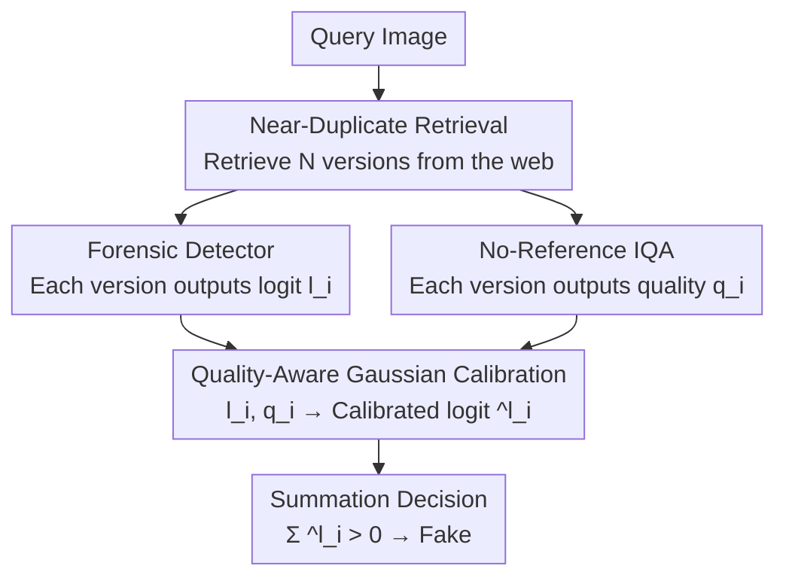

# Quality-Aware Calibration for AI-Generated Image Detection in the Wild

**Conference**: CVPR 2026  
**arXiv**: [2604.15027](https://arxiv.org/abs/2604.15027)  
**Code**: https://grip-unina.github.io/QuAD/ (Available)  
**Area**: AIGC Detection / Image Forensics  
**Keywords**: AI-generated image detection, near-duplicate images, quality-aware calibration, IQA, Bayesian fusion

## TL;DR
Focusing on multiple "near-duplicate versions" with varying image quality generated during web propagation, this paper proposes QuAD: using no-reference IQA to estimate the quality of each version, then performing Gaussian calibration on detector logits conditioned on quality followed by weighted fusion. This makes low-quality versions "speak less" and high-quality versions "speak more," improving the balanced accuracy of six SOTA detectors by approximately 8 percentage points on average.

## Background & Motivation
**Background**: Existing AI-generated image detectors (forensic detectors) almost all assume the input is a "clean image to be tested" and output a real/fake score. To counter social network compression and scaling, mainstream robustness methods involve JPEG/blur data augmentation during training or modeling the noise distribution of social platforms.

**Limitations of Prior Work**: In the real world, a single viral image will appear in numerous "near-duplicate" versions online—each forwarding can involve re-compression, scaling, or cropping, leading to degrading quality. Fine-grained statistical traces relied upon for forensics are gradually erased. Consequently, **the same detector gives drastically different scores for different versions of the same image**, making it unclear which version to trust.

**Key Challenge**: A natural idea (following prior work [16]) is "only trust the first uploaded/largest sized version, as it has the least processing." However, the authors point out this path is unreliable: the earliest appearance is not necessarily the original, timestamps can be distorted by forwarding delays/tampering, and the largest image might be heavily processed then upsampled; many earlier ancestral versions may have already disappeared from the web. The other extreme—simple averaging of all version scores—is similarly biased by heavily compressed inferior copies, increasing uncertainty.

**Goal**: Upgrade the problem from "single-image detection" to "joint inference across multiple versions"—automatically judging how credible each version's score is within a set of near-duplicates with unknown quality and mixed sources, then fusing them into a more reliable final decision.

**Key Insight**: The authors observe a key fact in Fig. 3—quality estimated by no-reference IQA (e.g., LoDa) is highly correlated with the intensity of post-processing (heavier compression, downsampling, and blur result in lower quality scores). Simultaneously, Fig. 6 shows that heavier degradation leads to overlapping real/fake logit distributions, making them less separable. Thus, "quality" serves as an observable proxy variable linked to "score credibility."

**Core Idea**: Using quality as a condition, calibrate detector logits into "log-likelihood ratios considering credibility," then sum for the final decision. In low-quality regions, real/fake Gaussian distributions almost overlap, and their calibrated contribution approaches 0; in high-quality regions, the distributions are separable, contributing more. This utilizes information from all versions while automatically down-weighting the influence of unreliable copies.

## Method

### Overall Architecture
QuAD (Quality-Aware calibration with near-Duplicates) is an inference-time fusion pipeline that does not require retraining the detector. Given a query image, it first retrieves all its near-duplicate versions $X_1,\dots,X_N$ from the web. For each version, two tasks are run simultaneously: an off-the-shelf forensic detector outputs logit $l_i$ (estimating the log-posterior likelihood ratio of real/fake), and a no-reference IQA module outputs a quality index $q_i$. The core step is "Quality-Aware Calibration": using a set of Gaussian models pre-fitted on a development set, the raw $l_i$ is converted to a calibrated $\hat{l}_i$. The absolute magnitude of this calibrated value reflects the separability of real/fake distributions under quality $q_i$. Finally, all $\hat{l}_i$ are summed; if greater than 0, it is judged as fake. The only parts that need to be "learned" in the entire pipeline are 8 coefficients describing the linear change of Gaussian mean/variance with quality.

### Key Designs

**1. Near-duplicate retrieval + dual-channel scoring: Turning "one image" into "a set of evidence"**

This is the scaffolding that transforms single-image detection into multi-version inference. For a query image, the authors use the Google Cloud Vision API to retrieve all near-duplicate instances on the web, obtaining a set $\{X_1,\dots,X_N\}$. Each instance is sent through two channels: the forensic detector gives logit $l_i$, defined as $l_i=\log\frac{P(y=1\mid X_i)}{P(y=0\mid X_i)}$ ($y=1$ for fake, $y=0$ for real); the no-reference IQA gives quality index $q_i$. Note that "quality" here specifically refers to image degradation (how much it was compressed/scaled/cropped), **not** the visual realism of generated content, nor is it used directly as a real/fake indicator. The most naive fusion (naive) would be to sum logits directly under conditional independence and equal prior assumptions $\sum_i l_i>0$—this is a Bayesian combination of multiple pieces of evidence, but the problem is that $l_i$ from inferior copies are added without distinction.

**2. Quality-Aware Gaussian Calibration: Rewriting logits into "credibility-aware likelihood ratios"**

This is the core of the paper. The pain point is that naive summation treats all logits equally, while more degraded versions (small $q_i$) have overlapping distributions and less credible $l_i$. The authors' approach is to model the conditional distribution of logits for real and fake images under the quality condition as Gaussians:
$$l_i\mid q_i,y=1\sim\mathcal{N}(\mu_1(q_i),\sigma_1^2(q_i)),\quad l_i\mid q_i,y=0\sim\mathcal{N}(\mu_0(q_i),\sigma_0^2(q_i))$$
Both mean and variance change with quality. Consequently, each term in the decision rule is no longer the raw $l_i$, but the log-likelihood ratio of these two Gaussians, i.e., the calibrated $\hat{l}_i$:
$$\hat{l}_i=\frac{(l_i-\mu_0(q_i))^2}{2\sigma_0^2(q_i)}-\frac{(l_i-\mu_1(q_i))^2}{2\sigma_1^2(q_i)}+\log\frac{\sigma_0(q_i)}{\sigma_1(q_i)}$$
The final decision is $\sum_i\hat{l}_i>0$. The beauty of this step is that the absolute value of $\hat{l}_i$ naturally reflects how well the two Gaussians are separated at that quality point—at low quality, the two Gaussians almost coincide, $\hat{l}_i$ approaches 0, and is automatically "soft-masked"; at high quality, they are well-separated, $\hat{l}_i$ is large, and it dominates the fusion result. Compared to "only picking the highest quality one" (losing information) or "averaging all" (biased by poor copies), this utilizes all versions while weighting continuously by credibility, offering a more refined middle ground.

**3. Linear parameterization of quality + Maximum Likelihood fitting: Learning only 8 coefficients**

To make the above formula usable, one must know how $\mu_j, \sigma_j$ change with quality $q_i$. The authors assume a simple linear relationship:
$$\mu_j(q_i)=a_j\cdot q_i+b_j,\quad \log\sigma_j^2(q_i)=\alpha_j\cdot q_i+\beta_j,\quad j\in\{0,1\}$$
(Taking log-linear for variance ensures positivity). Thus, the entire calibrator has only 8 coefficients $(a_0,b_0,\alpha_0,\beta_0,a_1,b_1,\alpha_1,\beta_1)$, estimated once using maximum likelihood on approximately 50% of the AncesTree data, with the other half reserved for evaluation. This is lightweight enough to add virtually no inference cost, and because fitting focuses on "statistical drift of forensic traces with quality" rather than image content (semantics are aligned between real and fake images in the dataset), it generalizes to out-of-distribution real-world data.

### Loss & Training
Ours does not train the detector or the IQA. The only "learning" is using a maximum likelihood strategy to estimate the 8 Gaussian coefficients on the AncesTree development set (about half the data); the remaining half is used for evaluation. Both the detector and IQA modules are off-the-shelf and frozen; Ours acts as a plug-and-play post-processing calibration/fusion layer wrapped around them.

## Key Experimental Results

### Main Results
Evaluation metrics are balanced Accuracy (bAcc, higher is better) and negative log-likelihood (NLL, lower is better, measuring confidence calibration). Comparisons are made across 6 SOTA detectors (DMID, CoDE, D3, B-Free, DRCT, CO-SPY) against multiple aggregation/sorting baselines.

AncesTree (Controlled in-the-wild dataset, average of six detectors):

| Strategy | # Images | bAcc↑ | NLL↓ |
|----------|----------|-------|------|
| random (Single random, common practice) | 1 | 70.7 | 0.97 |
| naive (Average all) | all | 73.2 | 0.75 |
| oracle L1 (Highest quality layer, ideal upper bound) | L1 | 78.8 | 0.66 |
| LoDa sorting top-10 | 10 | 77.6 | 0.66 |
| **QuAD (Ours)** | all | **81.6** | **0.43** |

Ours not only exceeds the naive average (+8.4 bAcc, NLL 0.75→0.43) but also outperforms the oracle first layer (78.8), which can only be obtained in controlled environments.

ReWIND (Real viral images, average of six detectors):

| Strategy | # Images | bAcc↑ | NLL↓ |
|----------|----------|-------|------|
| naive (Average all) | all | 63.0 | 1.27 |
| Date (Earliest upload, prior [16] approach) | 1 | 67.3 | 1.29 |
| LoDa top-10 | 10 | 66.0 | 1.13 |
| **QuAD (Coeffs transferred from AncesTree)** | all | **70.3** | **0.63** |
| **QuAD\* (Coeffs re-estimated on ReWIND via leave-one-out)** | all | **71.4** | **0.57** |

Even when calibration coefficients are fitted only on the small-scale, synthetic AncesTree, they remain consistently superior when transferred to real viral images with completely unknown degradation histories (70.3 vs naive 63.0, Date 67.3), with NLL nearly halved.

### Ablation Study

| Configuration | bAcc↑ | Description |
|---------------|-------|-------------|
| QuAD + LoDa Calibration | 81.6 | Default IQA |
| QuAD + TReS Calibration | 81.5 | Minimal change with different IQA |
| QuAD + QCN Calibration | 81.4 | Minimal change with different IQA |
| Sort by Compression Quality Factor (QF) top-10 | 72.6 | Sorting baseline, far inferior to calibration |
| Sort by Image Size top-20 | 71.1 | Largest size ≠ most credible |

### Key Findings
- **Calibration Fusion > Hard Sorting/Selection**: Summing all versions after calibration (81.6) is significantly better than any strategy that "selects only the top K" based on some metric, and it even beats the oracle first layer (78.8)—proving that discarding information (selecting the best) is inferior to soft weighting by credibility.
- **Quality is More Reliable than Size/Compression Factor**: Fig. 8 shows that sorting by image size or compression quality factor is unreliable (the largest image could be heavily processed then upsampled), whereas IQA (especially LoDa) is the sorting variable truly correlated with credibility.
- **Insensitive to IQA Choice**: The average accuracy provided by LoDa/TReS/QCN is 81.6/81.5/81.4 respectively, indicating that the method's robustness comes from the calibration framework itself rather than a specific IQA model.
- **Effective with Few Near-Duplicates**: Fig. 8 (right) shows that even with only a few retrieved near-duplicates, Ours still outperforms naive aggregation, covering realistic scenarios where near-duplicates are scarce.
- **Failure Points**: On ReWIND, only CO-SPY showed a slight performance drop, which the authors attribute to the AncesTree development set being insufficient to cover all real-world degradation variations; re-estimating coefficients on ReWIND (QuAD*) further improves it to 71.4.

## Highlights & Insights
- **Shifting from "which image to trust" to "weighting all images by credibility"**: This is a cognitive shift—no longer obsessing over retrieving the cleanest original (often unavailable), but acknowledging all versions are useful with varying credibility and weighting them statistically. This "soft selection instead of hard selection" logic can be transferred to any fusion problem with uneven source credibility.
- **Using observable quality as a proxy for unobservable credibility**: Degradation history is unknown, but degradation results (quality) can be measured by off-the-shelf IQA and are strongly correlated with detector distribution separability. This paradigm of "finding an observable proxy variable to calibrate black-box scores" is highly generalizable.
- **Extremely lightweight and plug-and-play**: The entire calibration uses only 8 linear coefficients with zero additional network overhead at inference. It can be wrapped around any frozen detector for immediate gains with minimal deployment cost.
- **Two complementary datasets filling the gap**: AncesTree (136k images, controllable degradation trees) for large-scale fitting analysis, and ReWIND (~10k real viral near-duplicates) for realistic evaluation—the latter being the first mixed real/fake dataset with actual web-retrieved near-duplicate versions.

## Limitations & Future Work
- **Dependence on Near-Duplicate Retrieval Quality**: The authors acknowledge the entire pipeline is built on the ability to retrieve near-duplicates; how missed detections or false positives (unrelated images treated as near-duplicates) affect performance has not been systematically analyzed. Future work will investigate strategies for filtering irrelevant samples.
- **Strong Gaussian/Linear Assumptions**: Modeling the logit conditional distribution as Gaussian and mean/variance as linearly dependent on quality are simplifications for solvability and fitting; if the actual distribution deviates severely, calibration may fail (as seen with CO-SPY on ReWIND).
- **Conditional Independence and Equal Prior Assumptions**: Bayesian summation assumes versions are conditionally independent given the label and that real/fake priors are equal; in reality, web forwarding chains are highly correlated, which the authors admit is a simplification for tractability.
- **Adversarial Scenarios Not Considered**: Malicious actors could intentionally construct near-duplicates to mislead detectors; this is not covered and is listed as a future direction, along with extending the work to AI-generated video.

## Related Work & Insights
- **vs Robustness Data Augmentation [26,27]**: They add JPEG/blur augmentation or model social platform noise during training to make single-image detection more resistant to degradation. Ours does not modify the detector or its training; it performs multi-version fusion at inference—the two are orthogonal and QuAD can be layered onto any augmented detector.
- **vs FOSID [16] (Retrieval-assisted selection of earliest upload)**: Previous work also faced multi-version scenarios but focused on "selecting one instance most likely to be unprocessed (earliest/original)," which is limited by the unavailability of originals and unreliable timestamps. Ours avoids hard selection, jointly analyzing all near-duplicates with quality calibration weighting, outperforming the "earliest date" baseline (70.3 vs 67.3).
- **vs Works using IQA for forensics [15,24]**: Jiang et al. use IQA scores as discriminative features for deepfakes; Song et al. use IQA for curriculum learning to augment low-quality samples. Ours is different—IQA is only used at inference to calibrate each near-duplicate's detector score and determine fusion weight, explicitly declaring IQA is not a real/fake indicator but a measure of degradation.

## Rating
- Novelty: ⭐⭐⭐⭐⭐ First to systematically handle "multi-version fusion of web near-duplicates" for forensics, reframing single-image detection as credibility-weighted multi-evidence inference.
- Experimental Thoroughness: ⭐⭐⭐⭐⭐ 6 SOTA detectors × multiple sorting baselines × two datasets (136k synthetic + 10k real), plus validation of IQA-insensitivity and stable cross-domain transfer.
- Writing Quality: ⭐⭐⭐⭐ Motivation progresses logically; Bayesian derivation and Gaussian calibration are clear; numerous charts require careful cross-referencing.
- Value: ⭐⭐⭐⭐⭐ Plug-and-play, zero retraining yields ~8-point gains for existing detectors, directly addressing real pain points for fact-checkers/journalists with open data and code.

## Related Papers

- [\[CVPR 2026\] PPM-CLIP: Probabilistic Prompt Modeling for Generalizable AI-Generated Image Detection](ppm-clip_probabilistic_prompt_modeling_for_generalizable_ai-generated_image_dete.md)
- [\[CVPR 2026\] ReAlign: Generalizable Image Forgery Detection via Reasoning-Aligned Representation](realign_generalizable_image_forgery_detection_via_reasoning-aligned_representati.md)
- [\[CVPR 2026\] Locate-Then-Examine: Grounded Region Reasoning Improves Detection of AI-Generated Images](locate-then-examine_grounded_region_reasoning_improves_detection_of_ai-generated.md)
- [\[CVPR 2026\] Inconsistency-aware Multimodal Schrodinger Bridge for Deepfake Localization](inconsistency-aware_multimodal_schrodinger_bridge_for_deepfake_localization.md)
- [\[CVPR 2026\] FRAME: Forensic Routing and Adaptive Multi-path Evidence Fusion for Image Manipulation Detection](frame_forensic_routing_and_adaptive_multi-path_evidence_fusion_for_image_manipul.md)

<!-- RELATED:END -->

<!-- RELATED:START -->

## Related Papers

- [\[CVPR 2026\] PPM-CLIP: Probabilistic Prompt Modeling for Generalizable AI-Generated Image Detection](ppm-clip_probabilistic_prompt_modeling_for_generalizable_ai-generated_image_dete.md)
- [\[CVPR 2026\] Inconsistency-aware Multimodal Schrodinger Bridge for Deepfake Localization](inconsistency-aware_multimodal_schrodinger_bridge_for_deepfake_localization.md)
- [\[CVPR 2026\] Locate-Then-Examine: Grounded Region Reasoning Improves Detection of AI-Generated Images](locate-then-examine_grounded_region_reasoning_improves_detection_of_ai-generated.md)
- [\[CVPR 2026\] Learning Forgery-Aware Lip Representations Without Forgery Priors](learning_forgery-aware_lip_representations_without_forgery_priors.md)
- [\[CVPR 2026\] ReAlign: Generalizable Image Forgery Detection via Reasoning-Aligned Representation](realign_generalizable_image_forgery_detection_via_reasoning-aligned_representati.md)

<!-- RELATED:END -->
