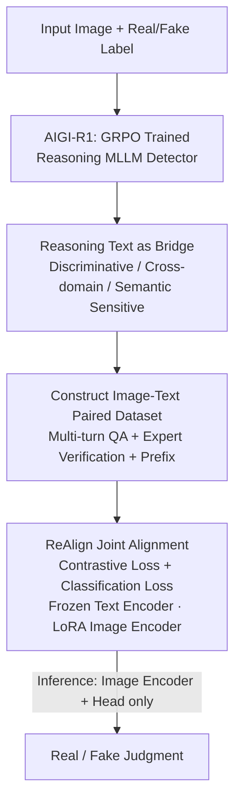

# ReAlign: Generalizable Image Forgery Detection via Reasoning-Aligned Representation

**Conference**: CVPR 2026  
**arXiv**: [2605.16080](https://arxiv.org/abs/2605.16080)  
**Code**: None  
**Area**: AIGI Detection / Image Forensics  
**Keywords**: AIGI Forgery Detection, Reasoning Text Representation, GRPO, Contrastive Alignment, CLIP Distillation

## TL;DR
ReAlign first trains a multimodal large language model (MLLM), AIGI-R1, that can "reason" using GRPO. It then uses the generated reasoning text as a "bridge" to distill the reasoning text space into a lightweight CLIP detector via contrastive learning. This allows the small model to inherit both the cross-domain generalization and semantic error sensitivity of the large model, while requiring only the image encoder during inference. It achieves SOTA results on AIGCDetectBenchmark / AIGI-Holmes / UltraSynth-10k (mAcc 96.14% / 99.44% / 97.09%).

## Background & Motivation
**Background**: The proliferation of AI-generated images (AIGI) has made authenticity detection a necessity. Existing detectors are divided into two categories: Non-LLM-based (CNN/ViT, e.g., AIDE, UniFD, PatchCraft) which directly extract image features for binary classification, and LLM-based (FakeShield, ForgeryGPT, AIGI-Holmes) which encode images into language space to provide both judgments and textual explanations.

**Limitations of Prior Work**: Both approaches have significant drawbacks. Non-LLM detectors excel at capturing low-level artifacts (texture discontinuities, noise, frequency anomalies) but are black boxes with small parameters that easily overfit the training distribution, failing on unseen generators. LLM-based detectors leverage world knowledge to identify semantic/common-sense flaws (logically inconsistent objects) but are insensitive to subtle low-level artifacts, have massive parameters, slow inference, and high deployment costs, making them unsuitable for mobile devices.

**Key Challenge**: Sensitivity to low-level artifacts $\leftrightarrow$ semantic understanding and generalization. These two sets of capabilities are currently split between the two approaches and are difficult to reconcile. More importantly, there has been no clear evidence regarding whether the "explanatory text" output by LLMs actually contributes substantially to detection.

**Goal**: This work addresses two sub-questions: (1) Identifying the intrinsic value of reasoning text generated by LLMs for detection; (2) Unifying the advantages of both approaches into a framework that is both lightweight and generalizable.

**Key Insight**: The authors discovered through experiments that reasoning text produced by an LLM optimized via reinforcement learning (GRPO) constitutes a high-quality representation space with three properties: discriminativeness (strongly related to "real/fake" concepts), cross-domain generalization (text representations of different datasets overlap highly, smoothing visual distribution shifts), and semantic error sensitivity (sensitive to semantic inconsistencies but not low-level details). Since the LLM's detection capability stems essentially from this reasoning text space, it is unnecessary to carry the entire LLM during inference.

**Core Idea**: Use "reasoning text representation" as a bridge to distill the generalization and semantic sensitivity of a GRPO-based large model into a lightweight CLIP detector. Text alignment is used during training, while only the image encoder is retained during inference.

## Method

### Overall Architecture
ReAlign's pipeline consists of four sequential steps: (a) Training an MLLM into **AIGI-R1** using GRPO to generate detection reasoning within `<think>` tags and judgments within `<answer>` tags; (b) Using the trained AIGI-R1 to generate diverse reasoning texts for each image, forming an **image-text paired dataset**; (c) **Jointly training** ReAlign (a CLIP detector) on these pairs using contrastive loss to pull image features toward the reasoning text space while maintaining discriminative power via classification loss; (d) Using only the image encoder + detection head for inference, completely discarding the LLM and the text generation process.

The key lies in the fact that reasoning text appears as an alignment target only during the **training phase**, acting as a carrier to "pour" the LLM's capabilities into the small model. Once alignment is complete, the generalization and semantic sensitivity of the text space are encoded into the image encoder, making the text space unnecessary for inference, thus achieving lightweight efficiency.

### Key Designs

**1. AIGI-R1: Training a Reasoning Detector via GRPO to Create a High-Quality Text Space**

This step solves the "where does the bridge come from" problem. To distill, one needs reasoning text that is both discriminative and generalizable. Inspired by DeepSeek-R1, the authors optimize the MLLM using Group Relative Policy Optimization (GRPO) for outcome-based reinforcement learning. GRPO improves upon PPO by sampling a group of candidate responses for the same question and optimizing based on relative reward rankings, eliminating the need for a critic model and making training more stable for tasks where supervision is scarce. The optimization objective is:

$$\max_{\pi_\theta}\;\mathbb{E}_{o\sim\pi_\theta(q)}\big[R_{\text{total}}(q,o)-\beta\cdot \mathrm{KL}[\pi_\theta(o|q)\,\|\,\pi_{\text{ref}}(o|q)]\big],$$

where $R_{\text{total}}=R_{\text{det}}+R_{\text{format}}$. The detection reward $R_{\text{det}}^{(i)}=1$ if the predicted judgment $o^{(i)}$ matches the ground truth $\text{det}_{\text{gt}}$, otherwise 0. $R_{\text{format}}$ constrains the `<think>/<answer>` tag format, and $\beta$ controls the KL divergence from the reference model. During training, the real/fake labels of images are used as ground truths for fixed questions like "Is this image AI-generated or camera-captured? Please analyze and provide a judgment," accompanied by a system prompt guiding the model to observe details. Compared to SFT's next-token supervision, this outcome-driven RL is proven to stimulate stronger generalization—the source of ReAlign's robustness.

**2. Reasoning Text as a Bridge: Three Validated Properties**

The authors did not take the utility of "reasoning text" for granted but empirically validated three properties that complement the weaknesses of prior work. **Discriminativeness**: By calculating semantic similarities $s_{\text{real}}, s_{\text{fake}}$ of image captions (generated by Qwen2.5-VL) and AIGI-R1 reasoning texts to class labels, it was found that reasoning texts polarize more clearly along the x-axis ($s_{\text{real}}-s_{\text{fake}}$) and sit higher on the y-axis ($s_{\text{real}}+s_{\text{fake}}$), indicating stronger discriminative signals. **Cross-domain Generalization**: t-SNE visualizations of StarGAN and SDXL datasets show that while visual features are clustered separately (large distribution shift), AIGI-R1 reasoning texts overlap highly, indicating domain invariance. **Semantic Error Sensitivity**: While non-LLM models like AIDE excel at texture distortions, they fail at semantic forgeries (e.g., common-sense violations), which AIGI-R1 handles well. Together, these properties justify using the reasoning text space as an alignment target.

**3. Constructing Image-Text Paired Datasets: Diverse and Clean Targets**

To support contrastive learning, the authors input multiple questions per image to generate varied responses, further increasing diversity by adjusting prediction seed and temperature. After generation, human experts verify and correct outputs (removing misjudgments or hallucinations). The reasoning text is extracted from `<think>` tags and prepended with "This is a real/fake image." based on the label. This results in a refined dataset of forgery descriptions paired with images.

**4. ReAlign Alignment Framework: Frozen Text, LoRA Image Encoder, Joint Contrastive + Classification**

The final step is "pouring" the reasoning text space into CLIP. ReAlign consists of an image encoder, a text encoder, and a detection head, all initialized with pretrained CLIP-ViT-L/14-336. The key configuration involves **freezing the text encoder** (to preserve CLIP's general semantic understanding) and using **LoRA** to efficiently fine-tune the image encoder (aligning image features with reasoning text while retaining general semantic perception). A two-layer MLP detection head is trained with full parameters. This forces image features into the discriminative, domain-invariant text space, essentially inheriting AIGI-R1's capabilities without needing the LLM during inference.

### Loss & Training
The contrastive loss uses symmetric cross-entropy. For image-to-text $\mathcal{L}_{i\to t}$:

$$\mathcal{L}_{i\to t}=-\frac{1}{N}\sum_{i=1}^{N}\log\frac{\exp(\mathbf{v}_i\cdot\mathbf{t}_i)}{\sum_{j=1}^{N}\exp(\mathbf{v}_i\cdot\mathbf{t}_j)},$$

where $\mathbf{v}_i$ and $\mathbf{t}_i$ are the encoded vectors of the image and its corresponding reasoning text, respectively. The total contrastive loss is $\mathcal{L}_{\text{contrastive}}=\frac{1}{2}(\mathcal{L}_{i\to t}+\mathcal{L}_{t\to i})$. The final objective is the weighted sum of contrastive and standard BCE classification loss:

$$\mathcal{L}=\mathcal{L}_{\text{contrastive}}+\alpha\cdot\mathcal{L}_{\text{classification}},\quad \alpha=8.$$

Implementation details: AIGI-R1 is trained on 8×A800-80G with a learning rate of $1\times10^{-6}$ and $\beta=0.04$. ReAlign is trained on a single RTX 3090 for 10 epochs with a learning rate of $1\times10^{-4}$ using LoRA (rank=6, alpha=6).

## Key Experimental Results

### Main Results
ReAlign achieves SOTA on all three benchmarks, outperforming the strongest baselines while remaining lightweight:

| Dataset | Metric | Ours | Prev. SOTA (Non-LLM/LLM) | Gain |
| :--- | :--- | :--- | :--- | :--- |
| AIGCDetectBenchmark (18 Generators) | mAcc | **96.14%** | AIDE 92.77% / AIGI-R1 91.77% | +3.37% / +4.37% |
| AIGI-Holmes (Incl. Infinity/FLUX, etc.) | mAcc | **99.44%** | AIDE 97.00% / RINE 96.20% | +2.44% |
| UltraSynth-10k (Self-built, 5 SOTA Closed Generators) | mAcc | **97.09%** | AIDE 81.08% / AIGI-R1 96.42% | +16.01% / +0.67% |

UltraSynth-10k is a challenging new benchmark (10k images) covering advanced closed-source generators (Qwen-Image, Seedream, GPT-4o, Gemini, HunYuan-Image). All methods were trained on AIGI-Holmes and tested on these **unseen generators** to evaluate zero-shot generalization.

### Ablation Study

**Alignment Text Ablation (Tab. 4, UltraSynth-10k)** — Verifying that "Reasoning Text" is the key to generalization:

| Configuration | Alignment Text | mAcc | Note |
| :--- | :--- | :--- | :--- |
| Ours | Reasoning text + Label prefix | **97.09%** | Full setting |
| (a) | Label + Image caption | 91.63% (−5.46%) | Caption is significantly worse |
| (b) | Reasoning text only | 96.87% (−0.22%) | Prefix provides minor gains |
| (c) | Image caption only | 88.32% (−8.77%) | Captions are far inferior |
| (d) | Label only | 91.33% (−5.76%) | Without reasoning text |

**Training Configuration Ablation (Tab. 5, UltraSynth-10k)**:

| Configuration | Training Strategy | Fine-Tuning | mAcc | Note |
| :--- | :--- | :--- | :--- | :--- |
| Ours | Joint | LoRA | **97.09%** | Full model |
| (a) | Joint | Full Param | 94.69% (−2.40%) | Full-parameter drops accuracy |
| (b) | Sequential | Full Param | 79.07% (−18.02%) | Sequential + Full is worst |
| (c) | Sequential | LoRA | 84.08% (−13.01%) | Sequential significantly lags |
| (d/e) | — | Freeze / LoRA (BCE only) | 89.15% / 93.68% | Alignment is essential |

### Key Findings
- **Reasoning text is the true source of generalization and semantic sensitivity**: Replacing reasoning text with captions or pure labels leads to a significant performance drop. 
- **Joint optimization significantly outperforms sequential optimization**: Sequential optimization resulted in a 13.01% lower mAcc, showing that the image encoder learns detection-relevant information more effectively under simultaneous classification constraints.
- **LoRA is superior to full-parameter fine-tuning**: Full-parameter tuning dropped mAcc by 2.40%, as LoRA preserves the general semantic perception of CLIP while enhancing forgery detection, whereas full-parameter tuning risks catastrophic forgetting.
- **Superiority increases with newer/harder generators**: On UltraSynth-10k, ReAlign is ~16% better than AIDE, showing its advantage is most prominent against modern high-fidelity closed-source generators.

## Highlights & Insights
- **Validated the utility of LLM reasoning text**: The authors quantified properties like discriminativeness and domain invariance through three visualization experiments rather than simply assuming LLMs help.
- **"Train with text, infer without" paradigm**: By using reasoning text only as an alignment target during training, the model harvests LLM-level generalization while maintaining a lightweight footprint for deployment.
- **Strategic trade-offs in architecture**: Freezing the text encoder and using LoRA on the image encoder is shown to be more effective than full-parameter fine-tuning, preserving critical semantic priors.
- **UltraSynth-10k contribution**: Addressed the lag in benchmarks relative to current generation technology by including the latest closed-source models like GPT-4o and Gemini.

## Limitations & Future Work
- **Reliance on expert verification**: Constructing the image-text pairs requires human verification of AIGI-R1 outputs, which acts as a bottleneck for scaling and introduces subjectivity.
- **Front-loaded training costs**: While inference is lightweight, the initial GRPO training of AIGI-R1 requires significant compute (8×A800), shifting costs from inference to training.
- **Low-level artifact sensitivity**: While overall accuracy is high, it remains to be seen if the CLIP image encoder truly learns "texture-level" artifacts as well as specialized CNNs, as the improvement is primarily semantic/distillation-based.

## Related Work & Insights
- **vs. AIDE / UniFD / PatchCraft (Non-LLM)**: These rely on fixed low-level visual features. ReAlign injects semantic and domain invariance via reasoning text, outperforming AIDE by ~16% in cross-domain settings.
- **vs. FakeShield / ForgeryGPT / AIGI-Holmes (LLM-based)**: These run massive models at inference time. ReAlign distills this capability into a small model, retaining generalization without the overhead.
- **vs. C2P-CLIP / UniGenDet (CLIP-based Contrastive Learning)**: While both use contrastive learning, ReAlign uses reasoning text from a GRPO-trained model as the target, providing stronger semantic priors than label-guided prompts.

## Rating
- Novelty: ⭐⭐⭐⭐ 
- Experimental Thoroughness: ⭐⭐⭐⭐⭐ 
- Writing Quality: ⭐⭐⭐⭐ 
- Value: ⭐⭐⭐⭐ 

<!-- RELATED:START -->

## Related Papers

- [\[CVPR 2026\] PPM-CLIP: Probabilistic Prompt Modeling for Generalizable AI-Generated Image Detection](ppm-clip_probabilistic_prompt_modeling_for_generalizable_ai-generated_image_dete.md)
- [\[CVPR 2026\] Learning Forgery-Aware Lip Representations Without Forgery Priors](learning_forgery-aware_lip_representations_without_forgery_priors.md)
- [\[CVPR 2026\] Quality-Aware Calibration for AI-Generated Image Detection in the Wild](quality-aware_calibration_for_ai-generated_image_detection_in_the_wild.md)
- [\[CVPR 2026\] Locate-Then-Examine: Grounded Region Reasoning Improves Detection of AI-Generated Images](locate-then-examine_grounded_region_reasoning_improves_detection_of_ai-generated.md)
- [\[CVPR 2026\] FRAME: Forensic Routing and Adaptive Multi-path Evidence Fusion for Image Manipulation Detection](frame_forensic_routing_and_adaptive_multi-path_evidence_fusion_for_image_manipul.md)

<!-- RELATED:END -->
