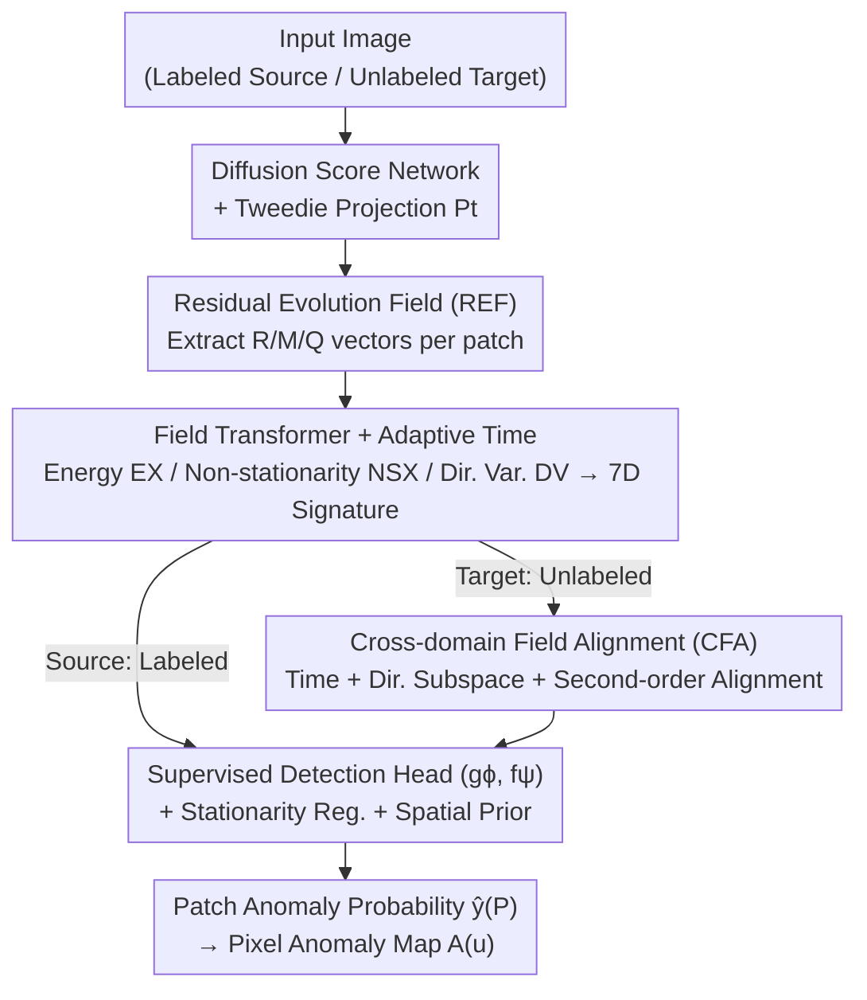

# Anomaly-Related Residual Fields for Cross-domain Anomaly Detection

**Conference**: CVPR 2026  
**Paper**: [CVF Open Access](https://openaccess.thecvf.com/content/CVPR2026/html/Gao_Anomaly-Related_Residual_Fields_for_Cross-domain_Anomaly_Detection_CVPR_2026_paper.html)  
**Code**: Not disclosed  
**Area**: Anomaly Detection / Cross-domain Transfer  
**Keywords**: Cross-domain Anomaly Detection, Diffusion Model Residuals, Residual Evolution Fields, Domain Alignment, Unlabeled Transfer

## TL;DR
Addressing the challenge that diffusion model residuals are noisy and magnitudes alone cannot distinguish anomalies, this paper proposes Residual Evolution Fields (REF). It separates "persistent non-stationary anomaly signals" from the spatio-temporal trajectories of residuals in the diffusion reverse process. Cross-domain Field Alignment (CFA) is then employed to transfer detectors trained on labeled source domains to unlabeled target domains, achieving an average AUROC of 95.22% across 9 cross-domain tasks, outperforming the strongest baseline by 13 percentage points.

## Background & Motivation

**Background**: The mainstream approach for unlabeled image anomaly detection is using diffusion models to learn a "normal manifold." Since diffusion models effectively capture the intra-normal variability of normal samples, many methods attempt to identify anomalies from "prediction residuals" (the difference between input and denoised reconstruction). The common assumption is that anomalies deviating from the manifold are harder to generate, thus resulting in larger prediction errors.

**Limitations of Prior Work**: The issue is that **large residuals do not equal anomalies**. The stochasticity of the diffusion reverse process, combined with complex but legitimate local structures in normal images, generates large residuals. Consequently, "residual magnitude" as an anomaly criterion is non-diagnostic—residuals in anomalous and normal regions overlap strongly and are both highly stochastic. Training a detector directly on residuals injects significant noise into the representation, causing cross-domain generalization to collapse.

**Key Challenge**: Anomaly signals are **weak and easily submerged** by intra-normal variability. Existing transfer methods are only reliable under small domain shifts. If the normal manifold itself differs greatly between source and target domains, alignment operations may flatten the already weak anomaly-sensitive directions. Filtering stochastic noise from residuals while preserving anomaly-sensitive directions during cross-domain alignment constitutes a contradiction.

**Key Insight**: Instead of focusing on the **instantaneous magnitude** of residuals, the authors examine their **evolution behavior over the reverse diffusion time axis**. Theoretical analysis (Supp.) provides a key observation: under learned normal dynamics, residuals following intra-normal statistics are gradually "absorbed" across reverse steps and converge to a stationary state. In contrast, residuals in anomalous regions carry an **additional non-stationary component that persists and is not absorbed**. Thus, anomalies are characterized not by "how large the residual is," but by "whether the residual is stable and persistent over time."

**Core Idea**: Residuals are organized into a spatio-temporal vector field. Statistics for "energy + non-stationarity" are used to detect the hidden, anomaly-aligned persistent signal. This field space is then aligned across domains to achieve unlabeled cross-domain reuse.

## Method

### Overall Architecture

The entire method runs symmetrically on two domains: **labeled source domain for supervised detector training; unlabeled target domain for detector reuse via alignment**. Given an image, a diffusion score network is executed along the reverse diffusion time $t=1,\dots,T$ to extract three residual vectors $(R_t, M_t, Q_t)$ for each patch. These are stacked over time and fed into a lightweight Field Transformer, yielding temporal attention $\alpha_t$ and a 7-dimensional REF signature (energy + non-stationarity index + directional variability). A detection head then maps this to patch anomaly probabilities. The source domain uses labels to supervise the entire pipeline (gϕ, fψ) and estimates the feature mean/covariance of normal patches as calibration anchors. After extracting the same REF features in the target domain, CFA aligns the target field space to the source field space across time, direction, and second-order statistics, allowing the source detector to be reused without target labels.

### Key Designs

**1. Residual Evolution Field (REF): Isolating "Persistent Anomaly Signals" via Three Residual Vectors and Stationarity Statistics**

The limitation is that residual magnitude alone cannot distinguish anomalies. REF addresses this by extracting three complementary residual quantities for each pixel $u$ at each diffusion step $t$. Let the score network be $S_\theta(y,t)$, the simultaneous Tweedie projection be $P_t(y)=y+\sigma_t^2 S_\theta(y,t)$ (estimating the noise-free state), and $v_t(u)=S_\theta(P_t(y_t),t)(u)$ be the reference direction:

$$R_t(u) = S_\theta(y_t,t)(u) - S_\theta(P_t(y_t),t)(u),\quad M_t(u) = S_\theta(y_t,t)(u) - \Pi_{v_t}[S_\theta(y_t,t)(u)],\quad Q_t(u) = \Phi_{t\to T}(y_t)(u) - \Phi_{t\to T}(P_t(y_t))(u)$$

Where $\Pi_v[w]=\frac{\langle w,v\rangle}{\|v\|^2}v$ is the orthogonal projection onto $v$, and $\Phi_{t\to T}$ is the solution for the probability-flow ODE integrated from $t$ to $T$. Intuitively: $R$ is **magnitude residual** (distance from manifold), $M$ is **directional offset** (the part of the residual perpendicular to the normal direction, carrying anomaly "orientation"), and $Q$ is **path cumulative drift** (accumulated difference along the reverse trajectory, characterizing "persistence").

The key is not the vectors themselves, but their **time-weighted energy** and **non-stationarity index** over patch $P$:

$$E_X(P) = \sum_{t=1}^{T}\|\bar X_t(P)\|_2^2\, w_t,\qquad NS_X(P) = \frac{\sum_{t=1}^{T-1}\|\bar X_{t+1}(P)-\bar X_t(P)\|_2^2\, w_t}{\sum_{t=1}^{T}\|\bar X_t(P)\|_2^2\, w_t + \epsilon_{\text{rid}}}$$

Where $X\in\{R,M,Q\}$ and $\epsilon_{\text{rid}}$ is a small ridge constant. Theoretical analysis (Supp. S.2–S.6) proves that under normal dynamics, residuals are **contractive and non-cumulative** ($E\|\bar R_{t+1}\|^2\le \kappa_t' E\|\bar R_t\|^2 + B_t'$), so normal regions have low $E_X$ and low $NS_X$ (tending towards stationarity). In contrast, anomalous regions **force a break in stationarity** because $\gamma_A\Delta s$ (anomaly responsibility × score difference) changes over time, preventing $M$ and $Q$ from decaying. The anomaly criterion thus shifts from "magnitude" to "temporal stability and persistence."

**2. Field Transformer + Adaptive Temporal Attention: Learning 7D Signatures**

Fixed temporal weights $w_t$ treat all patches equally, but "informative moments" vary by patch. The residual sequence $\{\text{vec}(\bar R_t,\bar M_t,\bar Q_t)\}_{t=1}^T$ with temporal positional encoding is fed to a lightweight Field Transformer $g_\phi$, which outputs normalized temporal attention $\alpha_t(P)$ and a patch embedding $h(P)$. Replacing $w_t$ with $\alpha_t$ yields adaptive energy $E_X^{\text{att}}$ and adaptive non-stationarity $NS_X^{\text{att}}$, along with directional variability $DV(P)$. The final 7D REF signature $[h(P);\,E_R^{\text{att}},E_M^{\text{att}},E_Q^{\text{att}},NS_R^{\text{att}},NS_M^{\text{att}},NS_Q^{\text{att}},DV]$ is sent to detection head $f_\psi\to \hat y(P)$. Multi-view statistics $Z$ provide a higher SNR than any single component.

**3. Cross-domain Field Alignment (CFA): Triple Alignment to Preserve and Transfer Anomaly Directions**

To prevent alignment from erasing anomaly-sensitive directions under large domain shifts, CFA operates in the low-dimensional **REF field space** rather than the raw pixel/feature space. Theoretically, the REF operator is contractive relative to domain differences. CFA consists of three unsupervised losses: **Temporal Alignment** matches target mean residuals to source via monotonic reparameterization $\psi$; **Second-order Alignment** uses whiten-recolor and CORAL loss to match second-order moments; **Directional Alignment** uses Orthogonal Procrustes rotation $R$ to align the top-r left singular vectors $U_T, U_S$ of stacked $\{\bar M_t\}$, specifically preserving the "orientation subspace" of anomalies. Target features are transformed and passed to the source detector without needing target labels.

### Loss & Training

Source objective $L_S=L_{\text{sup}}+\lambda_{\text{stat}}L_{\text{stat}}+\lambda_{\text{sp}}L_{\text{sp}}$: $L_{\text{sup}}$ is patch/image-level BCE; $L_{\text{stat}}$ is a stationarity/energy regularizer for normal patches; $L_{\text{sp}}$ is a weak spatial prior (TV term). Training proceeds in four stages: S1: Train source diffusion score network $S_{\theta_S}$; S2: Build REF and supervise $(g_\phi,f_\psi)$; T1: Train target score network $S_{\theta_T}$; T2: Optimize CFA. Inference calculates the mean of the top-p% pixels as the image-level score.

## Key Experimental Results

### Main Results

Datasets: MVTec, VisA, DAGM. Source domains are fully labeled; target domains are unlabeled and contaminated with anomalies. Metric: AUROC (%).

| Cross-domain Task | Best Baseline | Baseline AUROC | REF+CFA (Ours) | Gain |
|-------------------|---------------|----------------|----------------|------|
| MVTec Bottle→Cable | DKGPL | 72.63 | **81.72** | +5.02 |
| MVTec Bottle→Capsule | General-AD | 82.50 | **85.13** | +2.63 |
| MVTec Bottle→Hazelnut | JWO | 89.65 | **91.66** | +2.01 |
| VisA candle→Macaroni1 | GLASS | 94.94 | **100.00** | +5.06 |
| VisA candle→Macaroni2 | DDAD | 89.10 | **99.50** | +10.40 |
| VisA candle→Pcb2 | MLWE | 85.93 | **98.95** | +13.02 |
| DAGM Class2→Class1 | DDAD | 86.00 | **100.00** | +14.00 |
| DAGM Class2→Class3 | DDAD | 87.81 | **100.00** | +12.19 |
| DAGM Class2→Class6 | DDAD | 95.30 | **100.00** | +4.70 |
| **Average** | **DDAD** | **82.21** | **95.22** | **+13.01** |

Ours achieved the highest AUROC across all 9 target domains, averaging 13 percentage points higher than the strongest baseline (DDAD).

### Ablation Study

Average AUROC (%) on three VisA tasks:

| Configuration | Average AUROC | Description |
|---------------|---------------|-------------|
| **REF+CFA (Full)** | **99.48** | Full model |
| w/o R | 89.90 | Without magnitude residual component |
| w/o M | 86.66 | **Without directional offset (largest drop)** |
| w/o Q | 87.06 | Without path cumulative drift |
| w/o REF (Raw) | 84.11 | Training directly on raw diffusion residuals |
| w/o TA | 94.34 | CFA without temporal alignment |
| w/o DSA | 88.40 | **CFA without directional subspace alignment** |
| w/o SFA | 92.40 | Without second-order feature alignment |
| w/o CFA | 81.43 | Cross-domain transfer without alignment |

### Key Findings
- **Directional information (M / DSA) is critical**: Removing component M or directional subspace alignment DSA causes the largest performance drops. This confirms that anomaly separability is hidden in residual "orientation" rather than magnitude.
- **REF and CFA are both essential**: Using raw residuals drops AUROC from 99.48 to 84.11; removing CFA drops it to 81.43. One isolates the signal, the other enables transfer.
- **R/M/Q are complementary**: Removing any component decreases performance, validating the multi-view SNR improvement.

## Highlights & Insights
- **Redefining Anomaly as a Dynamical Property**: By ignoring magnitude and looking at temporal stationarity (normal residuals converge; anomaly residuals persist), the "magnitude non-diagnostic" problem is bypassed.
- **Procrustes Alignment for Subspaces**: Aligning the "orientation subspace" of anomalies via orthogonal rotation minimizes domain shift without destroying task-sensitive directions.
- **Theoretical Coherence**: The framework links residual contraction, stationarity breaking, and Wasserstein contraction of REF to a migration risk bound, grounding empirical success in theory.

## Limitations & Future Work
- **Computational Cost**: Training a score network for each domain pair is time-consuming and hard to scale. Distilling diffusion backbones into lightweight field predictors is a potential direction.
- **Saturation on Benchmarks**: Achieving 100% AUROC on several tasks suggests these industrial datasets may have relatively simple domain pairings; broader validation on subtler anomalies is needed.
- **Amortized Alignment**: Currently, each new target domain requires training a score network. Amortized alignment could enable a more universal source model.

## Related Work & Insights
- **vs. Diffusion Reconstruction (AnoDDPM / DDAD)**: These methods use the **magnitude** of reconstruction residuals. Ours identifies that magnitude is non-diagnostic and switches to **temporal stationarity** and directional components.
- **vs. Domain Adaptation (SHOT / TENT)**: General transfer methods often erase anomaly-sensitive directions during alignment. Ours aligns in a low-dimensional REF space using Procrustes to preserve directional integrity.
- **vs. Feature Matching (PatchCore)**: These lack cross-domain alignment mechanisms in the feature space; REF provides a dynamical test with theoretical transfer guarantees.

## Rating
- Novelty: ⭐⭐⭐⭐⭐ Redefining anomalies as non-stationary residual dynamics is highly original.
- Experimental Thoroughness: ⭐⭐⭐⭐ Strong results across 9 tasks, though saturated on industrial benchmarks.
- Writing Quality: ⭐⭐⭐⭐ Clear structure, though notationally dense with core proofs consigned to the supplement.
- Value: ⭐⭐⭐⭐ High utility for industrial inspection with solid theoretical backing, despite training costs.

<!-- RELATED:START -->

## Related Papers

- [\[CVPR 2026\] Hunting Normality from Query Sample via Residual Learning for Generalist Anomaly Detection](hunting_normality_from_query_sample_via_residual_learning_for_generalist_anomaly.md)
- [\[CVPR 2026\] Remedying Target-Domain Astigmatism for Cross-Domain Few-Shot Object Detection](remedying_target-domain_astigmatism_for_cross-domain_few-shot_object_detection.md)
- [\[ICLR 2026\] OwlEye: Zero-Shot Learner for Cross-Domain Graph Data Anomaly Detection](../../ICLR2026/object_detection/owleye_zero-shot_learner_for_cross-domain_graph_data_anomaly_detection.md)
- [\[CVPR 2026\] A Closer Look at Cross-Domain Few-Shot Object Detection: Fine-Tuning Matters and Parallel Decoder Helps](a_closer_look_at_cross-domain_few-shot_object_detection_fine-tuning_matters_and_.md)
- [\[CVPR 2026\] Learning Multi-Modal Prototypes for Cross-Domain Few-Shot Object Detection](learning_multi-modal_prototypes_for_cross-domain_few-shot_object_detection.md)

<!-- RELATED:END -->
