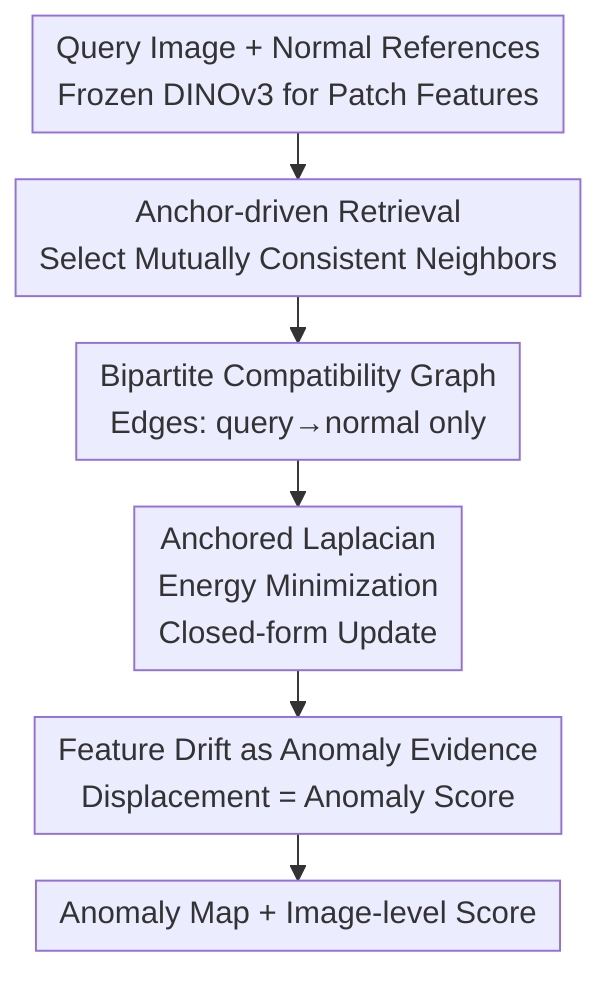

# Anomaly as Non-Conformity via Training-Free Graph Laplacian Energy Minimization

**Conference**: CVPR 2026  
**arXiv**: [2605.28428](https://arxiv.org/abs/2605.28428)  
**Code**: None (Unreleased as of the time of this note)  
**Area**: Industrial Anomaly Detection / Few-Shot Anomaly Detection / Training-Free Methods  
**Keywords**: Anomaly Detection, Graph Laplacian, Non-Conformity, Training-Free, Few-Shot

## TL;DR
ANoCo redefines anomaly detection from "how similar is this patch to normal ones" to "**how much cost is required to pull this patch back to the normal manifold**." By minimizing an anchored bipartite graph Laplacian energy to pull query patches toward the normal manifold, the **displacement magnitude itself** serves as the anomaly score. This approach requires no training, no message passing, and provides a closed-form solution, achieving new SOTA results on MVTec-AD / VisA in 1/2/4-shot settings.

## Background & Motivation
**Background**: Mainstream few-shot industrial anomaly detection follows the "training-free + retrieval" paradigm: using frozen feature extractors (ViT / DINO) to extract patch features, building a memory bank of normal patches, and performing nearest neighbor retrieval during testing. Anomalies are identified by **low similarity to the nearest normal patches** (e.g., PatchCore, SPADE, PaDiM).

**Limitations of Prior Work**: Similarity scoring is **patch-independent**, implicitly assuming that a query patch is normal as long as it resembles some normal patches. However, in few-shot scenarios, normal samples exhibit multi-modal distributions (lighting, texture, machining tolerances). $k$-NN can easily retrieve a set of "individually similar but mutually contradictory" normal neighbors for an anomalous patch, leading to false negatives. In other words, anomalies that are **locally plausible but globally inconsistent** cannot be detected by independent similarity checks.

**Key Challenge**: Prior attempts to model patch relationships using graphs (GNN message passing, Laplacian smoothing, homophily assumptions) **force connected nodes toward convergence**. While beneficial for representation learning or semi-supervised classification, this is disastrous for anomaly detection. Smoothing erases anomalous deviations and diffuses evidence across nodes; "encouraging graph smoothness" effectively eliminates the vital signal needed for detection.

**Goal**: To model the **structural relationship** between patches and the normal manifold while preventing the smoothing mechanism from erasing anomaly evidence, all while maintaining a training-free, interpretable, and low-complexity pipeline.

**Key Insight**: The authors reframe the question: instead of asking "how much does this patch look like normal," they ask "**how difficult is it to transform it to conform to the normal manifold**." If a patch is already on the normal manifold, it requires negligible movement; if it is anomalous, a significant deformation is needed to pull it back.

**Core Idea**: The graph Laplacian is reinterpreted as a **"non-conformity operator."** By fixing (anchoring) normal reference nodes and solving a convex anchored Laplacian energy minimization for query patches, the method avoids using the optimized features themselves. Instead, it uses the **displacement magnitude required to pull the patch back** as the anomaly score.

## Method

### Overall Architecture
ANoCo (Anomaly as Non-Conformity) takes several normal reference images ($K\le 4$) and a query image as input, outputting an image-level anomaly score $S(I_q)$ and a dense anomaly map $\mathcal{A}_q$. The pipeline involves only "linear solver" level computations without learnable parameters. It consists of three sequential stages: First, **anchor-driven retrieval** selects a subset of normal reference patches that are both similar to the query and mutually consistent. Second, a **bipartite compatibility graph** is constructed between query patches and selected reference patches (query–query and normal–normal edges are intentionally excluded). Third, reference nodes are frozen to solve an **anchored Laplacian energy minimization**, yielding closed-form updated query features $\tilde{\mathbf{F}}_q$. Finally, a comparison between original and updated features uses the **feature drift magnitude as anomaly evidence** to generate the anomaly map and image-level scores.

### Key Designs

**1. Anchor-driven Retrieval: Establishing a "Main Theme" before Picking Neighbors**

**Limitations of Prior Work**: Naive $k$-NN retrieves neighbors based solely on similarity to the query ($s_{ij}=\cos(\mathbf{f}^q_i,\mathbf{f}^r_j)$). In multi-modal distributions, this often includes "individually similar but mutually contradictory" patches, making the local representation of the normal manifold incoherent. ANoCo uses a two-step approach: First, the **most similar normal patch is selected as the anchor** $\mathbf{f}^r_{j^\star(i)}$ ($j^\star(i)=\arg\max_j s_{ij}$) for the $i$-th query patch. Second, other neighbors are required to not only match the query but also **align with the anchor**. Specifically, similarity between the anchor and other normal patches $a_{ij}=\cos(\mathbf{f}^r_{j^\star(i)},\mathbf{f}^r_j)$ is computed. Referenced patches are kept in the neighbor set $\mathcal{N}(i)$ only if they satisfy $a_{ij}>s_{ij^\star(i)}$ in the prefix of the $s_{ij}$ ranking. This selects a set of "mutually consistent" neighbors centered around the anchor, preventing anomalous patches from being misclassified as normal due to fragmented local matches.

**2. Bipartite Compatibility Graph: Breaking Anomaly Self-Reinforcement Loops**

**Limitations of Prior Work**: Traditional graph methods allow query–query and normal–normal edges. During smoothing, an anomalous patch can borrow "support evidence" from other anomalous patches in the same image, diluting the deviation. ANoCo constructs edges only between query patches $i$ and their anchor-consistent neighbors $j\in\mathcal{N}(i)$, **explicitly removing all query–query and normal–normal edges**. This prevents anomalous patches from communicating. For edge weights, the method considers that cosine similarity discards magnitude information. An additional **magnitude compatibility factor** $\alpha_{ij}=\frac{2\lVert\mathbf{f}^q_i\rVert_2\lVert\mathbf{f}^r_j\rVert_2}{\lVert\mathbf{f}^q_i\rVert_2+\lVert\mathbf{f}^r_j\rVert_2}$ (large when magnitudes are close) is multiplied to obtain $w^{\mathrm{QR}}_{ij}=s_{ij}\,\alpha_{ij}$. Because there are no query–query edges, the query block of the Laplacian $\mathbf{L}_{qq}=\mathbf{D}_q$ is strictly diagonal, ensuring that updates for each query patch are **decoupled**, which allows for element-wise closed-form solutions.

**3. Anchored Laplacian Energy Minimization: Treating Normal References as "Hard Constraints"**

**Limitations of Prior Work**: Standard Laplacian smoothing moves all nodes simultaneously, erasing anomalies. ANoCo expresses global features as $\tilde{\mathbf{F}}=[\tilde{\mathbf{F}}_q;\mathbf{F}_r]$, where reference features $\mathbf{F}_r$ are **clamped (anchored)**, and only query features are optimized. The objective function consists of a manifold consistency energy $E_{\text{lap}}=\tilde{\mathbf{F}}^\top\mathbf{L}\tilde{\mathbf{F}}$ (penalizing inconsistency along edges) and a stability regularization term $E_{\text{reg}}=\sum_i\lambda_i\lVert\tilde{\mathbf{f}}^q_i-\mathbf{f}^q_i\rVert_2^2$ (preventing excessive drift):

$$E(\tilde{\mathbf{F}})=\tilde{\mathbf{F}}^\top\mathbf{L}\tilde{\mathbf{F}}+\sum_{i=1}^{N_q}\lambda_i\lVert\tilde{\mathbf{f}}^q_i-\mathbf{f}^q_i\rVert_2^2.$$

Since references are fixed, this is a **strictly convex quadratic form** for query features, corresponding to the linear system $(\mathbf{L}_{qq}+\mathbf{\Lambda}_q)\tilde{\mathbf{F}}_q=\mathbf{\Lambda}_q\mathbf{F}_q-\mathbf{L}_{qr}\mathbf{F}_r$. With $\mathbf{L}_{qq}$ being diagonal and $\mathbf{\Lambda}_q$ positively diagonal, the sum is invertible:

$$\tilde{\mathbf{F}}_q=(\mathbf{L}_{qq}+\mathbf{\Lambda}_q)^{-1}(\mathbf{\Lambda}_q\mathbf{F}_q-\mathbf{L}_{qr}\mathbf{F}_r).$$

Each query patch requires only a sparse query→reference aggregation $\mathbf{L}_{qr}\mathbf{F}_r$ followed by element-wise division—**no iterations, no large matrix inversions, and no message passing**. This is a parallelizable $O(N_q d)$ closed-form operation. Anchoring the reference as a high-rigidity manifold ensures that only the query moves, preventing the normal manifold from being corrupted by anomalies.

**4. Feature Drift as Anomaly Evidence: Quantifying the "Cost of Correction"**

This is the most counter-intuitive yet core step. Most optimization-based methods use the optimized features as the final prediction or reconstruction. ANoCo **discards** $\tilde{\mathbf{f}}^q_i$ and looks only at the **displacement magnitude** from $\mathbf{f}^q_i$ to $\tilde{\mathbf{f}}^q_i$. Since normal patches already lie on the manifold, they require minimal movement; anomalous patches must undergo significant deformation to conform. The anomaly energy for each patch is defined as:

$$E_i=\lVert\tilde{\mathbf{f}}^q_i-\mathbf{f}^q_i\rVert_2^2\,\bigl(1-\cos(\tilde{\mathbf{f}}^q_i,\mathbf{f}^q_i)\bigr),$$

which accounts for both magnitude ($\ell_2$ square) and directional change ($1-\cos$). The $E_i$ values form the dense anomaly map, and the image-level score $S(I_q)$ is obtained via **max-pooling**. Because scores come from the "cost of self-modification" rather than "borrowed support," other anomalies in the same image cannot validate each other, making this more robust than independent similarity measures.

## Key Experimental Results

### Main Results
Using frozen DINOv3-L/16 (18th layer representation), ANoCo was compared against SPADE, PatchCore, WinCLIP, PromptAD, KAG-Prompt, and INP-Former on MVTec-AD and VisA. The table below shows **Image-level AUROC for 1/2/4-shot** and pixel-level metrics (from Table 1 of the paper):

| Settings | Method | MVTec Img-AUROC | MVTec Px-PRO | VisA Img-AUROC | VisA Px-PRO |
|----------|--------|-----------------|--------------|----------------|-------------|
| 1-shot | PatchCore (CVPR'22) | 83.4 | 79.7 | 81.6 | 82.6 |
| 1-shot | WinCLIP (CVPR'23) | 93.1 | 87.1 | 83.8 | 85.1 |
| 1-shot | INP-Former (CVPR'25) | 96.6 | 92.6 | 91.4 | 89.5 |
| 1-shot | **Ours (ANoCo)** | **97.9** | **95.4** | **92.7** | **94.9** |
| 2-shot | INP-Former (CVPR'25) | 97.0 | 93.1 | 94.6 | 91.8 |
| 2-shot | **Ours (ANoCo)** | **98.4** | **96.0** | 93.3 | **94.7** |
| 4-shot | INP-Former (CVPR'25) | 97.6 | 92.9 | **96.4** | 93.1 |
| 4-shot | **Ours (ANoCo)** | **98.7** | **96.2** | 95.2 | **95.7** |

ANoCo leads across all shot settings on MVTec-AD, with a significant boost in pixel-level PRO (localization) (95.4 vs. INP-Former's 92.6 in 1-shot). On VisA, while image-level scores for 2/4-shot slightly trail INP-Former, the **localization metrics (PRO) remain the best**.

### Ablation Study
Table 2 (1-shot) verifies the incremental contributions of the components:

| Configuration | MVTec Img-AUROC | MVTec Px-PRO | VisA Img-AUROC | VisA Px-PRO |
|---------------|-----------------|--------------|----------------|-------------|
| $k$-NN (L2) | 87.7 | 91.2 | 72.2 | 88.3 |
| $k$-NN (Mahalanobis) | 93.1 | 92.8 | 77.0 | 94.0 |
| $k$-NN + Non-Bipartite | 93.7 | 92.2 | 86.3 | 90.2 |
| $k$-NN + Bipartite | 95.8 | 94.4 | 90.5 | 94.2 |
| **ANoCo (Anchor + Bipartite)** | **97.9** | **95.4** | **92.7** | **94.9** |

Backbone ablations (Table 3) show ANoCo's consistent lead: 89.7 on WideResNet50 (vs. PatchCore 83.4), 95.0 on CLIP-B (vs. WinCLIP 93.1), and 97.3 on DINOv2-B (vs. INP-Former 96.6). This demonstrates that gains come from the mechanism, not just backbone scaling.

### Key Findings
- **Bipartite structure drives localization**: Transitioning from non-bipartite to bipartite graphs jumped VisA image-level AUROC from 86.3 to 90.5, confirming that breaking query-query/normal-normal edges prevents anomaly self-reinforcement.
- **Anchor-driven retrieval is the "cherry on top"**: Adding anchor-driven retrieval to the bipartite graph increased MVTec image-level AUROC by 2.1 points (95.8→97.9), providing robustness against sparsely sampled multi-modal distributions.
- **Stable VisA localization**: Despite occasionally lower image-level scores on VisA in 2/4-shot settings, PRO localization remains the most stable, suggesting the benefit is focused on spatial accuracy.

## Highlights & Insights
- **Innovation via inversion**: Reinterpreting the "smoothing operator" as a "non-conformity operator" is a major conceptual breakthrough. While others use the Laplacian to make nodes similar, this work anchors normal nodes and measures how much the query *must* change—turning a traditional weakness (smoothing erases anomalies) into a strength.
- **Counter-intuitive logic**: Discarding optimized results in favor of the "cost of optimization" is elegant. ANoCo proves that the deformation required to satisfy constraints is a cleaner anomaly signal than traditional reconstruction errors.
- **Extreme efficiency**: With no learnable parameters, no iterations, and no message passing, the complexity equals a sparse linear solve ($O(N_q d)$). It is training-free, parallelizable, and highly deployable.
- **Transferable insight**: Decoupling retrieval from scoring (using retrieval to define the manifold rather than provide a direct score) helps avoid common traps where any "similar" item in memory is falsely labeled as normal.

## Limitations & Future Work
- **Backbone dependence**: Performance is heavily tied to feature quality; AUROC drops to 89.7 on MVTec when using WideResNet50.
- **Image-level performance on VisA**: The marginal lag behind INP-Former in 2/4-shot image-level AUROC suggests that non-conformity measures might not always outperform specialized representation learning for global classification in specific categories.
- **Undisclosed details**: Sensitivity analysis for hyperparameters like the regularization weight $\lambda_i$, representation layer selection, and retrieval prefix length is limited in the main text.
- **Max-pooling strategy**: Relying on a single patch's maximum energy for image-level scoring could be sensitive to noise; more robust aggregations (e.g., top-k mean) could be explored.

## Related Work & Insights
- **vs. PatchCore / SPADE**: These methods use independent patch similarity. ANoCo maintains the memory paradigm but evaluates **joint consistency** with the manifold, addressing "locally plausible, globally inconsistent" leaks.
- **vs. GNNs**: Traditional GNNs use homophily priors that smear anomalies. ANoCo anchors normal nodes and restricts movement to queries, using displacement as the detection signal.
- **vs. Reconstruction-based AD**: Instead of learning a global model or minimizing reconstruction error, ANoCo solves a "projection" problem onto a fixed manifold via Laplacian constraints.
- **vs. INP-Former**: While INP-Former relies on representation learning to succeed on VisA, ANoCo achieves superior localization and MVTec performance without training, demonstrating a higher performance-to-complexity ratio.

## Rating
- Novelty: ⭐⭐⭐⭐⭐ 
- Experimental Thoroughness: ⭐⭐⭐⭐ 
- Writing Quality: ⭐⭐⭐⭐ 
- Value: ⭐⭐⭐⭐⭐ 

<!-- RELATED:START -->

## Related Papers

- [\[CVPR 2026\] LayoutAD: Exploring Semantic-Geometric Misalignment Reasoning for Scene Layout Anomaly Detection](layoutad_exploring_semantic-geometric_misalignment_reasoning_for_scene_layout_an.md)

<!-- RELATED:END -->
