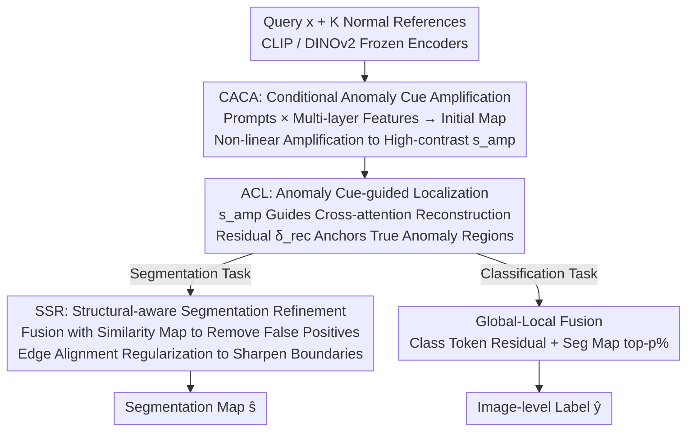

# Defect Cue-Preserved Structural Feature Refinement for Few-Shot Anomaly Detection

**Conference**: CVPR 2026  
**Paper**: [CVF Open Access](https://openaccess.thecvf.com/content/CVPR2026/html/Jiang_Defect_Cue-Preserved_Structural_Feature_Refinement_for_Few-Shot_Anomaly_Detection_CVPR_2026_paper.html)  
**Code**: None  
**Area**: Anomaly Detection / Few-Shot Industrial Inspection  
**Keywords**: Few-Shot Anomaly Detection, Defect Cue Fading, Anomaly Cue Amplification, Reconstruction-based Localization, Edge Alignment

## TL;DR
This paper identifies that the core difficulty in few-shot anomaly detection (FSAD) lies in the "dilution" of subtle defect cues layer-by-layer within deep feature extraction pipelines. It proposes DCP-SFR: first using learnable prompts to "amplify" early weak signals into high-contrast anomaly cue maps, then using these maps to guide reconstruction-based localization, and finally performing structural-aware boundary refinement. It achieves an image-level AUROC of 97.3% and a pixel-level AUROC of 98.2% on MVTec AD and VisA.

## Background & Motivation
**Background**: Industrial inspection increasingly relies on automated anomaly detection (AD). Traditional AD requires a large number of annotated defect samples, which are rare on real production lines. Few-shot anomaly detection (FSAD) is more practical as it can be rapidly deployed to new products using only a small set (1/2/4) of normal reference images. Current mainstream FSAD methods fall into three categories: ① Reconstruction-based (e.g., FastRecon, learning normal distributions and identifying anomalies via reconstruction residuals); ② Anomaly synthesis-based (e.g., AnomalyDiffusion, using diffusion models to generate synthetic defects for training set expansion); ③ Feature matching-based (e.g., PatchCore, WinCLIP, AnomalyDINO, calculating difference scores by matching query features with normal reference features in the pre-trained embedding space of CLIP/DINOv2).

**Limitations of Prior Work**: Reconstruction-based methods are limited by the scarcity of reference images, leading to incomplete coverage of normal patterns and high false alarm rates in complex scenarios. Synthesis-based methods suffer from domain gaps between synthetic and real defects, which contaminates defect representation learning. Feature matching-based methods treat FSAD as a one-time, static "matching problem," using a fixed set of feature representations to calculate difference scores.

**Key Challenge**: The authors attribute the root cause of the difficulty in anomaly detection to a phenomenon overlooked by previous work—**defect cue fading**: subtle, defect-related cues are inherently weak and are gradually submerged by background noise and lost layer-by-layer within multi-stage deep feature extraction pipelines. This manifests as localization drift and blurred boundaries. Fixed-representation matching methods lack mechanisms to counteract this progressive decay.

**Goal**: To "preserve and strengthen" defect-related structural information throughout the entire pipeline, decomposed into three tasks: amplifying weak signals at the early stage, anchoring attention to true anomaly regions during localization, and accurately aligning boundaries during segmentation.

**Key Insight**: Cues in the early stages are the most critical (as they decay further down the pipeline). Therefore, rather than calculating difference scores at the very end, it is better to actively amplify potential anomaly signals at the front end and use this amplified "anomaly cue map" as dynamic guidance throughout each subsequent step.

**Core Idea**: Use an "amplified high-contrast anomaly cue map" to dynamically guide the entire detection process—amplifying weak signals → guiding reconstruction-based localization → performing structural-aware boundary refinement to counteract the progressive fading of defect cues.

## Method

### Overall Architecture
DCP-SFR simultaneously handles two sub-tasks: image-level classification (normal/anomaly) and pixel-level anomaly segmentation. The input consists of a query image $x$ and $K$ normal reference images $\{x'_k\}$, and the output consists of an image-level label $\hat{y}$ and a segmentation map $\hat{s}$. The backbone utilizes two frozen pre-trained models: CLIP (image encoder $E_I$ + text encoder $E_T$) and DINOv2 (image encoder $E_D$). The backbones are not fine-tuned; only a few newly added modules are trained from scratch.

The pipeline is serialized into three stages: **CACA (Conditional Anomaly Cue Amplification)** first calculates an initial anomaly score map using multi-layer patch features and learnable prompts, then non-linearly amplifies it into a high-contrast cue map $s_{amp}$; **ACL (Anomaly Cue-guided Localization)** uses $s_{amp}$ as spatial guidance to reconstruct the query features into an "anomaly-free version" via stacked cross-attention, accurately locating anomalies based on the residual $\delta_{rec}$ between original and reconstructed features; **SSR (Structural-aware Segmentation Refinement)** merges $\delta_{rec}$ with a similarity regularization map to remove false positives and applies edge-alignment regularization to sharpen boundaries. The segmentation task utilizes patch features (preserving spatial position), while the classification task utilizes class tokens (aggregating global context). Both share the CACA+ACL processing core, with the classification side further performing global-local fusion.

### Key Designs

**1. CACA: Conditional Anomaly Cue Amplification — Boosting Weak Signals Early**

Addressing the "cues fade as they go deeper" pain point, CACA does not remedy the issue at the end but preserves and amplifies defect signals from the shallow layers. It extracts patch features $f_{p,j}$ from multiple intermediate layers of the CLIP image encoder (layers 6, 12, 18, 24; $m=4$), avoiding the loss of early cues caused by using only deep features. Simultaneously, a pair of learnable prompts is designed: $p_{normal}=[U_1]\dots[U_n]$ and $p_{anomaly}=[T_1]\dots[T_n][\text{damaged}]$. The latter uses the word `[damaged]` as a semantic anchor to provide a general "anomaly" prior, while the learnable vectors $[T_i]$ adapt to diverse and subtle defect patterns in specific tasks. The text encoder maps prompts into embeddings $f_c=E_T(p_c)$, which are then compared with patch features from each layer using cosine similarity to obtain the initial anomaly map:

$$s_{init} = \frac{1}{m}\sum_{j=1}^{m}\frac{\exp(\langle f_{anomaly}, f_{p,j}\rangle/\tau)}{\sum_{c\in C}\exp(\langle f_c, f_p,j\rangle/\tau)}$$

where $\langle\cdot,\cdot\rangle$ denotes cosine similarity and $\tau$ is the temperature; averaging multi-layer results ensures robustness. The key lies in the subsequent "amplification": a non-linear transformation $A$ reshapes $s_{init}$ into $s_{amp}=\frac{1}{1+e^{-A(s_{init})}}$. The role of $A$ is to amplify even the weakest anomaly responses while suppressing values in normal regions, thereby widening the contrast between anomaly and normal areas. This high-contrast map $s_{amp}$ serves as the spatial guidance signal for subsequent modules.

**2. ACL: Anomaly Cue-guided Localization — Anchoring True Anomalies to Prevent Reconstruction Drift**

While amplification "highlights" potential defects, precise localization is still required. ACL's strategy is to use $s_{amp}$ to guide a reconstruction process: under the condition of normal reference features, query features are reconstructed into an "anomaly-free version." Parts that cannot be reconstructed are considered defects. It utilizes stacked cross-attention, using DINOv2's fine-grained query features $g_p$ as the query and the mean of $K$ reference features $\bar{g}'_p$ as the key/value (providing a stable reference for normal patterns):

$$f^0_{rec} = \Upsilon(W^0_Q g_p,\, W^0_K \bar{g}'_p,\, W^0_V \bar{g}'_p)$$

The result is passed through $N_r$ layers of progressive refinement. Before entering each layer's query, spatial modulation is applied using the anomaly cue: $\hat{f}^{(z-1)}_{rec}=f^{(z-1)}_{rec}\odot(1-s_{amp})$. The term $(1-s_{amp})$ suppresses regions indicated as anomalies, forcing the current layer to rely more heavily on the normal reference features $\bar{g}'_p$ for reconstruction. This "anchoring" is crucial: regions labeled as anomalies are prevented from copying their original features, thereby avoiding the reconstruction of the anomalies themselves, which would cause localization drift. The final reconstructed feature $f^{N_r}_{rec}$ is compared with the original feature via L1 distance to obtain the residual map $\delta_{rec}=\|g_p-f^{N_r}_{rec}\|_1$, precisely indicating the defect location. PCA visualization shows that after localization, normal features collapse into tight clusters near the origin while anomaly features remain scattered, indicating the learning of a discriminative feature space.

**3. SSR: Structural-aware Segmentation Refinement — Removing False Positives & Accurate Boundary Alignment**

The residual map $\delta_{rec}$ might still contain false positives due to normal texture variations or have rough boundaries. SSR performs two actions. First, it filters false positives using non-parametric similarity matching: all reference patch features are clustered into a memory bank $M$. For each query token, the maximum cosine similarity with the bank is calculated as $\Psi(l)=\max_{t\in M}\langle g_p(l),t\rangle$, and a regularization map $s_{cos}=1-\Psi$ is derived (where patterns similar to normal ones result in scores closer to 0 and are suppressed). The final segmentation map is a weighted fusion of both: $\hat{s}=\delta_{rec}+\lambda s_{cos}$. $\delta_{rec}$ is sensitive (ensuring high recall for potential anomalies), while $s_{cos}$ is precise (rejecting false positives), making them complementary. Second, a structural alignment regularization is applied to improve contour fidelity. Edge maps are extracted from both the prediction and the ground truth using an edge extractor $O(\cdot)$: $\hat{s}_{edge}=O(\hat{s})$ and $s_{edge}=O(s)$. An edge consistency loss in Dice form is then applied:

$$L_C = \mathbb{E}_x\left[1-\frac{2\sum_i \hat{s}^{edge}_i s^{edge}_i + \zeta}{\sum_i(\hat{s}^{edge}_i)^2+\sum_i(s^{edge}_i)^2+\zeta}\right]$$

This directly optimizes edge alignment, with $\zeta$ preventing division by zero. Ablation studies found that SSR also accelerates convergence and leads to a better local optimum.

### Loss & Training
The classification side performs global-local fusion: the global score is obtained by comparing class tokens with prompt embeddings and passing them through a reconstruction + lightweight adapter $C$ to get $\hat{y}_{global}=C(\eta_{rec})$ (where $\eta_{rec}=\|g_{cls}-g''_{cls}\|_1$). The local score is obtained by a lightweight network $\kappa(\cdot)$ that reads the segmentation map $\hat{s}$ to predict a sampling ratio $p=\kappa(\hat{s})$, calculating the mean of the top-$p\%$ pixels in $\hat{s}$ as $\hat{y}_{local}$. The final score is $\hat{y}=\hat{y}_{global}+\mu\hat{y}_{local}$. Cross-entropy $L_{CE}$ is used for classification. For segmentation, as anomaly regions are much smaller than normal ones, a combination of focal loss $L_{Focal}$ and Dice loss $L_{Dice}$ is used. The total objective is:

$$\min_{\Theta}\; L_{CE} + L_{Focal} + L_{Dice} + \beta L_C$$

All trainable components are trained from scratch, while the backbones remain frozen. Prompt length is 12, trained for 25 epochs with a batch size of 8 using Adam with a learning rate of 0.01; $\lambda=1.0,\ \mu=2.0,\ \alpha=0.9,\ \beta=2.0$.

## Key Experimental Results

Datasets: MVTec AD and VisA (27 categories of industrial products with pixel-level annotations). Baselines: WinCLIP+, APRIL-GAN, AnomalyGPT, PromptAD, InCTRL, AnomalyDINO. Evaluations include image-level (i-AUROC/i-AUPR/i-F1-max) and pixel-level (p-AUROC/p-PRO/p-F1-max/p-AP) metrics under 1/2/4-shot settings.

### Main Results

Core metrics under the 1-shot setting (bold indicates best performance, units in %):

| Dataset · Task | Metric | DCP-SFR | AnomalyDINO | PromptAD |
|------|------|------|------|------|
| MVTec AD Classification | i-AUROC | **97.3** | 96.6 | 94.6 |
| MVTec AD Segmentation | p-AUROC | **96.9** | 96.8 | 95.9 |
| MVTec AD Segmentation | p-AP | **61.2** | 56.5 | 53.9 |
| VisA Classification | i-AUROC | **92.0** | 87.4 | 86.9 |
| VisA Segmentation | p-AUROC | **98.2** | 97.8 | 96.7 |

Further improvements are observed under the 4-shot setting: MVTec AD reaches i-AUROC 98.0 / p-AUROC 97.5; VisA segmentation p-F1-max increases from 44.9% in 1-shot to 47.1% in 4-shot, demonstrating the model's ability to effectively leverage more reference images. The representative conclusions are image-level AUROC 97.3% and pixel-level AUROC 98.2% (attained in the best-performing 1-shot scenarios). In the 1-shot setting, MVTec AD segmentation AP is approximately 5 percentage points higher than AnomalyDINO, reflecting robustness under extremely few references.

### Ablation Study

Removing modules one-by-one under the VisA 1-shot setting (units in %):

| Config | i-AUROC | p-AUROC | p-F1-max | p-AP | Description |
|------|------|------|------|------|------|
| DCP-SFR (Full) | 92.0 | 98.2 | 44.6 | 39.9 | Full model |
| w/o CACA | 91.5 | 97.4 | 43.2 | 39.0 | No cue amplification; weaker on small/low-contrast anomalies |
| w/o ACL | 89.7 | 96.7 | 41.3 | 37.7 | Largest drop; significant loss in localization and background suppression |
| w/o SSR | 91.1 | 97.1 | 41.0 | 35.0 | Worse boundaries/false positives and slower convergence |

### Key Findings
- **ACL contributes the most**: Removing it dropped p-AP from 39.9% to 37.7% and i-AUROC from 92.0 to 89.7—the largest drop among all modules. This confirms that "cue-guided reconstruction localization" is the core of precise localization and background suppression. PCA plots show a clear difference in the separability of normal and anomaly features with vs. without ACL.
- **CACA manages "spotting subtle defects"**: Removing it reduced p-F1-max from 44.6% to 43.2%, with a noticeable impact on small targets and low-contrast defects. Feature visualization confirms it indeed amplifies subtle anomalies while suppressing background noise.
- **SSR improves both precision and convergence**: Removing it dropped p-AUROC from 98.2% to 97.1% and p-AP from 39.9% to 35.0% (directly affecting boundaries and false positives). Furthermore, the full model converges faster and stays at a superior solution.
- **Cross-domain generalization**: Maintaining an advantage when training on MVTec AD and testing on VisA (and vice versa) indicates that the defect cue preservation strategy does not depend on specific data distributions.

## Highlights & Insights
- **Explicitly modeling "defect cue fading" as a problem**: While previous work assumed feature comparison sufficed, this paper highlights that deep pipelines progressively lose weak signals and designs a "front-end amplification → full-pipeline guidance" anti-fading strategy. The problem definition itself is a contribution.
- **The $(1-s_{amp})$ spatial modulation is a reusable trick**: Multiplying the inverted amplified anomaly cue into the reconstruction query forces the model to rely solely on normal references at anomaly locations. This prevents the "anomaly being reconstructed" effect—an idea transferable to other reconstruction-based localization tasks.
- **Complementary fusion of recall and precision**: $\hat{s}=\delta_{rec}+\lambda s_{cos}$ combines the highly sensitive reconstruction residual with high-precision similarity regularization. One ensures nothing is missed, the other ensures no mistakes are made—a simple but effective engineering design.
- **Edge Dice regularization for direct contour optimization**: While most AD methods optimize only at the pixel classification level, this work adds a consistency loss on the edge map, directly addressing the "blurred boundary" pain point of FSAD.

## Limitations & Future Work
- Strong dependence on the simultaneous use of two large backbones (CLIP + DINOv2). The inference cost and VRAM usage were not discussed (⚠️ inference speed/parameter counts were not compared).
- Evaluation is limited to MVTec AD and VisA. Other anomaly detection scenarios like medical or remote sensing were not covered; "cross-domain generalization" was only validated between two industrial domains.
- The margin over AnomalyDINO in pixel-level F1-max / AP for VisA 1-shot is small, indicating that the gains from amplify-locate-refine might hit a ceiling under extremely few samples and complex backgrounds.
- Multiple hyperparameters ($\lambda, \mu, \alpha, \beta$, prompt length, structure of amplification network $A$) require manual setting. Although the authors claim convergence without heavy tuning, the robustness of optimal configurations across datasets lacks systematic analysis.

## Related Work & Insights
- **vs AnomalyDINO (Feature matching SOTA)**: AnomalyDINO performs static feature matching in the DINOv2 embedding space. This paper argues that static matching cannot counteract cue fading and replaces it with "dynamic anomaly cue-guided reconstruction localization + edge refinement," outperforming it in most metrics, especially in MVTec AD segmentation AP (by ~5 points).
- **vs FastRecon (Reconstruction-based)**: Pure reconstruction suffers from high false alarms due to incomplete coverage of normal patterns with few references. DCP-SFR uses $s_{amp}$ to guide reconstruction only in normal areas and superimposes similarity regularization to remove false positives, mitigating the high false alarm issue.
- **vs PromptAD / WinCLIP+ (CLIP Prompt Learning)**: These rely on prompts for comparison in CLIP space. DCP-SFR also uses learnable prompts (with `[damaged]` semantic anchors) but only as part of "early amplification," followed by reconstruction localization and structural refinement, forming a multi-stage cue preservation chain rather than a one-time match.

## Rating
- Novelty: ⭐⭐⭐⭐ Explicitly modeling "defect cue fading" and designing an anti-fading chain is a fresh perspective, though individual sub-modules (prompts, cross-attention reconstruction, memory bank, edge loss) are combinations of existing components.
- Experimental Thoroughness: ⭐⭐⭐⭐ Covering two datasets × three shots × seven metrics + module ablation + cross-domain + visualizations is quite comprehensive; however, the lack of inference cost/parameter count and hyperparameter sensitivity analysis is a drawback.
- Writing Quality: ⭐⭐⭐ The logic is clear and formulas are complete, but there are grammatical/spelling flaws in the original text (e.g., inconsistent sub-task descriptions for segmentation), which affects readability.
- Value: ⭐⭐⭐⭐ Sets a new FSAD SOTA on MVTec AD/VisA. The anti-fading + edge alignment approach has practical value for industrial inspection deployment.

<!-- RELATED:START -->

## Related Papers

- [\[ICLR 2026\] Foundation Visual Encoders Are Secretly Few-Shot Anomaly Detectors](../../ICLR2026/anomaly_detection/foundation_visual_encoders_are_secretly_few-shot_anomaly_detectors.md)
- [\[ICLR 2026\] Let OOD Feature Exploring Vast Predefined Classifiers](../../ICLR2026/anomaly_detection/let_ood_feature_exploring_vast_predefined_classifiers.md)
- [\[ICLR 2026\] MRAD: Zero-Shot Anomaly Detection with Memory-Driven Retrieval](../../ICLR2026/anomaly_detection/mrad_zero-shot_anomaly_detection_with_memory-driven_retrieval.md)
- [\[CVPR 2026\] Anomaly-Related Residual Fields for Cross-domain Anomaly Detection](anomaly-related_residual_fields_for_cross-domain_anomaly_detection.md)
- [\[CVPR 2026\] RAID: Retrieval-Augmented Anomaly Detection](raid_retrieval-augmented_anomaly_detection.md)

<!-- RELATED:END -->
