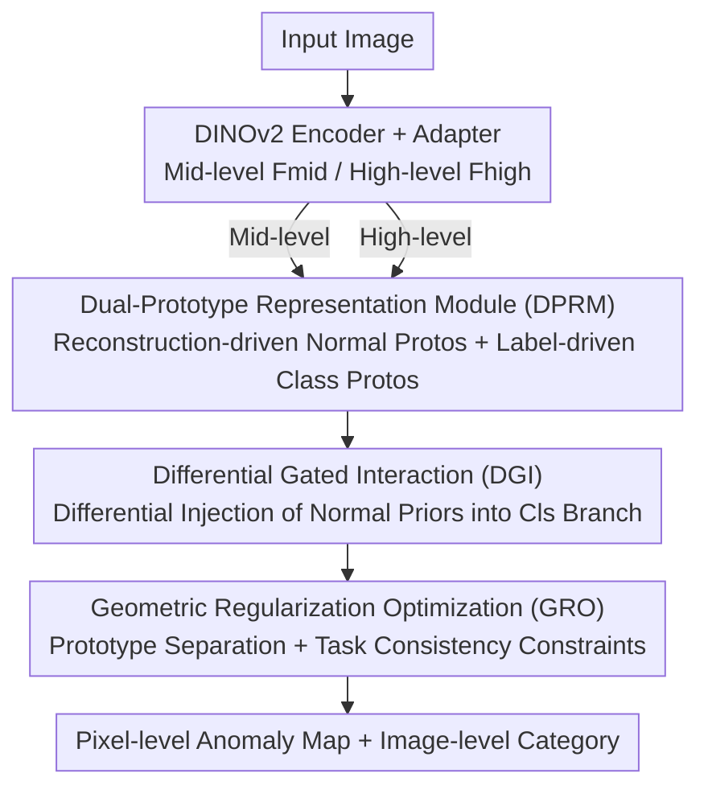

# Dual-Prototype-Guided Multi-task Learning for Unsupervised Anomaly Detection and Classification

**Conference**: CVPR 2026  
**Paper**: [CVF Open Access](https://openaccess.thecvf.com/content/CVPR2026/html/Luo_Dual-Prototype-Guided_Multi-task_Learning_for_Unsupervised_Anomaly_Detection_and_Classification_CVPR_2026_paper.html)  
**Code**: https://github.com/luoqianhao/PG-SFD  
**Area**: Anomaly Detection / Industrial Inspection  
**Keywords**: Unsupervised Anomaly Detection, Anomaly Classification, Prototype Learning, Multi-task Learning, Feature Disentanglement

## TL;DR
PG-SFD models "unsupervised anomaly detection (pixel-level localization) + weakly supervised anomaly classification (region-level classification)" as a dual-prototype collaborative optimization problem. By explicitly decoupling normal/anomaly semantics using normal and category prototypes, injecting normal priors into the classification branch via differential gating, and alleviating multi-task gradient conflicts with geometric regularization, it achieves an I-AUROC of 99.4% on MVTec-AD while supporting fine-grained defect classification.

## Background & Motivation

**Background**: In industrial and medical scenarios, defect perception is often decoupled into two steps: performing Unsupervised Anomaly Detection (UAD, building normal prototypes using only normal samples) to localize anomalous Regions of Interest (ROI) at the pixel level, and then feeding the cropped local patches into an anomaly classifier to determine the defect type. These two tasks are typically trained independently and executed serially.

**Limitations of Prior Work**: The authors identify two critical flaws in the serial paradigm. The first is **Local Visual Ambiguity (LVA)**: different categories of defects often appear nearly identical in local regions (e.g., "steel adhesion vs. guide mark"). Since UAD relies solely on normal sample modeling, it suffers from blurred anomaly boundaries and unclear thresholds, leading to missing subtle anomalies. Meanwhile, the classifier only sees local views cropped by UAD, losing global context and failing to distinguish locally similar but semantically different defects. The second is the **Inability to Transfer Knowledge**: the vast "normal pattern priors" learned during the UAD stage are disconnected from the global context after cropping and cannot be passed to the classifier.

**Key Challenge**: A natural solution is end-to-end Multi-task Learning (MTL), leveraging shared features for mutual benefit. However, standard MTL is inapplicable here due to **Incompatible Feature Preferences**: UAD requires mid-level features that preserve detail for precise localization, while anomaly classification requires highly abstract high-level semantic features. Optimizing both in a shared space leads to gradient conflicts, resulting in inaccurate ROIs and misalignment between features and supervision signals.

**Goal / Key Insight**: The authors advocate shifting from "implicit feature sharing" to "explicit feature disentanglement"—harnessing the complementary information of MTL while explicitly managing feature conflicts.

**Core Idea**: The UAD and anomaly classification tasks are modeled as a **Dual-Prototype Collaborative Optimization** problem. The model simultaneously learns a set of **Normal Prototypes** driven by unsupervised reconstruction and a set of **Category Prototypes** driven by image-level weak labels. These prototypes explicitly separate normal/anomaly semantics and inter-class semantics in the feature space. Combined with cross-task differential injection and geometric regularization, the framework achieves end-to-end joint inference for pixel-level detection and image-level classification.

## Method

### Overall Architecture

The backbone of PG-SFD (Prototype-Guided Semi-Supervised Feature Disentanglement) is a self-supervised pretrained ViT encoder (DINOv2 ViT-Small was found to be optimal). The hierarchical structure of ViT naturally produces multi-level features: **mid-level features $F_{mid}(x)$** balancing spatial detail and semantics are fed to the UAD branch for pixel-level localization; **high-level features $F_{high}(x)$** with the strongest semantic abstraction are fed to the classification branch. Each feature path is adapted via an adapter.

Three core modules operate in sequence: **DPRM** constructs category prototypes $p^c$ and normal prototypes $p^a$ to decouple semantics; **DGI** uses a gating mechanism to inject normal prototypes as discriminative priors into the classification branch; **GRO** applies geometric constraints during optimization to "push apart" disentangled feature structures and alleviate gradient conflicts.

### Key Designs

**1. Dual-Prototype Representation Module (DPRM): Explicitly Decoupling Normal and Anomaly Semantics**

This is the foundation of the work, directly addressing the "normal-anomaly semantic entanglement" caused by LVA. The authors define two sets of prototypes: category prototypes $p^c \in \mathbb{R}^{d \times N}$ ($N$ classes) and normal prototypes $p^a \in \mathbb{R}^{d \times K}$ ($K$ is a hyperparameter for the normal prototype space). Both are learned via distinct signals to separate the two types of semantics.

**Normal Prototypes** follow an unsupervised reconstruction route: a lightweight reconstruction head $R(\cdot)$ predicts $\hat{y} = R(F_{mid}(x))$, yielding an error map $E(x) = \|x - \hat{y}\|_2$. High-error positions indicate potential anomalies. Feature vectors from $F_{mid}(x)$ corresponding to the top-$T$ error pixels are used to update $p^a$ via momentum:

$$p^a \leftarrow p^a + (1-m)\cdot \mathrm{Mean}\big(\{f_{patch} \mid E_{patch} > \theta\}\big)$$

where $m$ is the momentum coefficient and $\theta$ is the error threshold. This allows normal prototypes to "understand the deviation of anomaly regions relative to normal patterns." **Category Prototypes** are supervised by image-level weak labels: Global Average Pooling (GAP) of high-level features yields $f_{global} = \mathrm{GAP}(F_{high}(x))$. The cosine similarity $s_c(x) = \cos(f_{global}, p^c_n)$ is calculated, and standard cross-entropy $L_{cls}$ with temperature $\tau$ pulls samples toward their respective prototype centers. Compared to methods using a single "normal class prototype" (e.g., CFA, ProtoAD), dual prototypes accommodate the semantic diversity of anomalies and support multi-class discrimination.

**2. Differential Gated Interaction (DGI): Differential Injection of Normal Priors to Amplify Anomaly Differences**

While normal prototypes are rich in normal features, the classification branch requires discriminative ability between anomaly classes. DGI addresses "how to usefully feed normal priors to classification instead of simple concatenation." It takes $p^a$ and adapted high-level features $F'_{high}(x)$ as input. $p^a$ is upsampled to $\hat{p}^a$ to align with $F_{high}$. A differential gated response is computed pixel-wise:

$$\Delta F = \sigma\big(\mathrm{MLP}(\hat{p}^a - F'_{high}(x))\big)$$

where $\sigma$ is the sigmoid function. The fused feature is $F_{fused} = \Delta F \odot F_{high} + (1-\Delta F)\odot \hat{p}^a$. The elegance of this differential design lies in its adaptive behavior: for **normal samples**, high-level features and normal prototypes are similar, $\Delta F \to 0.5$ for balanced fusion; for **anomalous samples**, high-level features contain discriminative context, $\Delta F \to 1$, preserving discriminative information. This allows the model to "retain details for fine-grained localization and focus on global semantics for classification," achieving adaptive feature disentanglement.

**3. Geometric Regularization Optimization (GRO): Active Feature Space Expansion to Alleviate Gradient Conflicts**

While previous modules handle representation and interaction, MTL gradient conflicts persist. GRO actively adds geometric constraints to the feature space during optimization. It includes two losses. The **Prototype Separation Loss** constrains the minimum cosine distance between the two sets of prototypes, forcing local features of normal samples to cluster near their weighted category prototype centers to enhance semantic consistency:

$$L_{sep} = \frac{1}{C\cdot K}\sum_{c=1}^{C}\sum_{k=1}^{K} \exp\big(-\tau\cdot(1-\cos(p^c_n - p^a_k))\big)$$

The **Task Consistency Loss** prevents distribution shifts between detection and classification features. A projection $\phi(\cdot)$ aligns reconstruction features $f_{rec}$ with classification features $f_{cls}$ via $L_{cons} = \|f_{cls} - \phi(f_{rec})\|_1$. The total objective is:

$$L = \lambda_{rec}L_{rec} + \lambda_{cls}L_{cls} + \lambda_{sep}L_{sep} + \lambda_{cons}L_{cons}$$

Ablations show GRO is the key factor in boosting I-AUROC from 93.8% to 99.4%.

### Loss & Training

The total loss is the weighted sum of four terms: reconstruction $L_{rec}$, classification $L_{cls}$, prototype separation $L_{sep}$, and task consistency $L_{cons}$. Training uses a DINOv2 ViT-Small encoder, input resized to $448 \times 448$, StableAdamW optimizer with weight decay $1 \times 10^{-4}$, and initial learning rates of $1 \times 10^{-3}$ and $5 \times 10^{-3}$ for the UAD and classification modules, respectively. A **three-stage curriculum learning** strategy is employed: all loss terms are activated for joint optimization only after the 60th epoch, allowing individual branches to stabilize first and avoid initial multi-task conflicts.

## Key Experimental Results

The dataset covers industrial and medical domains: MVTec-AD, a self-collected Hot-Rolled Steel Pipe (IHSP) dataset (4 defect types, 13,321 training / 1,100 test) for fine-grained classification; VisA (general objects) and Uni-Medical (medical) for binary label generalization. To evaluate the ability to work with "few anomalous samples," anomalies in public datasets were re-split into 2:8 (train/test). Metrics include AUROC / AP / F1 / P-AUPRO for detection and Cls-Acc / Cls-F1 for classification.

### Main Results (Unified Anomaly Perception on MVTec-AD)

| Method | Protocol | I-AUROC↑ | P-AUPRO↑ | Cls-ACC↑ | Cls-F1↑ |
|:---|:---|:---:|:---:|:---:|:---:|
| Dinomaly | Normal only | 99.1 | 95.7 | N/A | N/A |
| INPformer | Normal only | 99.3 | **96.0** | N/A | N/A |
| DinoCLS | Image labels | N/A | N/A | 63.3 | 60.9 |
| Two-Stage* | Normal + Image | — | — | 54.7 | 48.5 |
| AnomalyCLIP | Normal + Prompt | 94.6 | 87.8 | N/A | N/A |
| **PG-SFD (Ours)** | Normal + Image | **99.4** | 95.6 | **64.7** | **61.6** |

\*Two-Stage uses INPformer for UAD followed by classification on detected ROIs. PG-SFD is the only framework providing comprehensive detection and classification metrics. It reaches SOTA in detection (I-AUROC) and matches the best pure UAD methods in P-AUPRO (95.6% vs. 96.0%), demonstrating that feature disentanglement does not sacrifice localization precision. In classification, its Cls-F1 (61.6%) outperforms the serial Two-Stage approach (48.5%) by 13.1 points.

### Key Findings
- **DPRM enables localization**: The baseline P-AUPRO was only 20.5% due to multi-task conflict; adding DPRM boosted it to 94.5%, proving explicit dual-prototype decoupling is key.
- **DGI focuses on classification**: Adding DGI to the DPRM version improved Cls-F1 by 4.3%, showing the benefit of cross-task semantic guidance.
- **GRO provides the final leap**: Geometric regularization pushed I-AUROC from 93.8% to 99.4% by suppressing residual gradient conflicts.
- **Normal Protocol Dimension $K=6$ is optimal**: This size balances representation capacity and feature compactness.
- t-SNE visualizations show normal samples tightly clustered around normal prototypes while anomaly classes are pushed into independent clusters, confirming that explicit disentanglement occurs in the feature space.

## Highlights & Insights
- **Reformulating "detection + classification" as dual-prototype collaborative optimization** provides a clean perspective: normal prototypes handle "deviation from normality," while category prototypes handle "which anomaly type." The two supervision signals naturally correspond to the two sets of prototypes, preventing semantic interference common in implicit sharing.
- **Innovative Differential Gated Interaction (DGI)**: Using the difference between $\hat{p}^a$ and $F'_{high}$ as a gate allows the network to adaptively decide between preserving detail or aggregating semantics based on the input. This is transferable to other multi-task scenarios requiring adaptive feature granularity.
- **Curriculum Learning + Geometric Regularization set a precedent**: Deferring joint optimization and using GRO to actively expand the feature space is a robust engineering practice for alleviating MTL gradient conflicts.

## Limitations & Future Work
- **Dependency on image-level labels**: Category prototypes require image-level annotations, making the framework currently inapplicable to purely unsupervised or zero-shot scenarios.
- **Fine-grained advantage requires fine-grained labels**: In datasets like VisA with binary labels, the classification advantage is less pronounced; the method's "sweet spot" is industrial data with fine-grained defect annotations.
- Several loss formulas (specifically subscript mapping in $L_{sep}$ and alignment details for $\hat{p}^a$) are briefly described and require reference to the official code for exact replication.
- The private IHSP dataset has not been fully detailed, making the 99.9% I-AUROC difficult to benchmark externally.

## Related Work & Insights
- **vs. Pure UAD (PatchCore / Dinomaly / INPformer)**: These use a single normal prototype and cannot classify; PG-SFD supports multi-class discrimination with competitive localization accuracy.
- **vs. Two-Stage Weakly Supervised Classification (CutPaste / WinCLIP)**: Serial ROI cropping breaks context; PG-SFD's end-to-end joint inference yields a 13.1 point Cls-F1 gain.
- **vs. MTL Unified Methods (DRAEM / AnomalyCLIP)**: DRAEM relies on synthetic anomalies, and AnomalyCLIP relies on text-image alignment with limited detection precision. Both use implicit feature sharing, whereas PG-SFD utilizes explicit feature disentanglement and geometric regularization.

## Rating
- Novelty: ⭐⭐⭐⭐ Dual-prototype optimization + differential gating provides a rare and clear explicit modeling of detection/classification conflicts.
- Experimental Thoroughness: ⭐⭐⭐⭐ Solid across industrial and medical domains with ablation; private data and saturated metrics are minor downsides.
- Writing Quality: ⭐⭐⭐ Motivation and framework are clear, but some loss symbols are overly simplified.
- Value: ⭐⭐⭐⭐ High practical value for industrial inspection where integrated localization and classification are required.

<!-- RELATED:START -->

## Related Papers

- [\[CVPR 2026\] Multi-Prototype Compactness and Boundary-Aware Synthesis for Unsupervised Anomaly Detection](multi-prototype_compactness_and_boundary-aware_synthesis_for_unsupervised_anomal.md)
- [\[CVPR 2026\] Hunting Normality from Query Sample via Residual Learning for Generalist Anomaly Detection](hunting_normality_from_query_sample_via_residual_learning_for_generalist_anomaly.md)
- [\[CVPR 2026\] RAID: Retrieval-Augmented Anomaly Detection](raid_retrieval-augmented_anomaly_detection.md)
- [\[CVPR 2026\] LayoutAD: Exploring Semantic-Geometric Misalignment Reasoning for Scene Layout Anomaly Detection](layoutad_exploring_semantic-geometric_misalignment_reasoning_for_scene_layout_an.md)
- [\[CVPR 2026\] Anomaly-Related Residual Fields for Cross-domain Anomaly Detection](anomaly-related_residual_fields_for_cross-domain_anomaly_detection.md)

<!-- RELATED:END -->
