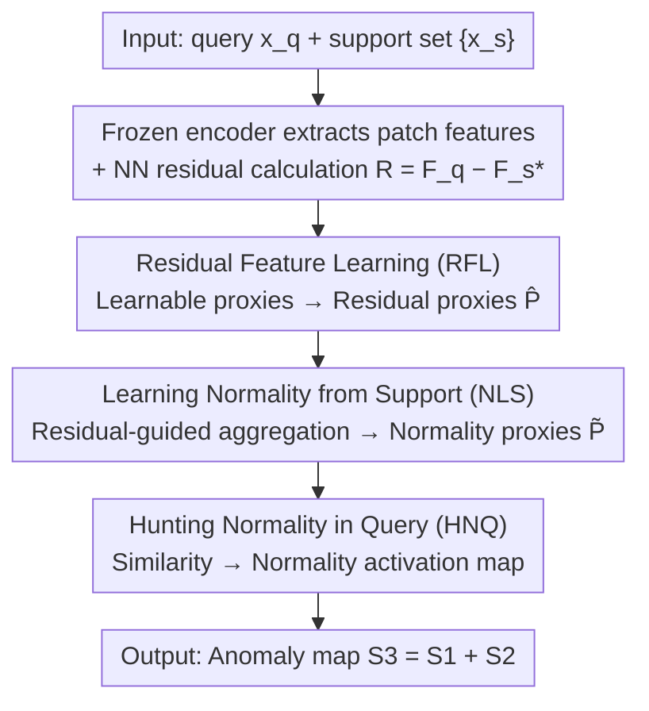

# Hunting Normality from Query Sample via Residual Learning for Generalist Anomaly Detection

**Conference**: CVPR 2026  
**Paper**: [CVF Open Access](https://openaccess.thecvf.com/content/CVPR2026/html/Wang_Hunting_Normality_from_Query_Sample_via_Residual_Learning_for_Generalist_CVPR_2026_paper.html)  
**Code**: The paper mentions "Code is available at HNQ-GAD" (⚠️ Refer to the original text/project page for the full repository link)  
**Area**: Anomaly Detection / Few-Shot Learning  
**Keywords**: Generalist Anomaly Detection, Residual Features, Cross-Domain Generalization, Attention Proxies, Normality Modeling

## TL;DR
Addressing the issue in Generalist Anomaly Detection (GAD) where "directly modeling residual distributions" leads to misjudgments due to inconsistency between residuals and instance features, Ours no longer classifies residuals directly. Instead, it treats residuals as a **guide**: learnable proxies extract patterns from residuals (RFL), then these residual proxies aggregate query-related "normality proxies" (NLS) from the support set. Finally, these normality proxies are used to **search for normal regions** (HNQ) within the query features to locate anomalies. Ours achieves competitive few-shot performance on cross-domain benchmarks including Industrial→Industrial and Industrial→Medical.

## Background & Motivation

**Background**: Traditional Anomaly Detection (AD) follows a one-model-per-category paradigm with single-domain training/testing, requiring retraining or fine-tuning for unseen classes, which limits transferability. GAD (e.g., InCTRL, ResAD) aims to train a unified model in a source domain that generalizes to unseen classes in target domains. A promising approach involves **residual features**: subtracting the nearest normal features in the support set from the query features to remove class-specific information and obtain a more **class-invariant** space.

**Limitations of Prior Work**: Models like ResAD directly **model the residual distribution**, assuming normal residuals cluster together while anomalous residuals fall outside. However, residuals are only **indirect signals** of anomalies: subtle defects might produce **small residuals** and be misidentified as normal (false negatives), whereas two normal features might produce **large residuals** due to the "diversity of normality" and be misidentified as anomalies (false positives).

**Key Challenge**: An **inconsistency** exists between residuals and instance features—"large difference between query and support" does not necessarily equal "anomaly." Directly drawing boundaries on residual distributions treats an unreliable proxy signal as a criterion, leading to uncontrollable risks.

**Goal**: To leverage the cross-domain transferability of residuals while avoiding the risks of "direct residual distribution modeling," achieving precise anomaly localization even on unseen target domains.

**Key Insight**: Anomaly residual patterns are complex and easily overlap with normal residuals. Rather than struggling to characterize "what anomalies look like," it is better to **focus on the normality within the query**. Since residuals are inherently transferable, they can be used to learn rich residual patterns first. These patterns are then **transferred** to the normal instance space to learn "what normal instances look like." Finally, dynamically generated normal prototypes are used to find normality in the query; whatever remains is anomalous.

**Core Idea**: Transform residuals from "objects to be classified" into "guiding signals"—learn a transferable relationship between "residual patterns ↔ instance-level normality" to **hunt normality** with residuals, rather than directly modeling residual distributions.

## Method

### Overall Architecture
Given a query sample $x^q$ and $K$ normal support samples $\{x^s_k\}$, a frozen encoder (ViT) first extracts patch-level features $F^q, \{F^s_k\}$. For each query patch, a nearest neighbor search is performed in the support set, and subtraction yields residual patch features $R$. Although residuals are class-invariant, they still exhibit inter-instance inconsistency. Thus, RFL uses a set of learnable proxies $P$ via cross-attention to extract residual patterns, outputting residual proxies $\hat P$. NLS then uses $\hat P$ as a guide to aggregate query-related normality proxies $\tilde P$ from support features using residual-guided attention. Finally, HNQ calculates the similarity between normality proxies and query patch features to obtain a normality activation map, which inversely provides the anomaly map. During inference, the same RFL/NLS modules **dynamically** generate new normality proxies for target samples without requiring retraining on the target domain.

### Key Designs

**1. Residuals as Guides instead of Classification Objects: Shifting from "Modeling Residual Distributions" to "Learning Normality via Residuals"**

This is the paradigm shift of the entire paper, addressing the inconsistency between residuals and instance features. Residuals $r=f^q-f^s_*$ (where $f^s_*$ is the nearest neighbor in the support set), while class-invariant, suffer from the fact that "large differences" can represent either anomalies or normal diversity. Directly classifying $R$ causes both missed detections and false positives. Consequently, Ours does not draw decision boundaries for residuals but instead learns a transferable mapping: "residual patterns → instance-level normality." Residuals only serve to **show the way**, while the actual anomaly judgment depends on normal prototypes learned from the support set. Since anomalous residuals are complex and overlap with normal ones, the authors deliberately **characterize only normality**, letting anomalies emerge as the "complement of normality," fundamentally avoiding the modeling of unreliable anomalous residuals.

**2. RFL (Residual Feature Learning): Compressing the Residual Space into Residual Prototypes via Learnable Proxies**

Using patch-wise residuals directly introduces noise and inconsistency. RFL initializes $M$ learnable proxies $P\in\mathbb{R}^{M\times C}$ as the query, with residuals $R$ as the key/value for cross-attention, followed by a self-attention layer to obtain residual proxies $\hat P=\text{SA}_1(\text{Softmax}(Q_1K_1^\top/\sqrt d)V_1)$ (where $Q_1=W^Q_1P, K_1=W^K_1R, V_1=W^V_1R$). Since both key and value come from $R$, $\hat P$ contains information from the entire residual space and can be viewed as **residual prototypes**—aggregating scattered, noisy patch-wise residuals into a few stable, transferable pattern representations.

**3. NLS (Learning Normality from Support): "Translating" Patterns back to the Normal Instance Space via Residual Proxies**

Residual proxies still reside in the residual space and cannot directly determine normality. The core of NLS is **Residual-Guided Attention (RG-Attention)**: $Q_2=W^Q_2\hat P, K_2=W^K_2R, V_2=W^V_2\bar F^s$, where $\bar F^s=\frac1K\sum_k F^s_k$ is the mean of the support features. Attention weights are implicitly calculated from the correlation between "residual proxies $\hat P$ and residual embeddings $R$," and then used to aggregate **support features** $V_2$. This maps the patterns learned in the residual space to the normal instance patterns of the support set, outputting normality proxies $\tilde P=\text{SA}_2(\text{Softmax}(Q_2K_2^\top/\sqrt d)V_2)$ in the **instance feature space**. Crucially, the value is replaced with support features rather than residuals—this step completes the "residual pattern ↔ instance-level normality" transfer, and $\tilde P$ is **dynamically generated** for the current query/support pair rather than being a static distribution.

**4. HNQ (Hunting Normality in Query): Finding Normal Regions via Normality Proxies**

With query-related normality proxies $\tilde P$, similarity is calculated on query patch features to get the normality activation map: $S_0^l=\frac1M\sum_m \frac{f^q_l\cdot\tilde P_m}{\|f^q_l\|\|\tilde P_m\|}$. The initial anomaly map is $S_1=1-S_0$. Another anomaly map $S_2$, based on the NN distance between query and support features, is superimposed to get the final prediction $S_3=S_1+S_2$. Thus, "more similar to normal prototypes → more normal," and the mismatched regions are anomalies. Combining both paths (learned normality + raw NN distance) makes localization more robust, avoiding reliance on a single clue.

### Loss & Training
The framework is trained in an episodic manner (one query + $K$ normal supports of the same class per episode). The localization loss $L_{local}=\text{Focal}(S_3,y^q)+\text{Dice}(S_3,y^q)$ supervises the alignment of the pixel-level anomaly map with GT masks; the image-level loss $L_{global}=\text{BCE}(S_3^*,y^q)$ (where $S_3^*$ is the maximum value of $S_3$) supervises sample-level labels. The total objective is $L=L_{global}+L_{local}$. The encoder remains frozen throughout, and only learnable modules like RFL/NLS are trained. During inference, RFL→NLS is run to dynamically generate normality proxies for target samples without retraining.

## Key Experimental Results

### Main Results
Three benchmarks: MVTec AD, VisA (Industrial), BraTS (Medical). Three transfer settings: VisA→MVTec, MVTec→VisA, MVTec→BraTS (Industrial→Medical). Reports image-level (AUROC/AP/F1-max) and pixel-level (AUROC/PRO/F1-max) metrics for 1/2/4-shot evaluation.

| Setting | Metric | Ours | Prev. SOTA Comparison |
|------|------|------|-----------|
| 1-shot MVTecAD (Train on VisA) | Image AUROC | **96.0** | PromptAD 94.6 / WinCLIP 93.1 / ResAD\* 84.8 |
| 1-shot MVTecAD | Pixel AUROC / PRO | **96.4 / 92.5** | PromptAD 95.9 / 87.9 |
| 1-shot VisA (Train on MVTec) | Image AUROC | **87.3** | PromptAD 86.9 / WinCLIP 83.8 / ResAD\* 80.9 |
| 1-shot VisA | Pixel AUROC / PRO | **97.6 / 91.4** | PromptAD 96.7 / 85.1 |

Note: ResAD\* is the authors' reproduction. The gain in pixel-level PRO is particularly significant (MVTec 1-shot 92.5 vs PromptAD 87.9, VisA 1-shot 91.4 vs 85.1), confirming that "learning normality" is more conducive to **localization**.

### Ablation Study (Varying Shots)

| Config / Shot | Image AUROC (MVTec) | Image AUROC (VisA) | Description |
|------|------|------|------|
| 1-shot Ours | 96.0 | 87.3 | Outperforms PromptAD with one normal reference |
| 2-shot Ours | 97.2 | 88.0 | Stable Gain with more support samples |
| 2-shot ResAD\* | 87.2 | 86.6 | Directly builds residual distribution, lags significantly |
| 4-shot (Trend) | Increasing | Increasing | Follows WinCLIP/PatchCore trend but remains higher |

> ⚠️ Specific 4-shot values for Ours were not fully provided in the snippet (table truncated); only the trend is listed here. Refer to Tab. 1 of the original text for exact numbers.

### Key Findings
- **Highest PRO Gain**: Compared to the single-digit lead in image AUROC, the advantage in pixel-level PRO (+4–6 points) is more prominent, suggesting that "normality activation maps" are especially beneficial for anomaly **region overlap**.
- **Disadvantage of Direct Residual Modeling**: ResAD (modeling residual distributions directly) lags behind Ours in all shot settings, validating the motivation that "residual-instance inconsistency" creates uncontrollable risks.
- **Cross-Domain Utility for Medical Data**: The MVTec→BraTS setting shows that the "residual→normality" relationship trained on industrial data transfers to medical imaging, supporting GAD's claim of universality.

## Highlights & Insights
- **The Perspective Shift of "Hunting Normality" is Clever**: Anomalies are diverse and hard to enumerate, whereas normality is relatively concentrated and modelable. Focusing on normality within the query and treating anomalies as the complement is a pragmatic solution to the "open-category" problem, transferable to open-set segmentation/OOD detection.
- **Residuals Downgraded from Criterion to Guide**: By retaining the cross-domain capability of residuals while "translating" them back to the instance space via two-stage attention (RFL→NLS), Ours avoids the fragility of direct residual classification. This design pattern of "using unreliable signals as guidance rather than direct decision-making" is worth reusing.
- **Dynamic Normality Proxies**: $\tilde P$ is generated in real-time for each query/support pair rather than being a static set of prototypes or a memory bank, making it naturally compatible with unseen classes without retraining.
- **Dual-Map Fusion $S_3=S_1+S_2$**: Complementing learned normality with naive NN distance improves localization robustness at a low cost.

## Limitations & Future Work
- **Dependency on Support Set Quality and Nearest Neighbors**: Residuals are derived from NN searches; if support normal samples differ significantly from the query class or the NN is chosen incorrectly, residuals and subsequent proxies will be biased.
- **Number of Proxies $M$ as a Hidden Hyperparameter**: The number of learnable proxies requires a trade-off between expressiveness and overfitting; the paper does not fully explore its sensitivity.
- **Representation Upper Bound of Frozen ViT**: The encoder is frozen throughout; if the target domain is too far from the pre-training distribution, the patch features themselves may lack discriminative power.
- **Pixel-level F1-max is Not Completely Dominant**: In some settings, the F1-max of Ours is slightly lower than WinCLIP/PromptAD, indicating room for improvement in hard decision thresholding.

## Related Work & Insights
- **vs. ResAD**: Both use residuals, but ResAD directly learns residual distributions and assumes anomalies fall outside clusters. Ours points out that residual-instance inconsistency causes missed/false detections and switches to using residuals to **guide** normality learning, achieving 97.2 vs. 87.2 image AUROC on MVTec (2-shot).
- **vs. InCTRL**: InCTRL first proposed GAD using residual distances to judge anomalies, essentially "scoring residuals directly." Ours treats residuals as a guide to dynamic normal prototype generation, leading to more stable generalization and localization.
- **vs. WinCLIP / PromptAD (CLIP-based Few-Shot)**: These rely on text-prompt alignment for zero/few-shot AD. Ours does not rely on language priors but on residual-guided normality modeling, surpassing them in pixel-level PRO with a complementary technical route.

## Rating
- Novelty: ⭐⭐⭐⭐ The perspective shift of "residuals as guides, focus on query normality" is innovative, though RFL/NLS use standard cross/self-attention proxy blocks.
- Experimental Thoroughness: ⭐⭐⭐⭐ Three benchmarks + Industrial→Medical cross-domain + 1/2/4-shot coverage is relatively complete; some 4-shot values and finer ablations are slightly missing in the main text.
- Writing Quality: ⭐⭐⭐⭐ Motivation (residual inconsistency) is clearly argued, illustrations are sufficient, though some mathematical notation is occasionally complex.
- Value: ⭐⭐⭐⭐ Identifies a real problem in "residual-based GAD" and provides a pragmatic solution with practical value for anomaly localization in unseen classes.

<!-- RELATED:START -->

## Related Papers

- [\[CVPR 2026\] Anomaly-Related Residual Fields for Cross-domain Anomaly Detection](anomaly-related_residual_fields_for_cross-domain_anomaly_detection.md)
- [\[NeurIPS 2025\] Normal-Abnormal Guided Generalist Anomaly Detection](../../NeurIPS2025/object_detection/normal-abnormal_guided_generalist_anomaly_detection.md)
- [\[CVPR 2026\] Dual-Prototype-Guided Multi-task Learning for Unsupervised Anomaly Detection and Classification](dual-prototype-guided_multi-task_learning_for_unsupervised_anomaly_detection_and.md)
- [\[CVPR 2026\] CHAL: Causal-guided Hierarchical Anomaly-aware Learning for Moving Infrared Small Target Detection](chal_causal-guided_hierarchical_anomaly-aware_learning_for_moving_infrared_small.md)
- [\[CVPR 2026\] Bidirectional Multimodal Prompt Learning with Scale-Aware Training for Few-Shot Multi-Class Anomaly Detection](bidirectional_multimodal_prompt_learning_with_scale-aware_training_for_few-shot_.md)

<!-- RELATED:END -->
