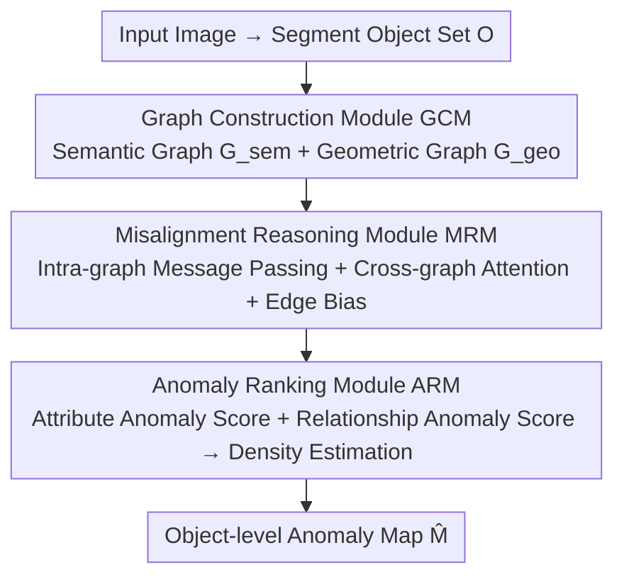

# LayoutAD: Exploring Semantic-Geometric Misalignment Reasoning for Scene Layout Anomaly Detection

**Conference**: CVPR 2026  
**Paper**: [CVF Open Access](https://openaccess.thecvf.com/content/CVPR2026/html/Zeng_LayoutAD_Exploring_Semantic-Geometric_Misalignment_Reasoning_for_Scene_Layout_Anomaly_Detection_CVPR_2026_paper.html)  
**Code**: To be confirmed  
**Area**: Anomaly Detection / Scene Understanding  
**Keywords**: Scene layout anomaly, semantic-geometric misalignment, graph reasoning, unsupervised anomaly detection, object-level reasoning

## TL;DR
LayoutAD proposes a new task "Scene Layout Anomaly Detection," which uses an unsupervised approach to generate object-level anomaly scores for each object in an image. By decomposing the scene into semantic and geometric graphs and reasoning the "misalignment" between them via cross-graph attention, it identifies layout-level hallucinations—such as "a five-legged dog" or "a car parked on a lake"—that are invisible to pixel-level detectors.

## Background & Motivation

**Background**: Visual anomaly detection has historically been divided into two branches. Structural anomaly detection (PatchCore, SimpleNet, DRAEM, etc.) and logical anomaly detection (SINBAD, WinCLIP) focus on pixel-level deviations in industrial or medical scenarios, identifying texture defects and reconstruction residuals. Scene anomaly segmentation (SynBoost, PEBAL, Mask2Anomaly) performs pixel-level OOD segmentation in natural scenes but only investigates the most basic anomaly relationship of "object vs. background."

**Limitations of Prior Work**: These methods almost entirely ignore layout-level anomalies regarding "whether an object's placement is reasonable and whether relationships are consistent." They are sensitive to pixels but blind to high-level semantic/geometric misalignments—such as a dog with five legs or a car driving on a lake. With the popularity of text-to-image models, these "factual defect hallucinations" are increasingly common, yet vanilla models are unable to self-correct.

**Key Challenge**: Judging whether a layout is anomalous essentially requires joint reasoning of both **semantic context** (what the object is and how they interact) and **geometric structure** (where the object is and its spatial arrangement). Pixel-level detectors focus only on local appearance, while hallucination detection methods must rely on text prompts (`prompt-conditioned`), which are often unavailable or meaningless in real photos or surveillance scenarios.

**Goal**: Define and solve a new task—given an image, predict an **object-level anomaly map** $\hat{M}$ to mark the degree of anomaly for each object in terms of semantic rationality and geometric consistency, covering both object attribute anomalies and object relationship anomalies.

**Key Insight**: The authors draw inspiration from the human perception mechanism—humans judge whether a scene is abnormal by simultaneously reasoning about "semantics" and "geometry." Thus, this cognitive intuition is modeled as two complementary graphs that are then aligned with each other.

**Core Idea**: Use "cross-modal misalignment reasoning between semantic and geometric graphs" instead of "pixel reconstruction or prompt alignment" to detect scene layout anomalies in a completely unsupervised manner.

## Method

### Overall Architecture
LayoutAD aims to output a layout anomaly score for each object in a given image. It first uses a pre-trained segmentation model [such as SAM, ⚠️ subject to the original text] to extract an object set $O$. The entire image is represented as the input to the model $\mathcal{D}$, with the goal being $\hat{M} = \mathcal{D}(O)$. The pipeline consists of three sequential modules: the Graph Construction Module (GCM) decomposes the scene into a semantic graph and a geometric graph $\rightarrow$ the Misalignment Reasoning Module (MRM) performs message passing and cross-graph attention within and between the two graphs to identify semantic-geometric inconsistencies $\rightarrow$ the Anomaly Ranking Module (ARM) provides attribute anomaly scores and relationship anomaly scores using density estimation, merging them into a final anomaly score for each object, visualized as an anomaly map.

### Key Designs

**1. Graph Construction Module GCM: Decomposing the Scene into Complementary Semantic and Geometric Graphs**

Pixel-level representations lose the "structural relationships between objects," which are the carriers of layout anomalies. GCM therefore constructs two graphs for the object set $O$: the semantic graph $G_{sem}=(V_{sem}, E_{sem})$ has node features $s_i \in \mathbb{R}^{d_s}$ formed by concatenating CLIP appearance embeddings with category-level text representations, characterizing "what the object is and what it looks like"; the geometric graph $G_{geo}=(V_{geo}, E_{geo})$ has node features $g_i \in \mathbb{R}^{d_g}$ derived from normalized spatial descriptors—centroid position, shape, size, and aspect ratio—characterizing "where the object is and how it is placed." Edge construction employs a hybrid strategy of kNN + distance thresholds to balance local context and long-range interactions: semantic edges are measured by appearance/category embedding similarity, while geometric edges are derived from spatial cues like relative displacement, distance, size ratio, and overlap. Together, the two graphs form a structured "appearance-spatial" representation, providing a foundation for subsequent cross-modal alignment.

**2. Misalignment Reasoning Module MRM: Cross-graph Attention to Capture "Semantically Plausible but Geometrically Misplaced"**

The essence of a layout anomaly is that semantics and geometry **do not match**—the appearance is reasonable but the position is absurd, or the position is reasonable but the semantics conflict. MRM first performs intra-modal message passing: each graph uses GATv2 layers to iteratively update node/edge features, obtaining initial semantic/geometric representations $Z_{sem}, Z_{geo}$; these are then fed into a cross-graph transformer containing self-attention and cross-attention. Self-attention aggregates long-range dependencies within each modality, $\hat{Z}_{sem} = \text{Attn}(Q_{sem}, K_{sem}, V_{sem})$; cross-attention performs bidirectional semantic $\leftrightarrow$ geometric alignment, $\hat{Z}_{sem} = \text{Attn}(Q_{sem}, K_{geo}, V_{geo})$ and $\hat{Z}_{geo} = \text{Attn}(Q_{geo}, K_{sem}, V_{sem})$, allowing the model to explicitly detect inconsistencies between the two modalities. A key addition is the **edge-aware relation bias**: the attention logit is written as

$$\ell_{ij} = \frac{Q_i K_j^\top}{\sqrt{d}} + b_{ij}$$

where $b_{ij}$ encodes the semantic or geometric relationship between object pairs, ensuring the attention respects the layout structure in the graph rather than just looking at feature similarity. After multi-layer reasoning, a learnable aggregation operator $\mathcal{G}(\cdot)$ summarizes a scene-level global feature $z_{global}$, providing overall context for subsequent scoring.

**3. Anomaly Ranking Module ARM: Measuring "Degree of Abnormality" via Conditional Density Estimation**

With the aligned representations, how is it determined if an object is anomalous? The idea of ARM is: normal layouts follow a certain distribution, and anomalies are low-probability events. It uses a Mixture Density Network (Gaussian Mixture) for conditional likelihood estimation. The object attribute anomaly score is the weighted sum of the "negative log-likelihood of one modality conditioned on the other modality + global context":

$$s_i^{attr} = -\lambda_1 \log p(\hat{z}_i^{sem}\mid \hat{z}_i^{geo}, z_{global}) - \lambda_2 \log p(\hat{z}_i^{geo}\mid \hat{z}_i^{sem}, z_{global})$$

where $\lambda_1, \lambda_2$ are learnable, and $p(x|h)=\sum_{k=1}^K \pi_k(h)\mathcal{N}(x\mid \mu_k(h), \text{diag}(\sigma_k^2(h)))$ is a $K$-component Gaussian mixture with parameters predicted by the conditional input $h$. For relationship anomalies, each edge's geometric relationship feature $\hat{r}_{ij}$ is scored under the condition of the semantics of both objects + global context $s_{ij}^{rel} = -\log p(\hat{r}_{ij}\mid \hat{z}_i^{sem}, \hat{z}_j^{sem}, z_{global})$, and aggregated to the object as $s_i^{rel}=\log\sum_{j:(i,j)\in E}\exp(s_{ij}^{rel})$. The final anomaly score is a convex combination of both: $s_i = (1-\alpha)s_i^{attr} + \alpha s_i^{rel}$, where $\alpha$ balances "object-specific abnormality" and "relationship abnormality."

### Loss & Training
Training utilizes two complementary likelihood objectives. The attribute-level loss $\mathcal{L}_i^{attr}$ takes the same form as $s_i^{attr}$ above, encouraging the model to assign higher probabilities to semantically coherent and geometrically reasonable object attributes; the relationship-level loss $\mathcal{L}_{ij}^{rel}=-\log p(\hat{r}_{ij}\mid \hat{z}_i^{sem}, \hat{z}_j^{sem}, z_{global})$ models spatial rationality between objects. The total loss is a weighted sum $\mathcal{L}_{total}=\beta_{attr}\sum_i \mathcal{L}_i^{attr} + \beta_{rel}\sum_{(i,j)\in E}\mathcal{L}_{ij}^{rel}$, implemented with $\beta_{attr}=3.0$ and $\beta_{rel}=1.0$. The entire framework is trained only on normal layouts (unsupervised), where anomalies are low-likelihood events, requiring no anomaly annotations. Training uses a single RTX 4090 card, input $640\times640$, AdamW, learning rate $1\text{e}{-4}$, weight decay $1\text{e}{-4}$, and 30 epochs including a 5-epoch warm-up.

## Key Experimental Results

### Main Results
The authors constructed a new benchmark **COCOAD**: multi-object images with clear spatial arrangements were selected from COCO2017, and Qwen-Image was used in a text-guided mode to insert one or more anomalous objects while preserving camera perspective, background, and original layout, resulting in 1033 anomalous images covering both object attribute and object relationship anomalies. Evaluation metrics: Image-level AUROC (I-AUROC), and for localization, Pixel-level AUROC (P-AUROC) and Anomalous Pixel AUROC (A-P-AUROC, calculating AUROC only on anomalous pixels); for fair comparison, LayoutAD's object-level scores are projected back to pixel space via segmentation masks.

| Method | Paradigm | I-AUROC ↑ | P-AUROC ↑ | A-P-AUROC ↑ |
|------|------|-----------|-----------|-------------|
| PatchCore | Structural AD | 0.539 | 0.571 | 0.565 |
| SimpleNet | Structural AD | 0.551 | 0.571 | 0.515 |
| UCAD | Structural AD | 0.547 | 0.678 | 0.682 |
| UniAD | Structural AD | 0.479 | 0.575 | 0.508 |
| DualAnoDiff | Structural AD | 0.573 | 0.572 | – |
| GeneralAD | Structural AD | 0.543 | 0.565 | 0.314 |
| SynBoost | Anomaly Seg. | 0.542 | 0.773 | 0.777 |
| PixOOD | Anomaly Seg. | 0.538 | 0.720 | 0.722 |
| SINBAD | Logical AD | 0.449 | – | – |
| WinCLIP | Logical AD | 0.455 | 0.54 | – |
| **Ours (LayoutAD)** | Layout AD | **0.586** | **0.871** | **0.883** |

LayoutAD leads across all three metrics: the localization metric P-AUROC is approximately 9.8 percentage points higher than the strongest baseline SynBoost (0.773), and A-P-AUROC is approximately 10.6 percentage points higher. The improvement is particularly significant—demonstrating that anomaly maps produced by object-level semantic-geometric reasoning are far more compact and interpretable than pixel-level methods. While the image-level I-AUROC of 0.586 is not high in absolute terms (due to the difficulty of the task), it still outperforms all baselines.

### Ablation Study
> ⚠️ The following ablation logic is organized based on the paper's framework (GCM/MRM/ARM modules + fusion weight $\alpha$). **Specific values are subject to the original text.**

| Configuration | Key Metric | Description |
|------|---------|------|
| Full model | Optimal | Complete GCM + MRM + ARM model |
| w/o Geometric Graph (Semantic only) | Decrease | Loss of spatial arrangement cues; relationship anomalies undetected ⚠️ |
| w/o Cross-graph Attention | Decrease | Degenerates into two independent branches; fails to capture semantic-geometric misalignment ⚠️ |
| w/o Relationship Branch ($\alpha=0$) | Decrease | Only object attribute anomalies remain; relationship anomalies missed ⚠️ |

### Key Findings
- **Qualitatively, LayoutAD's activations are more "targeted"**: Structural anomaly detectors (e.g., UniAD) only respond to local texture deviations, resulting in scattered activations; logical anomaly methods (e.g., WinCLIP) rely on global semantic priors, highlighting large context areas and missing fine-grained misalignments; segmentation-based methods (PixOOD, SynBoost) often misclassify normal areas as anomalous. LayoutAD accurately activates anomalous objects (e.g., lighting up the "horse" area and suppressing the background), correctly identifying unreasonable object-context relationships.
- **The difference between pixel and object-level paradigms is key**: All baselines perform pixel-level scoring + thresholding, resulting in fragmented results with many artifacts; LayoutAD performs object-level reasoning before projection, making the anomaly maps semantically interpretable and spatially compact, which is the root cause of the significant lead in P-AUROC/A-P-AUROC.
- **Downstream Usability**: The model can support downstream applications such as image anomaly segmentation, video anomaly detection, and self-correcting image generation, suggesting that layout anomaly signals can help generative models correct hallucinations.

## Highlights & Insights
- **The task definition is a contribution in itself**: For the first time, "Scene Layout Anomaly Detection" is isolated from pixel-level deviations, clearly distinguished from visual anomaly detection (low-level pixels) and hallucination detection (relying on prompts), filling the gap in "object-level structural/contextual inconsistency."
- **Dual-graph + Cross-graph Attention modeling aligns well with intuition**: Decomposing the human cognition of "simultaneously looking at semantics and geometry" into two alignable graphs, where misalignment = cross-graph attention failure, makes the mechanism clean and interpretable; the edge-aware bias $b_{ij}$ ensures attention respects the layout structure, which is a reusable trick.
- **Unsupervised + Density Estimation combination**: Training only on normal layouts and converting "anomaly" into "low likelihood" via Mixture Density Networks bypasses the problem that layout anomaly annotations are almost impossible to obtain.
- **Transferability**: The "composition $\rightarrow$ cross-modal alignment $\rightarrow$ density scoring" paradigm can be transferred to any task requiring judgment on "whether the relationship between multiple entities is reasonable," such as scene graph generation quality inspection or robot grasp layout verification.

## Limitations & Future Work
- **Reliance on upstream segmentation quality**: The entire pipeline is built on an object set extracted by a pre-trained segmentation model; missing or incorrect segmentation directly pollutes the graph structure (⚠️ segmenter model details subject to original text).
- **I-AUROC remains relatively low (0.586)**: This indicates that the binary classification task of "judging whether an entire image has an anomaly" is far from solved; the current advantage is primarily in localization rather than image-level determination.
- **Syntheticity of the benchmark**: Anomalies in COCOAD are inserted via Qwen-Image text guidance, which may have a gap with the distribution of naturally occurring layout anomalies in the real world; the scale of 1033 images is also relatively small.
- **Missing ablation data**: This note is based on a truncated cache; the sensitivity of hyperparameters such as $K$ (number of Gaussian components), $\alpha$, and the number of kNN neighbors needs to be supplemented from the original text.

## Related Work & Insights
- **vs. Structural/Logical Anomaly Detection (PatchCore, SINBAD, WinCLIP)**: These perform pixel-level or set-level anomaly detection in industrial/medical scenarios with simple backgrounds. This work shifts to object-level layout anomalies in natural complex scenes, explicitly modeling semantic-geometric relationships between objects, with superior I/P-AUROC.
- **vs. Scene Anomaly Segmentation (SynBoost, PEBAL, Mask2Anomaly)**: These only study "object vs. background" OOD relationships and perform pixel-level scoring + thresholding, resulting in fragmented results; this work performs object-level reasoning, resulting in more compact and interpretable anomaly maps.
- **vs. Hallucination Detection**: Hallucination detection must be prompt-conditioned (comparing generated images with text), while prompts are unavailable in real photos/surveillance; LayoutAD requires no text conditions and reasons layout rationality directly from the image itself.

## Rating
- Novelty: ⭐⭐⭐⭐⭐ Opening a new "Scene Layout Anomaly Detection" task and providing a dual-graph misalignment reasoning framework; the definition is clear and the approach is fresh.
- Experimental Thoroughness: ⭐⭐⭐⭐ Built the COCOAD benchmark and compared ten baselines across three paradigms; localization metrics significantly lead, though image-level AUROC is low and ablation details are missing in the cache.
- Writing Quality: ⭐⭐⭐⭐ The logic from motivation to method to experiment is smooth; formulas are complete, and the task definition is particularly clear.
- Value: ⭐⭐⭐⭐ Provides a new tool for self-correction in text-to-image hallucinations and scene quality inspection; the perspective of object-level layout anomaly has strong extensibility.

<!-- RELATED:START -->

## Related Papers

- [\[CVPR 2026\] Anomaly as Non-Conformity via Training-Free Graph Laplacian Energy Minimization](anomaly_as_non-conformity_via_training-free_graph_laplacian_energy_minimization.md)

<!-- RELATED:END -->
