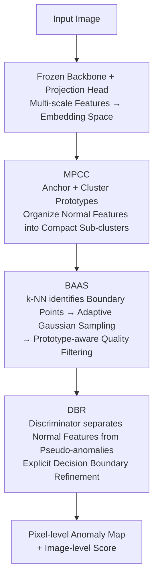

# Multi-Prototype Compactness and Boundary-Aware Synthesis for Unsupervised Anomaly Detection

**Conference**: CVPR 2026  
**Paper**: [CVF Open Access](https://openaccess.thecvf.com/content/CVPR2026/html/Liao_Multi-Prototype_Compactness_and_Boundary-Aware_Synthesis_for_Unsupervised_Anomaly_Detection_CVPR_2026_paper.html)  
**Code**: TBD  
**Area**: Anomaly Detection / Object Detection  
**Keywords**: Unsupervised Anomaly Detection, Multi-prototype, Boundary-aware Synthesis, Feature-level Pseudo-anomalies, Industrial Inspection

## TL;DR
Addressing the issue where the single-prototype hypothesis results in overly loose decision boundaries under high intra-class variance, this paper proposes the PGBL framework. It structures normal features into multiple compact sub-clusters using Multi-Prototype Compactness Constraints (MPCC), synthesizes pseudo-anomalies at the topological boundaries of these sub-clusters (BAAS), and refines the decision surface with a discriminator (DBR). PGBL outperforms previous methods in detection and localization on MVTec-AD, VisA, and Real-IAD.

## Background & Motivation
**Background**: Unsupervised Anomaly Detection (UAD) aims to recognize out-of-distribution samples during inference after being trained only on normal images, representing a core requirement for industrial quality inspection. Embedding-based methods, which map normal samples into a compact feature space under the assumption that anomalies fall outside this space, currently lead in performance. Many methods adopt a **single-prototype hypothesis**, learning a minimum volume hypersphere to encapsulate all normal points.

**Limitations of Prior Work**: Real-world normal data often exhibits **multi-modal distributions and high intra-class variance** due to variations in lighting, pose, and texture. Forcing these diverse samples into a single global manifold leads to two problems: first, decision boundaries become excessively loose, encompassing the gaps between clusters and causing the miss-detection of subtle defects; second, the lack of internal structure in the latent space through a single global constraint risks feature confusion and representation collapse. Although memory bank methods preserve variance by storing numerous features, they lack explicit geometric boundaries and incur high inference overhead.

**Key Challenge**: Existing embedding-based methods suffer from a trade-off: they either force diverse features into an over-generalized global manifold, failing to capture intra-class diversity, or overfit normal data with rigid boundaries, leading to frequent false positives on rare but normal variations or domain-shifted samples.

**Goal**: To retain intra-class sub-structures and learn locally compact representations while establishing a tight, non-linear decision boundary to ensure even minor anomalies are detectable.

**Key Insight**: Instead of a global prototype, normal features should be organized into multiple semantic sub-clusters using a hybrid of "one anchor prototype + multiple cluster prototypes." The topological boundaries between clusters are precisely where anomalies are most likely to appear; thus, **targeted synthesis** of pseudo-anomalies at these boundaries—rather than blind noise addition—can calibrate the decision surface effectively.

**Core Idea**: Replace single-prototype hypersphere modeling with multi-prototype compactness, and refine the decision surface by synthesizing "pain-point" pseudo-anomalies at the sub-cluster boundaries (PGBL = Prototype-Guided Boundary Learning).

## Method

### Overall Architecture
PGBL takes an industrial image as input and outputs a pixel-level anomaly map and an image-level anomaly score. It consists of three sequential modules: **MPCC** uses a frozen backbone to extract features and a trainable projection head to map them into a structured embedding space, organizing features into compact sub-clusters via a two-layer prototype system; **BAAS** identifies cluster boundary points using the cluster assignments from MPCC, synthesizes challenging pseudo-anomalies at these boundaries, and filters out invalid samples via prototype-aware quality checks; **DBR** is a lightweight discriminator trained to separate normal features from synthesized pseudo-anomalies, thereby explicitly calibrating the implicit decision boundary from MPCC. The framework is trained jointly with a total loss $L_{total} = L_{MPCC} + \gamma L_{DBR}$. Only the projection head $G$ and discriminator $D$ are updated, while the backbone $F_\phi$ remains frozen.

### Key Designs

**1. MPCC (Multi-Prototype Compactness Constraints): Capturing Intra-class Variance and Preventing Collapse**

Single-prototype methods fail when intra-class variance is high. MPCC introduces a "dual-layer prototype system": an anchor prototype $a$ maintains overall intra-class cohesion to prevent fragmentation, while $M$ cluster prototypes $P=\{p_m\}_{m=1}^M$ learn discriminative representations for different sub-modes. The projection head $G$ (an MLP with residual connections) maps feature maps to embeddings $z_i^{h,w}=G(f_i^{h,w})$. Each feature vector is assigned to the nearest cluster prototype based on Euclidean distance: $\hat m_i^{h,w}=\arg\min_m \|z_i^{h,w}-p_m\|_2$. Prototypes are updated dynamically per batch using Exponential Moving Average (EMA) (anchor momentum $\alpha=0.98$, cluster momentum $\beta=0.94$). The loss consists of three terms: anchor compactness loss $L_{anc}$ pulls all features toward the global anchor; cluster compactness loss $L_{clu}$ pulls features toward their respective nearest cluster prototypes; and prototype diversity loss $L_{div}=-\frac{1}{M}\sum_m \log(\min_{m'\neq m} \mathrm{dist}(p_m,p_{m'}))$ penalizes prototypes that are too close to each other. The total loss is $L_{MPCC}=\lambda_{anc}L_{anc}+\lambda_{clu}L_{clu}+\lambda_{div}L_{div}$ (weights $0.8/1.0/0.1$). This preserves multi-modal structures without the storage overhead of memory banks.

**2. BAAS (Boundary-Aware Anomaly Synthesis): Targeted Synthesis at Topological Sub-cluster Boundaries**

While MPCC structures the feature space, the gaps between clusters remain "undistinct" blurred zones. Blind noise addition (like SimpleNet) is inefficient as samples may fall far from the boundary or inside normal clusters. BAAS performs targeted synthesis in three steps. First, **Boundary Point Identification**: using k-NN distance as a non-parametric density proxy, the distance to the $k$-th nearest neighbor is calculated for each feature $z_i^{h,w}$ in cluster $C_m$: $S_k(z_i^{h,w})=\|z_i^{h,w}-\eta_k(z_i^{h,w},C_m)\|_2$. The top $P\%$ ($P=25$) features with the largest $S_k$ in each cluster are selected as boundary points $B_m$. Second, **Synthesis**: local Gaussian noise is added to each boundary point $z_b$: $\tilde v = z_b + \epsilon,\ \epsilon\sim N(0, \sigma^2 I)$ ($\sigma^2=0.5$). Third, **Prototype-aware Quality Filtering**: only candidates further from any prototype than the original boundary point are kept: $V=\{\tilde v \mid d(\tilde v, P) > \|z_b - p_{\hat m}\|_2\}$, where $d(x,P)=\min_p \|x-p\|_2$. This ensures pseudo-anomalies strictly fall in low-density regions outside or between clusters, forcing the network to learn tight non-linear boundaries.

**3. DBR (Discriminative Boundary Refinement): Explicit Calibration of Decision Margins**

The decision boundaries of MPCC are implicit and fuzzy. DBR uses a lightweight MLP discriminator $D$ (4 layers) to separate normal features $z$ from synthesized pseudo-anomalies $\tilde v$ using Binary Cross Entropy: $L_{DBR}=\sum_z \mathrm{BCE}(D(z),1)+\sum_{\tilde v}\mathrm{BCE}(D(\tilde v),0)$. Crucially, gradients flow back to both $D$ and the projection head $G$. This co-optimization feeds back the "separation signal" to MPCC, encouraging the production of a more separable feature space. During inference, pixel scores are $s^{h,w}=1-D(z^{h,w})$ (upsampled for localization), and the image score is $s_{img}=\max_{h,w}s^{h,w}$.

### Loss & Training
The joint optimization is $L_{total}=L_{MPCC}+\gamma L_{DBR}$ ($\gamma=1.0$), with a frozen backbone and trainable $G$ and $D$. The backbone is a WideResNet50 pre-trained on ImageNet, concatenating features from stages 2 and 3 (dimension 1536). Inputs are resized and center-cropped to $256\times256$. Optimization uses StableAdamW with learning rates of $10^{-4}$ for $G$ and $2\times10^{-4}$ for $D$. Training lasts 200 epochs with a batch size of 8 and $M=10$ cluster prototypes.

## Key Experimental Results

### Main Results
Evaluation was conducted on MVTec-AD (15 categories), VisA (12 categories), and Real-IAD (30 categories, 150k+ images). Metrics include image/pixel-level AUROC and AP, as well as P-AUPRO.

| Dataset | Metric | PGBL | Prev. SOTA (Comparison) | Note |
|:---|:---|:---|:---|:---|
| MVTec-AD | I-AUROC | **99.8** | 99.6 (SimpleNet) | Image-level detection |
| MVTec-AD | I-AP | **99.9** | 99.8 | Image-level precision |
| MVTec-AD | P-AP | 65.1 | 76.1 (DeSTSeg) | ⚠️ DeSTSeg higher |
| MVTec-AD | P-AUPRO | **95.0** | 94.1 (NoCoAD) | Localization |
| VisA | I-AUROC | **98.0** | 95.4 (SimpleNet) | Detection |
| VisA | P-AP | **50.4** | 41.1 (DeSTSeg) | Significant lead in pixel precision |
| Real-IAD | I-AUROC | **91.5** | 90.2 (MVAD) | 1.3% Gain |
| Real-IAD | P-AUPRO | 92.3 | 93.8 (RD) | ⚠️ Competitive but not 1st |

Note: On MVTec-AD, the P-AUROC of 98.1% is tied with SimpleNet/DeSTSeg/PatchCore. PGBL leads in detection and most localization metrics but lags behind DeSTSeg in MVTec-AD P-AP.

### Ablation Study
Stepwise addition on MVTec-AD (Baseline is CFA-like: single prototype + nearest neighbor distance):

| Configuration | I-AUROC | P-AUROC | P-AUPRO | Note |
|:---|:---|:---|:---|:---|
| Baseline (Single Prototype) | 96.3 | 95.1 | 90.3 | CFA-style nearest neighbor |
| + MPCC | 97.0 | 97.4 | 93.1 | Structured space via multi-prototypes |
| + MPCC + DBR | 99.2 | 98.0 | 94.3 | DBR trained with standard Gaussian noise |
| + MPCC + DBR + BAAS | **99.8** | **98.1** | **95.0** | Full model with boundary synthesis |

### Key Findings
- **DBR provides the largest boost**: Adding DBR to MPCC increased I-AUROC from 97.0 to 99.2 (+2.2), indicating that explicit discrimination is the primary performance driver. BAAS further adds +0.6 by replacing random Gaussian noise with boundary-aware samples.
- **Optimal Prototype Count $M$**: Performance peaks at $M=10$. Too few prototypes fail to capture complexity, while too many lead to redundancy and overfitting of the normal distribution.
- **Hyperparameter Robustness**: BAAS is insensitive to the k-NN neighborhood $k \in [20, 120]$. Noise variance $\sigma^2$ is stable at moderate values; excessively high values lead to noise intruding into normal clusters.
- **Low Backbone Dependency**: High performance is maintained across ResNet50/101, WideResNet50, and ViT-B/L. WideResNet50 was chosen as the default for its superior efficiency.

## Highlights & Insights
- **The "Structure then Synthesize at Boundaries" loop is highly effective**: MPCC provides cluster structures $\rightarrow$ Gaps between clusters are the natural locations for anomalies $\rightarrow$ BAAS performs precision synthesis $\rightarrow$ DBR forces MPCC to learn a more separable space.
- **Using k-NN distance as a non-parametric density proxy is lightweight**: It avoids the fragility of parametric methods regarding the shape of the normal distribution and is robust to the choice of $k$.
- **Quality filtering is essential**: The simple constraint of keeping only samples "further from prototypes than the original boundary" ensures pseudo-anomalies stay in true low-density regions, preventing noisy labels from contaminating the discriminator's training.

## Limitations & Future Work
- **Not SOTA in all metrics**: P-AP on MVTec-AD is noticeably lower than DeSTSeg, and P-AUPRO on Real-IAD is not the highest, suggesting that the method is stronger at detection than fine-grained pixel segmentation.
- **Heuristic Prototype Count**: While $M=10$ works for MVTec-AD and VisA, it may require manual tuning for datasets with different intra-class variance levels. An adaptive mechanism for $M$ is missing.
- ⚠️ **OCR Noise**: Some sub-labels and hyperparameter values in the source may contain minor errors; verification with the original paper is recommended.
- **Future Directions**: Self-adaptive cluster prototype counts (e.g., DP-means) or adaptive noise scaling based on local density to improve localization of tiny defects.

## Related Work & Insights
- **vs. Single Prototype/One-class (CFA, PatchSVDD)**: These use one hypersphere, leading to loose boundaries for high-variance data; PGBL uses multiple prototypes for tighter local boundaries.
- **vs. Memory Banks (PatchCore, PaDiM)**: Memory banks preserve variance but lack explicit geometric boundaries and are slow; MPCC uses a few prototypes with EMA updates for a lightweight, explicit boundary.
- **vs. Feature Synthesis (SimpleNet)**: SimpleNet uses random Gaussian noise which often produces invalid samples; BAAS targets topological boundaries with quality filtering for more effective pseudo-anomalies.
- **vs. Reconstruction-based (RD4AD, UniAD)**: Reconstruction methods suffer from "identity shortcuts" and slow inference; PGBL follows the embedding + synthesis route, outperforming them in detection metrics.

## Rating
- Novelty: ⭐⭐⭐⭐ The combination of multi-prototype structuring and boundary-aware synthesis is consistent and well-targeted.
- Experimental Thoroughness: ⭐⭐⭐⭐⭐ Comprehensive evaluation across three datasets, ablation studies, and sensitivity analysis.
- Writing Quality: ⭐⭐⭐⭐ Clear motivation and methodology; honest presentation of results where not superior.
- Value: ⭐⭐⭐⭐ A lightweight, reproducible approach that provides a strong framework for boundary modeling in industrial UAD.

<!-- RELATED:START -->

## Related Papers

- [\[CVPR 2026\] Dual-Prototype-Guided Multi-task Learning for Unsupervised Anomaly Detection and Classification](dual-prototype-guided_multi-task_learning_for_unsupervised_anomaly_detection_and.md)
- [\[CVPR 2026\] GPFlow: Gaussian Prototype Probability Flow for Unsupervised Multi-Modal Anomaly Detection](gpflow_gaussian_prototype_probability_flow_for_unsupervised_multi-modal_anomaly_.md)
- [\[CVPR 2026\] Bidirectional Multimodal Prompt Learning with Scale-Aware Training for Few-Shot Multi-Class Anomaly Detection](bidirectional_multimodal_prompt_learning_with_scale-aware_training_for_few-shot_.md)
- [\[CVPR 2026\] Complementary Prototype Mapping for Efficient Multimodal Anomaly Detection](complementary_prototype_mapping_for_efficient_multimodal_anomaly_detection.md)
- [\[CVPR 2026\] Geometry-Aligned and Anomaly-Aware Reconstruction for 3D Anomaly Detection](geometry-aligned_and_anomaly-aware_reconstruction_for_3d_anomaly_detection.md)

<!-- RELATED:END -->
