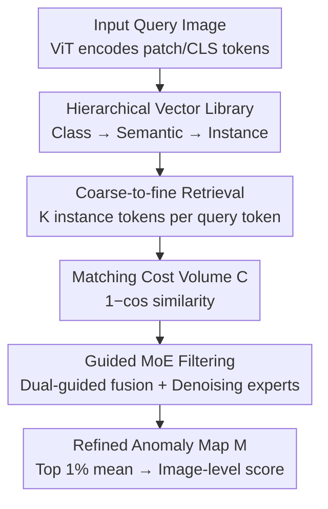

# RAID: Retrieval-Augmented Anomaly Detection

**Conference**: CVPR 2026  
**Paper**: [CVF Open Access](https://openaccess.thecvf.com/content/CVPR2026/html/Cai_RAID_Retrieval-Augmented_Anomaly_Detection_CVPR_2026_paper.html)  
**Code**: https://github.com/Mingxiu-Cai/RAID  
**Area**: Anomaly Detection  
**Keywords**: Unsupervised Anomaly Detection, Retrieval-Augmented Generation, Hierarchical Vector Library, Guided MoE, Cost Volume Filtering

## TL;DR
RAID reinterprets Unsupervised Anomaly Detection (UAD) as a Retrieval-Augmented Generation (RAG) pipeline: it first performs coarse-to-fine retrieval using a three-level vector library (class prototype → semantic prototype → instance token), then employs a "Guided MoE Filter" to denoise the retrieved matching cost volume. This suppresses matching noise and produces anomaly maps with sharp boundaries, achieving SOTA across full-shot, few-shot, and multi-dataset settings on MVTec/VisA/MPDD/BTAD.

## Background & Motivation

**Background**: The mainstream of UAD is "establishing correspondence between test images and normal templates," following two paths: reconstruction-based (mapping anomalies back to the normal manifold via GAN/Transformer/Diffusion and finding anomalies via residuals) and embedding-based (storing normal template features in a memory bank for patch matching, e.g., PatchCore, AnomalyDINO). Recent trends involve using Vision Foundation Models (DINOv2, CLIP) to provide semantically rich features.

**Limitations of Prior Work**: Regardless of the path, "test image ↔ normal template" matching inevitably introduces noise—from intra-class variance, imperfect correspondence, or limited templates. This noise manifests as blurred anomaly boundaries or missed subtle defects in anomaly maps. CostFilter-AD attempted to use a "matching cost filtering" plugin, but it constructs a global matching space that is slow and constrained by the initial anomaly cues of the host model.

**Key Challenge**: The authors observe that existing UAD methods only implement the "retrieval" half of RAG—retrieving a normal counterpart (reconstruction/memory retrieval/distillation) and determining anomalies via feature matching—while neglecting the "generative reasoning" phase. Consequently, retrieval noise is not further processed, directly polluting the final anomaly map.

**Goal**: To complete UAD as a full RAG pipeline—one that not only retrieves normal representations efficiently and scalably but also performs joint reasoning on multiple retrieved counterparts during the generation phase to actively suppress matching noise.

**Key Insight**: Rewrite UAD from a RAG perspective—hierarchical retrieval is responsible for "retrieving context-relevant normal references," while guided MoE filtering "denoises the matching cost volume during the generation phase," together achieving noise-robust anomaly detection and localization.

## Method

### Overall Architecture

RAID abstracts UAD into the formula $M = G(\{p_Q\}, R(\{p_Q\}, D))$: the input query image is first encoded by a pre-trained ViT (DINOv2-s) into patch tokens $\{p_Q\}$ and a CLS token $c_Q$; $R(\cdot)$ performs coarse-to-fine retrieval on a hierarchical vector library $D$ to retrieve the most relevant template instance tokens for each query token; $G(\cdot)$ constructs a matching cost volume from the query and retrieval results, using a guided MoE filter to denoise it and generate a refined anomaly map $M$. The pipeline consists of two main stages: **Retrieval Phase** (library construction + hierarchical retrieval) and **Generation Phase** (cost volume + guided MoE filtering).

### Key Designs

**1. Hierarchical Vector Library: Replacing flat memory banks with a "Class → Semantic → Instance" structure**

Existing embedding-based methods use a flat structure—searching a massive memory bank globally for each query patch, which is slow and hard to generalize to unseen categories, while being extremely sensitive to noisy templates in few-shot settings. RAID organizes template tokens into three tiers to balance inter-class discriminability and intra-class representation richness. The top-level **Class Prototypes** $\{\bar c\}$ are centroids obtained via K-means on all template CLS tokens $\{\bar c\}=\mathrm{KMeans}({c_T^n}_{n=1}^N)$, encoding category-level semantics for "category-agnostic, dataset-agnostic" retrieval and multi-dataset scalability. The mid-tier **Semantic Prototypes** $\{\bar s\}_c$ are cluster centers (set to 50 per class) obtained from K-means on patch tokens within each class, capturing recurring patterns like textures and structures. The bottom-tier **Instance Tokens** $\{t\}_{c,j}$ store all original patch tokens indexed by class and semantic prototype, preserving fine-grained details for pixel-level matching. The hierarchy $\{\bar c\}\to\{\bar s\}\to\{\bar t\}$ allows retrieval to narrow down step-by-step.

**2. Coarse-to-fine Hierarchical Retrieval: 5× speedup without accuracy loss via three-level top-K**

The three-tier library enables coarse-to-fine retrieval, progressively reducing the search space. The top level uses the query CLS token and class prototypes (cosine similarity) to estimate the input category $\hat c = \arg\max_c \mathrm{sim}(c_Q, \bar c_c)$. The mid-level lets each query patch token $p_Q$ retrieve the top $K'$ (default $K'=5$) nearest semantic prototypes within that category. The bottom level then retrieves the top $K$ (default $K=150$) most similar instance tokens from those prototypes. Only the most relevant semantic prototype is kept per patch token. After processing all query tokens, the system prepares $H'\times W'\times 1$ semantic prototypes and $H'\times W'\times K$ template tokens per image. Compared to flat retrieval, the hierarchical structure reduces matching dimensions while maintaining semantic fidelity—latency is reduced ~5× (0.052s vs 0.267s) with nearly identical I-/P-AUROC (99.4%/98.6%).

**3. Matching Cost Volume + Guided MoE Filtering: Re-envisioning "Generation" as adaptive denoising**

Retrieval brings in "hallucination noise" from unreliable matches, spatial misalignment, and domain shifts, which blurs boundaries and drowns out subtle defects. RAID rewrites the generation phase as "filter-based generative reasoning." It first calculates patch-level costs $C_{y,x,k}=1-\mathrm{sim}(p_Q^{(y,x)}, t^{(y,x),k})$, resulting in a 3D cost volume $C\in\mathbb{R}^{H'\times W'\times K}$ (lower similarity indicates higher anomaly likelihood). This volume is more compact than CostFilter-AD's global space, enabling faster inference. It then uses a **two-stage guided MoE filter**:
- **Dual-guided Fusion**: Semantic prototypes are rearranged into a prototype guidance map $g_s$ and query tokens into $g_Q$. A convolutional router computes sparse routing for $\mathrm{cat}(g_Q,g_s)$, activating only top-k guidance experts to aggregate a fused guidance $\tilde g = \sum_i \tilde p_i E_g^i(\mathrm{cat}(g_Q,g_s))$.
- **Guided Filtering**: A second set of denoising experts is densely activated. Each expert $E_C^i$ performs dual-branch filtering on cost volume $C$ under fusion guidance $\tilde g$: a cross-attention branch ($\tilde g$ as query, $C$ as key/value) for global awareness, and a convolutional branch for local refinement. The results are weighted and summed to form the final anomaly map $M = \sum_i p_i \cdot \tilde C_i$.
The retrieved semantic priors are category/dataset-agnostic; injecting them into dynamically activated MoEs allows the filter to focus on "matching cost denoising" and learn category-independent anomaly representations, explaining its strong few-shot generalization.

### Loss & Training

A self-supervised strategy is used: synthesizing anomaly images with masks $M_s$. Total loss $L = L_{\text{focal}}(M, M_s) + \lambda_{\text{bal}} L_{\text{bal}}$, where focal loss handles imbalanced pixels and $L_{\text{bal}}$ regularizes the router to prevent collapse ($\lambda_{\text{bal}}=0.005$). At inference, the image-level score is the mean of the top 1% responses in $M$. Training: 100 epochs, Adam, LR $1\times10^{-4}$, 256×256 input (full-shot) or 224×224 (few-shot).

## Key Experimental Results

### Main Results

Image-level/Pixel-level AUROC (%) across four benchmarks under full-shot UAD:

| Dataset | Metric | RAID | CostFilter-AD | AnomalyDINO | GLAD |
|--------|------|------|---------------|-------------|------|
| MVTec-AD | I-AUROC / P-AUROC | **99.4 / 98.6** | 99.0 / 98.0 | 96.8 / 98.1 | 97.5 / 97.3 |
| MVTec-AD | Pixel AP | **71.7** | 58.1 | 61.3 | 58.8 |
| VisA | I-AUROC / P-AUROC | **94.9 / 99.0** | 93.4 / 98.6 | 90.5 / 97.5 | 90.1 / 97.4 |
| MPDD | I-AUROC / P-AUROC | **96.3 / 98.9** | 93.1 / 97.5 | — | 90.8 / 98.0 |
| BTAD | Pixel AP | **67.3** | 47.0 | — | — |

The pixel-level AP Gain is significant (58.1→71.7 on MVTec), showing the advantage of guided filtering on fine boundaries. Few-shot (trained on MPDD, transferred to MVTec/VisA):

| Setting | Dataset | RAID | IIPAD | PromptAD | Win-CLIP |
|------|--------|------|-------|----------|----------|
| 1-shot | MVTec-AD | **95.1 / 96.6** | 94.2 / 96.4 | 93.0 / 95.2 | 92.6 / 91.6 |
| 2-shot | MVTec-AD | **96.6 / 97.1** | 95.7 / 96.7 | 95.4 / 95.6 | 93.8 / 91.9 |
| 4-shot | VisA | 89.3 / **98.2** | 88.3 / 97.4 | 87.5 / 97.9 | 85.7 / 96.0 |

Multi-dataset: RAID achieves a total average of **95.4 / 96.7 / 98.5 / 57.0** (I-AUROC/I-AP/P-AUROC/P-AP), outperforming OneNIP (92.0 / 94.7 / 97.9 / 48.9).

### Ablation Study

Guided MoE Filter components (MVTec-AD, I-/P-AUROC):

| ID | Configuration | I-/P-AUROC | Description |
|----|------|-----------|------|
| 0 | Retrieval only | 97.9 / 97.5 | Baseline without filtering |
| 1 | +Cross-Att.+RouterC | 98.5 / 97.6 | Second stage cross-attention branch |
| 2 | +Stage 1 MoEg | 99.2 / 98.4 | Dual-guided fusion provides the largest gain |
| 6 | w/o RouterC | 98.0 / 97.5 | No sparse routing leads to drop (lack of specialization) |
| 7 | Full | **99.4 / 98.6** | Full model |

Retrieval strategies: Flat (0.267s, 99.4/98.7) vs. Hierarchical (0.052s, 99.3/98.7)—comparable accuracy with ~5× speedup.

### Key Findings
- **Dual-guided fusion (Stage 1 MoEg) is the most critical component**: It raises I-AUROC from 98.5 to 99.2, showing that using both semantic prototypes and query input for denoising is far more effective than vanilla cross-attention.
- **Sparse routing is essential**: Removing RouterC drops performance back to 98.0/97.5; sparse activation prevents router collapse and ensures expert specialization.
- **Template "Relevance" matters more than "Quantity"**: Performance peaks when a relevant subset is used; using "all" templates slightly reduces performance (99.3 vs 99.4), confirming that relevance dominates after hierarchical retrieval focuses the cost volume.

## Highlights & Insights
- **RAG as a Unified Framework for UAD**: The paper identifies that prior works only implement the "retrieval" half of RAG. Adding a denoising "generation" phase naturally addresses noise issues.
- **Efficiency via Hierarchy**: Hierarchical top-K reduces search space, lowering cost volume dimensions (making filtering lighter) and reducing latency by 5×.
- **Matching Cost Volume Denoising vs. Image Reconstruction**: Focusing on filtering the cost volume is more effective for noise suppression than directly regenerating normal images, specifically for pixel-level AP.

## Limitations & Future Work
- Retrieval depends on DINOv2 feature quality; robustness to out-of-domain industrial textures (e.g., reflective metal, transparet parts) requires more testing.
- The two-stage MoE increases FLOPs (14.2G) and memory (6.5GB) compared to simpler methods like PatchCore (7.12G/3.46GB), sacrificing compute for accuracy.
- Hyperparameter sensitivity (e.g., $K$, $K'$, number of experts) across disparate domains needs further analysis.

## Related Work & Insights
- **vs. CostFilter-AD**: Both filter matching costs, but RAID uses a compact volume from hierarchical retrieval, leading to much higher pixel-level AP (58.1→71.7 on MVTec) and faster inference.
- **vs. PatchCore/AnomalyDINO**: These are purely retrieval-based without a generative denoising stage; RAID handles retrieval noise better.
- **vs. Win-CLIP/PromptAD**: RAID is image-only (no language priors) and uses lower resolution but outperforms them, showing the strength of structured visual retrieval + cost volume denoising.

## Rating
- Novelty: ⭐⭐⭐⭐⭐ 
- Experimental Thoroughness: ⭐⭐⭐⭐⭐ 
- Writing Quality: ⭐⭐⭐⭐ 
- Value: ⭐⭐⭐⭐⭐ 

<!-- RELATED:START -->

## Related Papers

- [\[ICLR 2026\] MRAD: Zero-Shot Anomaly Detection with Memory-Driven Retrieval](../../ICLR2026/anomaly_detection/mrad_zero-shot_anomaly_detection_with_memory-driven_retrieval.md)
- [\[CVPR 2026\] Multi-Prototype Compactness and Boundary-Aware Synthesis for Unsupervised Anomaly Detection](multi-prototype_compactness_and_boundary-aware_synthesis_for_unsupervised_anomal.md)
- [\[CVPR 2026\] Dual-Prototype-Guided Multi-task Learning for Unsupervised Anomaly Detection and Classification](dual-prototype-guided_multi-task_learning_for_unsupervised_anomaly_detection_and.md)
- [\[CVPR 2026\] LayoutAD: Exploring Semantic-Geometric Misalignment Reasoning for Scene Layout Anomaly Detection](layoutad_exploring_semantic-geometric_misalignment_reasoning_for_scene_layout_an.md)
- [\[CVPR 2026\] Anomaly-Related Residual Fields for Cross-domain Anomaly Detection](anomaly-related_residual_fields_for_cross-domain_anomaly_detection.md)

<!-- RELATED:END -->

## Related Papers

- [\[NeurIPS 2025\] Video-RAG: Visually-aligned Retrieval-Augmented Long Video Comprehension](../../NeurIPS2025/object_detection/video-rag_visually-aligned_retrieval-augmented_long_video_comprehension.md)
- [\[CVPR 2026\] WeDetect: Fast Open-Vocabulary Object Detection as Retrieval](wedetect_fast_open-vocabulary_object_detection_as_retrieval.md)
- [\[AAAI 2026\] CASL: Curvature-Augmented Self-supervised Learning for 3D Anomaly Detection](../../AAAI2026/object_detection/casl_curvature-augmented_self-supervised_learning_for_3d_anomaly_detection.md)
- [\[CVPR 2026\] Beyond Caption-Based Queries for Video Moment Retrieval](beyond_caption-based_queries_for_video_moment_retrieval.md)
- [\[CVPR 2026\] Beyond Semantic Search: Towards Referential Anchoring in Composed Image Retrieval](beyond_semantic_search_towards_referential_anchoring_in_composed_image_retrieval.md)

<!-- RELATED:END -->
